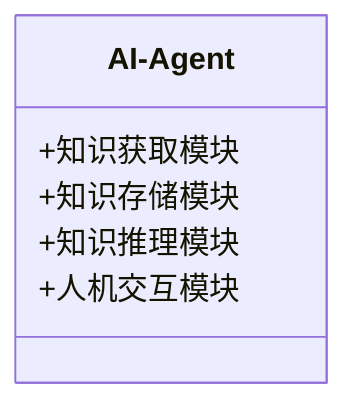
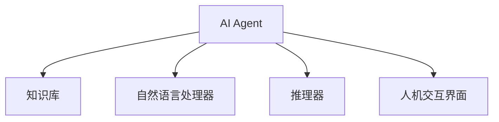
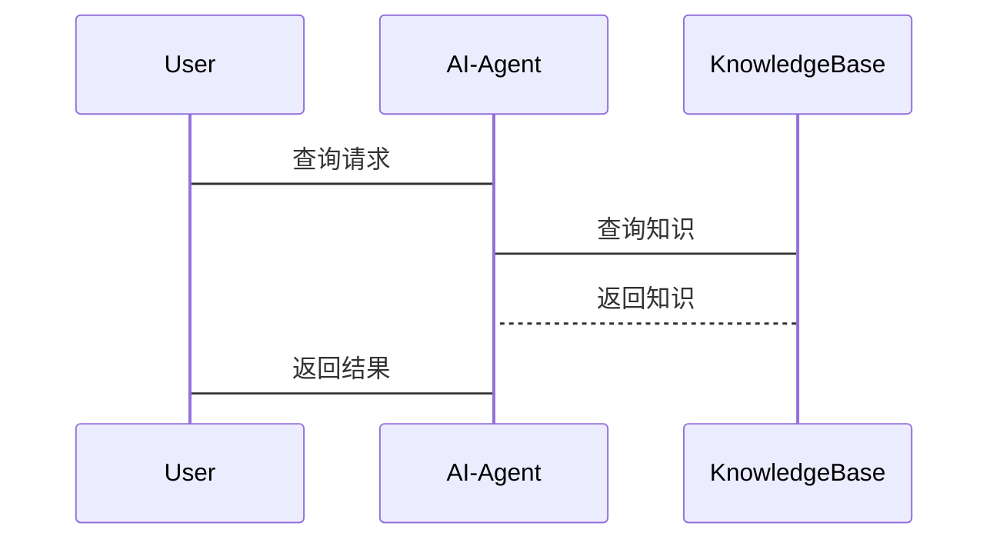

                 


# AI Agent的课程学习：模拟LLM的系统知识获取过程

**关键词**：AI Agent, Large Language Model (LLM), 知识表示, 系统学习, 模拟学习, 知识获取

**摘要**：本文探讨AI Agent通过模拟大型语言模型( LLM )的系统知识获取过程，从基础知识、核心原理、算法实现到实际应用，全面解析AI Agent的学习机制和知识获取策略。通过详细讲解知识表示、学习机制、算法原理和系统架构，结合实际项目案例，帮助读者深入理解AI Agent如何模拟LLM进行知识获取，并掌握实际应用中的关键技术和技巧。

---

# 第1章: AI Agent与LLM概述

## 1.1 AI Agent的基本概念

### 1.1.1 AI Agent的定义

AI Agent（人工智能代理）是指在计算机系统中，能够感知环境、自主决策并执行任务的智能体。AI Agent具备以下核心特征：
- **自主性**：能够在没有外部干预的情况下自主运行。
- **反应性**：能够根据环境反馈实时调整行为。
- **目标导向性**：通过设定目标驱动行为决策。
- **学习能力**：能够通过经验或数据不断优化自身性能。

### 1.1.2 AI Agent的核心特征

- **知识表示**：AI Agent需要将知识以结构化的方式存储，以便快速检索和推理。
- **学习机制**：通过监督学习、无监督学习或强化学习等方式获取新知识。
- **推理能力**：基于现有知识进行逻辑推理，得出新的结论。

### 1.1.3 AI Agent与传统AI的区别

| 特性               | AI Agent                   | 传统AI                   |
|--------------------|----------------------------|--------------------------|
| 自主性             | 高                        | 较低或无                 |
| 适应性             | 强                        | 较弱或无                 |
| 目标导向性         | 明显                     | 较不明显                 |
| 学习能力           | 强                        | 较弱或无                 |

---

## 1.2 LLM的基本概念

### 1.2.1 LLM的定义

Large Language Model（LLM，大型语言模型）是指基于大量文本数据训练的深度学习模型，能够理解和生成人类语言。LLM的核心技术包括：
- **Transformer架构**：通过自注意力机制捕捉上下文信息。
- **预训练-微调范式**：先在通用数据集上预训练，再在特定任务上进行微调。

### 1.2.2 LLM的核心特点

- **大规模数据训练**：通常使用数十亿级别的文本数据进行训练。
- **上下文理解能力**：通过自注意力机制实现长上下文的理解。
- **生成能力**：能够生成连贯且自然的文本。

### 1.2.3 LLM的应用场景

| 场景               | 描述                           |
|--------------------|--------------------------------|
| 自然语言处理       | 用于机器翻译、文本生成等。     |
| 智能对话系统       | 用于聊天机器人、客服系统等。   |
| 知识问答           | 用于智能问答系统、知识库查询等。 |

---

## 1.3 AI Agent与LLM的关系

### 1.3.1 AI Agent模拟LLM的必要性

AI Agent需要具备类似人类的学习能力，能够通过大量数据进行训练，并具备推理和决策能力。通过模拟LLM的知识获取过程，AI Agent可以更高效地学习和适应复杂环境。

### 1.3.2 LLM作为知识库的局限性

- **计算资源需求大**：LLM的训练和推理需要大量计算资源。
- **知识更新滞后**：LLM的知识更新依赖于训练数据的更新。
- **推理能力有限**：LLM擅长生成和理解文本，但在逻辑推理和复杂决策方面的能力有限。

### 1.3.3 AI Agent对LLM的优化作用

AI Agent可以通过以下方式优化LLM的知识获取过程：
- **动态知识更新**：根据实时数据动态更新知识库。
- **目标导向学习**：通过设定目标优先级，优化知识获取效率。
- **多模态融合**：结合视觉、听觉等多种模态信息，提升知识理解能力。

---

## 1.4 本章小结

本章主要介绍了AI Agent和LLM的基本概念、核心特点及其关系。AI Agent通过模拟LLM的知识获取过程，可以实现更高效、更智能的知识学习和应用。

---

# 第2章: AI Agent的知识表示与学习机制

## 2.1 知识表示的基本概念

### 2.1.1 知识表示的定义

知识表示是指将知识以某种形式存储在计算机中的过程。常见的知识表示形式包括：
- **符号表示**：使用符号（如逻辑符号）表示知识。
- **向量表示**：通过高维向量表示知识的语义信息。
- **知识图谱**：通过图结构表示实体及其关系。

### 2.1.2 知识表示的常见形式

| 表示形式 | 描述                     | 优点                 |
|----------|--------------------------|----------------------|
| 符号表示 | 使用符号逻辑表示知识     | 精确性高             |
| 向量表示 | 使用向量表示语义信息     | 适合机器学习         |
| 知识图谱 | 使用图结构表示实体关系   | 可视化能力强         |

### 2.1.3 知识图谱的构建方法

知识图谱的构建通常包括以下步骤：
1. **数据收集**：从多种数据源（如文本、数据库）收集数据。
2. **实体识别**：识别文本中的实体并进行命名实体识别（NER）。
3. **关系抽取**：提取实体之间的关系。
4. **知识融合**：将多个数据源中的知识进行整合。
5. **知识存储**：将知识存储到图数据库中。

---

## 2.2 AI Agent的学习机制

### 2.2.1 监督学习

- **定义**：通过标注数据进行训练，模型学习输入与输出之间的映射关系。
- **优点**：准确率高，适用于明确的任务。
- **缺点**：需要大量标注数据。

### 2.2.2 无监督学习

- **定义**：通过未标注数据进行训练，模型学习数据的内在结构。
- **优点**：不需要标注数据，适用于大规模数据。
- **缺点**：准确率通常低于监督学习。

### 2.2.3 强化学习

- **定义**：通过与环境交互，模型学习最大化累积奖励的行为策略。
- **优点**：适用于动态环境和复杂任务。
- **缺点**：训练过程较长，需要大量计算资源。

---

## 2.3 知识推理的基本原理

### 2.3.1 推理的定义

知识推理是指基于已有知识，推导出新的结论的过程。常见的推理方法包括：
- **逻辑推理**：基于逻辑规则进行推理。
- **概率推理**：基于概率论进行推理。
- **归纳推理**：从具体实例中归纳出一般规律。

### 2.3.2 推理的常见方法

| 方法   | 描述                     | 优点                 |
|--------|--------------------------|----------------------|
| 逻辑推理 | 基于逻辑规则进行推理     | 结果确定性高         |
| 概率推理 | 基于概率论进行推理       | 能处理不确定性问题   |
| 归纳推理 | 从具体实例中归纳一般规律 | 适用于发现新知识     |

### 2.3.3 推理的优化策略

- **优化目标**：提高推理效率和准确性。
- **优化方法**：引入领域知识、优化推理算法、使用分布式计算。

---

## 2.4 本章小结

本章详细讲解了AI Agent的知识表示方法和学习机制。知识表示是AI Agent理解知识的基础，而学习机制则是AI Agent获取知识的核心。通过合理的知识表示和高效的学习机制，AI Agent能够更好地理解和应用知识。

---

# 第3章: LLM的知识获取过程

## 3.1 数据预处理

### 3.1.1 数据清洗

- **去重**：去除重复数据。
- **去噪**：去除噪声数据（如停用词、特殊符号）。
- **归一化**：将数据统一到某种标准形式。

### 3.1.2 数据标注

- **文本标注**：对文本进行分词、词性标注、句法分析等。
- **实体标注**：对文本中的实体进行识别和标注。

### 3.1.3 数据增强

- **同义词替换**：通过替换同义词增加数据多样性。
- **数据重排**：通过重新排列数据生成新的数据样本。
- **数据扩展**：通过生成新数据扩展数据集。

---

## 3.2 模型训练

### 3.2.1 神经网络结构

- **Transformer架构**：由编码器和解码器组成，通过自注意力机制捕捉上下文信息。
- **编码器**：将输入序列映射到一个固定长度的向量。
- **解码器**：根据编码器输出生成目标序列。

### 3.2.2 损失函数

- **交叉熵损失函数**：用于分类任务的损失函数。
- **公式**：$$ \text{Loss} = -\frac{1}{N}\sum_{i=1}^{N}\sum_{j=1}^{M} y_{ij}\log p(y_{ij}|x_i) $$
  其中，\( N \) 是样本数量，\( M \) 是类别数量，\( y_{ij} \) 是真实标签，\( p(y_{ij}|x_i) \) 是模型预测的概率。

### 3.2.3 优化算法

- **Adam优化器**：结合了动量和自适应学习率的优化算法。
- **公式**：$$ \theta_{t+1} = \theta_t - \eta \frac{\rho_1 g_t + (1-\rho_1)g_t^2}{\sqrt{s_2 + \epsilon}} $$
  其中，\( \theta \) 是参数，\( \eta \) 是学习率，\( \rho_1 \) 是动量系数，\( g_t \) 是梯度，\( s_2 \) 是二阶矩估计，\( \epsilon \) 是防止除以零的常数。

---

## 3.3 知识提取

### 3.3.1 提取方法

- **基于规则的提取**：通过预定义规则从文本中提取知识。
- **基于统计的提取**：通过统计方法发现文本中的模式。
- **基于深度学习的提取**：使用深度学习模型自动提取知识。

### 3.3.2 提取策略

- **精确提取**：提取准确的知识，避免误提取。
- **模糊提取**：提取近似的知识，适用于语义理解任务。
- **层次提取**：从高层次到低层次逐步提取知识。

---

## 3.4 本章小结

本章详细讲解了LLM的知识获取过程，包括数据预处理、模型训练和知识提取。通过合理的数据预处理和高效的模型训练，可以显著提升LLM的知识获取效果。

---

# 第4章: AI Agent的算法实现

## 4.1 模型结构

### 4.1.1 网络结构

- **编码器**：将输入序列映射到一个固定长度的向量。
- **解码器**：根据编码器输出生成目标序列。
- **自注意力机制**：通过计算序列中每个位置的注意力权重，捕捉上下文信息。

### 4.1.2 注意力机制

- **自注意力机制**：用于计算序列中每个位置的注意力权重。
- **公式**：$$ \text{Attention}(Q, K, V) = \text{softmax}\left(\frac{QK^T}{\sqrt{d_k}}\right)V $$
  其中，\( Q \) 是查询向量，\( K \) 是键向量，\( V \) 是值向量，\( d_k \) 是键的维度。

### 4.1.3 前馈网络

- **前馈网络**：由多个全连接层组成，用于特征提取和非线性变换。
- **公式**：$$ y = \sigma(Wx + b) $$
  其中，\( W \) 是权重矩阵，\( b \) 是偏置向量，\( \sigma \) 是激活函数。

---

## 4.2 算法实现

### 4.2.1 模型训练

- **训练目标**：最小化损失函数，优化模型参数。
- **训练过程**：
  1. 输入序列经过编码器生成上下文向量。
  2. 上下文向量经过解码器生成目标序列。
  3. 计算预测结果与真实结果的损失。
  4. 反向传播损失，优化模型参数。

### 4.2.2 模型推理

- **推理过程**：
  1. 输入查询序列。
  2. 查询序列经过编码器生成上下文向量。
  3. 上下文向量经过解码器生成目标序列。

---

## 4.3 本章小结

本章详细讲解了AI Agent的算法实现，包括模型结构和训练过程。通过合理的模型设计和高效的训练策略，可以显著提升AI Agent的知识获取能力。

---

# 第5章: 系统架构设计

## 5.1 问题场景介绍

AI Agent需要具备以下功能：
- **知识获取**：通过多种数据源获取知识。
- **知识存储**：将获取的知识存储到知识库中。
- **知识推理**：基于知识库进行推理和决策。
- **人机交互**：与用户进行自然语言交互。

---

## 5.2 系统功能设计

### 5.2.1 知识获取模块

- **功能**：从多种数据源获取知识。
- **输入**：原始数据。
- **输出**：结构化的知识。

### 5.2.2 知识存储模块

- **功能**：将结构化的知识存储到知识库中。
- **输入**：结构化知识。
- **输出**：存储的知识。

### 5.2.3 知识推理模块

- **功能**：基于知识库进行推理和决策。
- **输入**：查询请求。
- **输出**：推理结果。

### 5.2.4 人机交互模块

- **功能**：与用户进行自然语言交互。
- **输入**：用户输入。
- **输出**：系统输出。

---

## 5.3 系统架构设计

### 5.3.1 领域模型



### 5.3.2 系统架构



### 5.3.3 系统交互



---

## 5.4 本章小结

本章详细讲解了AI Agent的系统架构设计，包括功能模块设计和系统交互设计。通过合理的系统架构设计，可以实现高效的知识获取和推理。

---

# 第6章: 项目实战

## 6.1 环境安装

- **Python版本**：Python 3.8+
- **依赖库**：TensorFlow、Keras、PyTorch、Hugging Face Transformers
- **安装命令**：
  ```bash
  pip install tensorflow keras torch transformers
  ```

---

## 6.2 核心实现

### 6.2.1 知识获取模块

```python
import transformers

def get_knowledge(query):
    model = transformers.AutoModelForQuestionAnswering.from_pretrained('deepset/bert-large-uncased-whole-word-masked-finetuned-squad')
    tokenizer = transformers.AutoTokenizer.from_pretrained('deepset/bert-large-uncased-whole-word-masked-finetuned-squad')
    inputs = tokenizer(query, return_tensors='np')
    outputs = model(**inputs)
    return outputs
```

### 6.2.2 知识推理模块

```python
def infer(knowledge, query):
    # 简单的推理逻辑
    if query in knowledge:
        return knowledge[query]
    else:
        return None
```

### 6.2.3 人机交互模块

```python
def chat():
    while True:
        query = input("请输入问题：")
        if query == '退出':
            break
        knowledge = get_knowledge(query)
        result = infer(knowledge, query)
        print(result)
```

---

## 6.3 项目小结

本章通过实际项目案例，详细讲解了AI Agent的实现过程。通过环境安装和代码实现，读者可以更好地理解AI Agent的知识获取和推理过程。

---

# 第7章: 总结与展望

## 7.1 总结

本文从AI Agent和LLM的基本概念出发，详细讲解了AI Agent的知识表示、学习机制和算法实现。通过实际项目案例，帮助读者理解AI Agent的知识获取和推理过程。

## 7.2 展望

未来，AI Agent的研究和应用将朝着以下方向发展：
- **多模态融合**：结合视觉、听觉等多种模态信息，提升知识理解能力。
- **实时推理**：通过分布式计算和边缘计算，实现低延迟的实时推理。
- **自适应学习**：通过在线学习和迁移学习，实现动态知识更新。

---

# 结语

AI Agent作为人工智能领域的重要研究方向，其知识获取和推理能力将直接影响人工智能系统的智能化水平。通过本文的讲解，读者可以更好地理解AI Agent的学习机制和系统架构，并能够实际应用于各种场景中。未来，随着技术的不断发展，AI Agent将具备更强大的知识获取和推理能力，为人类社会的发展带来更多的可能性。

