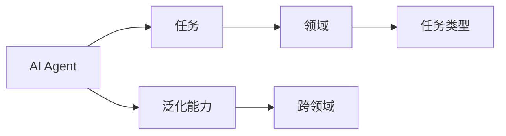
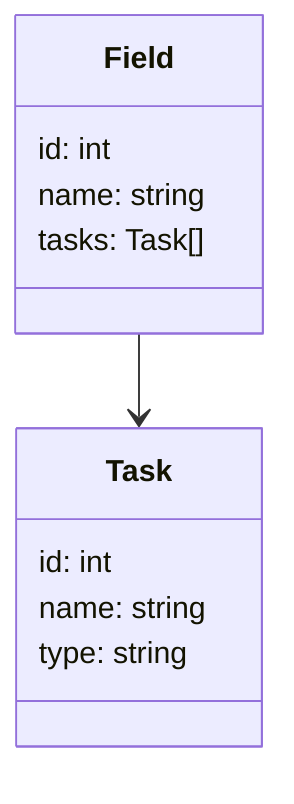
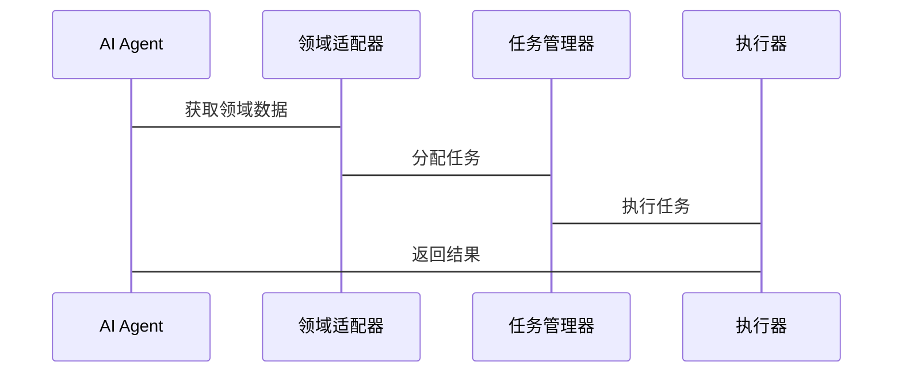

                 


# AI Agent的跨域任务泛化能力开发

## 关键词：AI Agent, 跨域任务, 泛化能力, 算法原理, 系统架构, 项目实战

## 摘要：  
AI Agent的跨域任务泛化能力是指AI Agent能够适应不同领域任务的能力。本文从AI Agent的基本概念、跨域任务的挑战、泛化能力的重要性入手，详细分析了AI Agent的核心概念与算法原理，探讨了系统架构设计与项目实战，最后总结了跨域任务泛化能力开发的关键点和未来发展方向。

---

# 第1章: AI Agent的概述与背景

## 1.1 AI Agent的基本概念  
AI Agent（人工智能代理）是指能够感知环境、自主决策并执行任务的智能体。它通过传感器获取信息，利用计算模型进行推理，并通过执行器与环境交互。AI Agent的核心特征包括自主性、反应性、目标导向和学习能力。  

### 1.1.1 什么是AI Agent  
AI Agent是一种智能实体，能够根据环境输入做出决策并执行动作。例如，智能音箱（如Alexa）就是一个典型的AI Agent，它能够通过语音指令完成播放音乐、设置闹钟等任务。  

### 1.1.2 AI Agent的核心特征  
1. **自主性**：AI Agent能够在没有外部干预的情况下自主运行。  
2. **反应性**：AI Agent能够实时感知环境并做出反应。  
3. **目标导向**：AI Agent的行为通常是为了实现特定目标。  
4. **学习能力**：AI Agent能够通过经验改进性能。  

### 1.1.3 AI Agent的应用场景  
AI Agent广泛应用于多个领域，包括智能助手、自动驾驶、智能客服、机器人控制等。  

## 1.2 跨域任务的定义与挑战  
跨域任务是指涉及多个领域的任务，例如一个AI Agent需要在医疗领域和金融领域之间切换任务。  

### 1.2.1 跨域任务的定义  
跨域任务是指AI Agent需要在不同领域之间执行任务，这些任务可能涉及不同的数据格式、业务逻辑和操作流程。  

### 1.2.2 跨域任务的典型场景  
1. **多领域客服支持**：一个AI Agent需要同时处理金融、医疗、教育等多个领域的客户咨询。  
2. **跨领域数据分析**：AI Agent需要从不同领域的数据源中提取信息并进行分析。  

### 1.2.3 跨域任务中的主要挑战  
1. **领域知识的差异性**：不同领域具有不同的术语、规则和流程。  
2. **任务切换的复杂性**：AI Agent需要快速适应不同领域的任务。  
3. **性能的不确定性**：跨域任务可能影响AI Agent的准确性和效率。  

## 1.3 泛化能力的重要性  
泛化能力是指AI Agent在不同领域任务中保持高性能的能力。  

### 1.3.1 泛化能力的定义  
泛化能力是指AI Agent能够将从一个领域学到的知识应用到其他领域任务中的能力。  

### 1.3.2 泛化能力在AI Agent中的作用  
1. **提高适应性**：AI Agent能够适应更多场景和任务。  
2. **减少训练成本**：通过泛化能力，可以减少针对每个领域单独训练的需求。  

### 1.3.3 泛化能力的衡量标准  
1. **准确率**：在不同领域任务中的正确率。  
2. **效率**：适应新领域任务的速度。  

## 1.4 本章小结  
本章介绍了AI Agent的基本概念、跨域任务的定义与挑战，以及泛化能力的重要性。这些内容为后续章节奠定了基础。

---

# 第2章: 跨域任务的背景与需求分析  

## 2.1 跨域任务的背景  
随着AI技术的发展，AI Agent需要在更多领域中发挥作用。  

### 2.1.1 多领域任务的复杂性  
跨领域任务通常涉及复杂的业务逻辑和数据格式，对AI Agent的适应性提出了更高要求。  

### 2.1.2 跨域任务的典型场景  
1. **金融与医疗的结合**：例如，AI Agent需要分析患者的医疗数据并提供金融风险评估。  
2. **教育与物流的结合**：例如，AI Agent需要根据学生的学习情况优化物流配送路径。  

### 2.1.3 跨域任务的驱动因素  
1. **业务需求**：企业需要AI Agent能够处理多个领域的任务。  
2. **技术进步**：AI技术的发展使得跨域任务成为可能。  

## 2.2 跨域任务的需求分析  
需求分析是跨域任务开发的关键步骤。  

### 2.2.1 用户需求分析  
1. **功能需求**：用户希望AI Agent能够处理多个领域的任务。  
2. **性能需求**：用户希望AI Agent在不同领域中保持高性能。  

### 2.2.2 系统需求分析  
1. **系统架构需求**：系统需要支持多领域的数据处理和任务执行。  
2. **接口需求**：系统需要提供统一的接口以支持不同领域的任务。  

### 2.2.3 业务需求分析  
1. **业务流程需求**：业务流程需要适应不同领域的任务。  
2. **合规性需求**：系统需要符合不同领域的法律法规。  

## 2.3 跨域任务的边界与外延  
### 2.3.1 跨域任务的边界  
1. **任务范围**：AI Agent只能处理特定范围内的跨域任务。  
2. **领域限制**：AI Agent只能在预定义的领域中执行任务。  

### 2.3.2 跨域任务的外延  
1. **扩展性**：AI Agent可以通过训练扩展到更多领域。  
2. **适应性**：AI Agent能够快速适应新领域任务。  

## 2.4 本章小结  
本章分析了跨域任务的背景、需求和边界，为后续章节的系统设计和算法开发提供了依据。

---

# 第3章: AI Agent的核心概念与联系  

## 3.1 核心概念原理  
AI Agent的核心模块包括感知模块、推理模块和执行模块。  

### 3.1.1 AI Agent的核心模块  
1. **感知模块**：负责获取环境信息。  
2. **推理模块**：负责分析信息并做出决策。  
3. **执行模块**：负责执行决策并输出结果。  

### 3.1.2 跨域任务的实现机制  
AI Agent通过感知模块获取不同领域的数据，利用推理模块进行跨领域分析，并通过执行模块完成任务。  

### 3.1.3 泛化能力的实现路径  
1. **领域知识整合**：整合多个领域的知识。  
2. **跨领域推理**：在不同领域之间进行推理。  

## 3.2 核心概念属性特征对比  
通过对比分析，可以更好地理解AI Agent的核心概念。  

### 3.2.1 不同AI Agent模型的对比  
| 模型 | 特征 |  
|------|------|  
| 强化学习模型 | 基于奖励机制 |  
| 对比学习模型 | 基于相似性对比 |  
| 迁移学习模型 | 基于知识迁移 |  

### 3.2.2 跨域任务的特征对比  
| 特征 | 跨域任务 | 单领域任务 |  
|------|---------|------------|  
| 适应性 | 高 | 低 |  
| 复杂性 | 高 | 低 |  

### 3.2.3 泛化能力的特征对比  
| 特征 | 泛化能力 | 非泛化能力 |  
|------|----------|-------------|  
| 适应性 | 高 | 低 |  
| 性能 | 高 | 低 |  

## 3.3 ER实体关系图架构  
通过ER图可以清晰展示AI Agent的核心概念与联系。  



## 3.4 本章小结  
本章详细分析了AI Agent的核心概念与联系，为后续章节的算法开发和系统设计奠定了基础。

---

# 第4章: 跨域任务泛化能力的算法原理  

## 4.1 算法原理概述  
跨域任务泛化能力的实现依赖于多种算法的结合。  

### 4.1.1 强化学习在跨域任务中的应用  
强化学习通过奖励机制优化AI Agent的决策能力。  

### 4.1.2 对比学习在跨域任务中的应用  
对比学习通过对比不同领域的数据，提高AI Agent的泛化能力。  

### 4.1.3 迁移学习在跨域任务中的应用  
迁移学习通过知识迁移，提升AI Agent在新领域的性能。  

## 4.2 算法流程图  
通过流程图可以清晰展示算法的执行步骤。  


## 4.3 算法数学模型  
数学模型是算法实现的核心。  

### 4.3.1 强化学习模型  
$$ V(s) = \max_a Q(s,a) $$  
其中，$V(s)$是状态$s$的价值，$Q(s,a)$是状态$s$动作$a$的价值。  

### 4.3.2 对比学习模型  
$$ \text{Contrast}(x,y) = \log\frac{\exp(\text{sim}(x,y))}{\sum_{z} \exp(\text{sim}(x,z))} $$  
其中，$\text{sim}(x,y)$是$x$和$y$的相似度。  

## 4.4 本章小结  
本章详细介绍了跨域任务泛化能力的算法原理，为后续章节的系统设计提供了技术支持。

---

# 第5章: 系统分析与架构设计  

## 5.1 问题场景介绍  
跨域任务泛化能力的实现需要一个高效的系统架构。  

### 5.1.1 问题场景  
AI Agent需要在不同领域之间切换任务，例如从金融领域切换到医疗领域。  

## 5.2 系统功能设计  
系统功能设计是架构设计的基础。  

### 5.2.1 领域模型设计  
通过Mermaid类图可以展示领域模型。  



### 5.2.2 系统架构设计  
通过Mermaid架构图可以展示系统架构。  


### 5.2.3 系统接口设计  
系统接口设计是系统交互的基础。  

1. **领域适配器接口**：负责与不同领域的数据源交互。  
2. **任务管理器接口**：负责任务的分配和管理。  

### 5.2.4 系统交互设计  
通过Mermaid序列图可以展示系统交互。  



## 5.3 本章小结  
本章详细分析了跨域任务泛化能力的系统架构设计，为后续章节的项目实战提供了指导。

---

# 第6章: 项目实战  

## 6.1 项目背景与目标  
本项目旨在开发一个具有跨域任务泛化能力的AI Agent。  

### 6.1.1 项目背景  
随着企业对多领域任务处理的需求增加，开发具有跨域任务泛化能力的AI Agent成为必然趋势。  

### 6.1.2 项目目标  
1. 实现AI Agent在多个领域的任务处理能力。  
2. 提高AI Agent的泛化能力。  

## 6.2 环境安装与配置  
### 6.2.1 安装Python  
需要安装Python 3.8及以上版本。  

### 6.2.2 安装依赖库  
安装以下依赖库：  
```bash
pip install numpy pandas scikit-learn transformers
```

## 6.3 系统核心实现  
### 6.3.1 领域适配器实现  
```python
class FieldAdapter:
    def __init__(self, field):
        self.field = field
```

### 6.3.2 任务管理器实现  
```python
class TaskManager:
    def __init__(self):
        self.tasks = []
    
    def add_task(self, task):
        self.tasks.append(task)
```

### 6.3.3 执行器实现  
```python
class Executor:
    def execute(self, task):
        # 具体执行逻辑
        pass
```

### 6.3.4 AI Agent实现  
```python
class AIAgent:
    def __init__(self):
        self.field_adapter = FieldAdapter("default")
        self.task_manager = TaskManager()
        self.executor = Executor()
    
    def process_task(self, task):
        self.task_manager.add_task(task)
        self.executor.execute(task)
```

## 6.4 代码解读与分析  
### 6.4.1 领域适配器  
领域适配器负责与不同领域的数据源交互，实现跨领域数据的转换和处理。  

### 6.4.2 任务管理器  
任务管理器负责任务的分配和管理，确保任务能够正确执行。  

### 6.4.3 执行器  
执行器负责具体任务的执行，例如调用API或处理数据。  

## 6.5 实际案例分析  
### 6.5.1 案例背景  
假设一个AI Agent需要在金融和医疗领域之间切换任务。  

### 6.5.2 案例分析  
1. **金融领域任务**：分析股票数据。  
2. **医疗领域任务**：诊断疾病。  

## 6.6 本章小结  
本章通过项目实战，展示了跨域任务泛化能力的实现过程，为读者提供了实际的操作指南。

---

# 第7章: 最佳实践、小结与展望  

## 7.1 最佳实践  
### 7.1.1 知识整合  
通过整合不同领域的知识，提高AI Agent的泛化能力。  

### 7.1.2 模型优化  
通过优化模型结构，提高AI Agent的性能。  

## 7.2 小结  
本文详细介绍了AI Agent的跨域任务泛化能力的开发过程，从理论到实践，为读者提供了全面的指导。  

## 7.3 未来展望  
随着AI技术的不断发展，AI Agent的跨域任务泛化能力将得到进一步提升。未来的研究方向包括更高效的算法设计和更智能的系统架构。  

---

# 附录  

## 附录A: 术语表  
1. **AI Agent**：人工智能代理。  
2. **跨域任务**：涉及多个领域的任务。  
3. **泛化能力**：AI Agent在不同领域任务中的适应能力。  

## 附录B: 参考文献  
1. Russell, S., & Norvig, P. (2010). Artificial Intelligence: A Modern Approach.  
2. Goodfellow, I., Bengio, Y., & Courville, A. (2016). Deep Learning.  

---

通过以上内容，您可以全面了解AI Agent的跨域任务泛化能力的开发过程。希望本文对您有所帮助！

