                 


# AI Agent的跨域知识迁移与整合

## 关键词：AI Agent，跨域知识迁移，知识整合，迁移学习，深度学习

## 摘要

AI Agent的跨域知识迁移与整合是人工智能领域的重要研究方向。随着技术的发展，AI Agent需要能够处理多个领域的知识，以提升其通用性和适应性。本文详细探讨了跨域知识迁移的核心概念、算法、系统架构设计以及项目实战，帮助读者全面理解AI Agent的跨域知识迁移与整合。

---

# 文章正文

## 第一部分：AI Agent的背景与核心概念

### 第1章：AI Agent的基本概念与背景

#### 1.1 AI Agent的定义与核心特征

AI Agent（人工智能代理）是指能够感知环境并执行任务的智能实体。其核心特征包括自主性、反应性、主动性、社交能力和社会性。

**图1-1：AI Agent的核心特征**

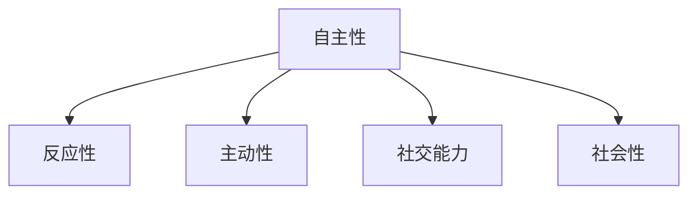

AI Agent与传统AI的区别在于其能够主动适应环境并执行复杂任务。

#### 1.2 跨域知识迁移的背景与意义

知识迁移是指将一个领域的知识应用到另一个领域。随着AI技术的发展，单领域模型难以应对现实中的复杂问题，跨域知识迁移变得尤为重要。

**图1-2：跨域知识迁移的背景**

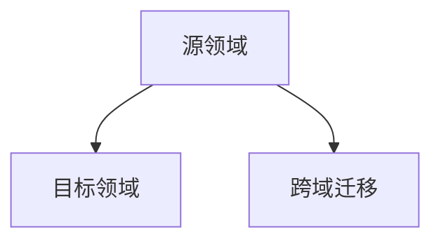

跨域知识迁移能够提升AI Agent的通用性和适应性，使其在多个领域中都能有效工作。

#### 1.3 跨域知识整合的重要性

知识整合是指将不同领域的知识结合起来，形成统一的知识体系。整合能够增强AI Agent的决策能力和问题解决能力。

**表1-1：整合方法的对比**

| 方法        | 优点                          | 缺点                          |
|-------------|-------------------------------|-------------------------------|
| 基于规则的  | 明确性高，易于解释             | 灵活性低，难以处理复杂问题     |
| 基于统计的   | 灵活性高，能够处理复杂问题     | 解释性低，难以明确规则         |
| 基于深度学习 | 强大学习能力，能够处理复杂模式 | 计算资源需求高，解释性较差     |

---

## 第二部分：AI Agent的知识迁移与整合的核心概念

### 第2章：知识表示与迁移的基本原理

#### 2.1 知识表示的原理

知识表示是将知识以某种形式表达出来。常见的表示方法包括符号表示、向量表示和图表示。

**图2-1：知识表示的类图**

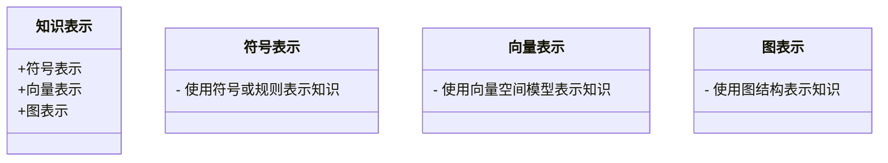

#### 2.2 知识迁移的原理

知识迁移是指将一个领域的知识应用到另一个领域。主要的迁移学习算法包括基于特征的迁移学习、基于实例的迁移学习和基于模型的迁移学习。

**图2-2：迁移学习的流程图**

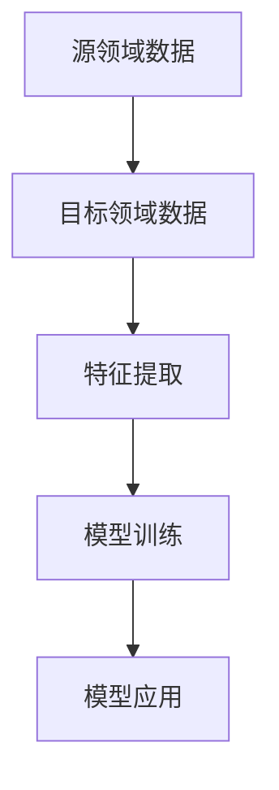

#### 2.3 知识整合的原理

知识整合是将不同领域的知识结合起来。常见的整合方法包括基于规则的整合、基于统计的整合和基于深度学习的整合。

**图2-3：知识整合的流程图**

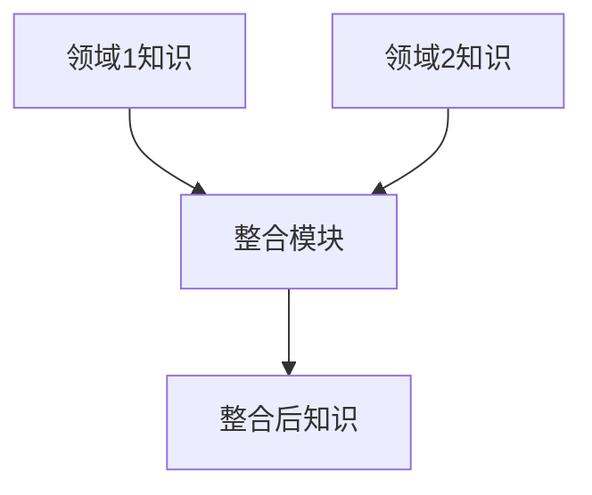

---

## 第三部分：AI Agent的跨域知识迁移与整合的算法与模型

### 第3章：知识表示与迁移的算法

#### 3.1 知识表示的算法

知识表示的算法包括符号表示、向量表示和图表示。每种方法都有其优缺点。

**图3-1：符号表示的示例**

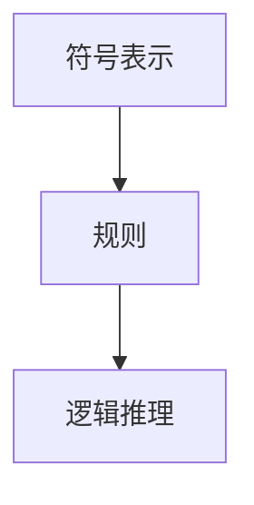

#### 3.2 知识迁移的算法

迁移学习的算法包括基于特征的迁移学习、基于实例的迁移学习和基于模型的迁移学习。

**图3-2：基于特征的迁移学习流程**

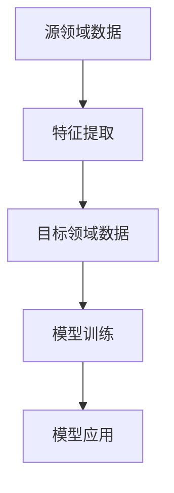

#### 3.3 知识整合的算法

知识整合的算法包括基于规则的整合、基于统计的整合和基于深度学习的整合。

**图3-3：基于深度学习的整合流程**

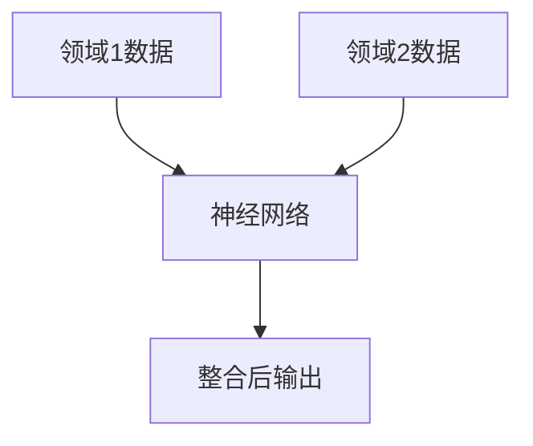

---

## 第四部分：AI Agent的跨域知识迁移与整合的系统架构设计

### 第4章：系统架构设计

#### 4.1 问题场景介绍

系统需要实现跨域知识迁移与整合，解决AI Agent在多个领域中有效工作的问题。

#### 4.2 系统功能设计

**图4-1：系统功能设计类图**

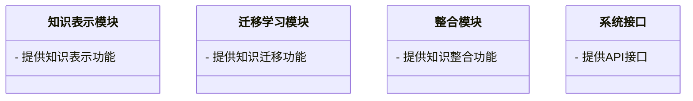

#### 4.3 系统架构设计

**图4-2：系统架构设计图**

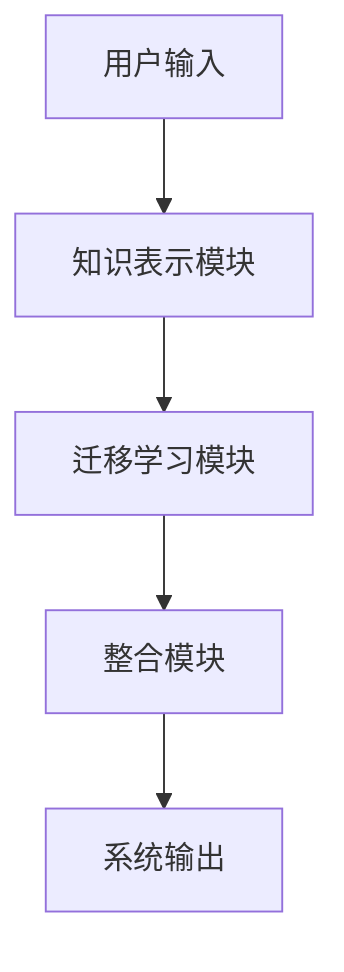

#### 4.4 系统接口设计

系统接口设计包括输入接口和输出接口，用于与外部系统的交互。

**图4-3：系统接口设计**

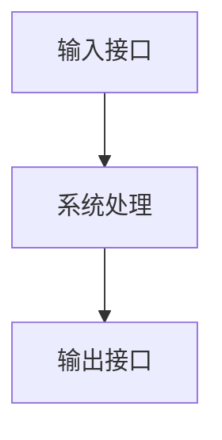

#### 4.5 系统交互设计

**图4-4：系统交互序列图**

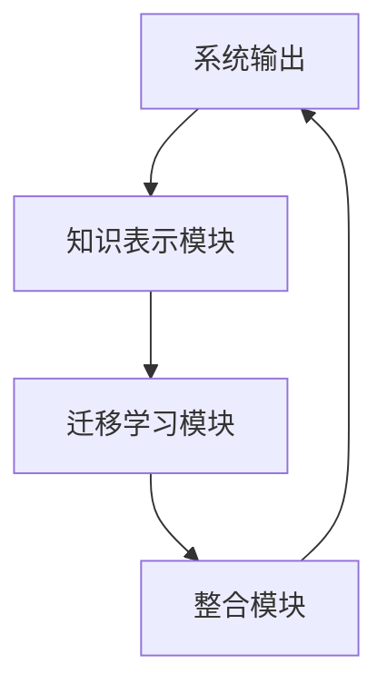

---

## 第五部分：AI Agent的跨域知识迁移与整合的项目实战

### 第5章：项目实战

#### 5.1 环境安装

需要安装Python、TensorFlow和Scikit-learn等库。

#### 5.2 核心代码实现

**代码5-1：跨域问答系统的实现**

```python
# 知识表示模块
class KnowledgeRepresentation:
    def __init__(self):
        self.knowledge = {}

    def add_knowledge(self, key, value):
        self.knowledge[key] = value

# 迁移学习模块
class TransferLearning:
    def __init__(self):
        self.model = None

    def train(self, source_data, target_data):
        # 迁移学习算法实现
        pass

# 整合模块
class IntegrationModule:
    def __init__(self):
        self.knowledge_base = KnowledgeBase()

    def integrate(self, source_knowledge, target_knowledge):
        # 整合算法实现
        pass
```

#### 5.3 代码解读与分析

跨域问答系统通过知识表示、迁移学习和整合模块实现，能够将源领域的问题应用到目标领域。

#### 5.4 案例分析与详细讲解

通过具体的案例分析，展示跨域知识迁移与整合的实际应用。

---

## 第六部分：AI Agent的跨域知识迁移与整合的高级主题

### 第6章：高级主题

#### 6.1 可解释性与透明性

提升AI Agent的可解释性和透明性，使其能够更好地被人类理解和信任。

#### 6.2 伦理与安全

探讨跨域知识迁移与整合中的伦理和安全问题，确保AI Agent的应用符合伦理规范。

#### 6.3 人机协作

研究人机协作的模式，提升AI Agent与人类的合作效率。

---

## 第七部分：AI Agent的跨域知识迁移与整合的未来展望

### 第7章：未来展望

#### 7.1 技术趋势

展望跨域知识迁移与整合的技术发展趋势。

#### 7.2 应用场景

探讨AI Agent在跨域知识迁移与整合中的潜在应用场景。

#### 7.3 挑战与机遇

分析跨域知识迁移与整合面临的挑战和机遇，为未来的研究提供方向。

---

## 第八部分：总结与附录

### 第8章：总结

#### 8.1 回顾与总结

总结全文的主要内容和观点。

#### 8.2 最佳实践

提供一些实际应用中的最佳实践建议。

#### 8.3 参考文献

列出本文参考的相关文献和资料。

#### 8.4 附录

包括术语表、工具列表等内容，方便读者查阅。

---

通过以上分析和思考，我们可以看到AI Agent的跨域知识迁移与整合是一个复杂但充满潜力的领域。随着技术的不断进步，AI Agent将在更多领域展现出强大的应用能力。

