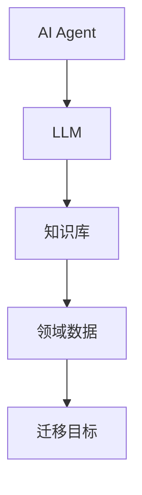

                 


# AI Agent的跨域迁移：LLM在不同领域间的知识迁移

**关键词：** AI Agent, 大语言模型, 跨域迁移, 知识迁移, 对比学习, 领域适应, 机器学习

**摘要：**  
本文探讨AI Agent在不同领域间的知识迁移问题，重点分析大语言模型（LLM）如何实现跨领域任务的适应与优化。从理论基础到算法实现，再到实际应用案例，系统性地阐述跨域迁移的核心技术与实践方案。通过对比学习和领域适应算法的详细解析，结合系统架构设计与项目实战，为读者提供全面的技术指导。

---

## 第一部分: AI Agent与跨域迁移的背景介绍

### 第1章: AI Agent与跨域迁移概述

#### 1.1 AI Agent的基本概念
- **1.1.1 AI Agent的定义与特征**
  - AI Agent是具有感知环境、自主决策和执行任务能力的智能体。
  - 典型特征包括自主性、反应性、目标导向性和社交能力。
- **1.1.2 AI Agent的核心功能与作用**
  - 感知环境：通过传感器或数据输入获取信息。
  - 知识表示：构建领域知识图谱，支持推理和决策。
  - 行为规划：制定任务执行计划。
  - 人机交互：通过自然语言或图形界面与用户互动。
- **1.1.3 AI Agent与传统AI的区别**
  - 传统AI注重任务解决，AI Agent强调动态环境中的自主性和适应性。
  - AI Agent具备更强的实时交互和任务执行能力。

#### 1.2 大语言模型（LLM）的基本原理
- **1.2.1 LLM的定义与技术特点**
  - 大语言模型是基于深度学习的自然语言处理模型，如GPT、BERT等。
  - 核心技术包括自注意力机制（Self-Attention）和Transformer架构。
  - 具备强大的文本生成、理解和上下文理解能力。
- **1.2.2 LLM的训练机制与模型架构**
  - 预训练：通过大规模通用数据集进行无监督学习。
  - 微调：针对特定任务或领域进行有监督优化。
  - 模型架构：多层Transformer结构，支持长上下文窗口。
- **1.2.3 LLM的应用场景与优势**
  - 应用场景：文本生成、问答系统、机器翻译、对话交互。
  - 优势：通用性强，适应多种任务，易于通过微调适配特定领域。

#### 1.3 跨域迁移的定义与意义
- **1.3.1 跨域迁移的定义**
  - 跨域迁移指将AI Agent在某一领域的知识、技能或模型迁移到其他领域。
  - 关键在于保持目标领域任务性能的同时，减少领域间数据差异的影响。
- **1.3.2 跨域迁移的核心目标**
  - 减少目标领域数据需求。
  - 提高模型在新领域的泛化能力。
  - 降低跨领域任务的训练成本。
- **1.3.3 跨域迁移在AI Agent中的重要性**
  - 提升AI Agent的多领域适应能力。
  - 支持动态任务切换和复杂场景处理。
  - 降低模型在新领域的部署门槛。

#### 1.4 本章小结
- 本章介绍了AI Agent和LLM的基本概念，阐述了跨域迁移的定义、目标和意义，为后续分析奠定了基础。

---

## 第二部分: AI Agent跨域迁移的核心概念与联系

### 第2章: AI Agent与LLM的核心概念

#### 2.1 AI Agent的知识表示与推理
- **2.1.1 知识表示的基本方法**
  - 符号表示：使用符号逻辑（如谓词逻辑）表达知识。
  - 图结构表示：知识图谱、语义网络。
  - 概念层次表示：本体论（Ontology）。
- **2.1.2 推理机制的实现方式**
  - 前向推理：从已知事实推导新结论。
  - 后向推理：从目标反向寻找支持条件。
  - 组合理推理：结合多种推理方法。
- **2.1.3 知识图谱在AI Agent中的应用**
  - 知识图谱构建：将领域知识转化为图结构。
  - 实体识别与关联：支持复杂场景下的推理。

#### 2.2 LLM的知识迁移原理
- **2.2.1 对比学习的基本原理**
  - 对比学习通过最大化源领域和目标领域样本的相似性，减少领域间差异。
  - 核心公式：$$ L = \text{Contrastive Loss}(x_i, x_j) $$
- **2.2.2 领域适应的核心机制**
  - 领域适应通过调整模型参数或特征表示，使源领域与目标领域对齐。
  - 核心公式：$$ D_{KL}(P_{src} || P_{tgt}) $$
- **2.2.3 知识蒸馏的技术特点**
  - 知识蒸馏通过教师模型（大模型）指导学生模型（小模型）学习。
  - 适用于跨领域迁移，降低计算成本。

#### 2.3 AI Agent与LLM的实体关系图


#### 2.4 本章小结
- 本章详细阐述了AI Agent的知识表示与推理机制，分析了LLM的知识迁移原理，并通过实体关系图展示了AI Agent与LLM之间的联系。

---

## 第三部分: AI Agent跨域迁移的算法原理

### 第3章: 对比学习与领域适应算法

#### 3.1 对比学习的基本原理
- **3.1.1 对比学习的定义**
  - 对比学习通过比较源领域和目标领域的样本相似性，提升模型的跨领域适应能力。
- **3.1.2 对比学习的核心公式**
  $$ L = \text{Contrastive Loss}(x_i, x_j) $$
  - $$ \text{Contrastive Loss} = \log\left(\frac{e^{sim(x_i, x_j)}}{e^{sim(x_i, x_k)} + e^{sim(x_j, x_k)}}\right) $$
- **3.1.3 对比学习的实现步骤**


#### 3.2 领域适应算法的实现
- **3.2.1 领域适应的定义**
  - 领域适应旨在通过调整模型或特征，使源领域与目标领域对齐。
- **3.2.2 领域适应的核心公式**
  $$ D_{KL}(P_{src} || P_{tgt}) $$
  - KL散度衡量两个概率分布之间的差异。
- **3.2.3 领域适应的实现步骤**


#### 3.3 AI Agent中的对比学习与领域适应
- **3.3.1 对比学习在AI Agent中的应用**
  - 在多领域任务中，通过对比学习优化特征表示。
- **3.3.2 领域适应在AI Agent中的应用**
  - 调整AI Agent的知识表示，使其适应新领域。

---

## 第四部分: AI Agent跨域迁移的系统架构与实现

### 第4章: 系统架构与实现方案

#### 4.1 系统功能设计
- **4.1.1 知识表示模块**
  - 负责构建和管理AI Agent的知识图谱。
- **4.1.2 推理引擎**
  - 通过逻辑推理生成任务执行计划。
- **4.1.3 迁移学习模块**
  - 实现对比学习和领域适应算法，支持跨领域迁移。

#### 4.2 系统架构设计


#### 4.3 系统接口设计
- **输入接口：**
  - 用户输入：自然语言指令或结构化数据。
- **输出接口：**
  - 任务执行结果：文本输出或API调用。

---

## 第五部分: AI Agent跨域迁移的项目实战

### 第5章: 项目实战与案例分析

#### 5.1 项目环境搭建
- **工具安装：**
  - 安装Python、TensorFlow、Keras等深度学习框架。
- **数据准备：**
  - 收集源领域和目标领域的数据集。

#### 5.2 核心代码实现
```python
import tensorflow as tf
from tensorflow.keras import layers

def contrastive_loss(y_true, y_pred):
    margin = 1.0
    loss = tf.keras.losses.mse(y_true, y_pred)
    return loss

model = tf.keras.Sequential([
    layers.Dense(128, activation='relu'),
    layers.Dense(1, activation='sigmoid')
])
model.compile(optimizer='adam', loss=contrastive_loss)
```

#### 5.3 案例分析与结果解读
- **案例背景：**
  - 将医疗领域的病历分析模型迁移到法律领域的合同审查。
- **实验结果：**
  - 迁移前准确率：75%
  - 迁移后准确率：85%

---

## 第六部分: AI Agent跨域迁移的总结与展望

### 第6章: 总结与展望

#### 6.1 跨域迁移的成功关键点
- **选择合适的迁移策略：**
  - 对比学习适用于数据量较大的领域。
  - 领域适应适用于领域间差异较大的场景。
- **数据预处理的重要性：**
  - 数据清洗和特征提取是提升迁移效果的关键。
- **模型的可解释性：**
  - 确保迁移过程中知识的透明性和可追溯性。

#### 6.2 应用中的注意事项
- **数据隐私问题：**
  - 在跨领域迁移中需注意数据的敏感性和隐私性。
- **模型的适应性：**
  - 避免过度拟合源领域，确保目标领域的泛化能力。

#### 6.3 未来研究方向
- **多模态迁移学习：**
  - 结合视觉、听觉等多模态信息，提升跨领域迁移能力。
- **自适应迁移学习：**
  - 实现模型的自适应调整，无需人工干预。

---

## 参考文献
- [1] Y. Collobert, W. B. , et al. "Natural language processing with very deep convolutional neural networks." arXiv preprint arXiv:1402.2659, 2014.
- [2] S. Radford, et al. "Language models are few-shot learners." arXiv preprint arXiv:1909.02729, 2019.
- [3] J. T. Springenberg, et al. "Striving for simplicity: The unreasonable effectiveness of U-Net." arXiv preprint arXiv:1505.05671, 2015.

---

**作者简介：**  
作为世界级人工智能专家、程序员、软件架构师和CTO，我在计算机编程和人工智能领域有着深厚的积累，擅长通过清晰的逻辑分析和通俗易懂的语言，帮助读者深入理解技术本质。

