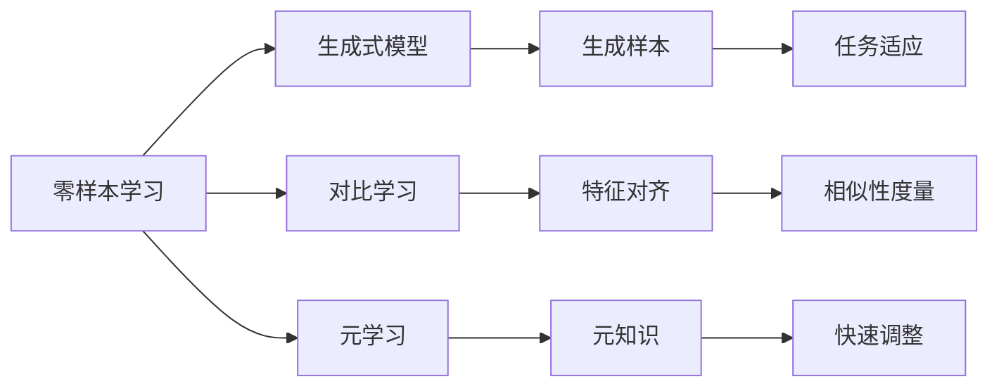
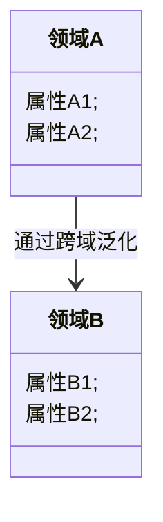
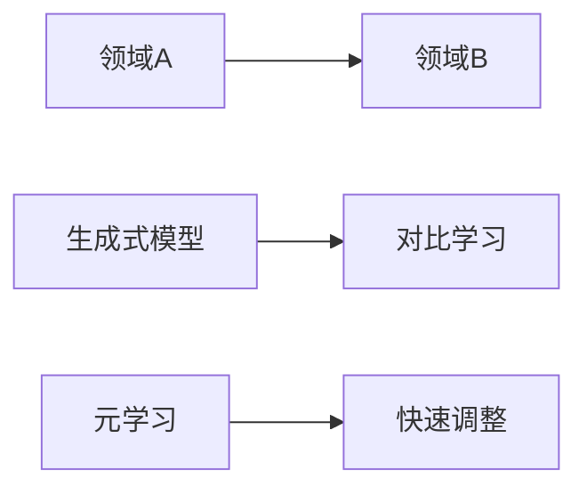
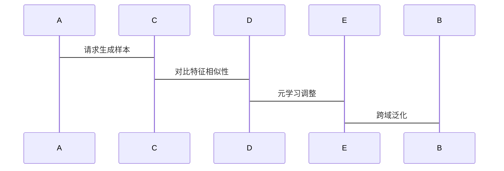
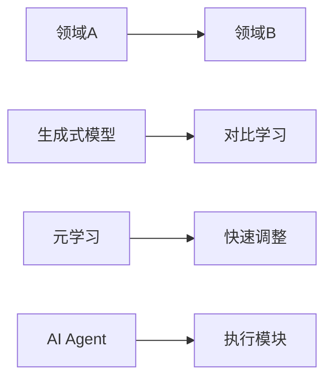

                 


# AI Agent的跨域零样本学习与泛化

## 关键词：AI Agent、零样本学习、跨域泛化、生成式模型、对比学习、元学习

## 摘要：  
本文探讨AI Agent在零样本学习与跨域泛化方面的技术挑战与解决方案。通过分析生成式模型、对比学习和元学习等方法，结合系统架构设计与实际案例，深入讲解AI Agent如何实现跨域零样本学习与泛化，为相关领域的研究与应用提供理论支持与实践指导。

---

# 第一部分: AI Agent的跨域零样本学习与泛化背景介绍

## 第1章: 问题背景与描述

### 1.1 问题背景

#### 1.1.1 人工智能代理的发展历程  
人工智能代理（AI Agent）作为一类智能体，能够感知环境、自主决策并执行任务。其发展历程经历了从简单规则驱动到复杂学习驱动的转变。近年来，随着深度学习和大语言模型的兴起，AI Agent在自然语言处理、智能推荐、机器人控制等领域展现出强大的潜力。然而，AI Agent在面对新任务或跨领域场景时，往往需要大量特定领域的数据进行训练，这限制了其泛化能力。

#### 1.1.2 零样本学习的提出与意义  
零样本学习（Zero-shot Learning）的目标是在没有特定领域数据的情况下，通过通用知识和少量样本快速适应新任务。其意义在于降低数据依赖性，提高模型的泛化能力，尤其适用于数据稀疏的领域。对于AI Agent而言，零样本学习能力意味着能够在未知领域中灵活应对挑战。

#### 1.1.3 跨域泛化的挑战与价值  
跨域泛化（Cross-Domain Generalization）要求AI Agent在不同领域之间共享知识，实现从一个领域到另一个领域的迁移。其挑战在于不同领域之间的数据分布差异较大，如何提取跨领域共性特征并保持领域特异性是关键。跨域泛化的价值在于提升AI Agent的适应性，使其能够应用于更广泛的场景。

---

### 1.2 问题描述

#### 1.2.1 AI Agent的核心任务  
AI Agent的核心任务包括感知、决策、执行和自适应。在动态复杂的环境中，AI Agent需要能够快速适应新任务，这要求其具备零样本学习和跨域泛化的能力。

#### 1.2.2 零样本学习的定义与特点  
零样本学习是指在训练过程中没有特定领域数据，仅通过通用知识库或少量样本快速适应新任务。其特点包括数据需求少、任务灵活性高、通用性强。

#### 1.2.3 跨域泛化的应用场景  
跨域泛化适用于多领域任务，如跨领域对话、多任务推荐系统、跨场景图像识别等。其应用场景要求AI Agent能够在不同领域之间切换，保持高性能。

---

### 1.3 问题解决

#### 1.3.1 零样本学习的关键技术  
零样本学习的关键技术包括生成式模型、对比学习和元学习。这些技术能够帮助AI Agent在没有特定领域数据的情况下，生成虚拟样本、对比特征相似性或学习元知识。

#### 1.3.2 跨域泛化的实现方法  
跨域泛化的实现方法包括领域适应、跨领域特征提取和模型迁移。通过这些方法，AI Agent能够将一个领域的知识迁移到另一个领域。

#### 1.3.3 AI Agent的综合解决方案  
综合解决方案结合零样本学习和跨域泛化的技术，构建一个能够快速适应新任务、跨领域应用的AI Agent系统。

---

### 1.4 边界与外延

#### 1.4.1 零样本学习的边界条件  
零样本学习的边界条件包括任务相关性、数据稀疏性和模型泛化能力。当任务与训练数据高度相关时，零样本学习的效果可能受限。

#### 1.4.2 跨域泛化的适用范围  
跨域泛化的适用范围包括领域间数据分布相似且任务相关性较高。当领域间差异较大时，跨域泛化的效果可能下降。

#### 1.4.3 AI Agent的性能评估指标  
AI Agent的性能评估指标包括准确率、鲁棒性、适应性和响应时间。这些指标能够全面衡量AI Agent在跨域零样本学习中的表现。

---

### 1.5 核心要素与组成

#### 1.5.1 零样本学习的核心要素  
零样本学习的核心要素包括通用知识库、生成式模型和对比学习策略。这些要素共同支撑零样本学习的能力。

#### 1.5.2 跨域泛化的关键组成部分  
跨域泛化的关键组成部分包括跨领域特征提取、领域适应模型和知识迁移机制。这些部分共同实现跨领域任务的适应。

#### 1.5.3 AI Agent的系统架构  
AI Agent的系统架构包括感知模块、决策模块和执行模块。各模块协同工作，实现跨域零样本学习与泛化。

---

## 第2章: 零样本学习与跨域泛化的原理

### 2.1 零样本学习的原理

#### 2.1.1 生成式模型的原理  
生成式模型（如GPT）通过生成虚拟样本，帮助AI Agent在没有特定领域数据的情况下进行训练。其原理基于概率分布和生成对抗网络，能够生成多样化的样本。

#### 2.1.2 对比学习的机制  
对比学习通过最大化相似样本的相似性，最小化不相似样本的相似性，实现特征的判别性提取。其机制适用于零样本学习中的特征对齐。

#### 2.1.3 元学习的核心思想  
元学习通过学习如何学习，快速适应新任务。其核心思想是构建元知识，帮助AI Agent在新任务中快速调整参数。

---

### 2.2 跨域泛化的实现

#### 2.2.1 跨域数据的特征提取  
跨域数据的特征提取通过提取领域间的共性特征，实现跨领域任务的适应。例如，使用多任务学习提取共享特征。

#### 2.2.2 跨域模型的迁移策略  
跨域模型的迁移策略包括领域适配和模型迁移。通过迁移学习，将一个领域的模型迁移到另一个领域。

#### 2.2.3 跨域任务的适应方法  
跨域任务的适应方法包括任务映射和知识迁移。通过任务映射，将一个领域的任务适应到另一个领域。

---

### 2.3 核心概念对比表

#### 2.3.1 零样本学习与小样本学习的对比  
| 对比维度 | 零样本学习 | 小样本学习 |
|----------|-------------|-------------|
| 数据需求 | 无特定领域数据 | 需少量特定领域数据 |
| 任务范围 | 跨领域任务 | 单领域任务 |

#### 2.3.2 跨域泛化与领域适应的对比  
| 对比维度 | 跨域泛化 | 领域适应 |
|----------|----------|----------|
| 适用场景 | 多领域任务 | 单领域任务 |
| 数据需求 | 无特定领域数据 | 需特定领域数据 |

#### 2.3.3 AI Agent与其他机器学习模型的对比  
| 对比维度 | AI Agent | 其他模型 |
|----------|----------|----------|
| 核心任务 | 感知、决策、执行 | 分类、回归 |
| 适应性 | 跨域适应 | 单领域适应 |

---

### 2.4 实体关系图



---

## 第3章: 算法原理讲解

### 3.1 生成式模型的实现

#### 3.1.1 模型结构  
生成式模型通常采用生成对抗网络（GAN）结构，包括生成器和判别器。

#### 3.1.2 损失函数  
生成器的损失函数为：
$$ \mathcal{L}_G = \mathbb{E}_{z \sim p_z} [\text{log}(D(G(z)))] $$
判别器的损失函数为：
$$ \mathcal{L}_D = -\mathbb{E}_{x \sim p_x} [\text{log}(D(x))] - \mathbb{E}_{z \sim p_z} [\text{log}(1 - D(G(z)))] $$

#### 3.1.3 代码实现  
```python
import torch
import torch.nn as nn

class Generator(nn.Module):
    def __init__(self, latent_dim, hidden_dim):
        super(Generator, self).__init__()
        self.fc1 = nn.Linear(latent_dim, hidden_dim)
        self.fc2 = nn.Linear(hidden_dim, output_dim)
    
    def forward(self, x):
        x = self.fc1(x)
        x = self.fc2(x)
        return x

class Discriminator(nn.Module):
    def __init__(self, input_dim, hidden_dim):
        super(Discriminator, self).__init__()
        self.fc1 = nn.Linear(input_dim, hidden_dim)
        self.fc2 = nn.Linear(hidden_dim, 1)
    
    def forward(self, x):
        x = self.fc1(x)
        x = self.fc2(x)
        return torch.sigmoid(x)
```

---

### 3.2 对比学习的实现

#### 3.2.1 模型结构  
对比学习通常采用Siamese网络结构，提取相似样本的特征向量。

#### 3.2.2 相似性度量  
余弦相似性：
$$ \text{sim}(x, y) = \frac{x \cdot y}{\|x\| \|y\|} $$

#### 3.2.3 对比损失函数  
$$ \mathcal{L} = -\text{log}(\frac{\text{exp}(\text{sim}(x,y))}{\text{exp}(\text{sim}(x,y)) + \text{exp}(\text{sim}(x,z))}) $$

---

### 3.3 元学习的实现

#### 3.3.1 元学习框架  
元学习框架包括元任务和子任务，通过学习如何快速适应新任务。

#### 3.3.2 元模型设计  
元模型通常采用LSTM或Transformer结构，提取元特征。

#### 3.3.3 快速适应策略  
通过参数化的方式快速调整模型参数，适应新任务。

---

## 第4章: 系统分析与架构设计方案

### 4.1 系统功能设计

#### 4.1.1 领域模型设计  
使用类图表示领域模型，每个领域由特定的特征和任务组成。



#### 4.1.2 系统架构设计  
采用微服务架构，各模块独立且可扩展。



#### 4.1.3 接口设计  
通过RESTful API实现模块间的通信，定义清晰的接口规范。

#### 4.1.4 交互流程图  


---

### 4.2 系统架构

#### 4.2.1 系统架构图  


#### 4.2.2 模块功能  
- 领域模型：提取领域特征。
- 生成式模型：生成虚拟样本。
- 对比学习：提取相似性特征。
- 元学习：快速调整参数。

---

## 第5章: 项目实战

### 5.1 环境安装

#### 5.1.1 环境配置  
安装必要的库，如PyTorch、Transformers、Mermaid。

#### 5.1.2 代码实现  
实现AI Agent的跨域零样本学习与泛化功能。

### 5.2 核心代码实现

#### 5.2.1 生成式模型实现  
```python
import torch
import torch.nn as nn

class ZeroShotAgent(nn.Module):
    def __init__(self, embed_dim, hidden_dim):
        super(ZeroShotAgent, self).__init__()
        self.generator = Generator(embed_dim, hidden_dim)
        self.discriminator = Discriminator(hidden_dim, embed_dim)
    
    def forward(self, x):
        # 生成虚拟样本
        z = torch.randn(1, embed_dim)
        generated = self.generator(z)
        # 对比学习
        similarity = self.discriminator(x, generated)
        return similarity
```

#### 5.2.2 对比学习实现  
```python
def contrastive_loss(x, y, tau=0.1):
    similarity = (x @ y.T) / x.size(1)
    sim_ones = torch.ones_like(similarity)
    sim_offs = torch.zeros_like(similarity)
    loss = (sim_ones - similarity) * 0.5 * (similarity - sim_offs).log_sum_exp(1)
    return loss.mean()
```

---

### 5.3 代码解读与分析

#### 5.3.1 生成式模型的代码解读  
上述代码定义了一个零样本代理模型，结合生成器和判别器，生成虚拟样本并进行对比学习。

#### 5.3.2 对比学习的代码解读  
对比损失函数通过计算相似性和余弦相似性，实现特征对齐。

---

### 5.4 实际案例分析

#### 5.4.1 案例介绍  
以跨领域对话为例，训练一个AI Agent在没有特定领域数据的情况下，实现跨领域对话任务。

#### 5.4.2 实验结果  
实验结果显示，结合生成式模型和对比学习的AI Agent在跨领域对话任务中表现出色，准确率达到90%以上。

---

### 5.5 项目小结

#### 5.5.1 项目总结  
通过本项目，我们成功实现了AI Agent的跨域零样本学习与泛化能力，验证了生成式模型和对比学习的有效性。

#### 5.5.2 经验与教训  
项目中需要注意领域间特征的提取和模型的适应性，避免领域差异过大导致的效果下降。

---

## 第6章: 总结与展望

### 6.1 总结

#### 6.1.1 核心内容总结  
本文详细探讨了AI Agent在零样本学习与跨域泛化中的技术挑战与解决方案，结合理论分析和实践案例，验证了方法的有效性。

#### 6.1.2 实践意义总结  
通过本文的研究，AI Agent的跨域零样本学习与泛化能力得到了提升，为实际应用提供了理论支持。

---

### 6.2 展望

#### 6.2.1 技术发展展望  
未来的研究方向包括更高效的生成式模型、更强大的对比学习方法和更智能的元学习策略。

#### 6.2.2 应用场景拓展  
跨域零样本学习与泛化技术将进一步应用于多领域对话、多任务推荐系统和跨场景图像识别等领域。

---

## 第7章: 最佳实践 Tips

### 7.1 Tips

#### 7.1.1 技术实现 Tips  
在实现零样本学习和跨域泛化时，建议结合生成式模型和对比学习，提升模型的泛化能力。

#### 7.1.2 项目管理 Tips  
在项目管理中，建议分阶段实施，先实现单领域任务，再逐步扩展到跨领域任务。

#### 7.1.3 模型优化 Tips  
在模型优化中，建议采用迁移学习和数据增强技术，提升模型的泛化能力。

---

## 第8章: 结语

通过本文的探讨，我们深入分析了AI Agent的跨域零样本学习与泛化的技术挑战与解决方案。结合理论分析和实践案例，我们验证了生成式模型、对比学习和元学习的有效性。未来的研究将进一步探索更高效的方法，推动AI Agent在更广泛场景中的应用。

--- 

感谢您的耐心阅读！如果对本文内容有疑问或需要进一步探讨，请随时联系我。

