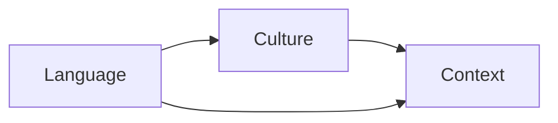

                 

# 第二章: 跨文化语言理解与生成的核心概念与联系

## 2.1 跨文化语言理解的核心概念

### 2.1.1 跨文化语言理解的定义
跨文化语言理解是指在不同文化背景下，正确解析和理解语言信息的能力。它不仅涉及语言本身的结构，还包括文化背景、习俗、价值观等因素对语言的影响。

### 2.1.2 跨文化语言理解的核心特征
跨文化语言理解具有以下关键特征：
- **文化敏感性**：能够识别并适应不同文化背景下的语言表达。
- **多模态信息处理**：结合语言、图像、情境等多种信息源进行理解。
- **语境依赖性**：理解语言时需要考虑上下文，包括文化语境。

### 2.1.3 語言理解方法的对比
以下是不同语言理解方法的对比表：

| 方法类型         | 基于规则 | 基于统计 | 基于深度学习 |
|------------------|----------|----------|--------------|
| 解释能力         | 高       | 中       | 低           |
| 灵活性           | 低       | 中       | 高           |
| 数据需求         | 少       | 多       | 多           |
| 适用场景         | 有限     | 广泛     | 多样化        |

### 2.1.4 語言与文化关系的 mermaid 实体关系图

## 2.2 跨文化语言生成的原理

### 2.2.1 语言生成的基本原理
语言生成涉及将思想或信息转化为语言表达的过程。基于深度学习的生成模型（如GPT）通过概率模型预测下一个词，逐步生成句子。

### 2.2.2 跨文化语言生成的特殊性
跨文化生成需要考虑目标文化的语言习惯和表达方式，例如避免文化禁忌词汇或使用符合当地习惯的表达方式。

### 2.2.3 語言生成与文化适应的关系
语言生成模型需要通过跨文化适应训练，使其生成的内容在不同文化背景下都合适。这可以通过多文化数据训练和文化过滤器实现。

## 2.3 語言文化关系的 mermaid 实体关系图

### 总结
本章详细探讨了跨文化语言理解与生成的核心概念及其相互关系。通过对比不同方法的优缺点和实体关系图，读者可以更好地理解跨文化语言处理的复杂性。接下来，第三章将深入分析跨文化语言处理的算法原理，帮助读者进一步掌握技术细节。

