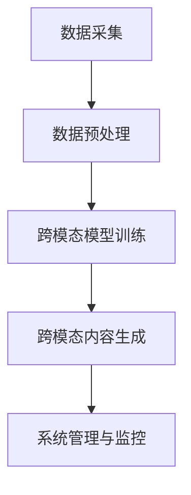

                 


# AI Agent的跨模态内容理解与生成系统

> 关键词：AI Agent, 跨模态内容理解, 跨模态生成, 多模态模型, 跨模态交互

> 摘要：本文系统地探讨了AI Agent在跨模态内容理解与生成系统中的应用，从核心概念、算法原理到系统架构设计，再到实际项目实战，全面解析了跨模态技术的实现细节与应用场景。本文旨在为读者提供一个从理论到实践的完整指南，帮助读者深入理解AI Agent的跨模态能力，并掌握实际开发中的关键技巧。

---

## 第1章: AI Agent与跨模态技术概述

### 1.1 AI Agent的基本概念

#### 1.1.1 AI Agent的定义与特点
AI Agent（智能体）是指在计算机系统中，能够感知环境并采取行动以实现目标的实体。AI Agent可以是软件程序、机器人或其他智能系统，其核心特点包括：
- **自主性**：能够在没有外部干预的情况下运行。
- **反应性**：能够根据环境输入实时调整行为。
- **目标导向**：所有行动都以实现特定目标为导向。
- **社会性**：能够与其他Agent或人类进行交互协作。

#### 1.1.2 跨模态技术的基本概念
跨模态技术是指在多个数据模态（如文本、图像、音频等）之间建立关联并进行信息理解和生成的技术。跨模态的核心在于将不同模态的数据进行对齐、融合和协同处理，以实现更强大的信息理解和生成能力。

#### 1.1.3 AI Agent在跨模态领域的应用价值
AI Agent结合跨模态技术，能够实现多模态数据的协同理解和生成，广泛应用于智能客服、智能助手、自动驾驶、机器人对话等领域。通过跨模态技术，AI Agent能够更全面地感知环境、理解用户需求并生成多样化的响应。

### 1.2 跨模态内容理解与生成的背景

#### 1.2.1 跨模态数据的定义与分类
跨模态数据是指来自不同感知渠道的数据，常见的模态包括：
- **文本**：包括自然语言文本、对话记录等。
- **图像**：包括图片、视频等视觉数据。
- **音频**：包括语音、音乐等听觉数据。
- **其他模态**：如地理位置、时间序列数据等。

#### 1.2.2 跨模态技术的发展历程
跨模态技术的发展经历了多个阶段：
- **单模态处理阶段**：单独处理文本、图像等模态数据。
- **跨模态检索阶段**：通过模态间的关联进行信息检索（如图像-文本检索）。
- **跨模态生成阶段**：基于多模态数据生成新的内容（如文本生成图像）。
- **多模态协同阶段**：多个模态数据协同工作，实现更复杂的理解和生成任务。

#### 1.2.3 当前AI Agent在跨模态领域的挑战与机遇
当前，AI Agent在跨模态领域的挑战主要体现在：
- **模态间信息对齐困难**：不同模态的数据具有不同的特征空间，难以直接进行关联。
- **多模态数据的高效处理**：如何在实时场景下高效处理多模态数据是关键挑战。
- **跨模态生成的多样性与真实性**：生成的多模态内容需要既多样化又真实可信。

### 1.3 本书的核心目标与内容框架

#### 1.3.1 本书的核心目标
本书旨在系统地介绍AI Agent在跨模态内容理解与生成系统中的核心技术和实现方法，从理论到实践，帮助读者掌握跨模态技术的核心原理和应用开发技巧。

#### 1.3.2 本书的内容框架
本书内容分为四个主要部分：
1. **概述**：介绍AI Agent和跨模态技术的基本概念与背景。
2. **跨模态数据与AI Agent的结合**：详细分析跨模态数据的类型、预处理与融合方法。
3. **跨模态内容理解与生成的算法原理**：讲解跨模态理解与生成的核心算法及其数学模型。
4. **系统架构设计与项目实战**：通过实际案例展示跨模态系统的架构设计与实现。

#### 1.3.3 本书的适用读者
本书适用于对AI Agent和跨模态技术感兴趣的读者，包括但不限于：
- 人工智能领域的研究人员
- 从事跨模态系统开发的工程师
- 对AI技术感兴趣的高等院校学生

---

## 第2章: 跨模态数据与AI Agent的结合

### 2.1 跨模态数据的类型与特点

#### 2.1.1 文本数据
文本数据是最常见的模态之一，包括自然语言文本、对话记录等。文本数据的特点是信息密度高、语义丰富，但难以直接与其他模态数据进行关联。

#### 2.1.2 图像数据
图像数据是视觉信息的载体，包括图片、视频等。图像数据具有空间信息丰富但语义理解困难的特点。

#### 2.1.3 音频数据
音频数据包括语音、音乐等，具有时间序列特性，适合处理声音信息但难以直接与视觉信息关联。

#### 2.1.4 其他模态数据
如地理位置、时间序列数据等，这些模态数据在特定场景下具有重要作用。

### 2.2 跨模态数据的预处理与融合

#### 2.2.1 数据清洗与标准化
跨模态数据预处理的关键步骤包括：
- **去噪**：去除无用信息（如噪声、冗余数据）。
- **标准化**：将不同模态的数据转换到统一的特征空间。

#### 2.2.2 数据对齐与融合方法
跨模态数据对齐是实现数据融合的关键步骤，常用方法包括：
- **基于特征的对齐**：通过提取特征将不同模态的数据对齐。
- **基于分布的对齐**：通过概率分布将不同模态的数据对齐。
- **基于语义的对齐**：通过语义理解将不同模态的数据对齐。

#### 2.2.3 跨模态数据的表示方式
跨模态数据的表示方式包括：
- **向量表示**：将数据转换为向量形式，便于计算。
- **符号表示**：通过符号或标签表示数据。
- **混合表示**：结合多种表示方式。

### 2.3 AI Agent中的跨模态交互

#### 2.3.1 跨模态交互的基本概念
跨模态交互是指在不同模态之间进行信息交换和协同工作的过程。跨模态交互的核心在于实现模态间的高效通信与协作。

#### 2.3.2 跨模态交互的实现方式
跨模态交互的实现方式包括：
- **基于规则的交互**：通过预定义的规则实现模态间的协作。
- **基于模型的交互**：通过机器学习模型实现模态间的协作。
- **混合交互**：结合规则和模型的交互方式。

#### 2.3.3 跨模态交互的应用场景
跨模态交互的应用场景包括：
- **智能客服**：通过文本和语音实现跨模态交互。
- **智能助手**：通过文本、语音和图像实现跨模态交互。
- **自动驾驶**：通过图像、激光雷达和 GPS 数据实现跨模态交互。

---

## 第3章: 跨模态内容理解的算法原理

### 3.1 跨模态理解的核心算法

#### 3.1.1 多模态转换模型
多模态转换模型是指将一种模态的数据转换为另一种模态数据的模型，例如将文本转换为图像。

#### 3.1.2 跨模态检索模型
跨模态检索模型是指在不同模态之间进行信息检索的模型，例如在图像中检索相关文本。

#### 3.1.3 跨模态分类与识别模型
跨模态分类与识别模型是指在不同模态之间进行分类和识别的模型，例如在图像中识别文本内容。

### 3.2 跨模态生成的算法原理

#### 3.2.1 多模态生成模型的定义
多模态生成模型是指能够生成多种模态数据的模型，例如生成同时包含文本和图像的内容。

#### 3.2.2 基于Transformer的多模态生成模型
基于Transformer的多模态生成模型是一种广泛使用的生成模型，其核心思想是通过自注意力机制实现多模态数据的协同生成。

#### 3.2.3 基于GAN的多模态生成模型
基于GAN（生成对抗网络）的多模态生成模型是一种通过对抗训练实现多模态数据生成的模型。

### 3.3 跨模态模型的训练与优化

#### 3.3.1 跨模态模型的训练策略
跨模态模型的训练策略包括：
- **联合训练**：同时训练多种模态的数据。
- **对齐训练**：通过模态间的对齐进行联合训练。
- **对抗训练**：通过生成对抗网络进行训练。

#### 3.3.2 跨模态模型的损失函数设计
跨模态模型的损失函数设计需要考虑多种模态数据的特征差异，常用损失函数包括：
- **交叉熵损失**
- **KL散度损失**
- **对抗损失**

#### 3.3.3 模型的调参与优化方法
跨模态模型的调参与优化方法包括：
- **超参数调节**：通过调节学习率、批次大小等超参数优化模型性能。
- **正则化方法**：使用Dropout、L2正则化等方法防止过拟合。
- **模型优化算法**：使用Adam、SGD等优化算法优化模型参数。

---

## 第4章: 跨模态内容理解与生成的系统架构

### 4.1 系统整体架构设计

#### 4.1.1 系统功能模块划分
跨模态内容理解与生成系统的功能模块包括：
- **数据采集模块**：采集多模态数据。
- **数据预处理模块**：对数据进行清洗和标准化。
- **跨模态模型训练模块**：训练跨模态模型。
- **跨模态内容生成模块**：生成多模态内容。
- **系统管理与监控模块**：管理与监控系统运行状态。

#### 4.1.2 系统功能流程图
以下是系统功能流程图的mermaid图：



#### 4.1.3 系统架构的优缺点分析
跨模态内容理解与生成系统的优点包括：
- **高效性**：能够快速处理多模态数据。
- **准确性**：通过模态间的协同提高理解与生成的准确性。
- **多样性**：能够生成多样化的多模态内容。

缺点包括：
- **复杂性**：系统设计和实现较为复杂。
- **计算资源需求高**：需要大量的计算资源支持。

### 4.2 系统功能模块设计

#### 4.2.1 数据采集与预处理模块
数据采集与预处理模块是系统的核心模块之一，负责采集多模态数据并进行清洗和标准化。

#### 4.2.2 跨模态模型训练模块
跨模态模型训练模块负责训练跨模态模型，包括模型参数的优化和损失函数的设计。

#### 4.2.3 跨模态内容生成模块
跨模态内容生成模块负责生成多模态内容，例如生成同时包含文本和图像的内容。

#### 4.2.4 系统管理与监控模块
系统管理与监控模块负责管理系统的运行状态，包括资源分配、系统监控等。

### 4.3 系统接口与交互设计

#### 4.3.1 系统接口设计
跨模态内容理解与生成系统的接口设计需要考虑模块之间的交互，例如数据采集模块与数据预处理模块之间的接口设计。

#### 4.3.2 系统交互设计
系统交互设计需要考虑用户与系统的交互方式，例如用户通过界面对系统进行操作和监控。

---

## 第5章: 跨模态内容理解与生成的项目实战

### 5.1 环境安装与配置

#### 5.1.1 安装依赖
需要安装的依赖包括：
- Python 3.8+
- PyTorch 2.0+
- Transformers库
- Mermaid图生成工具

#### 5.1.2 配置开发环境
配置开发环境，例如安装虚拟环境并激活。

### 5.2 核心代码实现

#### 5.2.1 数据预处理代码
以下是数据预处理的代码示例：

```python
import numpy as np
import pandas as pd

# 文本数据预处理
def preprocess_text(text):
    # 假设text是字符串
    return text.lower().strip()

# 图像数据预处理
def preprocess_image(image):
    # 假设image是图像数据
    return image / 255.0  # 标准化
```

#### 5.2.2 跨模态模型训练代码
以下是跨模态模型训练的代码示例：

```python
import torch
import torch.nn as nn
import torch.optim as optim

class MultimodalModel(nn.Module):
    def __init__(self, vocab_size, image_features):
        super().__init__()
        self.text_encoder = nn.Embedding(vocab_size, 128)
        self.image_encoder = nn.Linear(image_features, 128)
        self.bottleneck = nn.Linear(256, 128)

    def forward(self, text_input, image_input):
        text_embed = self.text_encoder(text_input)
        image_embed = self.image_encoder(image_input)
        combined_embed = torch.cat((text_embed, image_embed), dim=-1)
        output = self.bottleneck(combined_embed)
        return output

# 训练代码
def train_model(model, optimizer, criterion, text_loader, image_loader):
    model.train()
    for text_data, image_data in zip(text_loader, image_loader):
        optimizer.zero_grad()
        output = model(text_data, image_data)
        loss = criterion(output, target)
        loss.backward()
        optimizer.step()
```

#### 5.2.3 跨模态内容生成代码
以下是跨模态内容生成的代码示例：

```python
import torch
import torch.nn as nn
import torch.optim as optim

class MultimodalGenerator(nn.Module):
    def __init__(self, latent_dim, text_dim, image_dim):
        super().__init__()
        self.latent_layer = nn.Linear(latent_dim, 256)
        self.text_decoder = nn.Linear(256, text_dim)
        self.image_decoder = nn.Linear(256, image_dim)

    def forward(self, latent_input):
        latent_output = self.latent_layer(latent_input)
        text_output = self.text_decoder(latent_output)
        image_output = self.image_decoder(latent_output)
        return text_output, image_output

# 生成代码
def generate_content(generator, latent_input):
    generator.eval()
    with torch.no_grad():
        text_output, image_output = generator(latent_input)
        return text_output, image_output
```

### 5.3 实际案例分析与解读

#### 5.3.1 案例分析
以智能客服为例，跨模态内容理解与生成系统可以帮助智能客服通过文本和语音理解用户需求并生成相应的回复。

#### 5.3.2 代码应用解读
通过实际案例分析，解读代码实现的细节和实际应用中的注意事项。

### 5.4 项目总结与经验分享

#### 5.4.1 项目小结
总结项目实施过程中的关键点和经验教训。

#### 5.4.2 项目经验分享
分享在项目实施过程中积累的经验和最佳实践。

---

## 第6章: 最佳实践与未来展望

### 6.1 最佳实践

#### 6.1.1 系统设计
- **模块化设计**：确保系统模块化，便于维护和扩展。
- **高效数据处理**：采用高效的算法和数据结构处理跨模态数据。

#### 6.1.2 开发实践
- **代码规范**：遵循代码规范，便于团队协作。
- **测试与调试**：重视单元测试和集成测试，确保系统稳定。

### 6.2 小结

### 6.3 注意事项

#### 6.3.1 模型调优
- **参数选择**：合理选择模型参数，避免过拟合和欠拟合。
- **数据平衡**：确保数据分布平衡，避免模型偏向某一模态。

#### 6.3.2 系统性能优化
- **并行计算**：利用并行计算加速模型训练。
- **内存管理**：合理管理内存，避免内存泄漏。

### 6.4 拓展阅读

#### 6.4.1 推荐书籍
- 《Deep Learning》
- 《自然语言处理入门》

#### 6.4.2 推荐论文
- "Attention Is All You Need"
- "Learning Across Modalities"

---

## 附录

### 附录A: 跨模态数据处理的数学公式

#### 1. 文本向量化公式
$$
\text{Word Embedding} = \text{Word}_{i} \rightarrow \mathbb{R}^{d}
$$

#### 2. 图像对齐公式
$$
\text{Image Features} = \text{Image}_{j} \rightarrow \mathbb{R}^{d}
$$

#### 3. 跨模态对齐公式
$$
\text{Cross-Modal Alignment} = \argmin_{\theta} \sum_{i,j} \mathcal{L}(f_{\theta}(\text{Word}_i), f_{\theta}(\text{Image}_j))
$$

---

通过以上详细的内容，我们系统地介绍了AI Agent的跨模态内容理解与生成系统的核心概念、算法原理和系统设计，同时通过实际案例展示了系统的实现过程。希望读者能够通过本文深入理解跨模态技术，并在实际应用中灵活运用。

