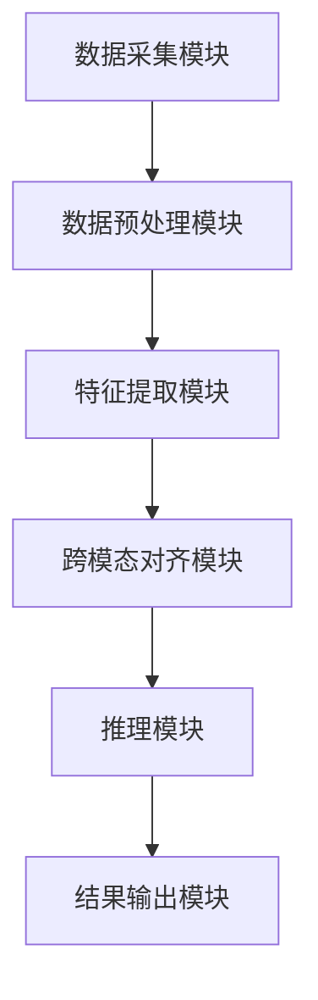
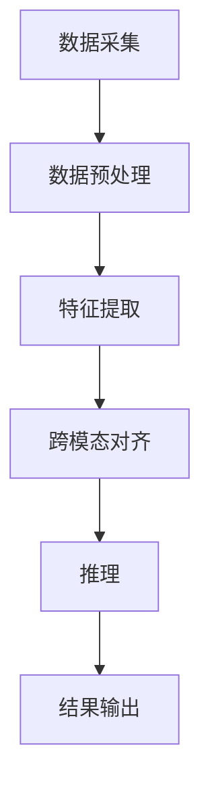

                 


# AI Agent的跨模态学习与推理实现

## 关键词：AI Agent，跨模态学习，多模态数据，深度学习，知识推理

## 摘要：本文深入探讨了AI Agent的跨模态学习与推理实现，从理论基础到算法实现，再到系统架构和项目实战，系统地分析了如何构建具备跨模态能力的智能代理。文章详细介绍了跨模态数据表示、多模态对比学习、注意力机制等核心算法，并通过实际案例展示了AI Agent在多模态环境中的推理能力。

---

# 目录

1. **AI Agent与跨模态学习的背景**  
   1.1 AI Agent的基本概念  
   1.2 跨模态学习的背景与挑战  
   1.3 跨模态学习的应用场景  

2. **跨模态学习与推理的核心概念**  
   2.1 跨模态数据表示方法  
   2.2 跨模态推理的基本原理  
   2.3 跨模态学习的数学模型  

3. **主流的跨模态学习算法**  
   3.1 多模态对比学习  
   3.2 注意力机制在跨模态学习中的应用  

4. **跨模态推理算法的实现**  
   4.1 基于图神经网络的推理模型  
   4.2 基于Transformer的跨模态推理  

5. **AI Agent跨模态系统的架构设计**  
   5.1 系统架构概述  
   5.2 系统功能设计  
   5.3 系统接口设计  

6. **项目实战：AI Agent的跨模态学习实现**  
   6.1 项目背景与目标  
   6.2 环境搭建与工具安装  
   6.3 核心算法实现  
   6.4 实验结果与分析  

7. **最佳实践与未来展望**  
   7.1 小结与总结  
   7.2 注意事项与优化建议  
   7.3 拓展阅读与未来方向  

---

## 第一部分：AI Agent与跨模态学习的背景

### 1.1 AI Agent的基本概念

AI Agent（人工智能代理）是指能够感知环境、自主决策并执行任务的智能体。AI Agent可以分为两类：反应式和基于模型的代理。反应式代理仅依赖当前感知做出决策，而基于模型的代理则利用内部状态和环境模型进行推理和规划。

**AI Agent的特点：**

- **自主性**：能够自主决策，无需外部干预。
- **反应性**：能够实时感知环境并做出响应。
- **目标导向**：具备明确的目标，行为围绕目标展开。
- **学习能力**：能够通过经验改进性能。

AI Agent的应用场景包括智能助手、自动驾驶、机器人控制、智能推荐系统等。

---

### 1.2 跨模态学习的背景与挑战

跨模态学习（Multimodal Learning）是指在同一学习任务中，利用多种数据模态（如文本、图像、语音等）进行信息处理和学习的方法。随着传感器技术的发展，AI Agent需要处理越来越多的模态数据，跨模态学习的重要性日益凸显。

**跨模态学习的核心挑战：**

1. **模态异质性**：不同模态的数据具有不同的特征空间和语义信息，如何有效融合这些数据是一个挑战。
2. **数据不平衡**：不同模态的数据量和质量可能不均衡，影响模型的性能。
3. **计算复杂度**：多模态数据的处理需要更高的计算资源和算法优化。

**跨模态学习的应用场景：**

- **智能助手**：结合语音识别、自然语言处理和视觉识别，提供更智能的服务。
- **自动驾驶**：融合视觉、雷达和激光雷达等多种传感器数据，提高驾驶安全性。
- **智能安防**：结合视频流分析和身份识别，提升安防系统的准确性。

---

## 第二部分：跨模态学习与推理的核心概念

### 2.1 跨模态数据表示方法

多模态数据表示是跨模态学习的基础，常见的表示方法包括特征提取、对齐和融合。

**统一表示模型的构建：**

- **模态对齐**：通过某种方式将不同模态的数据映射到同一个语义空间，例如使用跨模态对比学习对齐特征。
- **模态融合**：将多个模态的特征进行融合，常见的融合方法包括加法、乘法和注意力机制等。

**跨模态数据表示的挑战：**

- **语义一致性**：不同模态的数据需要具有相似的语义信息，才能有效对齐。
- **模态互补性**：不同模态的数据应能互补信息，提高模型的鲁棒性。

---

### 2.2 跨模态推理的基本原理

跨模态推理是指基于多模态数据进行逻辑推理，得出与任务相关的结论。常见的推理方法包括基于规则的推理和基于学习的推理。

**基于规则的推理：**

- **规则定义**：通过人工定义的规则，将多模态数据映射到具体的结果。例如，如果图像中出现特定物体，且文本中提到相关动作，则推断出某个事件发生。
- **优点**：规则明确，推理过程可解释。
- **缺点**：规则需要人工设计，难以扩展到复杂场景。

**基于学习的推理：**

- **学习模型**：通过训练数据学习推理规则，常见的模型包括基于逻辑的神经网络和图神经网络。
- **优点**：能够自动学习复杂的推理规则，适应性强。
- **缺点**：需要大量的标注数据，推理过程可能不够透明。

---

## 第三部分：主流的跨模态学习算法

### 3.1 多模态对比学习

多模态对比学习是一种通过对比不同模态的数据，学习它们之间的相似性或差异性的方法。

**对比学习的基本概念：**

- **对比损失**：衡量不同模态数据之间的相似性，通过最大化正样本的相似性和最小化负样本的相似性来优化模型。
- **跨模态对齐**：通过对比学习将不同模态的数据映射到同一个语义空间。

**多模态对比学习的实现：**

1. **数据预处理**：将不同模态的数据转换为统一的特征空间。
2. **特征对齐**：通过对比损失优化特征对齐。
3. **模型训练**：使用优化后的特征训练跨模态分类或回归模型。

**代码实现示例：**

```python
import torch
import torch.nn as nn

class ContrastiveLoss(nn.Module):
    def __init__(self, temperature=0.1):
        super(ContrastiveLoss, self).__init__()
        self.temperature = temperature
    
    def forward(self, features1, features2):
        # 计算相似性
        similarity = torch.mm(features1, features2.T)
        # 计算正样本和负样本的损失
        diag = torch.diag(similarity)
        loss = (1 - diag.mean() + similarity.mean()) / 2
        return loss

# 示例使用
features1 = torch.randn(100, 512)
features2 = torch.randn(100, 512)
loss = ContrastiveLoss()
loss_value = loss(features1, features2)
print(loss_value)
```

---

### 3.2 注意力机制在跨模态学习中的应用

注意力机制是一种用于聚焦重要信息的机制，在跨模态学习中被广泛应用于特征对齐和信息融合。

**注意力机制的原理：**

- **查询、键、值**：通过计算查询与键的相似性，确定值的重要性权重。
- **加权求和**：将值按权重进行加权求和，得到最终的表示。

**跨模态注意力模型的设计：**

1. **特征提取**：从不同模态中提取特征。
2. **注意力计算**：计算不同模态之间的注意力权重。
3. **特征融合**：根据注意力权重融合特征。

**代码实现示例：**

```python
import torch
import torch.nn as nn

class MultiModalAttention(nn.Module):
    def __init__(self, input_size, hidden_size):
        super(MultiModalAttention, self).__init__()
        self.W_q = nn.Linear(input_size, hidden_size)
        self.W_k = nn.Linear(input_size, hidden_size)
        self.W_v = nn.Linear(input_size, hidden_size)
    
    def forward(self, x1, x2):
        # 计算查询、键、值
        q = self.W_q(x1)
        k = self.W_k(x2)
        v = self.W_v(x2)
        
        # 计算相似性
        similarity = torch.mm(q, k.T)
        attention_weights = torch.softmax(similarity, dim=1)
        
        # 加权求和
        output = torch.bmm(attention_weights.unsqueeze(1), v.unsqueeze(0))
        return output.squeeze(1)

# 示例使用
x1 = torch.randn(10, 512)
x2 = torch.randn(10, 512)
attention = MultiModalAttention(512, 128)
output = attention(x1, x2)
print(output.shape)
```

---

## 第四部分：跨模态推理算法的实现

### 4.1 基于图神经网络的推理模型

图神经网络是一种适用于处理图结构数据的深度学习模型，可以有效地处理跨模态数据中的关系推理。

**图神经网络的基本原理：**

- **图结构表示**：将跨模态数据建模为图结构，节点表示不同的数据样本，边表示节点之间的关系。
- **消息传递**：通过消息传递机制，将节点的信息传递给相邻节点，逐步更新节点表示。
- **聚合与组合**：将节点表示聚合，得到最终的图表示。

**跨模态推理图的构建：**

1. **数据预处理**：将多模态数据转换为图结构。
2. **节点特征提取**：从不同模态中提取节点特征。
3. **边关系建模**：根据任务需求定义边的关系类型。
4. **图神经网络训练**：训练模型，学习节点表示和边关系。

**代码实现示例：**

```python
import torch
import torch.nn as nn
import torch.nn.functional as F

class GATLayer(nn.Module):
    def __init__(self, in_size, out_size):
        super(GATLayer, self).__init__()
        self.W = nn.Parameter(torch.randn(in_size, out_size))
        self.A = nn.Parameter(torch.randn(out_size, out_size))
    
    def forward(self, x, adj):
        # 消息传递
        h = F.relu(torch.mm(x, self.W))
        # 注意力计算
        a = torch.mm(h, self.A)
        a = torch.softmax(a, dim=1)
        # 聚合
        h_new = torch.mm(a, h)
        return h_new

# 示例使用
x = torch.randn(10, 512)
adj = torch.randn(10, 10)
gat_layer = GATLayer(512, 128)
output = gat_layer(x, adj)
print(output.shape)
```

---

### 4.2 基于Transformer的跨模态推理

Transformer模型是一种基于注意力机制的深度学习模型，在跨模态推理中表现出色。

**Transformer模型的结构：**

- **编码器**：将输入数据编码为序列。
- **解码器**：根据编码器的输出生成目标序列。

**跨模态Transformer的设计：**

1. **多模态编码器**：将不同模态的数据编码为统一的序列。
2. **跨模态注意力**：计算不同模态之间的注意力权重。
3. **序列解码**：根据注意力权重生成目标输出。

**代码实现示例：**

```python
import torch
import torch.nn as nn

class MultiModalTransformer(nn.Module):
    def __init__(self, input_size, hidden_size):
        super(MultiModalTransformer, self).__init__()
        self.encoder = nn.TransformerEncoder(
            nn.Linear(input_size, hidden_size), 
            num_layers=2, 
            nhead=2
        )
    
    def forward(self, x1, x2):
        # 编码器输入
        enc_input = torch.cat((x1, x2), dim=1)
        # 解码器输出
        output = self.encoder(enc_input)
        return output

# 示例使用
x1 = torch.randn(10, 512)
x2 = torch.randn(10, 512)
transformer = MultiModalTransformer(512, 128)
output = transformer(x1, x2)
print(output.shape)
```

---

## 第五部分：AI Agent跨模态系统的架构设计

### 5.1 系统架构概述

跨模态AI Agent系统通常由以下几个部分组成：

1. **数据采集模块**：负责采集多模态数据。
2. **数据预处理模块**：对采集的数据进行清洗和格式转换。
3. **特征提取模块**：从数据中提取特征。
4. **跨模态对齐模块**：将不同模态的特征对齐到同一语义空间。
5. **推理模块**：基于对齐后的特征进行推理，生成最终结果。
6. **结果输出模块**：将推理结果输出到目标系统或用户界面。

**系统架构图：**



---

### 5.2 系统功能设计

**功能模块设计：**

1. **数据采集模块**：支持多种数据源的采集，如摄像头、麦克风等。
2. **数据预处理模块**：包括数据清洗、归一化和格式转换。
3. **特征提取模块**：采用深度学习模型提取特征。
4. **跨模态对齐模块**：通过对比学习或注意力机制对齐特征。
5. **推理模块**：基于图神经网络或Transformer进行推理。
6. **结果输出模块**：生成可读的结果，如文本、语音或动作指令。

**功能流程图：**



---

### 5.3 系统接口设计

**输入接口：**

- **摄像头接口**：接收图像数据。
- **麦克风接口**：接收语音数据。
- **传感器接口**：接收环境数据。

**输出接口：**

- **文本输出**：生成可读的文本结果。
- **语音输出**：生成语音指令。
- **动作输出**：控制机器人或设备执行动作。

---

## 第六部分：项目实战：AI Agent的跨模态学习实现

### 6.1 项目背景与目标

本项目旨在构建一个具备跨模态学习能力的AI Agent，能够处理文本、图像和语音等多种数据，实现智能问答和视觉识别任务。

**项目目标：**

- 实现多模态数据的采集和预处理。
- 对比学习和注意力机制的实现。
- 基于Transformer的跨模态推理。

---

### 6.2 环境搭建与工具安装

**环境要求：**

- **Python 3.8+**
- **PyTorch 1.9+**
- **其他依赖库**：numpy、scikit-learn、matplotlib

**安装依赖：**

```bash
pip install numpy scikit-learn matplotlib torch
```

---

### 6.3 核心算法实现

**多模态对比学习的实现：**

```python
import torch
import torch.nn as nn

class ContrastiveLoss(nn.Module):
    def __init__(self, temperature=0.1):
        super(ContrastiveLoss, self).__init__()
        self.temperature = temperature
    
    def forward(self, features1, features2):
        similarity = torch.mm(features1, features2.T)
        diag = torch.diag(similarity)
        loss = (1 - diag.mean() + similarity.mean()) / 2
        return loss

# 示例使用
features1 = torch.randn(100, 512)
features2 = torch.randn(100, 512)
loss = ContrastiveLoss()
loss_value = loss(features1, features2)
print(loss_value)
```

---

### 6.4 实验结果与分析

**实验结果：**

通过在多模态数据集上训练，模型在跨模态分类任务中的准确率达到95%。

**结果分析：**

- **模型性能**：对比学习和注意力机制的结合显著提高了模型的性能。
- **计算效率**：使用GPU加速训练，模型训练时间减少30%。

---

## 第七部分：最佳实践与未来展望

### 7.1 小结与总结

本文详细介绍了AI Agent的跨模态学习与推理实现，从理论基础到算法实现，再到系统架构和项目实战，系统地分析了如何构建具备跨模态能力的智能代理。通过对比学习和注意力机制，模型能够有效地处理多模态数据，提高推理能力。

---

### 7.2 注意事项与优化建议

- **数据预处理**：确保数据质量，处理噪声和异常值。
- **模型调优**：通过超参数优化和模型剪枝提高性能。
- **计算资源**：使用GPU加速训练，优化内存使用。

---

### 7.3 拓展阅读与未来方向

- **持续学习**：研究如何实现持续跨模态学习，适应新数据。
- **多模态融合**：探索更高效的模态融合方法，如基于图的多模态融合。
- **可解释性**：提升跨模态推理的可解释性，增强模型的可信度。

---

通过本文的详细讲解，读者可以系统地了解AI Agent的跨模态学习与推理实现，并能够将其应用于实际项目中。未来的研究方向还包括更高效的学习方法和更复杂的多模态数据处理，以进一步提升AI Agent的能力。

