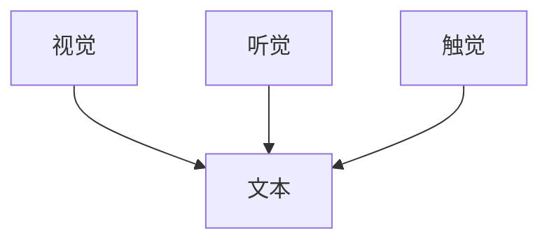
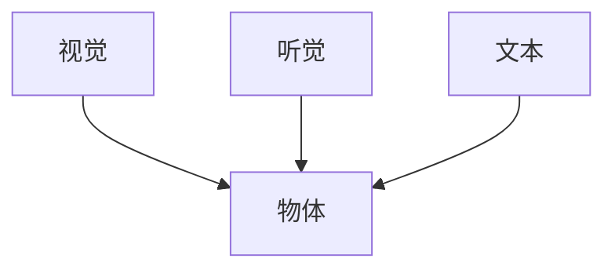
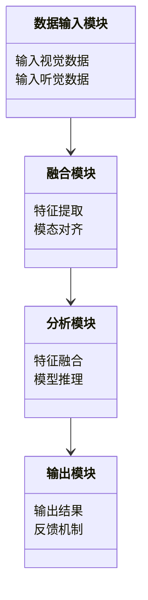

                 

# AI Agent的跨模态学习：促进多种感官信息的融合

> 关键词：跨模态学习，AI Agent，多模态数据，信息融合，深度学习

> 摘要：本文将详细探讨AI Agent在跨模态学习中的应用，重点分析如何通过融合多种感官信息（如视觉、听觉、触觉等）来提升AI Agent的感知和决策能力。从理论基础到实际应用，文章将系统性地介绍跨模态学习的核心概念、算法原理、系统架构以及项目实战，帮助读者全面理解这一前沿技术。

---

## 第一部分: 背景与概念

### 第1章: 跨模态学习的背景与概念

#### 1.1 跨模态学习的定义与背景

跨模态学习（Multimodal Learning）是指在同一学习任务中，结合来自不同感官模态（如视觉、听觉、触觉等）的数据，以提高模型的理解能力和表现。随着AI技术的不断发展，跨模态学习在各个领域（如计算机视觉、自然语言处理、机器人学等）的应用越来越广泛。

**问题背景**：  
传统的单一模态学习方法在处理复杂任务时往往力不从心，例如在图像识别任务中仅依赖视觉信息可能会忽略重要的上下文信息。通过融合多模态数据，AI Agent可以更好地理解和处理复杂的现实场景。

**问题解决**：  
跨模态学习通过结合多种感官信息，能够提供更全面的上下文理解，从而提升模型的泛化能力和鲁棒性。

**边界与外延**：  
跨模态学习的核心在于数据的融合与信息的共享，其外延包括多模态表示学习、多模态对比学习等。

#### 1.2 跨模态学习的核心概念

**多模态数据的定义与特点**：  
多模态数据是指来自不同感官渠道的数据，例如图像、文本、语音、视频等。这些数据具有多样性和互补性，能够提供更丰富的信息。

**跨模态学习的分类与对比**：  
跨模态学习可以分为模态对齐、模态生成、模态分类等多种形式。与多模态学习相比，跨模态学习更注重不同模态之间的关联与融合。

**实体关系图**：  
通过Mermaid图展示跨模态学习中的实体关系，帮助读者理解不同模态之间的交互与依赖。

---

## 第二部分: 跨模态学习的核心概念与联系

### 第2章: 跨模态学习的核心概念与联系

#### 2.1 跨模态学习的原理

**跨模态数据的表示方法**：  
通过编码器将不同模态的数据转化为统一的表示空间，例如使用深度神经网络提取图像的特征向量。

**信息融合的方式**：  
包括早期融合（在特征提取前融合数据）和晚期融合（在特征提取后融合数据）。

**挑战与解决方案**：  
跨模态学习面临模态不平衡、信息冗余等问题，解决方案包括引入对比学习、注意力机制等。

#### 2.2 跨模态学习的核心要素

**模态的定义与特征对比**：  
通过表格对比不同模态的特征，例如：

| 模态类型 | 特征描述          |
|----------|------------------|
| 视觉     | 图像分辨率、颜色   |
| 听觉     | 音频频率、音调     |
| 文本     | 词汇、语义         |

**实体关系图**：  
通过Mermaid图展示跨模态学习中的实体关系：

---

## 第三部分: 跨模态学习的算法原理

### 第3章: 跨模态学习的算法原理

#### 3.1 跨模态学习的典型算法

**多模态对比学习**：  
通过对比学习，将不同模态的数据映射到同一空间，从而实现跨模态对齐。

**多模态自监督学习**：  
利用自监督学习框架，从多模态数据中学习有用的表示。

**多模态图神经网络**：  
将多模态数据建模为图结构，利用图神经网络进行跨模态推理。

#### 3.2 跨模态学习算法的数学模型

**对比学习的损失函数**：  
$$L = -\frac{1}{N}\sum_{i=1}^{N} \log \frac{e^{sim(x_i,y_i)}}{\sum_{j=1}^{N} e^{sim(x_i,y_j)}}}$$

**多模态融合的数学公式**：  
$$z = f(x,y)$$  
其中，$x$和$y$分别来自不同的模态，$z$是融合后的表示。

---

## 第四部分: 跨模态学习的系统分析与架构设计

### 第4章: 跨模态学习的系统分析与架构设计

#### 4.1 系统功能需求

**数据采集与预处理**：  
包括多模态数据的采集、清洗和标准化。

**模态数据的融合与分析**：  
将不同模态的数据进行融合，并进行特征提取和分析。

**系统的输出与反馈**：  
根据融合后的数据生成输出，并提供反馈机制以优化模型。

#### 4.2 系统架构设计

**系统功能模块划分**：  
包括数据输入模块、融合模块、分析模块和输出模块。

**系统的领域模型设计**：  
通过Mermaid图展示系统的领域模型：

---

## 第五部分: 跨模态学习的项目实战

### 第5章: 跨模态学习的项目实战

#### 5.1 环境搭建与数据准备

**开发环境的安装与配置**：  
安装Python、深度学习框架（如TensorFlow、PyTorch）等。

**数据集的准备与处理**：  
选择适合的多模态数据集（如MNIST+语音数据），并进行预处理。

#### 5.2 系统实现与优化

**系统核心功能的实现**：  
实现多模态数据的融合与分析，例如图像和文本的跨模态检索。

**算法的具体实现与优化**：  
通过对比学习实现跨模态对齐，并进行模型优化。

#### 5.3 系统测试与验证

**系统的测试与验证**：  
通过实验验证系统的性能，分析结果并进行优化。

---

## 第六部分: 跨模态学习的最佳实践与注意事项

### 第6章: 跨模态学习的最佳实践与注意事项

#### 6.1 最佳实践

**数据预处理**：  
确保数据的多样性和平衡性，避免模态不平衡问题。

**模型选择与优化**：  
选择适合的跨模态学习算法，并进行调参优化。

**系统的可扩展性**：  
设计模块化架构，便于后续扩展和维护。

#### 6.2 小结

跨模态学习通过融合多种感官信息，显著提升了AI Agent的感知和决策能力。本文从理论到实践，全面介绍了跨模态学习的核心概念、算法原理、系统架构和项目实战。

#### 6.3 注意事项

**数据隐私与安全**：  
在处理多模态数据时，需注意数据隐私和安全问题。

**模型的泛化能力**：  
避免过拟合，确保模型的泛化能力。

#### 6.4 拓展阅读

推荐阅读相关领域的最新论文和书籍，了解跨模态学习的最新进展。

---

**结语**：  
跨模态学习是AI Agent技术的重要组成部分，通过融合多种感官信息，能够显著提升AI Agent的智能水平。希望本文能够为读者提供有价值的参考，帮助他们在跨模态学习领域取得更大的突破。

