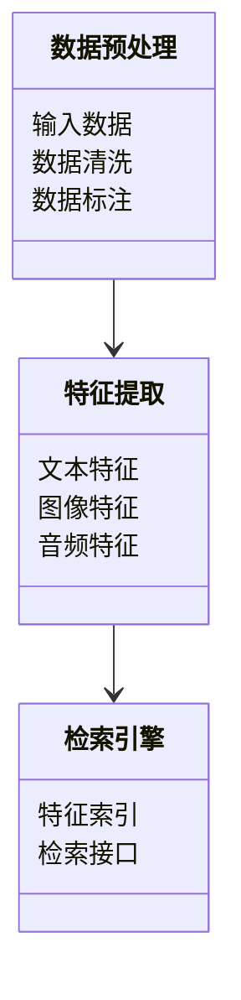
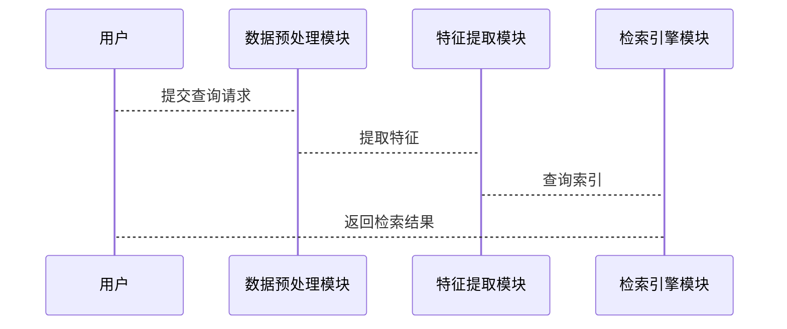

                 


```markdown
# AI Agent的跨模态检索能力开发

> 关键词：AI Agent，跨模态检索，多模态数据，深度学习，检索算法

> 摘要：本文深入探讨AI Agent的跨模态检索能力，从背景、核心概念到算法实现，再到系统架构与项目实战，详细分析其开发过程。通过数学公式、算法流程图、系统架构图等，帮助读者全面理解跨模态检索在AI Agent中的应用与开发。

---

# 第一部分: AI Agent的跨模态检索能力开发背景

## 第1章: 跨模态检索的基本概念与背景

### 1.1 跨模态检索的定义与特点
#### 1.1.1 跨模态检索的定义
跨模态检索是指在不同数据类型（如文本、图像、音频等）之间进行信息检索的过程。其核心在于将多模态数据转换为统一的表示形式，以便进行有效的匹配和检索。

#### 1.1.2 跨模态检索的核心特点
- **多模态性**：处理多种数据类型，支持跨模态查询。
- **异构性**：不同模态的数据具有不同的特征和结构。
- **语义一致性**：检索结果需在语义上与查询内容一致。

#### 1.1.3 跨模态检索与传统检索的区别
- 传统检索：单模态（如文本或图像）检索。
- 跨模态检索：支持多模态数据的检索和匹配。

### 1.2 AI Agent的定义与能力
#### 1.2.1 AI Agent的基本概念
AI Agent是一种智能体，能够感知环境、自主决策并执行任务。具备学习、推理、规划和交互能力。

#### 1.2.2 AI Agent的核心能力
- **感知能力**：通过多模态数据感知环境。
- **决策能力**：基于感知数据做出最优决策。
- **交互能力**：与用户或其他系统进行自然交互。

#### 1.2.3 跨模态检索在AI Agent中的重要性
跨模态检索能力使AI Agent能够处理和理解多种数据类型，提升其感知和交互能力。

### 1.3 跨模态检索的应用场景
#### 1.3.1 多媒体搜索
支持用户通过图像、文本等多种方式查询信息。

#### 1.3.2 联网设备的智能交互
智能家居设备通过跨模态检索实现与用户的自然交互。

#### 1.3.3 智慧城市的多模态数据处理
智慧城市建设中，跨模态检索用于处理交通、环境等多种数据。

## 1.4 本章小结
跨模态检索是AI Agent的核心能力之一，支持多模态数据的处理和检索，广泛应用于多媒体搜索、智能交互和智慧城市等领域。

---

# 第二部分: 跨模态检索的核心概念与原理

## 第2章: 跨模态检索的核心原理

### 2.1 跨模态数据的表示与融合
#### 2.1.1 多模态数据的表示方法
- **文本表示**：使用词嵌入（如Word2Vec）将文本转换为向量。
- **图像表示**：使用CNN提取图像特征向量。
- **音频表示**：使用MFCC提取音频特征。

#### 2.1.2 跨模态数据的融合策略
- **早期融合**：在特征提取前进行融合。
- **晚期融合**：在特征提取后进行融合。
- **多任务学习**：通过多任务模型实现跨模态融合。

#### 2.1.3 跨模态向量空间的构建
通过将不同模态的数据映射到统一向量空间，实现跨模态检索。

### 2.2 跨模态检索的算法原理
#### 2.2.1 基于相似度的检索算法
- **余弦相似度**：衡量两个向量的相似程度。
  $$\text{余弦相似度} = \frac{\vec{a} \cdot \vec{b}}{|\vec{a}| |\vec{b}|}$$
- **欧氏距离**：衡量两个向量的距离。
  $$\text{欧氏距离} = \sqrt{(a_1 - b_1)^2 + (a_2 - b_2)^2 + \dots + (a_n - b_n)^2}$$

#### 2.2.2 基于概率的检索算法
- **Bayesian检索**：基于贝叶斯定理进行概率计算。
- **语言模型检索**：基于语言模型进行文本检索。

#### 2.2.3 基于深度学习的检索算法
- **基于注意力机制的多模态编码**：通过注意力机制进行跨模态信息融合。
- **对比学习**：通过对比损失函数优化特征表示。
  $$\text{对比损失} = -\log(\text{相似度}) - \log(1 - \text{非相似度})$$

### 2.3 跨模态检索的评价指标
#### 2.3.1 检索准确率
准确率越高，检索结果越精准。

#### 2.3.2 检索召回率
召回率越高，检索结果越全面。

#### 2.3.3 检索效率
检索速度越快，系统性能越好。

## 2.4 本章小结
跨模态检索的核心在于数据表示与融合，以及高效的检索算法。基于相似度和深度学习的算法是当前研究的热点。

---

# 第三部分: 跨模态检索的系统架构与设计

## 第3章: 跨模态检索系统的架构与设计

### 3.1 问题场景介绍
设计一个支持多模态数据检索的AI Agent系统，涵盖数据预处理、特征提取、检索引擎等功能。

### 3.2 系统功能设计
#### 3.2.1 领域模型设计


#### 3.2.2 系统架构设计


#### 3.2.3 系统交互设计


### 3.3 系统实现细节
#### 3.3.1 数据预处理
- 数据清洗：去除噪声数据。
- 数据标注：为数据添加标签。

#### 3.3.2 特征提取
- 使用预训练模型（如BERT、ResNet）提取特征。

#### 3.3.3 检索引擎
- 建立特征索引，支持高效的检索操作。

### 3.4 本章小结
跨模态检索系统的架构设计包括数据预处理、特征提取和检索引擎三个主要模块，各模块协同工作，实现高效的跨模态检索。

---

# 第四部分: 跨模态检索的项目实战

## 第4章: 跨模态检索系统的实现

### 4.1 环境配置
- **Python**：3.8+
- **深度学习框架**：TensorFlow或PyTorch
- **其他依赖**：numpy、scikit-learn

### 4.2 核心代码实现
#### 4.2.1 数据预处理代码
```python
import numpy as np
from sklearn.feature_extraction.text import TfidfVectorizer

# 文本数据预处理
def preprocess_text(text):
    vectorizer = TfidfVectorizer()
    features = vectorizer.fit_transform([text]).toarray()
    return features[0]

# 图像数据预处理（示例）
def preprocess_image(image_path):
    # 假设使用预训练的图像模型提取特征
    return model.predict(image_path)
```

#### 4.2.2 检索引擎实现
```python
import numpy as np
from sklearn.metrics.pairwise import cosine_similarity

# 特征库存储
feature_database = {}

def add_to_database(key, feature):
    feature_database[key] = feature

def search_database(query_feature, threshold=0.7):
    similarities = cosine_similarity([query_feature], list(feature_database.values()))
    results = []
    for i, sim in enumerate(similarities[0]):
        if sim > threshold:
            results.append((i, sim))
    return results
```

### 4.3 功能测试与优化
#### 4.3.1 功能测试
- 测试跨模态检索的准确率和召回率。

#### 4.3.2 系统优化
- 优化特征提取算法，提高检索效率。
- 调整阈值，平衡准确率和召回率。

### 4.4 项目小结
通过实际项目实现，验证了跨模态检索系统的可行性和有效性。优化后的系统在准确率和效率上均有提升。

---

# 附录

## 附录A: 跨模态检索算法的数学模型
- 余弦相似度公式
- 对比学习损失函数

## 附录B: 系统架构图
- 数据流图
- 系统交互图

## 附录C: 参考文献
- 引用的相关论文和书籍

---

# 结语

跨模态检索是AI Agent的核心能力之一，随着技术的发展，其应用前景将更加广阔。通过本文的系统介绍和实战分析，读者可以全面掌握跨模态检索的开发与实现。
```

