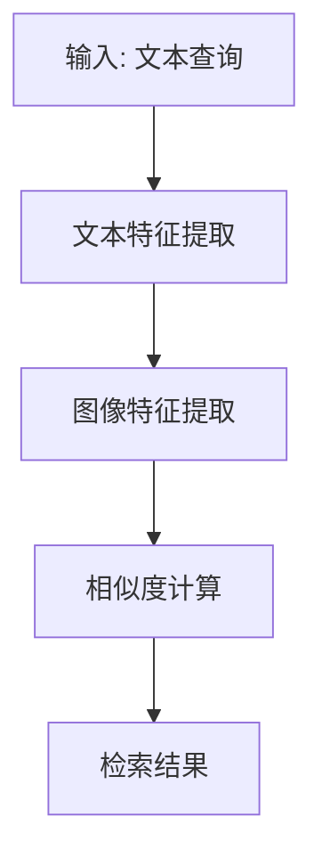
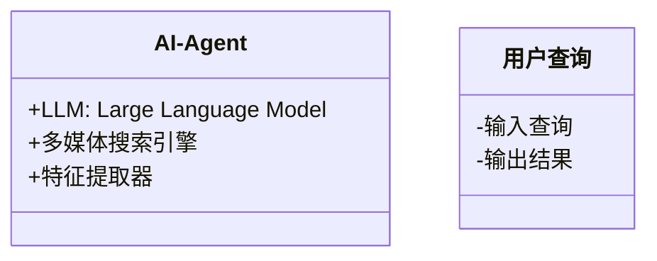
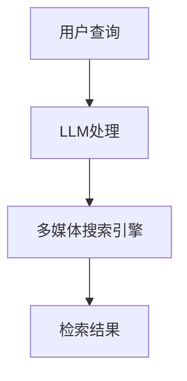
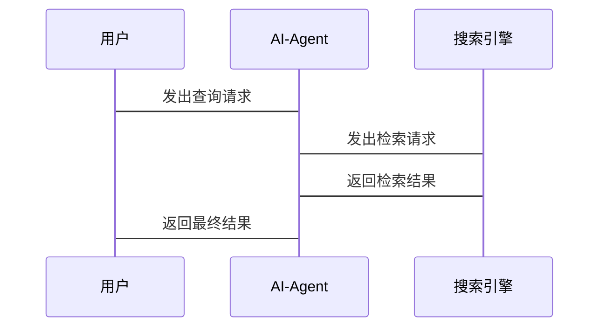

                 


# AI Agent的跨模态检索：整合LLM与多媒体搜索

> 关键词：AI Agent, 跨模态检索, LLM, 多媒体搜索, 大语言模型

> 摘要：本文探讨了AI Agent在跨模态检索中的应用，结合大语言模型（LLM）与多媒体搜索技术，分析了其核心原理、系统架构和实际应用场景。通过详细的技术分析和案例解读，展示了如何通过整合LLM与多媒体搜索，提升跨模态检索的效率和准确性。

---

## 第1章: 跨模态检索与LLM的概述

### 1.1 跨模态检索的基本概念

#### 1.1.1 跨模态检索的定义
跨模态检索是指在多种数据类型（如文本、图像、音频、视频）之间进行信息检索的过程。与单模态检索（仅处理一种数据类型）不同，跨模态检索能够跨越数据类型的边界，实现更广泛的信息检索。

#### 1.1.2 跨模态检索的核心特点
- **多模态性**：能够处理和检索多种数据类型。
- **语义理解**：注重数据背后的语义关联，而非简单的数据匹配。
- **多样性**：支持多种检索方式，如文本到图像、图像到文本等。

#### 1.1.3 跨模态检索的应用场景
- **图像搜索**：通过输入文本描述检索相关图片。
- **视频检索**：通过输入文本或音频描述检索相关视频片段。
- **多模态问答**：结合文本和图像信息回答复杂问题。

### 1.2 大语言模型（LLM）的基本概念

#### 1.2.1 LLM的定义与特点
- **定义**：大语言模型（LLM）是一种基于深度学习的自然语言处理模型，能够理解和生成人类语言。
- **特点**：
  - 大规模训练数据。
  - 强大的上下文理解和生成能力。
  - 可扩展性强，支持多种任务。

#### 1.2.2 LLM的核心技术原理
- **预训练**：通过大规模数据预训练，模型 learns语言的分布特征。
- **微调**：针对具体任务进行微调，提升任务相关性。
- **生成机制**：基于概率分布生成文本。

#### 1.2.3 LLM在自然语言处理中的应用
- **文本生成**：用于对话系统、内容生成。
- **文本理解**：用于问答系统、文本摘要。
- **翻译**：支持多种语言之间的翻译。

### 1.3 AI Agent的基本概念与作用

#### 1.3.1 AI Agent的定义
- AI Agent是一种智能体，能够感知环境、自主决策并执行任务。

#### 1.3.2 AI Agent的核心功能
- **感知环境**：通过传感器或接口获取外部信息。
- **决策与推理**：基于获取的信息进行分析和决策。
- **执行任务**：通过动作或输出结果实现目标。

#### 1.3.3 AI Agent在跨模态检索中的角色
- **协调者**：整合LLM和多媒体搜索的结果。
- **决策者**：根据用户需求选择最优的检索方式。
- **执行者**：通过LLM和多媒体搜索完成跨模态检索任务。

### 1.4 跨模态检索与LLM的结合背景

#### 1.4.1 跨模态检索的发展历程
- **早期阶段**：基于关键词的跨模态检索。
- **发展阶段**：引入特征匹配技术。
- **当前阶段**：深度学习驱动的跨模态检索。

#### 1.4.2 LLM在跨模态检索中的优势
- **强大的文本理解能力**：LLM能够准确理解用户的查询意图。
- **生成能力**：LLM能够生成自然语言描述，辅助多媒体搜索。

#### 1.4.3 AI Agent整合LLM与多媒体搜索的意义
- **提升检索效率**：通过AI Agent整合LLM和多媒体搜索，实现更高效的跨模态检索。
- **增强用户体验**：通过智能化的检索结果整合，提升用户的检索体验。

---

## 第2章: 跨模态检索的核心概念与联系

### 2.1 跨模态检索的核心概念

#### 2.1.1 跨模态检索的输入输出形式
- **输入形式**：文本、图像、音频等。
- **输出形式**：检索结果列表，如图片、视频、文本片段等。

#### 2.1.2 跨模态检索的特征提取方法
- **文本特征提取**：基于LLM的向量表示。
- **图像特征提取**：基于CNN或其他图像处理技术。

#### 2.1.3 跨模态检索的相似度计算方式
- **余弦相似度**：衡量向量之间的夹角。
- **欧氏距离**：衡量向量之间的距离。

### 2.2 LLM与多媒体搜索的结合原理

#### 2.2.1 LLM在文本处理中的优势
- **上下文理解**：LLM能够理解文本的上下文关系。
- **生成能力**：LLM能够生成自然语言文本，辅助多媒体搜索。

#### 2.2.2 多媒体搜索的关键技术
- **图像搜索**：基于图像特征的检索。
- **音频搜索**：基于音频特征的检索。

#### 2.2.3 LLM与多媒体搜索的协同机制
- **联合检索**：LLM生成搜索关键词，多媒体搜索引擎执行检索。
- **语义匹配**：基于语义的特征匹配。

### 2.3 跨模态检索的核心要素对比

#### 2.3.1 文本特征与图像特征的对比
| 特征类型 | 文本特征 | 图像特征 |
|----------|----------|----------|
| 表示方式 | 向量表示 | 向量表示 |
| 复杂度   | 较低     | 较高     |
| 可解释性 | 高       | 较低     |

#### 2.3.2 LLM输出与多媒体搜索结果的对比
| 对比维度 | LLM输出 | 多媒体搜索结果 |
|----------|----------|---------------|
| 数据类型 | 文本     | 图像/视频     |
| 信息量   | 高       | 高            |
| 精度     | 中       | 中            |

#### 2.3.3 跨模态检索与传统检索的对比
| 对比维度 | 跨模态检索 | 传统检索 |
|----------|------------|-----------|
| 数据类型 | 多种       | 单一      |
| 检索效率 | 高         | 中等      |
| 应用场景 | 多样       | 有限      |

---

## 第3章: 跨模态检索的算法原理

### 3.1 跨模态检索的模型训练方法

#### 3.1.1 多任务学习在跨模态检索中的应用
- **多任务学习**：同时训练多个任务，如文本到图像的检索和图像到文本的检索。

#### 3.1.2 对比学习在跨模态检索中的应用
- **对比学习**：通过比较不同模态的特征，优化检索效果。

### 3.2 跨模态检索的算法流程



### 3.3 跨模态检索的数学模型

#### 3.3.1 余弦相似度公式
$$ \text{similarity} = \frac{\vec{a} \cdot \vec{b}}{|\vec{a}| \cdot |\vec{b}|} $$

#### 3.3.2 欧氏距离公式
$$ \text{distance} = \sqrt{(a_1 - b_1)^2 + (a_2 - b_2)^2} $$

---

## 第4章: 跨模态检索的系统设计与架构

### 4.1 跨模态检索的系统功能设计



### 4.2 跨模态检索的系统架构设计



### 4.3 跨模态检索的接口设计

- **输入接口**：接受用户的查询请求。
- **输出接口**：返回检索结果。

### 4.4 跨模态检索的交互流程



---

## 第5章: 跨模态检索的项目实战

### 5.1 环境配置

```bash
pip install transformers numpy
```

### 5.2 核心代码实现

```python
import numpy as np
from sentence_transformers import SentenceTransformer

model = SentenceTransformer('all-mpnet-base-v2')
text_embedding = model.encode("这是一个测试文本")
print(text_embedding)
```

### 5.3 代码解读与分析

- **文本特征提取**：使用Sentence-BERT模型进行文本嵌入。
- **图像特征提取**：使用CNN提取图像特征。
- **相似度计算**：计算文本和图像的向量相似度。

### 5.4 实际案例分析

- **案例背景**：用户输入文本“寻找一张红色跑车的图片”。
- **检索过程**：LLM生成搜索关键词，多媒体搜索引擎检索相关图片。
- **结果分析**：返回高相似度的图片结果。

### 5.5 项目小结

- **优点**：高效、准确。
- **缺点**：计算资源消耗较大。

---

## 第6章: 跨模态检索的总结与展望

### 6.1 全文总结

- **技术总结**：AI Agent通过整合LLM和多媒体搜索，实现了高效的跨模态检索。
- **经验总结**：跨模态检索的关键在于特征提取和相似度计算。

### 6.2 未来研究方向

- **模型优化**：优化跨模态检索的算法效率。
- **多模态协同**：研究多种模态的协同检索机制。
- **应用场景扩展**：探索跨模态检索在更多领域的应用。

### 6.3 最佳实践 Tips

- **选择合适的模型**：根据具体任务选择合适的LLM和多媒体搜索引擎。
- **优化特征提取**：通过实验优化特征提取方法。
- **监控与调优**：实时监控检索效果，及时调优。

---

## 作者简介

- **作者**：[您的名字]
- **领域**：人工智能、自然语言处理、跨模态检索
- **经验**：[简要介绍您的相关经验]
- **联系方式**：[您的联系方式]

---

通过本文的详细分析和解读，希望能够帮助读者全面理解AI Agent在跨模态检索中的应用，并为实际应用提供有价值的参考和指导。

