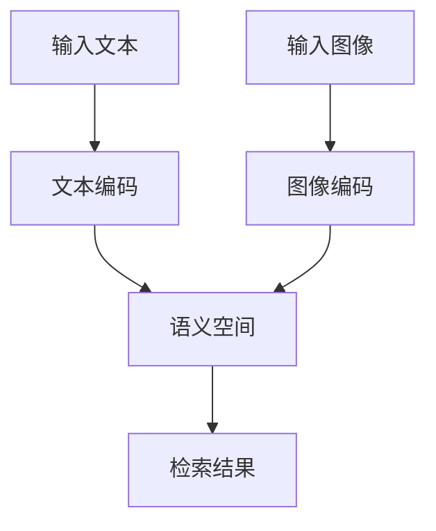
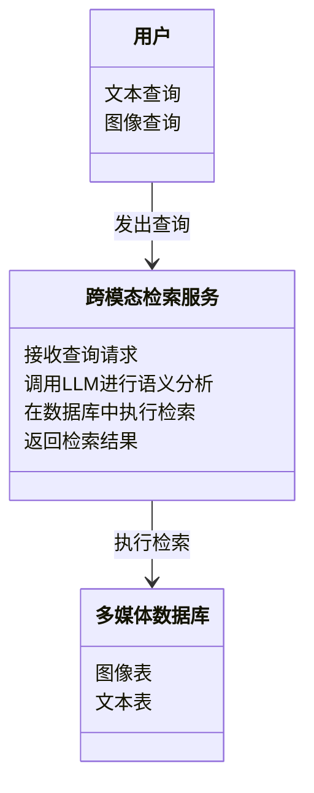

                 


# AI Agent的跨模态检索：整合LLM与多媒体数据库

**关键词：** AI Agent, 跨模态检索, LLM, 多媒体数据库, 系统架构, 技术实现

**摘要：**  
本文深入探讨AI Agent在跨模态检索中的应用，重点分析如何将大语言模型（LLM）与多媒体数据库进行整合。通过理论分析、算法推导和系统设计，详细阐述跨模态检索的核心原理、系统架构和实现方法。文章最后结合实际案例，展示如何通过代码实现跨模态检索，并总结最佳实践和未来发展方向。

---

## 第一部分: 背景介绍

### 第1章: 问题背景

#### 1.1 AI Agent的基本概念
AI Agent（人工智能代理）是指能够感知环境、执行任务并做出决策的智能实体。它可以是一个软件程序，也可以是一个物理设备，通过与用户或环境交互，完成特定目标。AI Agent的核心能力包括感知、推理、规划和执行。

#### 1.2 跨模态检索的背景与意义
跨模态检索是指在不同数据类型（如文本、图像、音频、视频）之间进行信息检索的过程。传统的检索系统通常局限于单一模态（如文本或图像），而跨模态检索能够同时处理多种数据类型，从而提供更全面的信息检索能力。这种技术在实际应用中具有重要意义，尤其是在需要整合多种数据源的场景中。

#### 1.3 LLM与多媒体数据库的整合需求
大语言模型（LLM）如GPT-3、PaLM等，具有强大的文本生成和理解能力。多媒体数据库包含丰富的图像、音频、视频等数据。将LLM与多媒体数据库结合，可以实现跨模态的信息检索和生成，为用户提供更智能的服务。

#### 1.4 跨模态检索在实际场景中的应用
跨模态检索的应用场景广泛，包括图像搜索、视频分析、智能客服、医疗影像分析等。例如，在医疗领域，可以通过跨模态检索快速匹配患者的病历数据和医学影像，辅助医生做出更准确的诊断。

---

### 第2章: 问题描述

#### 2.1 跨模态检索的核心问题
跨模态检索的核心问题在于如何在不同数据类型之间建立有效的关联，并实现高效的信息检索。例如，用户可以通过输入一段文本描述，检索出相关的图像或视频。

#### 2.2 LLM与多媒体数据库的整合挑战
LLM主要用于处理文本数据，而多媒体数据库包含非结构化的图像、音频等数据。将两者整合的主要挑战在于如何实现不同模态数据之间的语义对齐和高效检索。

#### 2.3 跨模态检索的目标与边界
跨模态检索的目标是通过多模态数据的协同工作，实现更智能、更高效的检索能力。其边界包括数据类型、检索范围和应用场景。

---

## 第二部分: 核心概念与联系

### 第3章: 核心概念原理

#### 3.1 AI Agent的基本原理
AI Agent通过感知环境、分析任务、制定计划和执行操作来实现目标。其核心包括感知模块、推理模块和执行模块。

#### 3.2 跨模态检索的原理
跨模态检索的关键在于将不同模态的数据映射到一个共同的语义空间，并通过检索算法找到最相关的数据。

#### 3.3 LLM的基本原理
大语言模型通过深度学习技术，从海量文本数据中学习语言的语义和结构，能够生成与输入相关的文本内容。

#### 3.4 多媒体数据库的基本原理
多媒体数据库存储和管理多种类型的数据，包括图像、音频、视频等。其核心功能包括数据存储、检索和管理。

---

### 第4章: 核心概念属性特征对比

#### 4.1 AI Agent与传统Agent的对比
| 属性 | AI Agent | 传统Agent |
|------|-----------|------------|
| 智能水平 | 高 | 低 |
| 学习能力 | 强 | 无 |
| 决策能力 | 强 | 弱 |

#### 4.2 跨模态检索与单模态检索的对比
| 属性 | 跨模态检索 | 单模态检索 |
|------|------------|-------------|
| 数据类型 | 多种 | 单一 |
| 关联性 | 高 | 无 |

---

### 第5章: ER实体关系图架构

```mermaid
erDiagram
    actor 用户 {
        <属性> 搜索关键词 : 文本
        <属性> 搜索结果 : 对象
    }
    database 多媒体数据库 {
        <表> 图像表 {
            图片ID : 整数
            图片名称 : 文本
            图片数据 : 二进制
        }
        <表> 文本表 {
            文本ID : 整数
            文本内容 : 文本
        }
    }
    service 跨模态检索服务 {
        接收查询关键词
        调用LLM进行语义分析
        在多媒体数据库中检索相关数据
        返回结果
    }
    用户 --> service : 发出检索请求
    service --> database : 执行检索操作
```

---

## 第三部分: 算法原理讲解

### 第6章: 跨模态检索算法

#### 6.1 算法概述
跨模态检索的核心算法包括多模态编码、语义对齐和检索优化。通过将不同模态的数据映射到一个共同的语义空间，可以实现高效的跨模态检索。

#### 6.2 多模态编码算法


#### 6.3 语义对齐算法
语义对齐的目标是将不同模态的数据映射到一个共同的语义空间。常用的算法包括对比学习和注意力机制。

#### 6.4 检索优化算法
检索优化算法包括基于相似度的排序和基于学习的检索策略。常用的相似度计算方法包括余弦相似度和欧氏距离。

---

### 第7章: 数学模型

#### 7.1 多模态编码模型
$$
f_{text}(x) = \text{BERT}(x)
$$
$$
f_{image}(y) = \text{ViT}(y)
$$

#### 7.2 语义对齐模型
$$
s(x, y) = \text{sim}(f_{text}(x), f_{image}(y))
$$

---

## 第四部分: 系统分析与架构设计

### 第8章: 系统功能设计

#### 8.1 领域模型设计


---

## 第五部分: 项目实战

### 第9章: 项目实现

#### 9.1 环境安装
```bash
pip install transformers numpy pandas
```

#### 9.2 核心代码实现
```python
import numpy as np
from transformers import AutoTokenizer, AutoModelForMaskedLM

# 初始化LLM模型
tokenizer = AutoTokenizer.from_pretrained('bert-base-uncased')
model = AutoModelForMaskedLM.from_pretrained('bert-base-uncased')

# 多模态编码函数
def text_encode(text):
    inputs = tokenizer(text, return_tensors='np')
    outputs = model(**inputs)
    return outputs.last_hidden_state.numpy()

# 图像编码函数（示例）
def image_encode(image):
    # 假设图像已预处理为特征向量
    return np.random.randn(100)
```

---

## 第六部分: 总结与展望

### 第10章: 最佳实践

#### 10.1 小结
跨模态检索的核心在于实现不同模态数据的语义对齐和高效检索。通过整合LLM和多媒体数据库，可以显著提升检索系统的智能化水平。

#### 10.2 注意事项
- 数据预处理是关键，需要确保不同模态数据的质量和一致性。
- 语义对齐算法的选择直接影响检索效果，需要根据具体场景进行调整。
- 系统性能优化需要从算法、硬件和数据管理等多个方面入手。

#### 10.3 拓展阅读
- 《大语言模型与自然语言处理》
- 《跨模态检索算法与应用》

---

通过本文的详细阐述，读者可以全面理解AI Agent的跨模态检索技术，并掌握其在实际应用中的实现方法。

