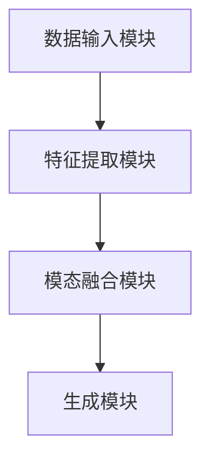
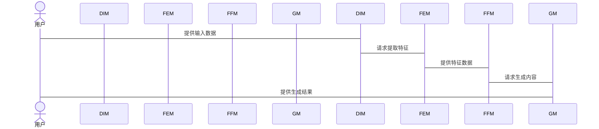

                 


# AI Agent的跨模态理解与生成

> 关键词：AI Agent, 跨模态理解, 生成模型, 多模态数据, 注意力机制, 应用场景

> 摘要：AI Agent在跨模态理解和生成方面具有重要应用，本文从技术背景、核心概念、算法原理、系统架构到项目实战，全面解析AI Agent的跨模态能力。通过详细分析多模态数据处理、注意力机制、生成模型等关键技术，结合实际应用场景，为读者提供深度的技术解读和实践指南。

---

# 第1章 AI Agent与跨模态理解概述

## 1.1 AI Agent的基本概念

### 1.1.1 AI Agent的定义与特点
AI Agent（人工智能代理）是指能够感知环境、执行任务并做出决策的智能实体。其特点包括自主性、反应性、目标导向和社交能力。AI Agent能够通过多种模态（如文本、图像、语音）与用户交互，实现复杂任务的执行。

### 1.1.2 跨模态理解的定义与背景
跨模态理解是指在同一任务中处理多种数据模态的能力。例如，在图像描述生成任务中，AI Agent需要理解图像内容并生成对应的文本描述。跨模态理解的背景在于现实场景中信息的多样性，单一模态难以满足复杂任务的需求。

### 1.1.3 跨模态理解在AI Agent中的重要性
跨模态理解使AI Agent能够更好地理解用户意图和环境信息，提升任务执行的准确性和智能性。例如，在医疗领域，AI Agent可以通过图像和文本模态的结合，辅助医生进行诊断。

## 1.2 跨模态理解的核心问题

### 1.2.1 多模态数据的融合挑战
多模态数据的融合需要解决数据异构性问题，即不同模态的数据具有不同的特征和结构。例如，图像数据是高维的像素矩阵，而文本数据是序列数据。

### 1.2.2 跨模态理解的边界与外延
跨模态理解的边界在于如何有效提取和融合多模态数据中的有用信息，同时避免信息冗余。外延则包括跨模态检索、跨模态生成等高级任务。

### 1.2.3 跨模态理解的核心要素组成
跨模态理解的核心要素包括：数据表示、特征提取、模态融合和语义对齐。这些要素共同构成了跨模态理解的基础框架。

---

# 第2章 跨模态理解与生成的核心概念

## 2.1 跨模态理解的原理

### 2.1.1 多模态数据的表示方法
多模态数据的表示方法包括模态特定表示和跨模态通用表示。例如，图像可以通过卷积神经网络（CNN）提取特征，文本可以通过词嵌入（如Word2Vec）提取特征。

### 2.1.2 跨模态注意力机制
跨模态注意力机制通过关注不同模态之间的关联，提升信息融合的效果。例如，在图像-文本匹配任务中，模型可以使用交叉注意力机制来捕获图像和文本之间的相互关系。

### 2.1.3 跨模态特征融合方法
跨模态特征融合方法包括早期融合（Early Fusion）和晚期融合（Late Fusion）。早期融合在特征提取阶段进行模态融合，晚期融合在高层表示阶段进行模态融合。

## 2.2 跨模态生成的原理

### 2.2.1 跨模态生成模型的架构
跨模态生成模型的架构包括编码器-解码器结构和生成对抗网络（GAN）结构。编码器用于提取源模态的特征，解码器用于生成目标模态的内容。

### 2.2.2 跨模态生成的关键技术
跨模态生成的关键技术包括条件生成对抗网络（Conditional GAN）、变体自编码器（VAE）和扩散模型。这些技术能够通过条件模态的信息生成目标模态的内容。

### 2.2.3 跨模态生成的数学模型
跨模态生成的数学模型可以表示为：
$$ P(y|x) = \text{生成模型}(x) $$
其中，$x$是源模态输入，$y$是目标模态输出。

## 2.3 跨模态理解与生成的对比分析

### 2.3.1 跨模态理解与生成的主要区别
跨模态理解的目标是理解输入数据的语义，而跨模态生成的目标是生成目标模态的内容。理解注重解释性，生成注重创造性。

### 2.3.2 跨模态理解与生成的联系
跨模态理解是跨模态生成的基础。生成模型需要理解输入模态的语义，才能生成与之相关的高质量内容。

### 2.3.3 跨模态理解与生成的优缺点对比
跨模态理解的优点是能够准确捕捉数据的语义信息，缺点是难以直接生成新的内容。跨模态生成的优点是能够创造新的内容，缺点是生成结果可能缺乏准确性。

---

# 第3章 跨模态理解的算法原理

## 3.1 跨模态理解的算法框架

### 3.1.1 多模态数据的预处理
多模态数据的预处理包括归一化、降维和特征提取。例如，图像数据可以通过归一化处理（如将像素值归一化到[0,1]）来消除模态间的尺度差异。

### 3.1.2 跨模态特征提取方法
跨模态特征提取方法包括模态特定提取和模态通用提取。模态特定提取针对每个模态设计专门的特征提取网络，模态通用提取设计通用的特征提取网络。

### 3.1.3 跨模态数据融合算法
跨模态数据融合算法包括加性融合、乘性融合和注意力融合。注意力融合通过动态权重分配，关注重要模态的信息。

## 3.2 跨模态理解的注意力机制

### 3.2.1 注意力机制的基本原理
注意力机制通过计算输入序列中每个位置的权重，关注重要的位置信息。例如，在图像描述生成任务中，模型可以通过图像注意力机制关注图像中的重要区域。

### 3.2.2 跨模态注意力的实现方法
跨模态注意力的实现方法包括交叉注意力和自注意力。交叉注意力用于跨模态信息交互，自注意力用于同一模态内的信息交互。

### 3.2.3 跨模态注意力的应用案例
跨模态注意力在图像描述生成任务中表现出色。例如，模型通过图像注意力机制关注图像中的重要物体，并生成对应的描述文本。

## 3.3 跨模态理解的模型训练

### 3.3.1 多任务学习的原理
多任务学习通过共享特征提取部分，同时训练多个任务。例如，模型可以在同一时间训练图像分类和图像描述生成任务。

### 3.3.2 对比学习在跨模态理解中的应用
对比学习通过最大化正样本对的相似性，最小化负样本对的相似性，提升跨模态理解的效果。例如，模型可以通过对比学习训练图像和文本的嵌入表示。

### 3.3.3 跨模态理解的损失函数设计
跨模态理解的损失函数可以包括重建损失和对比损失。重建损失用于衡量生成输出与输入的一致性，对比损失用于衡量不同模态之间的相似性。

---

# 第4章 跨模态生成的算法原理

## 4.1 跨模态生成的算法框架

### 4.1.1 跨模态生成的基本原理
跨模态生成的基本原理是通过生成模型，根据输入模态的信息，生成目标模态的内容。例如，模型可以根据输入的图像生成描述文本，或者根据输入的文本生成图像。

### 4.1.2 跨模态生成的模型架构
跨模态生成的模型架构包括编码器-解码器结构和生成对抗网络结构。编码器用于提取输入模态的特征，解码器用于生成目标模态的内容。

### 4.1.3 跨模态生成的训练策略
跨模态生成的训练策略包括对抗训练和条件训练。对抗训练通过生成器和判别器的博弈，提升生成质量；条件训练通过引入条件模态的信息，生成多样化的内容。

## 4.2 跨模态生成的注意力机制

### 4.2.1 跨模态生成的注意力模型
跨模态生成的注意力模型通过关注输入模态的关键区域，生成高质量的目标模态内容。例如，在图像-文本生成任务中，模型可以通过图像注意力机制关注图像中的重要物体，并生成相关的描述文本。

### 4.2.2 跨模态生成的注意力实现方法
跨模态生成的注意力实现方法包括交叉注意力和自注意力。交叉注意力用于跨模态信息交互，自注意力用于同一模态内的信息交互。

### 4.2.3 跨模态生成的注意力应用案例
跨模态生成的注意力在图像描述生成任务中表现出色。例如，模型通过图像注意力机制关注图像中的重要区域，并生成相关的描述文本。

## 4.3 跨模态生成的数学模型

### 4.3.1 跨模态生成的数学表达
跨模态生成的数学表达可以表示为：
$$ P(y|x) = \text{生成模型}(x) $$
其中，$x$是输入模态的数据，$y$是目标模态的生成内容。

### 4.3.2 跨模态生成的损失函数
跨模态生成的损失函数可以包括生成损失和对抗损失。生成损失用于衡量生成内容与真实内容的相似性，对抗损失用于衡量生成器和判别器的博弈效果。

---

# 第5章 系统分析与架构设计

## 5.1 项目背景与需求分析

### 5.1.1 项目背景
本项目旨在设计一个基于AI Agent的跨模态理解与生成系统，实现图像-文本生成和文本-图像生成功能。

### 5.1.2 项目需求
系统需求包括：支持多模态数据的输入和输出、实现跨模态理解和生成功能、具备良好的可扩展性和可维护性。

## 5.2 系统功能设计

### 5.2.1 系统功能模块划分
系统功能模块包括：数据输入模块、特征提取模块、模态融合模块和生成模块。

### 5.2.2 功能模块的交互流程
数据输入模块接收输入数据，特征提取模块提取模态特征，模态融合模块融合多模态特征，生成模块生成目标模态内容。

## 5.3 系统架构设计

### 5.3.1 系统架构图
使用Mermaid图展示系统架构：


### 5.3.2 系统接口设计
系统接口包括：输入接口（接收多模态数据）、输出接口（生成目标模态内容）、控制接口（管理模块交互）。

### 5.3.3 系统交互流程图
使用Mermaid图展示系统交互流程：


---

# 第6章 项目实战

## 6.1 环境安装与配置

### 6.1.1 环境要求
需要安装Python 3.8及以上版本、TensorFlow 2.0及以上版本和相关深度学习库。

### 6.1.2 安装步骤
使用以下命令安装所需库：
```bash
pip install numpy tensorflow pandas matplotlib
```

## 6.2 系统核心实现

### 6.2.1 数据预处理代码
```python
import numpy as np

def preprocess_image(image):
    # 假设image是图像数据
    # 归一化处理
    preprocessed_image = image / 255.0
    return preprocessed_image

def preprocess_text(text):
    # 假设text是文本数据
    # 分词处理
    words = text.split()
    return words
```

### 6.2.2 模型训练代码
```python
import tensorflow as tf
from tensorflow.keras import layers

def build_model(input_shape):
    inputs = layers.Input(shape=input_shape)
    x = layers.Conv2D(64, (3, 3), activation='relu')(inputs)
    x = layers.MaxPooling2D((2, 2))(x)
    x = layers.Flatten()(x)
    x = layers.Dense(256, activation='relu')(x)
    outputs = layers.Dense(1, activation='sigmoid')(x)
    return tf.keras.Model(inputs=inputs, outputs=outputs)
```

### 6.2.3 模型训练与评估
```python
model = build_model((224, 224, 3))
model.compile(optimizer='adam', loss='binary_crossentropy', metrics=['accuracy'])
model.fit(X_train, y_train, epochs=10, batch_size=32)
loss, accuracy = model.evaluate(X_test, y_test)
print(f"Test loss: {loss}, Test accuracy: {accuracy}")
```

---

# 第7章 最佳实践与总结

## 7.1 最佳实践

### 7.1.1 模型调优
通过调整学习率、批量大小和网络层数，优化模型性能。

### 7.1.2 数据增强
使用数据增强技术（如旋转、翻转、裁剪）提升模型的泛化能力。

### 7.1.3 模型推理优化
通过模型剪枝和量化技术，降低模型的计算复杂度，提升推理效率。

## 7.2 小结

### 7.2.1 本文总结
本文系统介绍了AI Agent的跨模态理解与生成技术，从算法原理到系统架构，再到项目实战，为读者提供了全面的技术指南。

### 7.2.2 未来展望
未来，跨模态理解和生成技术将在更多领域得到应用，例如元宇宙、智能助手和自动驾驶。同时，如何提升生成内容的质量和真实性，是研究者们需要持续探索的方向。

## 7.3 注意事项

### 7.3.1 模型训练的注意事项
在模型训练过程中，需要注意过拟合问题，可以通过数据增强、早停和Dropout等技术进行缓解。

### 7.3.2 模型部署的注意事项
在模型部署过程中，需要注意计算资源的分配和模型的轻量化设计，确保模型能够在实际场景中高效运行。

---

通过以上内容，读者可以全面理解AI Agent的跨模态理解与生成技术，并能够在实际项目中进行应用和实践。

