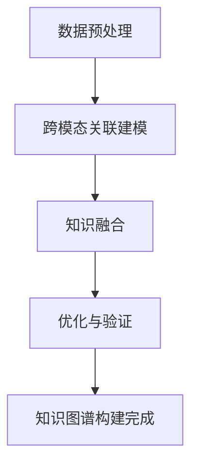

                 


# AI Agent的跨模态知识图谱构建与应用

## 关键词：AI Agent, 跨模态知识图谱, 多模态数据, 知识图谱构建, 智能体应用

## 摘要：  
本文系统地探讨了AI Agent在跨模态知识图谱构建与应用中的关键问题，从理论基础到实践应用进行了全面分析。通过构建跨模态知识图谱，AI Agent能够更高效地处理和理解多源异构数据，从而在多个领域实现智能化应用。本文首先介绍了跨模态知识图谱的基本概念和构建方法，然后分析了AI Agent在其中的作用与价值，接着深入探讨了构建过程中的算法原理和系统架构设计，并通过实际案例展示了跨模态知识图谱的应用场景。最后，本文总结了跨模态知识图谱构建的关键技术和未来发展方向。

---

## 第1章: 背景介绍

### 1.1 问题背景  
跨模态数据的复杂性使得传统单一模态的处理方法难以满足现代AI系统的需求。知识图谱作为一种结构化的知识表示方式，能够有效地整合和表示多模态数据，从而为AI Agent提供了强大的知识基础。然而，跨模态知识图谱的构建和应用仍然面临诸多挑战，如数据异构性、语义理解以及跨模态关联的复杂性。

#### 1.1.1 多模态数据的复杂性  
多模态数据（如文本、图像、音频等）的异构性和多样性使得数据的整合和分析变得更加复杂。如何在不同模态之间建立有效的关联是跨模态知识图谱构建的核心问题。

#### 1.1.2 知识图谱在AI中的重要性  
知识图谱作为一种结构化的知识表示方式，能够帮助AI系统更好地理解上下文和语义，从而提高其决策和推理能力。跨模态知识图谱的引入进一步扩展了知识图谱的应用范围。

#### 1.1.3 AI Agent在跨模态任务中的需求  
AI Agent需要能够处理和理解多模态数据，以便在复杂的现实场景中做出更智能的决策。跨模态知识图谱为AI Agent提供了强大的知识支持和跨模态推理能力。

### 1.2 问题描述  
跨模态知识图谱的构建需要解决以下几个关键问题：  
1. **数据整合**：如何有效地整合多模态数据并建立它们之间的关联？  
2. **语义理解**：如何理解不同模态数据的语义并建立语义上的联系？  
3. **跨模态推理**：如何在跨模态知识图谱上进行推理以支持AI Agent的任务？

### 1.3 问题解决  
通过构建跨模态知识图谱，AI Agent可以更好地理解和处理多模态数据，从而实现更智能的决策和推理。跨模态知识图谱的构建方法包括数据预处理、跨模态关联建模以及知识融合等步骤。

### 1.4 边界与外延  
跨模态知识图谱的边界包括其覆盖的模态类型和数据范围，而其外延则体现在其在不同领域的广泛应用，如自然语言处理、计算机视觉和机器人技术等。

---

## 第2章: 跨模态知识图谱的核心概念与联系

### 2.1 跨模态知识图谱的定义与原理  
跨模态知识图谱是一种结合了多种数据模态的知识表示方式，它通过实体、关系和属性的结构化表示，实现了多模态数据的统一和关联。

#### 2.1.1 跨模态数据的定义  
跨模态数据指的是来自不同感知模态（如文本、图像、音频等）的数据。例如，一张图片和一段描述图片的文字就是典型的跨模态数据。

#### 2.1.2 知识图谱的定义  
知识图谱是一种以图结构表示知识的数据模型，由实体（node）、属性（property）和关系（edge）组成。

#### 2.1.3 跨模态知识图谱的构建原理  
跨模态知识图谱的构建需要将不同模态的数据进行整合，通过跨模态关联建模来建立它们之间的联系。

### 2.2 跨模态知识图谱的属性特征对比  
以下是几种常见数据结构的属性特征对比：

| 数据结构 | 特征描述         | 示例                 |
|----------|------------------|----------------------|
| 文本      | 线性、序列化      | "这是一段文本"        |
| 图像      | 空间性、二维性    | "一张图片"           |
| 音频      | 时间序列性       | "一段音频"           |
| 知识图谱  | 结构化、关联性    | "人-住在-城市"        |

### 2.3 跨模态知识图谱的ER实体关系图  

```mermaid
erDiagram
    actor User {
        string id
        string name
    }
    actor Agent {
        string id
        string name
    }
    entity KnowledgeGraph {
        string id
        string name
        string description
    }
    entity Modality {
        string id
        string type
    }
    entity Relation {
        string id
        string type
    }
    User --> KnowledgeGraph: 使用
    Agent --> KnowledgeGraph: 管理
    Modality --> Relation: 关联
```

---

## 第3章: AI Agent的跨模态知识图谱构建算法原理

### 3.1 跨模态图嵌入算法  
跨模态图嵌入算法通过将多模态数据映射到同一个嵌入空间，实现跨模态数据的关联和语义理解。

#### 3.1.1 TransE算法  
TransE是一种经典的知识图谱嵌入算法，其目标是将实体和关系映射到低维向量空间中。

数学公式：  
$$ TransE的目标函数为：\min_{\|e_h - r_{h,t} + e_t\|} $$

#### 3.1.2 GraphSAGE算法  
GraphSAGE是一种基于图神经网络的嵌入算法，适用于大规模图数据的处理。

数学公式：  
$$ h_o = \text{aggregate}((h_1, h_2, ..., h_n)) $$  
$$ o = f(h_o) $$

### 3.2 跨模态知识图谱构建流程  



---

## 第4章: 跨模态知识图谱的系统分析与架构设计

### 4.1 系统功能设计  
跨模态知识图谱系统主要包括数据预处理、知识抽取、知识融合和知识推理四大功能模块。

#### 4.1.1 数据预处理  
数据预处理包括数据清洗、格式转换和特征提取。

#### 4.1.2 知识抽取  
知识抽取通过自然语言处理和计算机视觉技术，从多模态数据中提取实体、关系和属性。

#### 4.1.3 知识融合  
知识融合将来自不同模态的知识进行整合，消除冲突并建立关联。

#### 4.1.4 知识推理  
知识推理基于知识图谱进行推理和问答。

### 4.2 系统架构设计  


---

## 第5章: 跨模态知识图谱的应用与实战

### 5.1 项目实战：电商推荐系统  
以下是一个跨模态知识图谱在电商推荐系统中的应用案例。

#### 5.1.1 环境安装  
需要安装的知识图谱构建工具包括：  
- PyTorch  
- NetworkX  
- SpaCy

#### 5.1.2 核心实现代码  

```python
import networkx as nx

# 创建知识图谱
G = nx.Graph()

# 添加实体节点
G.add_nodes_from(["User", "Item", "Category"])

# 添加关系边
G.add_edges_from([("User", "Item"), ("Item", "Category")])

# 可视化知识图谱
nx.draw(G, with_labels=True)
```

#### 5.1.3 实际案例分析  
通过跨模态知识图谱，电商推荐系统可以基于用户的购买历史和偏好推荐相关商品。

---

## 第6章: 最佳实践与小结

### 6.1 最佳实践  
1. 在构建跨模态知识图谱时，应注重数据的质量和多样性。  
2. 使用高效的图嵌入算法和图神经网络模型以提高性能。  
3. 在实际应用中，应结合具体场景进行模型调优和优化。

### 6.2 小结  
跨模态知识图谱为AI Agent提供了强大的知识支持和跨模态推理能力，是实现智能系统的重要基础。未来，随着技术的发展，跨模态知识图谱将在更多领域得到广泛应用。

### 6.3 注意事项  
1. 数据隐私和安全问题需要高度重视。  
2. 在实际应用中，应充分考虑模型的可解释性和鲁棒性。  

### 6.4 拓展阅读  
推荐阅读以下书籍和论文：  
- 《知识图谱：概念、方法与应用》  
- "Knowledge Graphs and Beyond: A Survey on Multimodal Knowledge Graphs"  

---

## 附录: 参考文献  
（此处列出相关文献和资料）

