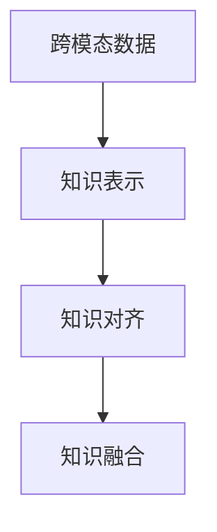
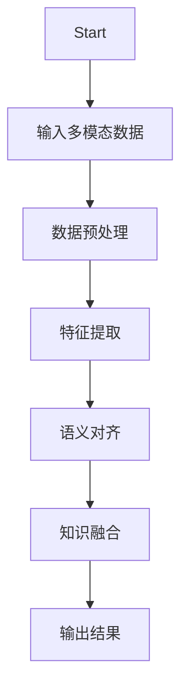
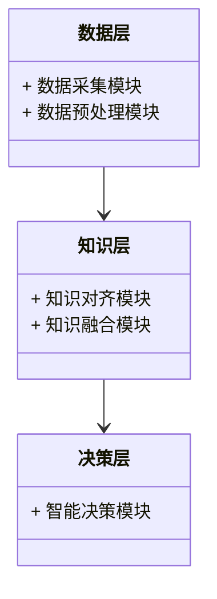

                 


# AI Agent的跨模态知识对齐与融合

> 关键词：AI Agent，跨模态，知识对齐，知识融合，多模态数据，知识图谱

> 摘要：本文深入探讨AI Agent在跨模态知识对齐与融合领域的核心问题，系统阐述了跨模态数据的表示与建模方法，详细分析了知识对齐与融合的算法原理，并通过实际案例展示了系统设计与实现过程。文章内容涵盖背景介绍、核心概念、算法原理、系统架构、项目实战及最佳实践，旨在为AI Agent的开发与研究提供理论支持与实践指导。

---

## 第一部分: AI Agent的跨模态知识对齐与融合基础

### 第1章: 背景介绍与问题背景

#### 1.1 问题背景与问题描述

多模态数据的复杂性是AI Agent面临的主要挑战之一。在现实场景中，AI Agent需要处理文本、图像、语音等多种数据类型，这些数据往往分散在不同的模态中，且彼此之间缺乏明确的关联。如何将这些分散的知识进行有效的对齐与融合，是实现智能决策的关键。

**1.1.1 多模态数据的挑战**  
多模态数据的特点是异构性、多样性和复杂性。例如，图像数据和文本数据的特征空间差异较大，直接进行对齐需要解决模态间语义鸿沟的问题。此外，数据的分布不均衡和噪声干扰也增加了对齐的难度。

**1.1.2 知识对齐与融合的必要性**  
知识对齐是指在不同模态之间建立语义上的对应关系，而知识融合则是将这些对齐后的知识整合到统一的知识表示中。这种对齐与融合的过程能够提升AI Agent的理解能力，使其能够更好地处理复杂的任务。

**1.1.3 AI Agent的核心问题**  
AI Agent的核心问题在于如何利用跨模态的知识对齐与融合，实现对复杂场景的准确理解和智能决策。这需要解决多模态数据的表示、对齐算法的设计以及融合方法的选择等问题。

#### 1.2 问题解决与边界定义

**1.2.1 跨模态知识对齐的目标**  
跨模态知识对齐的目标是将不同模态中的实体、关系或属性进行语义上的对齐。例如，在图像和文本中找到对应的实体或概念。

**1.2.2 知识融合的边界与外延**  
知识融合的边界在于如何处理冲突和不确定性，而外延则涉及将融合后的知识应用于实际场景中，如推理和决策。

**1.2.3 AI Agent的系统架构**  
AI Agent的系统架构通常包括感知层、知识层和决策层。感知层负责多模态数据的采集和处理，知识层负责对齐与融合，决策层基于融合后的知识进行推理和决策。

#### 1.3 概念结构与核心要素

**1.3.1 跨模态数据的特征**  
跨模态数据具有异构性、互补性和关联性。异构性指不同模态的数据形式不同；互补性指不同模态的数据可以互相补充；关联性指不同模态的数据可以通过语义建立联系。

**1.3.2 知识对齐的核心要素**  
知识对齐的核心要素包括模态间语义的表示、对齐算法的设计以及对齐效果的评估。对齐算法需要考虑数据的分布、特征和语义相似性。

**1.3.3 AI Agent的知识融合机制**  
知识融合机制包括基于规则的融合、基于概率的融合和基于学习的融合。这些机制需要考虑知识的冲突和不确定性，并通过合理的策略实现知识的最优融合。

---

### 第2章: 跨模态知识对齐与融合的核心概念

#### 2.1 跨模态数据的表示与建模

**2.1.1 多模态数据的表示方法**  
多模态数据的表示方法包括向量表示、符号表示和图结构表示。向量表示适用于数值型数据，符号表示适用于语义型数据，图结构表示适用于复杂的关系型数据。

**2.1.2 知识图谱的构建与表示**  
知识图谱是一种以图结构表示知识的模型，节点表示实体，边表示关系。跨模态知识图谱需要将不同模态的数据整合到统一的图结构中。

**2.1.3 跨模态数据的对齐原理**  
跨模态数据的对齐原理基于语义相似性和模态间的关联性。通过计算不同模态数据的语义相似度，可以实现模态间的对齐。

#### 2.2 跨模态知识对齐的算法原理

**2.2.1 基于相似度的对齐方法**  
基于相似度的对齐方法通过计算不同模态数据之间的相似度，找到语义上最接近的对齐关系。常用的距离度量包括余弦相似度和欧氏距离。

**2.2.2 基于学习的对齐模型**  
基于学习的对齐模型通过深度学习方法，学习不同模态数据之间的映射关系。常用的模型包括双线性映射模型和注意力机制模型。

**2.2.3 知识图谱的对齐评估**  
知识图谱的对齐评估可以通过精确率、召回率和F1值等指标进行评估。这些指标可以衡量对齐的准确性和全面性。

#### 2.3 跨模态知识融合的实现

**2.3.1 融合方法的选择**  
融合方法的选择需要考虑知识的异构性、冲突程度和应用需求。基于规则的融合适用于简单场景，基于概率的融合适用于不确定性较高的场景，基于学习的融合适用于复杂场景。

**2.3.2 融合过程中的冲突处理**  
知识融合过程中可能会出现冲突，例如同一实体在不同模态中有不同的表示。需要通过冲突检测和冲突解决方法，实现知识的最优融合。

**2.3.3 融合后的知识表示**  
融合后的知识可以通过统一的图结构或符号表示进行存储和管理。这种表示方式能够支持后续的推理和决策过程。

#### 2.4 核心概念对比与ER实体关系图

**2.4.1 核心概念对比表格**  
| 概念 | 特征 | 描述 |
|------|------|------|
| 跨模态数据 | 异构性 | 不同模态的数据形式不同 |
| 知识对齐 | 语义相似性 | 不同模态数据之间的语义对应关系 |
| 知识融合 | 综合性 | 将不同模态的知识整合到统一表示中 |

**2.4.2 ER实体关系图的Mermaid流程图**  


---

### 第3章: 跨模态知识对齐与融合的算法原理

#### 3.1 算法原理概述

**3.1.1 跨模态对齐的基本流程**  
跨模态对齐的基本流程包括数据预处理、特征提取、语义对齐和结果评估。数据预处理用于消除噪声，特征提取用于获取数据的特征表示，语义对齐用于建立模态间的对应关系，结果评估用于验证对齐的准确性。

**3.1.2 知识融合的数学模型**  
知识融合的数学模型可以通过概率论或深度学习方法进行建模。例如，基于概率的融合模型可以用贝叶斯定理表示，而基于深度学习的融合模型可以用图神经网络进行建模。

**3.1.3 算法的优缺点分析**  
基于相似度的对齐方法简单易实现，但对齐效果可能受到数据分布的影响；基于学习的对齐模型效果较好，但需要大量的训练数据和计算资源。

#### 3.2 算法流程图与代码实现

**3.2.1 算法流程图的Mermaid图**  


**3.2.2 算法实现代码示例**  
```python
import numpy as np

def semantic_alignment(text, image):
    # 特征提取
    text_feature = text_to_feature(text)
    image_feature = image_to_feature(image)
    
    # 计算相似度
    similarity = np.dot(text_feature, image_feature)
    
    # 确定对齐关系
    threshold = 0.8
    if similarity > threshold:
        return "aligned"
    else:
        return "not aligned"

# 示例
text = "这是一张猫的图片"
image = "cat.jpg"
result = semantic_alignment(text, image)
print(result)  # 输出：aligned
```

#### 3.3 数学公式与详细推导

**3.3.1 基于余弦相似度的对齐公式**  
$$ \text{similarity} = \frac{\mathbf{x} \cdot \mathbf{y}}{\|\mathbf{x}\| \|\mathbf{y}\|} $$  
其中，$\mathbf{x}$和$\mathbf{y}$分别表示两种模态的特征向量。

**3.3.2 基于概率的融合公式**  
$$ P(\text{true}|e_1, e_2) = \frac{P(e_1)P(e_2)}{P(e_1 \cup e_2)} $$  
其中，$e_1$和$e_2$分别表示两种模态的事件。

---

### 第4章: 系统分析与架构设计方案

#### 4.1 问题场景介绍

**4.1.1 系统功能设计**  
系统功能包括数据采集、知识对齐、知识融合和智能决策。数据采集模块负责多模态数据的获取，知识对齐模块负责建立模态间的对应关系，知识融合模块负责整合对齐后的知识，智能决策模块基于融合后的知识进行推理和决策。

**4.1.2 领域模型设计**  
领域模型包括数据层、知识层和决策层。数据层负责存储多模态数据，知识层负责知识的对齐与融合，决策层负责基于知识进行智能决策。

**4.1.3 系统架构设计**  
系统架构采用分层架构，包括数据采集层、知识处理层和决策层。数据采集层负责数据的获取和预处理，知识处理层负责知识的对齐与融合，决策层负责基于融合后的知识进行推理和决策。

#### 4.2 系统架构设计

**4.2.1 领域模型的Mermaid类图**  


**4.2.2 系统架构的Mermaid架构图**  


#### 4.3 系统接口设计

**4.3.1 接口设计**  
系统接口包括数据输入接口、知识对齐接口和知识融合接口。数据输入接口负责接收多模态数据，知识对齐接口负责建立模态间的对应关系，知识融合接口负责整合对齐后的知识。

**4.3.2 交互流程**  
数据输入接口接收多模态数据，数据预处理模块对数据进行预处理，知识对齐模块对齐数据，知识融合模块融合知识，智能决策模块基于融合后的知识进行推理和决策。

---

### 第5章: 项目实战

#### 5.1 项目介绍

**5.1.1 项目背景**  
本项目旨在实现一个基于跨模态知识对齐与融合的AI Agent，能够在多模态数据中进行语义对齐和知识融合，支持智能决策。

**5.1.2 项目目标**  
项目目标包括实现多模态数据的采集与预处理、设计知识对齐算法、实现知识融合模块以及构建智能决策系统。

#### 5.2 核心代码实现

**5.2.1 数据预处理代码**  
```python
def preprocess(text, image):
    # 文本预处理
    text_preprocessed = text.lower().strip()
    # 图像预处理
    image_preprocessed = image_resize(image)
    return text_preprocessed, image_preprocessed
```

**5.2.2 知识对齐代码**  
```python
def semantic_alignment(text_feature, image_feature):
    # 计算相似度
    similarity = np.dot(text_feature, image_feature)
    # 判断是否对齐
    if similarity > 0.8:
        return True
    else:
        return False
```

**5.2.3 知识融合代码**  
```python
def knowledge_fusion(text_alignment, image_alignment):
    # 融合知识
    fused_knowledge = {}
    for key in text_alignment:
        if key in image_alignment:
            fused_knowledge[key] = (text_alignment[key], image_alignment[key])
    return fused_knowledge
```

#### 5.3 项目小结

**5.3.1 项目总结**  
通过本项目，我们实现了多模态数据的采集与预处理，设计了知识对齐算法，实现了知识融合模块，并构建了智能决策系统。

**5.3.2 经验与不足**  
在项目实施过程中，我们发现知识对齐的准确性受到数据质量和特征提取方法的影响。未来可以进一步优化特征提取方法和对齐算法，提升对齐的准确性。

---

### 第6章: 最佳实践、小结、注意事项与拓展阅读

#### 6.1 最佳实践

**6.1.1 数据预处理的建议**  
数据预处理是跨模态知识对齐与融合的关键步骤。建议在预处理阶段消除噪声，标准化数据格式，提升数据质量。

**6.1.2 算法选择的建议**  
算法选择需要结合实际场景和数据特点。对于简单场景，可以采用基于相似度的对齐方法；对于复杂场景，可以采用基于学习的对齐模型。

#### 6.2 小结

跨模态知识对齐与融合是AI Agent实现智能决策的核心技术。通过本文的系统介绍，读者可以深入了解跨模态数据的表示与建模方法，掌握知识对齐与融合的算法原理，并通过实际案例学习系统设计与实现过程。

#### 6.3 注意事项

**6.3.1 数据质量的重要性**  
数据质量直接影响对齐与融合的效果。需要在数据采集和预处理阶段确保数据的准确性和完整性。

**6.3.2 算法选择的合理性**  
算法选择需要结合实际需求和数据特点。对于大规模数据，建议采用高效的深度学习模型；对于小规模数据，可以采用简单的基于相似度的方法。

#### 6.4 拓展阅读

**6.4.1 推荐阅读**  
- 《Deep Learning for Cross-Modal Retrieval》
- 《Knowledge Graphs and Reasoning》

**6.4.2 学术资源**  
推荐关注相关领域的顶级会议和期刊，如ACL、CVPR和NeurIPS。

---

通过本文的系统介绍，读者可以全面了解AI Agent的跨模态知识对齐与融合的核心技术，并能够在实际项目中应用这些方法，提升AI Agent的智能决策能力。

