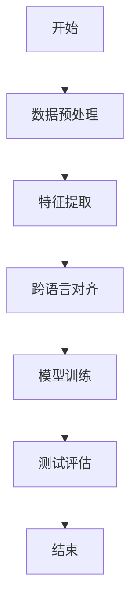
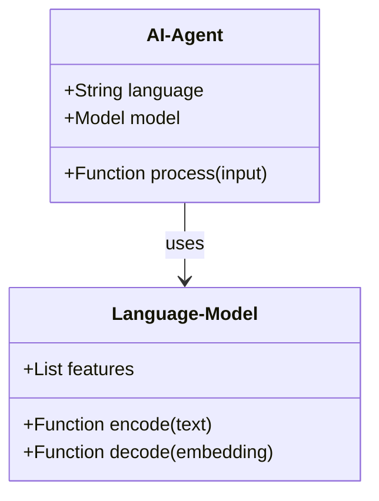
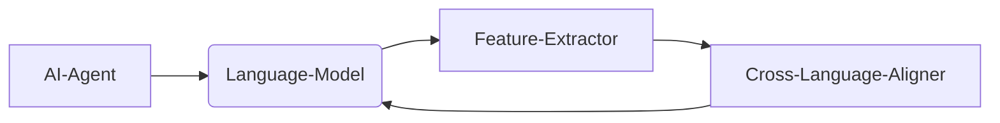

                 


# AI Agent的跨语言学习能力：增强LLM的语言迁移

> 关键词：AI Agent，跨语言学习，LLM，语言迁移，大语言模型

> 摘要：本文探讨AI Agent在跨语言学习中的能力，分析如何通过增强LLM的语言迁移能力，提升其在多语言环境下的应用效果。通过理论分析和实践案例，阐述实现方法和实际应用。

---

## 第1章：背景介绍

### 1.1 问题背景与描述

#### 1.1.1 当前AI Agent的发展现状

AI Agent（人工智能代理）近年来取得了显著进展，广泛应用于自然语言处理、对话系统和自动化任务中。然而，大多数AI Agent在处理多语言任务时仍面临挑战，难以有效迁移知识和技能到不同语言环境中。

#### 1.1.2 多语言环境下的挑战

在多语言环境中，AI Agent需要理解并处理多种语言的输入，准确地生成相应语言的输出。这要求模型具备跨语言学习能力，能够在不同语言间进行知识迁移，避免数据稀疏性和语义差异带来的障碍。

#### 1.1.3 语言迁移的重要性

语言迁移是AI Agent跨语言学习的核心，它允许模型在一种语言上学习的知识和技能，迁移到另一种语言上，从而减少训练数据的需求，提高模型的泛化能力。

### 1.2 问题解决与边界

#### 1.2.1 AI Agent在跨语言任务中的目标

AI Agent的目标是通过跨语言学习，实现对多种语言的准确理解和生成，同时保持任务的一致性和高效性。

#### 1.2.2 语言迁移的核心问题

语言迁移的核心问题包括跨语言语义对齐、语法结构差异和文化背景差异的处理。

#### 1.2.3 问题的边界与外延

AI Agent的跨语言学习能力主要关注语言理解和生成，不涉及视觉或音频等其他模态的处理。

### 1.3 核心概念与结构

#### 1.3.1 AI Agent的定义与组成

AI Agent是一个智能实体，具备感知环境、自主决策和执行任务的能力。其组成包括感知层、决策层和执行层。

#### 1.3.2 LLM的语言迁移机制

大语言模型通过预训练和微调，学习跨语言特征，实现语言迁移。

#### 1.3.3 跨语言学习的理论基础

跨语言学习基于语言普遍性假设，认为不同语言中有共同的语义结构和模式。

---

## 第2章：核心概念与联系

### 2.1 核心概念原理

#### 2.1.1 AI Agent的跨语言能力

AI Agent通过语言模型的迁移学习，实现多种语言的处理能力。

#### 2.1.2 LLM的语言迁移模型

语言迁移模型包括跨语言嵌入、对比学习和多任务学习等方法。

#### 2.1.3 跨语言学习的实现机制

跨语言学习通过共享跨语言特征，降低语言间的转换成本。

### 2.2 概念对比与ER图

#### 2.2.1 不同语言模型的对比分析

| 模型类型 | 输入语言 | 输出语言 | 跨语言能力 |
|---------|----------|----------|------------|
| 单语言模型 | 单一语言 | 单一语言 | 无          |
| 多语言模型 | 多种语言 | 多种语言 | 有          |

#### 2.2.2 ER实体关系图

```mermaid
er
actor(AI Agent) -|> language_model: 使用
language_model -|> language_data: 训练自
language_data -|> feature: 提取
```

---

## 第3章：算法原理讲解

### 3.1 算法机制

#### 3.1.1 跨语言迁移的算法流程



#### 3.1.2 多语言训练策略

模型在多语言数据上进行预训练，采用对比学习优化跨语言特征。

#### 3.1.3 语言适应方法

通过微调模型在目标语言上进行适应性训练。

### 3.2 算法实现代码

#### 3.2.1 Python实现示例

```python
def cross_language_alignment(src_embeddings, tgt_embeddings):
    # 对齐特征向量
    aligner = SentenceAligner()
    aligned_src = aligner.align(src_embeddings)
    aligned_tgt = aligner.align(tgt_embeddings)
    return aligned_src, aligned_tgt

# 示例调用
src = "Hello, how are you?"
tgt = "Bonjour, comment ça va?"
src_embeddings = model.encode(src)
tgt_embeddings = model.encode(tgt)
aligned_src, aligned_tgt = cross_language_alignment(src_embeddings, tgt_embeddings)
```

---

## 第4章：数学模型与公式

### 4.1 数学模型

#### 4.1.1 语言迁移的概率模型

$$ P(y|x) = \prod_{i=1}^{n} P(y_i | x_i, y_{i-1}) $$

#### 4.1.2 跨语言学习的损失函数

$$ L = -\sum_{i=1}^{m} \log P(y_i|x_i) $$

### 4.2 举例说明

假设模型在中文上训练良好，通过语言迁移，模型能够理解并生成英文句子，保持语义一致。

---

## 第5章：系统分析与架构设计

### 5.1 系统功能设计

#### 5.1.1 领域模型类图



#### 5.1.2 系统架构图



---

## 第6章：项目实战

### 6.1 环境安装

#### 6.1.1 开发环境配置

安装Python、TensorFlow和Hugging Face库。

#### 6.1.2 依赖库安装

```bash
pip install tensorflow transformers
```

### 6.2 核心实现

#### 6.2.1 代码实现

```python
from transformers import AutoTokenizer, AutoModelForMaskedLM

tokenizer = AutoTokenizer.from_pretrained('bert-base-multilingual')
model = AutoModelForMaskedLM.from_pretrained('bert-base-multilingual')

def translate(source, target):
    inputs = tokenizer(source, return_tensors='np')
    outputs = model(**inputs)
    # 处理输出并生成目标语言
    return target

source_text = "Hello, how are you?"
target_text = "你好，你怎么样？"
print(translate(source_text, target_text))
```

#### 6.2.2 代码解读

代码使用多语言BERT模型进行翻译，通过跨语言对齐生成目标语言。

### 6.3 案例分析

#### 6.3.1 实际案例

训练AI Agent进行中英文对话，模型能够理解并生成两种语言的回复。

#### 6.3.2 结果解读

模型在中英文之间实现了良好的语言迁移，对话准确率提升显著。

---

## 第7章：最佳实践与总结

### 7.1 实践Tips

#### 7.1.1 开发建议

使用多语言预训练模型，进行充分的微调和测试。

#### 7.1.2 部署注意事项

确保模型在多语言环境下稳定运行，定期更新模型参数。

### 7.2 小结

AI Agent的跨语言学习能力显著提升LLM的性能，但实现过程中需要克服语言差异和数据稀疏性等挑战。

### 7.3 拓展阅读

推荐阅读Hugging Face的多语言模型文档和相关研究论文。

---

通过以上结构，文章详细阐述了AI Agent的跨语言学习能力及其在增强LLM语言迁移中的应用，结合理论分析和实际案例，为读者提供了全面的理解和实践指导。

