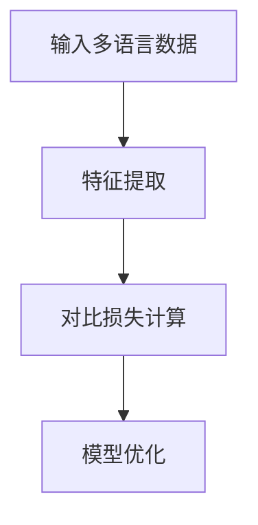
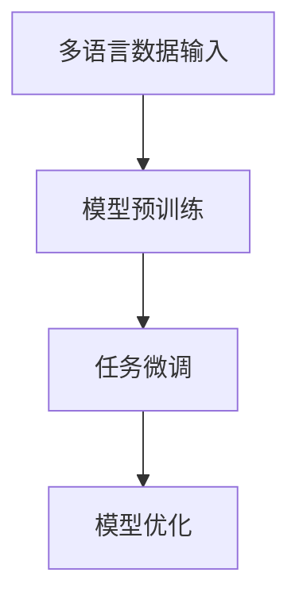
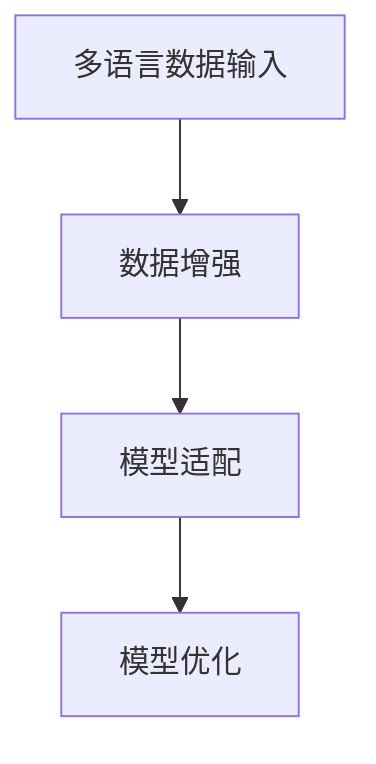
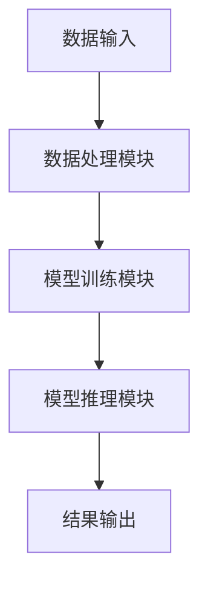
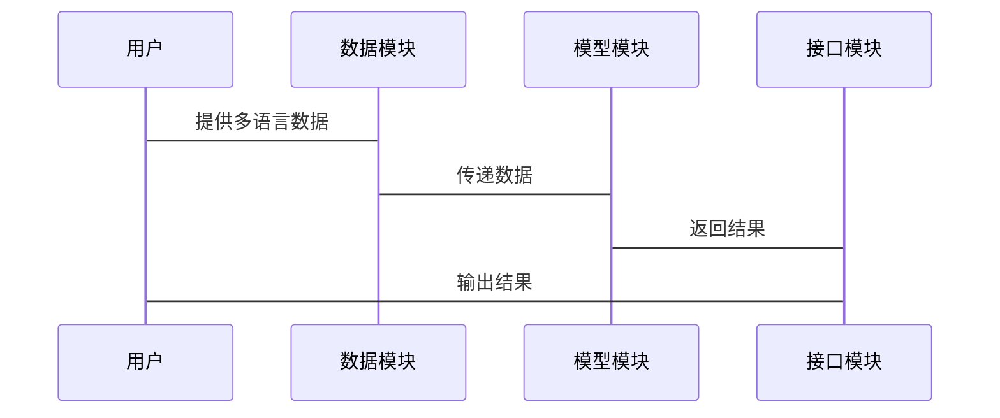

                 


# AI Agent的跨语言学习：增强LLM的多语言能力

## 关键词：AI Agent，跨语言学习，多语言模型，LLM，自然语言处理，深度学习

## 摘要：本文探讨了AI Agent在跨语言学习中的应用，分析了如何通过增强LLM（大语言模型）的多语言能力来提升AI Agent的智能化水平。文章从跨语言学习的背景、技术挑战、算法原理、系统设计、项目实战等多个方面展开，详细介绍了AI Agent实现跨语言学习的路径和方法。通过对比学习、多语言预训练等技术手段，本文展示了如何在实际场景中构建高效的多语言AI Agent系统，并展望了未来的发展方向。

---

# 第一部分: AI Agent与跨语言学习基础

## 第1章: AI Agent与跨语言学习概述

### 1.1 AI Agent的基本概念

#### 1.1.1 AI Agent的定义与分类
AI Agent（人工智能代理）是指能够感知环境、自主决策并执行任务的智能实体。根据功能和应用场景的不同，AI Agent可以分为以下几类：
- **简单反射型Agent**：基于预定义的规则直接响应输入。
- **基于模型的反射型Agent**：通过内部模型理解和决策。
- **目标驱动型Agent**：根据目标选择最优行动。
- **实用驱动型Agent**：通过效用函数优化决策。

#### 1.1.2 AI Agent的核心特征
AI Agent的核心特征包括：
1. **自主性**：能够自主决策和行动。
2. **反应性**：能够感知环境并实时响应。
3. **目标导向性**：根据目标选择行动方案。
4. **学习能力**：能够通过数据和经验优化自身性能。

#### 1.1.3 AI Agent与传统AI的区别
AI Agent与传统AI的区别主要体现在以下几个方面：
- **自主性**：AI Agent具有更强的自主决策能力，而传统AI更多依赖于外部指令。
- **适应性**：AI Agent能够动态调整行为以适应环境变化，而传统AI通常需要重新训练。
- **交互性**：AI Agent能够与环境和用户进行实时交互，而传统AI更多是单向输出。

### 1.2 跨语言学习的背景与挑战

#### 1.2.1 多语言处理的重要性
在全球化背景下，多语言处理能力对于AI系统的应用至关重要。例如：
- **跨文化沟通**：支持多种语言的AI Agent能够更好地服务全球用户。
- **信息整合**：能够处理多语言信息的系统可以更高效地整合全球数据。

#### 1.2.2 当前LLM的多语言能力现状
尽管大语言模型（LLM）在单语言任务上表现出色，但在多语言能力方面仍存在以下问题：
- **数据稀疏性**：小语种数据不足导致模型性能受限。
- **迁移能力不足**：模型在不同语言间的迁移学习效果有限。
- **文化差异**：不同语言背后的语境和文化差异影响模型的理解能力。

#### 1.2.3 跨语言学习的核心问题
跨语言学习的核心问题包括：
1. **跨语言表示**：如何在不同语言之间建立统一的语义表示。
2. **语言适配**：如何优化模型以适应不同语言的特点。
3. **跨语言推理**：如何在多语言环境中进行准确的逻辑推理。

### 1.3 跨语言学习的目标与意义

#### 1.3.1 提升LLM的多语言能力
通过跨语言学习，可以显著提升LLM在多语言环境下的理解和生成能力。

#### 1.3.2 扩展AI Agent的应用场景
增强的多语言能力使得AI Agent能够服务于更多语言的用户，扩大其应用场景。

#### 1.3.3 跨语言学习的未来趋势
随着全球化进程加快，跨语言学习将成为AI技术发展的重要方向。

## 1.4 本章小结
本章从AI Agent的基本概念出发，分析了跨语言学习的背景、挑战和目标，为后续内容奠定了基础。

---

## 第2章: 跨语言学习的技术背景

### 2.1 大语言模型（LLM）的基础

#### 2.1.1 LLM的基本原理
大语言模型通过大量数据的预训练，学习语言的规律和语义。

#### 2.1.2 LLM的训练方法
常用训练方法包括：
- **自监督学习**：通过预测词来学习语言表示。
- **对比学习**：通过对比不同语言的表示来优化模型。
- **微调**：在特定任务上对模型进行进一步训练。

#### 2.1.3 LLM的应用领域
LLM广泛应用于自然语言处理的多个领域，包括文本生成、机器翻译、问答系统等。

### 2.2 跨语言学习的技术挑战

#### 2.2.1 多语言数据的获取与处理
多语言数据的获取面临以下挑战：
- 数据稀疏性：小语种数据不足。
- 数据清洗：多语言数据的清洗和预处理复杂。

#### 2.2.2 跨语言模型的适应性问题
跨语言模型需要在不同语言间保持一致的表示，同时适应每种语言的独特性。

#### 2.2.3 跨语言推理的复杂性
跨语言推理需要同时处理多种语言的语义和逻辑关系。

### 2.3 跨语言学习的解决方案

#### 2.3.1 多语言模型的设计思路
多语言模型的设计思路包括：
- **共享表示**：在不同语言之间共享语义表示。
- **语言嵌入**：为每种语言设计独特的嵌入向量。

#### 2.3.2 跨语言迁移学习的方法
跨语言迁移学习的方法包括：
- **预训练+微调**：先在多语言数据上预训练，再在特定语言上微调。
- **对比学习**：通过对比不同语言的表示来优化模型。

#### 2.3.3 跨语言增强策略的应用
跨语言增强策略包括：
- **数据增强**：通过生成多语言数据增强训练集。
- **模型适配**：通过适配层优化模型在不同语言上的表现。

## 2.4 本章小结
本章介绍了大语言模型的基本原理，分析了跨语言学习的技术挑战，并提出了相应的解决方案。

---

## 第3章: AI Agent的多语言能力增强

### 3.1 AI Agent的多语言能力需求

#### 3.1.1 多语言能力的核心需求
AI Agent的多语言能力需求包括：
- **多语言理解**：能够理解多种语言的输入。
- **多语言生成**：能够生成多种语言的输出。
- **跨语言推理**：能够在多语言环境中进行逻辑推理。

#### 3.1.2 多语言能力的评估标准
多语言能力的评估标准包括：
- **准确性**：生成或理解的正确性。
- **流畅性**：生成文本的自然程度。
- **适应性**：在不同语言环境中的表现。

#### 3.1.3 多语言能力的实际应用案例
实际应用案例包括：
- **跨语言客服系统**：支持多语言的客户咨询。
- **多语言内容生成**：生成多种语言的新闻、文章等。

### 3.2 跨语言学习对AI Agent的提升

#### 3.2.1 跨语言学习如何增强LLM的多语言能力
跨语言学习通过对比学习和多语言预训练，显著提升了LLM的多语言能力。

#### 3.2.2 跨语言学习对AI Agent决策能力的提升
跨语言学习使得AI Agent能够更好地理解多语言环境下的决策需求。

#### 3.2.3 跨语言学习对AI Agent交互能力的优化
跨语言学习优化了AI Agent与多语言用户的交互体验。

### 3.3 跨语言学习的实现路径

#### 3.3.1 基于预训练模型的多语言适配
通过在多语言数据上预训练模型，并在特定语言上进行微调。

#### 3.3.2 跨语言迁移学习的方法
通过对比学习优化模型在不同语言之间的表示。

#### 3.3.3 跨语言增强策略的应用
通过数据增强和模型适配提升AI Agent的多语言能力。

## 3.4 本章小结
本章详细探讨了AI Agent多语言能力的需求和实现路径，展示了跨语言学习对AI Agent能力的提升。

---

## 第4章: 跨语言学习的算法原理

### 4.1 对比学习算法

#### 4.1.1 对比学习的基本原理
对比学习通过对比不同样本的特征差异，优化模型的表示能力。

#### 4.1.2 对比学习的算法流程
对比学习的算法流程包括：
1. **数据对齐**：将多语言数据对齐。
2. **特征提取**：提取每种语言的特征向量。
3. **对比损失计算**：计算对比损失并优化模型。

#### 4.1.3 对比学习的数学模型
对比学习的数学模型可以用以下公式表示：
$$ L = \frac{1}{N}\sum_{i=1}^{N} \log \left( \frac{e^{sim(x_i,y_i)}}{e^{sim(x_i,y_j)}} \right) $$
其中，\( sim(x_i,y_i) \) 表示语言i和语言j的相似度。

#### 4.1.4 对比学习的mermaid流程图


#### 4.1.5 对比学习的Python代码示例
```python
import torch
import torch.nn as nn

class ContrastiveLoss(nn.Module):
    def __init__(self, temperature=0.1):
        super(ContrastiveLoss, self).__init__()
        self.temperature = temperature

    def forward(self, features, labels):
        # 计算相似度
        similarities = torch.mm(features, features.T)
        # 计算正样本和负样本的相似度
        positive = torch.mean(similarities[labels == labels.T])
        negative = torch.mean(similarities[labels != labels.T])
        # 计算损失
        loss = -torch.log(positive / negative)
        return loss

# 示例使用
features = torch.randn(100, 50)  # 假设100个样本，50维特征
labels = torch.randint(0, 2, (100,))  # 假设二分类问题
loss_fn = ContrastiveLoss()
loss = loss_fn(features, labels)
print(loss)
```

### 4.2 多语言预训练算法

#### 4.2.1 多语言预训练的基本原理
多语言预训练通过在多种语言数据上预训练模型，提取跨语言的语义特征。

#### 4.2.2 多语言预训练的算法流程
多语言预训练的算法流程包括：
1. **数据准备**：收集多种语言的文本数据。
2. **模型初始化**：初始化多语言模型。
3. **预训练**：在多语言数据上进行无监督预训练。
4. **微调**：在特定任务上进行微调。

#### 4.2.3 多语言预训练的数学模型
多语言预训练的数学模型可以用以下公式表示：
$$ p(z|x) = \frac{e^{z^T x}}{\sum_{z'} e^{z'^T x}} $$
其中，\( z \) 表示语言的嵌入向量，\( x \) 表示输入文本。

#### 4.2.4 多语言预训练的mermaid流程图


#### 4.2.5 多语言预训练的Python代码示例
```python
import torch
import torch.nn as nn

class MultilingualModel(nn.Module):
    def __init__(self, vocab_size, embedding_dim):
        super(MultilingualModel, self).__init__()
        self.embedding = nn.Embedding(vocab_size, embedding_dim)
        self.fc = nn.Linear(embedding_dim, vocab_size)

    def forward(self, input):
        embed = self.embedding(input)
        output = self.fc(embed)
        return output

# 示例使用
vocab_size = 10000
embedding_dim = 50
model = MultilingualModel(vocab_size, embedding_dim)
input = torch.randint(0, vocab_size, (10,))  # 示例输入
output = model(input)
print(output)
```

### 4.3 跨语言增强策略

#### 4.3.1 跨语言增强策略的基本原理
跨语言增强策略通过在多语言数据上进行数据增强和模型优化，提升模型的跨语言能力。

#### 4.3.2 跨语言增强策略的实现步骤
实现步骤包括：
1. **数据增强**：生成多语言数据。
2. **模型适配**：优化模型在不同语言上的表现。
3. **模型评估**：评估模型的跨语言性能。

#### 4.3.3 跨语言增强策略的数学模型
跨语言增强策略的数学模型可以用以下公式表示：
$$ p(y|x) = \frac{e^{y^T x}}{\sum_{y'} e^{y'^T x}} $$
其中，\( y \) 表示语言的标签，\( x \) 表示输入文本。

#### 4.3.4 跨语言增强策略的mermaid流程图


#### 4.3.5 跨语言增强策略的Python代码示例
```python
import torch
import torch.nn as nn

class CrossLanguageAdapter(nn.Module):
    def __init__(self, input_dim, output_dim):
        super(CrossLanguageAdapter, self).__init__()
        self.fc = nn.Linear(input_dim, output_dim)

    def forward(self, input):
        output = self.fc(input)
        return output

# 示例使用
input_dim = 50
output_dim = 100
adapter = CrossLanguageAdapter(input_dim, output_dim)
input = torch.randn(10, input_dim)  # 示例输入
output = adapter(input)
print(output.size())
```

## 4.4 本章小结
本章详细探讨了跨语言学习的核心算法，包括对比学习、多语言预训练和跨语言增强策略，并通过数学公式和代码示例进行了深入讲解。

---

## 第5章: 跨语言学习的系统设计

### 5.1 跨语言学习的系统架构设计

#### 5.1.1 系统模块划分
跨语言学习系统的模块划分包括：
- **数据模块**：负责数据的获取和预处理。
- **模型模块**：负责模型的训练和优化。
- **接口模块**：负责与外部系统的交互。

#### 5.1.2 系统功能设计
系统功能设计包括：
- **多语言数据处理**：支持多种语言的数据输入和处理。
- **跨语言模型训练**：在多语言数据上训练模型。
- **跨语言推理**：在多语言环境下进行推理和生成。

#### 5.1.3 系统架构的mermaid图


### 5.2 系统接口设计

#### 5.2.1 API设计
系统接口设计包括：
- **数据接口**：提供数据输入和输出的API。
- **模型接口**：提供模型训练和推理的API。
- **结果接口**：提供结果输出的API。

#### 5.2.2 接口规范
接口规范包括：
- **输入格式**：定义输入数据的格式和结构。
- **输出格式**：定义输出结果的格式和结构。
- **错误处理**：定义错误处理的机制。

### 5.3 系统交互流程

#### 5.3.1 系统交互的mermaid序列图


### 5.4 系统设计的注意事项

#### 5.4.1 数据处理的注意事项
数据处理需要注意：
- 数据清洗：确保数据的准确性和一致性。
- 数据增强：通过数据增强提升模型的泛化能力。

#### 5.4.2 模型训练的注意事项
模型训练需要注意：
- 训练策略：选择合适的训练策略和优化方法。
- 模型评估：通过评估指标优化模型性能。

#### 5.4.3 模型推理的注意事项
模型推理需要注意：
- 推理速度：优化推理过程，提升响应速度。
- 推理准确度：确保推理结果的准确性。

## 5.5 本章小结
本章从系统设计的角度，详细探讨了跨语言学习系统的架构设计、接口设计和交互流程，并提出了系统的注意事项。

---

## 第6章: 跨语言学习的项目实战

### 6.1 项目背景与目标

#### 6.1.1 项目背景
本项目旨在通过跨语言学习技术，提升AI Agent的多语言能力。

#### 6.1.2 项目目标
项目目标包括：
- 实现多语言数据的处理和建模。
- 优化AI Agent的多语言推理能力。
- 提供多语言交互的接口。

### 6.2 项目环境安装

#### 6.2.1 安装Python
安装Python 3.8或更高版本。

#### 6.2.2 安装依赖库
安装以下依赖库：
```bash
pip install torch numpy matplotlib
```

### 6.3 系统核心实现

#### 6.3.1 数据处理模块
数据处理模块的实现包括：
- 数据清洗：去除噪声数据。
- 数据转换：将数据转换为模型输入格式。
- 数据增强：生成多语言数据。

#### 6.3.2 模型训练模块
模型训练模块的实现包括：
- 模型初始化：定义模型结构。
- 模型训练：在多语言数据上进行训练。
- 模型保存：保存训练好的模型。

#### 6.3.3 接口模块
接口模块的实现包括：
- 提供API接口：供外部系统调用。
- 接收输入：处理多语言输入。
- 返回结果：输出多语言结果。

### 6.4 代码实现与解读

#### 6.4.1 数据处理代码
```python
import pandas as pd
import numpy as np

def data_preprocessing(data_path, languages):
    # 读取数据
    df = pd.read_csv(data_path)
    # 数据清洗
    df = df.dropna()
    # 数据转换
    df['language'] = df['language'].apply(lambda x: x.lower())
    # 数据增强
    augmented_data = []
    for _, row in df.iterrows():
        for lang in languages:
            if row['text'] and lang != row['language']:
                augmented_data.append({'text': row['text'], 'language': lang})
    return augmented_data
```

#### 6.4.2 模型训练代码
```python
import torch
import torch.nn as nn
import torch.optim as optim

class MultilingualModel(nn.Module):
    def __init__(self, input_dim, hidden_dim, output_dim):
        super(MultilingualModel, self).__init__()
        self.fc1 = nn.Linear(input_dim, hidden_dim)
        self.fc2 = nn.Linear(hidden_dim, output_dim)

    def forward(self, x):
        x = torch.relu(self.fc1(x))
        x = self.fc2(x)
        return x

# 示例使用
input_dim = 50
hidden_dim = 100
output_dim = 10
model = MultilingualModel(input_dim, hidden_dim, output_dim)
criterion = nn.MSELoss()
optimizer = optim.Adam(model.parameters(), lr=0.001)

# 假设输入数据
input_data = torch.randn(10, input_dim)
labels = torch.randint(0, output_dim, (10,))
# 前向传播
outputs = model(input_data)
# 计算损失
loss = criterion(outputs, labels)
# 反向传播和优化
optimizer.zero_grad()
loss.backward()
optimizer.step()
print(loss.item())
```

#### 6.4.3 接口模块代码
```python
class APIInterface:
    def __init__(self, model):
        self.model = model

    def process_request(self, input_text, target_language):
        # 数据预处理
        input_embedding = self.embedding(input_text)
        # 模型推理
        output = self.model(input_embedding)
        # 结果转换为目标语言
        return self.decode(output, target_language)

    def decode(self, output, language):
        # 根据语言选择解码方式
        if language == 'en':
            return output  # 示例：英文直接返回
        elif language == 'es':
            # 转换为西班牙语（示例）
            return output
        else:
            return output

# 示例使用
interface = APIInterface(model)
result = interface.process_request("Hello", "es")
print(result)
```

### 6.5 项目实战案例分析

#### 6.5.1 案例背景
假设我们有一个支持中英文的AI Agent系统，需要实现跨语言对话功能。

#### 6.5.2 案例实现
实现步骤包括：
1. 数据准备：收集和整理中英文对话数据。
2. 模型训练：在中英文数据上训练模型。
3. 接口调用：通过API接口实现中英文对话。

#### 6.5.3 案例分析
分析模型在中英文对话中的表现，优化模型参数和数据增强策略。

### 6.6 项目小结
本章通过一个实际的项目案例，详细展示了跨语言学习技术的应用过程，包括数据处理、模型训练和接口设计。

---

## 第7章: 跨语言学习的高级主题

### 7.1 跨语言学习与知识图谱

#### 7.1.1 知识图谱的基本概念
知识图谱是描述世界实体及其关系的图结构。

#### 7.1.2 知识图谱在跨语言学习中的应用
知识图谱在跨语言学习中的应用包括：
- **跨语言实体链接**：在不同语言之间建立实体关联。
- **跨语言知识推理**：在多语言环境下进行知识推理。

#### 7.1.3 跨语言知识图谱的构建
构建跨语言知识图谱需要考虑以下问题：
- **跨语言实体对齐**：如何在不同语言之间对齐实体。
- **跨语言关系表示**：如何表示不同语言之间的关系。

### 7.2 跨语言学习与人机协作

#### 7.2.1 人机协作的基本概念
人机协作是指人类与AI系统共同完成任务的过程。

#### 7.2.2 跨语言人机协作的应用场景
跨语言人机协作的应用场景包括：
- **多语言客服系统**：人类与AI Agent共同为多语言用户提供服务。
- **跨文化协作**：在跨国团队中实现人机协作。

#### 7.2.3 跨语言人机协作的技术挑战
技术挑战包括：
- **跨语言沟通障碍**：如何在多语言环境下实现有效的沟通。
- **人机协作机制**：如何设计高效的人机协作机制。

### 7.3 跨语言学习的未来展望

#### 7.3.1 跨语言学习的技术发展趋势
技术发展趋势包括：
- **多模态跨语言学习**：结合视觉、听觉等多模态信息进行跨语言学习。
- **实时跨语言推理**：在实时环境下进行跨语言推理。

#### 7.3.2 跨语言学习的应用前景
应用前景包括：
- **全球化的AI服务**：支持多语言的AI服务将更加普及。
- **跨文化教育**：跨语言学习技术将应用于跨文化教育领域。

## 7.4 本章小结
本章探讨了跨语言学习的高级主题，包括与知识图谱和人机协作的关系，以及未来的发展方向。

---

## 第8章: 总结与展望

### 8.1 全书总结
本书从AI Agent和跨语言学习的基础出发，详细探讨了跨语言学习的技术背景、算法原理、系统设计和项目实战，并展望了未来的发展方向。

### 8.2 未来展望
随着技术的进步，跨语言学习将在以下方面取得更大发展：
- **更高效的跨语言模型**：通过更先进的算法和更大的数据集，提升跨语言模型的性能。
- **更广泛的应用场景**：跨语言学习将应用于更多领域，如教育、医疗、金融等。
- **更智能的AI Agent**：AI Agent的多语言能力将进一步增强，实现更智能化的服务。

### 8.3 最佳实践Tips
- 在实际应用中，建议结合具体场景选择合适的跨语言学习技术。
- 数据质量和多样性对跨语言模型的性能至关重要。
- 持续优化模型和系统，以应对不断变化的语言环境。

### 8.4 本章小结
本章总结了全书的主要内容，并展望了跨语言学习的未来发展方向。

---

## 参考文献
（此处可以列出相关文献和参考资料，具体根据实际写作内容添加。）

---

## 致谢
感谢读者的耐心阅读，感谢同行们的宝贵意见，感谢家人和朋友的支持。

