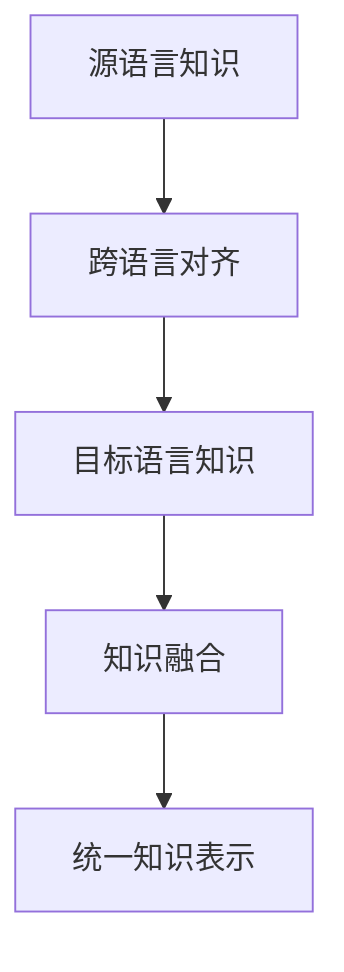
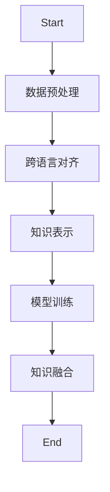
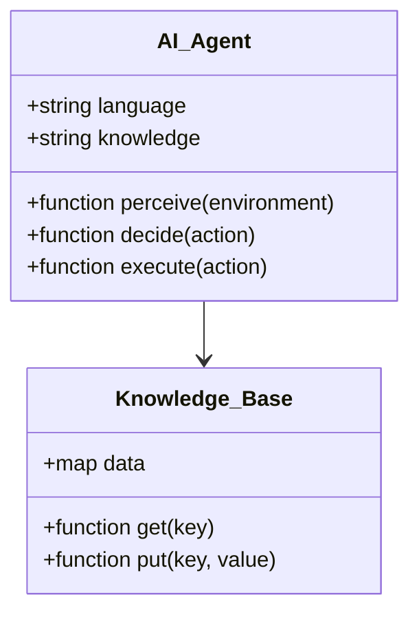
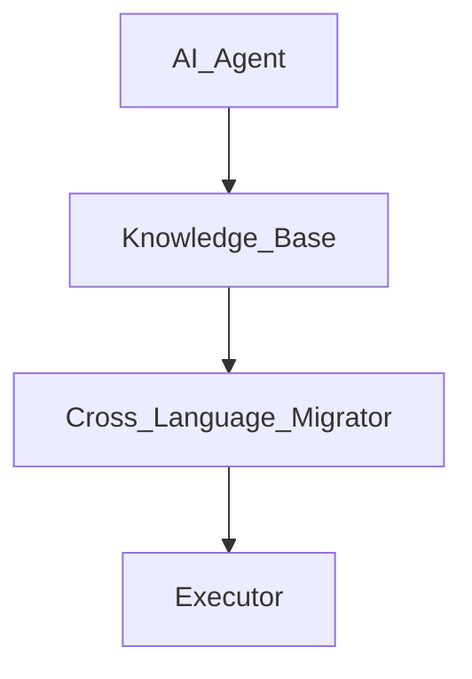
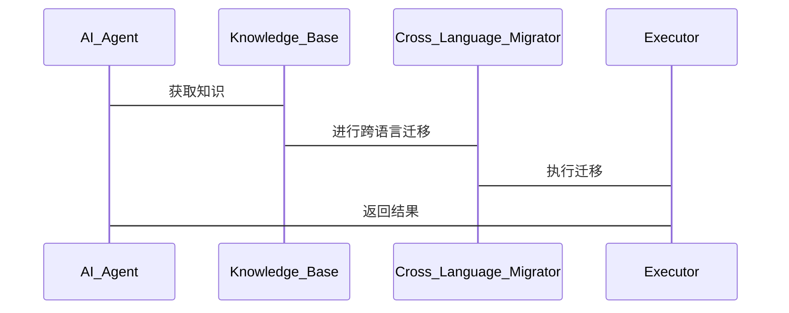
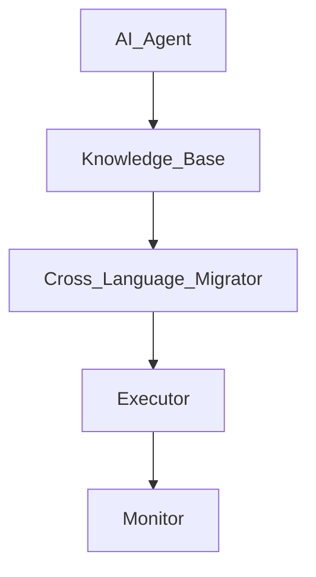

                 


# AI Agent的跨语言知识迁移与融合

> 关键词：AI Agent，跨语言知识迁移，知识融合，对比学习，图神经网络，多语言模型

> 摘要：本文系统探讨了AI Agent在跨语言知识迁移与融合中的理论与实践。从AI Agent的基本概念出发，分析了跨语言知识迁移的背景、核心概念与技术基础，深入讲解了对比学习和图神经网络在知识迁移中的应用，结合实际案例展示了跨语言知识融合的系统设计与实现，最后总结了跨语言知识迁移与融合的关键技术和未来发展方向。

---

# 第一部分: AI Agent的跨语言知识迁移与融合概述

# 第1章: AI Agent与跨语言知识迁移概述

## 1.1 AI Agent的基本概念

### 1.1.1 AI Agent的定义与特点
AI Agent（人工智能代理）是指能够感知环境、自主决策并执行任务的智能实体。AI Agent的核心特点包括：
- **自主性**：能够在没有外部干预的情况下独立执行任务。
- **反应性**：能够根据环境反馈动态调整行为。
- **目标导向性**：以特定目标为导向，优化决策过程。

AI Agent广泛应用于智能助手、推荐系统、自动驾驶等领域。

### 1.1.2 AI Agent的核心功能与应用场景
AI Agent的核心功能包括感知、推理、规划和执行。在跨语言场景中，AI Agent需要处理多语言信息，实现跨语言知识迁移与融合。应用场景包括：
- **多语言问答系统**：支持多种语言的交互。
- **跨语言信息检索**：在多语言环境中查找和整合信息。
- **多语言对话系统**：实现多语言对话交互。

### 1.1.3 跨语言知识迁移的背景与意义
跨语言知识迁移是指将一种语言的知识迁移到另一种语言，以提升AI Agent在多语言环境中的性能。背景包括：
- **语言多样性**：全球范围内存在多种语言，AI Agent需要处理多语言场景。
- **数据稀缺性**：某些语言的数据量较少，需要通过知识迁移来弥补。
- **任务通用性**：跨语言知识迁移可以提高AI Agent的通用性和适应性。

意义在于：
- **提升性能**：通过跨语言知识迁移，提升AI Agent在低资源语言环境中的性能。
- **降低成本**：减少多语言模型的训练数据需求。
- **扩展应用**：支持更多语言，扩大AI Agent的应用范围。

## 1.2 跨语言知识迁移的背景

### 1.2.1 多语言模型的发展现状
多语言模型的发展经历了从单语言模型到多语言模型的演变。当前主流的多语言模型包括：
- **mBert**：基于BERT的多语言模型。
- **XLM**：Facebook推出的多语言模型。
- **Marian**：支持多种语言的机器翻译模型。

这些模型在跨语言任务中表现出色，但仍然面临知识迁移的挑战。

### 1.2.2 知识迁移的核心问题与挑战
知识迁移的核心问题包括：
- **跨语言对齐**：如何将一种语言的知识迁移到另一种语言。
- **知识表示**：如何表示跨语言知识，使其易于迁移。
- **迁移效率**：如何提高跨语言知识迁移的效率。

挑战包括：
- **语言差异**：不同语言之间的语法、词汇差异。
- **数据稀缺性**：某些语言的数据量较少，影响迁移效果。
- **模型复杂性**：跨语言模型的复杂性较高，训练难度大。

### 1.2.3 跨语言知识迁移的必要性与优势
必要性体现在：
- **数据共享**：通过知识迁移，实现跨语言数据共享。
- **模型复用**：复用一种语言的模型知识到其他语言。

优势包括：
- **提高效率**：减少多语言模型的训练数据需求。
- **降低成本**：降低多语言模型的训练成本。
- **提升性能**：通过知识迁移，提升模型在低资源语言环境中的性能。

## 1.3 跨语言知识融合的技术基础

### 1.3.1 知识表示与知识图谱
知识表示是跨语言知识迁移的基础。知识图谱是一种结构化的知识表示方式，由节点和边组成，节点表示实体，边表示实体之间的关系。跨语言知识图谱可以通过对齐技术将不同语言的知识图谱对齐。

### 1.3.2 跨语言文本匹配与对齐
文本匹配是跨语言知识迁移的关键技术。跨语言文本匹配的目标是将一种语言的文本与另一种语言的文本进行匹配，实现知识对齐。常用方法包括：
- **对比学习**：通过对比学习，学习跨语言文本的相似性。
- **双语嵌入**：将不同语言的文本嵌入到同一个向量空间。

### 1.3.3 跨语言模型的训练与优化
跨语言模型的训练需要考虑多语言数据的多样性和语言间的差异。常用方法包括：
- **预训练**：对多语言数据进行预训练，提取跨语言特征。
- **微调**：在特定任务上对模型进行微调，提升任务性能。

---

# 第2章: 跨语言知识迁移的核心概念

## 2.1 跨语言知识迁移的定义与属性

### 2.1.1 跨语言知识迁移的定义
跨语言知识迁移是指将一种语言的知识迁移到另一种语言，以提升目标语言模型的性能。核心在于通过跨语言对齐和知识表示，实现知识的共享与复用。

### 2.1.2 跨语言知识迁移的属性对比
| 属性 | 单语言知识迁移 | 跨语言知识迁移 |
|------|----------------|----------------|
| 数据需求 | 高 | 低 |
| 语言限制 | 单一 | 多种 |
| 迁移范围 | 单一语言 | 多语言 |
| 应用场景 | 单语言任务 | 多语言任务 |

### 2.1.3 跨语言知识迁移的核心要素组成
跨语言知识迁移的核心要素包括：
- **源语言知识**：源语言的知识表示。
- **目标语言知识**：目标语言的知识表示。
- **跨语言对齐**：将源语言知识与目标语言知识对齐。
- **知识融合**：将对齐后的知识进行融合，形成统一的知识表示。

## 2.2 跨语言知识迁移的实体关系图



## 2.3 跨语言知识迁移的流程图



## 2.4 本章小结
...

---

# 第三部分: 跨语言知识迁移的算法原理

## 3.1 对比学习

### 3.1.1 对比学习的定义与特点
对比学习是一种通过对比正样本和负样本，学习数据相似性或差异性的方法。在跨语言知识迁移中，对比学习用于学习跨语言文本的相似性。

### 3.1.2 对比学习的数学模型
对比学习的目标函数可以表示为：

$$ L = \frac{1}{N} \sum_{i=1}^N \text{CE}(\text{sim}(x_i, y_i), 1) + \frac{1}{N} \sum_{i=1}^N \text{CE}(\text{sim}(x_i, y_j), 0) $$

其中，$\text{sim}(x_i, y_i)$表示源语言文本$x_i$和目标语言文本$y_i$的相似性，$\text{CE}$表示交叉熵损失函数。

### 3.1.3 对比学习在跨语言知识迁移中的应用
对比学习可以应用于跨语言文本匹配、跨语言对齐等任务。例如，在跨语言文本匹配中，对比学习可以用于学习跨语言文本的相似性。

## 3.2 图神经网络

### 3.2.1 图神经网络的定义与特点
图神经网络是一种基于图结构的深度学习方法，能够处理图结构数据。图神经网络通过聚合邻居节点的特征，学习节点的表示。

### 3.2.2 图神经网络在跨语言知识迁移中的应用
图神经网络可以应用于跨语言知识图谱的构建与对齐。例如，通过图神经网络，可以将不同语言的知识图谱对齐，构建跨语言知识图谱。

### 3.2.3 图神经网络的数学模型
图神经网络的聚合函数可以表示为：

$$ h_v^{(k+1)} = \text{aggregate}(\{h_u^{(k)} | u \in \text{neighbors}(v)\}) $$

其中，$h_v^{(k)}$表示节点$v$在第$k$层的特征向量，$\text{aggregate}$表示聚合函数。

## 3.3 跨语言知识迁移的算法实现

### 3.3.1 算法流程图


### 3.3.2 对比学习的Python实现

```python
import torch
import torch.nn as nn
import torch.nn.functional as F

class ContrastiveLoss(nn.Module):
    def __init__(self, temperature=0.1):
        super(ContrastiveLoss, self).__init__()
        self.temperature = temperature

    def forward(self, features, labels):
        # 计算相似性
        similarity = torch.mm(features, features.t()) / self.temperature
        # 计算交叉熵损失
        loss = F.cross_entropy(similarity, labels)
        return loss

# 示例用法
features = torch.randn(100, 128)  # 100个样本，128维特征
labels = torch.zeros(100)  # 标签，0表示负样本，1表示正样本
loss = ContrastiveLoss()(features, labels)
print(loss)
```

### 3.3.3 图神经网络的Python实现

```python
import torch
import torch.nn as nn
from torch.nn import init

class GNNLayer(nn.Module):
    def __init__(self, in_dim, out_dim):
        super(GNNLayer, self).__init__()
        self.W = nn.Parameter(torch.randn(in_dim, out_dim))
        self.A = nn.Parameter(torch.randn(in_dim, in_dim))

    def forward(self, x):
        # 聚合邻居特征
        aggregate = torch.mm(x, self.A)
        # 线性变换
        h = torch.mm(aggregate, self.W)
        return h

# 示例用法
x = torch.randn(10, 64)  # 10个节点，64维特征
gnn_layer = GNNLayer(64, 32)
h = gnn_layer(x)
print(h.size())  # 输出: torch.Size([10, 32])
```

---

# 第四部分: 跨语言知识迁移的系统分析与架构设计

## 4.1 系统功能设计

### 4.1.1 领域模型



### 4.1.2 系统架构设计



### 4.1.3 系统交互设计



## 4.2 系统实现

### 4.2.1 系统架构图



### 4.2.2 系统接口设计
- **AI Agent接口**：
  - `perceive(environment)`
  - `decide(action)`
  - `execute(action)`
- **知识库接口**：
  - `get(key)`
  - `put(key, value)`
- **跨语言迁移接口**：
  - `migrate(source_language, target_language)`
  - `align(knowledge)`
  - `fuse(knowledge)`

---

# 第五部分: 跨语言知识迁移的项目实战

## 5.1 项目背景与目标

### 5.1.1 项目背景
本项目旨在实现一个基于AI Agent的跨语言知识迁移系统，支持多语言环境下的知识迁移与融合。

### 5.1.2 项目目标
- **实现跨语言知识迁移**：将一种语言的知识迁移到另一种语言。
- **构建跨语言知识图谱**：通过知识迁移构建跨语言知识图谱。
- **实现知识融合**：将对齐后的知识进行融合，形成统一的知识表示。

## 5.2 核心代码实现

### 5.2.1 对比学习的实现

```python
class ContrastiveLoss(nn.Module):
    def __init__(self, temperature=0.1):
        super(ContrastiveLoss, self).__init__()
        self.temperature = temperature

    def forward(self, features, labels):
        similarity = torch.mm(features, features.t()) / self.temperature
        loss = F.cross_entropy(similarity, labels)
        return loss

# 示例用法
features = torch.randn(100, 128)  # 100个样本，128维特征
labels = torch.zeros(100)  # 标签，0表示负样本，1表示正样本
loss = ContrastiveLoss()(features, labels)
print(loss)
```

### 5.2.2 图神经网络的实现

```python
class GNNLayer(nn.Module):
    def __init__(self, in_dim, out_dim):
        super(GNNLayer, self).__init__()
        self.W = nn.Parameter(torch.randn(in_dim, out_dim))
        self.A = nn.Parameter(torch.randn(in_dim, in_dim))

    def forward(self, x):
        aggregate = torch.mm(x, self.A)
        h = torch.mm(aggregate, self.W)
        return h

# 示例用法
x = torch.randn(10, 64)  # 10个节点，64维特征
gnn_layer = GNNLayer(64, 32)
h = gnn_layer(x)
print(h.size())  # 输出: torch.Size([10, 32])
```

### 5.2.3 知识融合的实现

```python
def fuse_knowledge(source_knowledge, target_knowledge):
    # 知识融合方法
    fused_knowledge = {}
    for key in source_knowledge.keys() | target_knowledge.keys():
        if key in source_knowledge and key in target_knowledge:
            fused_knowledge[key] = {
                'source': source_knowledge[key],
                'target': target_knowledge[key]
            }
        elif key in source_knowledge:
            fused_knowledge[key] = source_knowledge[key]
        elif key in target_knowledge:
            fused_knowledge[key] = target_knowledge[key]
    return fused_knowledge
```

## 5.3 项目实战分析

### 5.3.1 项目实现细节
- **数据预处理**：对多语言数据进行预处理，提取特征。
- **跨语言对齐**：通过对比学习或图神经网络进行跨语言对齐。
- **知识融合**：将对齐后的知识进行融合，形成统一的知识表示。

### 5.3.2 代码功能解读
- **对比学习模块**：用于跨语言文本匹配，学习跨语言相似性。
- **图神经网络模块**：用于跨语言知识图谱的构建与对齐。
- **知识融合模块**：将对齐后的知识进行融合，形成统一的知识表示。

### 5.3.3 实际案例分析
假设我们有一个跨语言问答系统，支持中文和英文。通过跨语言知识迁移，可以将中文的知识迁移到英文，提升英文问答的准确率。

---

# 第六部分: 跨语言知识迁移的优化与总结

## 6.1 最佳实践

### 6.1.1 跨语言知识迁移的优化策略
- **数据增强**：通过数据增强技术，提高跨语言数据的质量。
- **模型优化**：优化模型结构，提高跨语言迁移的效率。
- **知识蒸馏**：通过知识蒸馏技术，降低跨语言迁移的计算成本。

### 6.1.2 跨语言知识迁移的注意事项
- **语言对齐**：注意不同语言之间的语法和词汇差异。
- **数据质量**：确保跨语言数据的质量和一致性。
- **模型适用性**：根据具体任务选择合适的跨语言模型。

## 6.2 小结
跨语言知识迁移是AI Agent在多语言环境中的关键技术，通过对比学习和图神经网络等方法，可以实现跨语言知识的高效迁移与融合。

## 6.3 注意事项
- **数据稀疏性**：在低资源语言环境中，跨语言知识迁移的效果可能受限。
- **模型复杂性**：跨语言模型的复杂性较高，训练和推理成本较高。
- **语言多样性**：需要考虑不同语言之间的差异性，避免迁移过程中出现偏差。

## 6.4 拓展阅读
- **对比学习**：深入理解对比学习的原理与应用。
- **图神经网络**：研究图神经网络在知识图谱中的应用。
- **多语言模型**：了解主流多语言模型的架构与性能。

---

# 结语
跨语言知识迁移是AI Agent在多语言环境中的核心能力，通过本文的系统探讨，读者可以全面了解跨语言知识迁移的理论与实践。未来，随着多语言模型和图神经网络的不断发展，跨语言知识迁移将变得更加高效和智能，为AI Agent的应用拓展更多可能性。

--- 

# 文章结束

