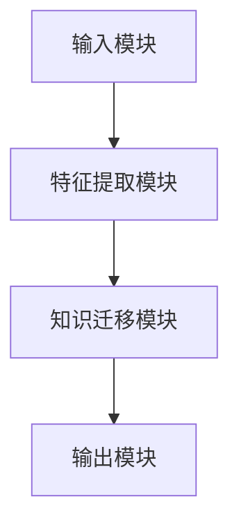

                 


# AI Agent的跨语言知识迁移技术

> 关键词：AI Agent，跨语言知识迁移，多语言模型，知识图谱，对比学习，迁移学习

> 摘要：本文深入探讨AI Agent在跨语言知识迁移中的技术原理与应用。通过分析跨语言知识迁移的核心概念、算法原理、系统架构以及实际项目案例，详细阐述了如何实现AI Agent在多语言环境下的高效知识转移与应用。文章结合理论与实践，为读者提供了从基础概念到实际操作的全面指南。

---

## 第1章: AI Agent的基本概念与跨语言知识迁移的背景

### 1.1 AI Agent的定义与特点

AI Agent（人工智能代理）是指在计算机系统中代表用户或其他实体进行操作的智能程序或实体。AI Agent具备以下特点：

- **自主性**：能够自主决策和执行任务。
- **反应性**：能够感知环境并实时响应。
- **目标导向**：具有明确的目标导向行为。
- **学习能力**：能够通过经验或数据进行学习和优化。

AI Agent的应用场景广泛，包括智能助手、推荐系统、自动驾驶等。其核心价值在于通过智能算法和大数据处理能力，为用户提供高效、个性化的服务。

---

### 1.2 跨语言知识迁移的背景与意义

随着全球化的发展，跨语言交流的需求日益增长。然而，传统的AI系统通常依赖于单一语言的数据和模型，难以在多语言环境中有效工作。跨语言知识迁移技术通过将一种语言的知识迁移到另一种语言，解决了这一问题。

#### 背景介绍

- **多语言处理的挑战**：不同语言之间存在语法、语义等方面的差异，直接迁移知识面临诸多困难。
- **跨语言知识迁移的必要性**：通过迁移学习，可以减少对目标语言数据的依赖，降低模型训练成本。
- **技术发展现状**：近年来，多语言模型（如多语言BERT）的发展为跨语言知识迁移提供了强大的技术基础。

---

## 第2章: 跨语言知识迁移的核心概念与技术原理

### 2.1 跨语言知识迁移的基本原理

跨语言知识迁移的核心在于通过共享特征或参数，实现不同语言之间的知识共享。以下是其实现的基本原理：

#### 跨语言表示学习

- **定义**：通过将不同语言的文本映射到共享的向量空间，实现跨语言表示。
- **方法**：利用对比学习或对齐技术，将不同语言的语义信息对齐。

#### 跨语言特征提取

- **定义**：提取与语言无关的特征，这些特征可以在不同语言之间共享。
- **方法**：基于自注意力机制，提取文本的上下文特征。

#### 跨语言迁移学习

- **定义**：通过迁移学习技术，将源语言的知识迁移到目标语言。
- **方法**：使用领域适配器或语言适配器，调整目标语言的模型参数。

---

### 2.2 跨语言知识迁移的关键技术

#### 多语言模型的构建

- **多语言模型**：如多语言BERT，通过共享的预训练参数，支持多种语言的文本处理。
- **对齐技术**：通过语言对齐技术，消除不同语言之间的语义差异。

#### 跨语言对比学习

- **定义**：通过对比不同语言的文本表示，增强跨语言的语义一致性。
- **方法**：使用对比损失函数，优化跨语言表示的相似性。

#### 跨语言知识图谱的构建与应用

- **知识图谱**：构建跨语言的知识图谱，实现多语言知识的统一表示。
- **应用**：通过知识图谱，支持跨语言的问答系统和信息检索。

---

## 第3章: 跨语言知识迁移的算法原理

### 3.1 跨语言迁移学习的算法框架

#### 基于特征的跨语言迁移

- **特征提取**：提取源语言和目标语言的共同特征。
- **迁移策略**：通过特征对齐，实现知识迁移。

#### 基于参数的跨语言迁移

- **参数共享**：通过共享模型参数，实现跨语言的知识迁移。
- **适配器设计**：使用语言适配器，调整目标语言的模型参数。

#### 对比学习在跨语言迁移中的应用

- **对比学习框架**：通过对比不同语言的文本表示，优化跨语言表示的相似性。
- **对比损失函数**：定义对比损失，优化模型参数。

### 3.2 多语言模型的数学公式与实现

#### 多语言模型的数学模型

$$
\text{loss} = \sum_{i=1}^{n} \text{cross\_entropy}(y_i, y_{\text{pred}}_i)
$$

其中，$y_i$ 是真实标签，$y_{\text{pred}}_i$ 是预测标签。

#### 跨语言对比学习的数学公式

$$
\text{loss}_{\text{contrast}} = -\frac{1}{N}\sum_{i=1}^{N} \text{log}(\frac{e^{sim(x_i, x'_i)}}{e^{sim(x_i, x''_i)}})
$$

其中，$sim(x_i, x'_i)$ 是正样本的相似度，$sim(x_i, x''_i)$ 是负样本的相似度。

---

## 第4章: 跨语言知识迁移的系统架构与设计

### 4.1 系统架构设计

#### 系统模块划分

- **输入模块**：接收多语言文本输入。
- **特征提取模块**：提取跨语言特征。
- **知识迁移模块**：实现跨语言知识迁移。
- **输出模块**：输出目标语言的文本或结果。

#### 系统功能设计

- **多语言文本处理**：支持多种语言的文本处理。
- **跨语言知识迁移**：实现知识从源语言到目标语言的迁移。
- **结果输出**：输出目标语言的处理结果。

#### 系统架构的Mermaid图



### 4.2 系统接口设计

#### 系统接口定义

- **输入接口**：接收多语言文本输入。
- **输出接口**：输出目标语言的处理结果。
- **控制接口**：控制系统的运行和停止。

#### 接口交互流程

- **输入处理**：输入模块接收文本输入。
- **特征提取**：特征提取模块提取跨语言特征。
- **知识迁移**：知识迁移模块实现知识迁移。
- **结果输出**：输出模块输出处理结果。

---

## 第5章: 跨语言知识迁移的项目实战

### 5.1 环境安装与配置

#### 开发环境的选择

- **推荐环境**：建议使用Python 3.8及以上版本。
- **依赖库的安装**：安装PyTorch、Hugging Face Transformers等库。

#### 代码示例

```python
from transformers import AutoTokenizer, AutoModelForMaskedLM
import torch

tokenizer = AutoTokenizer.from_pretrained('bert-base-multilingual-cased')
model = AutoModelForMaskedLM.from_pretrained('bert-base-multilingual-cased')
```

---

通过以上步骤，我们可以实现一个简单的跨语言知识迁移系统。随着技术的不断发展，跨语言知识迁移将更加高效和智能化。

