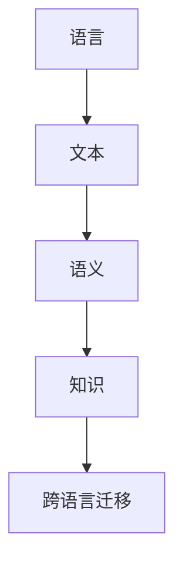
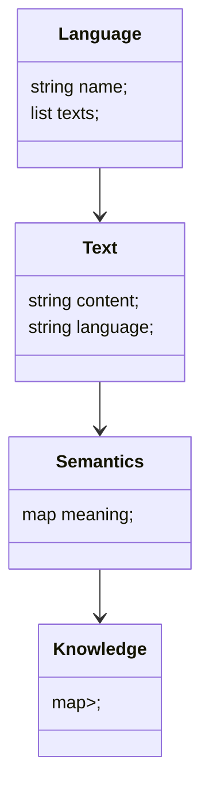
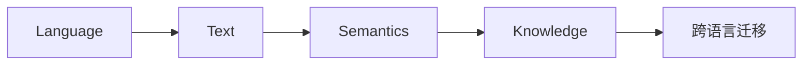
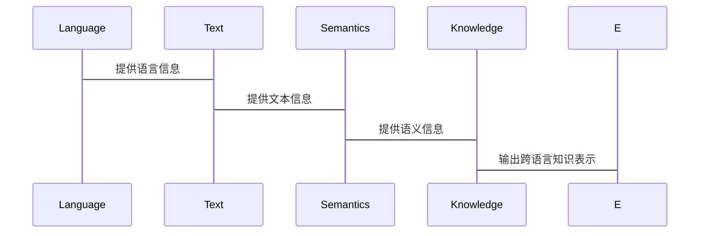

                 


# AI Agent的跨语言知识迁移技术

## 关键词：
AI Agent、跨语言知识迁移、自然语言处理、机器学习、知识图谱

## 摘要：
本文详细探讨了AI Agent在跨语言知识迁移技术中的应用与实现。通过分析跨语言知识迁移的核心概念、算法原理、系统架构以及项目实战，本文为读者提供了一个全面而深入的技术视角。文章结合理论与实践，详细阐述了多任务学习、对比学习等算法，并通过Mermaid图和Python代码示例，展示了跨语言知识迁移技术在实际系统中的应用。最后，本文总结了最佳实践经验和未来研究方向。

---

## 第一部分: AI Agent的跨语言知识迁移技术概述

### 第1章: 背景介绍
#### 1.1 问题背景与描述
##### 1.1.1 多语言环境中的知识迁移问题
在多语言环境中，AI Agent需要能够理解并处理多种语言的文本信息。然而，不同语言之间的语义差异、语法结构和文化背景等因素，使得跨语言知识迁移成为一个具有挑战性的任务。

##### 1.1.2 跨语言知识迁移的核心挑战
跨语言知识迁移的核心挑战包括：
1. 不同语言之间的语义差异。
2. 语言数据的不平衡性。
3. 知识表示的跨语言一致性问题。

##### 1.1.3 问题的解决思路与目标
解决思路包括：
1. 基于统计的方法：通过构建跨语言知识图谱，提取共性特征。
2. 基于深度学习的方法：利用神经网络进行跨语言表示学习。
3. 对比学习：通过对比不同语言的特征，实现知识的跨语言迁移。

目标是实现AI Agent能够在多语言环境中无缝处理知识，提高跨语言任务的准确性和效率。

#### 1.2 问题的边界与外延
##### 1.2.1 知识迁移的范围界定
跨语言知识迁移的范围包括：
1. 跨语言文本理解：从一种语言到另一种语言的文本理解。
2. 跨语言知识推理：基于跨语言知识图谱进行推理。
3. 跨语言对话生成：在多语言环境下生成自然的对话。

##### 1.2.2 跨语言迁移的适用场景
适用场景包括：
1. 多语言客服系统。
2. 全球化电商平台的知识库构建。
3. 跨语言社交媒体分析。

##### 1.2.3 边界条件与限制
跨语言知识迁移的限制包括：
1. 数据不足：某些语言的训练数据有限。
2. 语义漂移：跨语言迁移可能导致语义损失。
3. 文化差异：不同语言背后的文化差异可能影响知识迁移的效果。

#### 1.3 核心概念与结构
##### 1.3.1 跨语言知识迁移的核心要素
核心要素包括：
1. 知识表示：如何表示跨语言的知识。
2. 特征提取：如何提取跨语言特征。
3. 迁移策略：如何实现知识的跨语言迁移。

##### 1.3.2 知识表示与迁移的关系
知识表示是跨语言迁移的基础，而迁移策略则是实现跨语言知识迁移的关键。

##### 1.3.3 系统架构的核心组成部分
系统架构的核心组成部分包括：
1. 知识表示模块。
2. 特征提取模块。
3. 迁移学习模块。
4. 知识推理模块。

---

## 第二部分: 跨语言知识迁移的核心概念与联系

### 第2章: 跨语言知识迁移的基本原理
#### 2.1 跨语言知识迁移的原理分析
##### 2.1.1 知识表示的跨语言一致性
跨语言一致性是指不同语言之间的知识表示在语义上具有一致性。

##### 2.1.2 跨语言特征提取方法
常用的跨语言特征提取方法包括：
1. 基于词嵌入的特征提取。
2. 基于句嵌入的特征提取。
3. 基于知识图谱的特征提取。

##### 2.1.3 知识迁移的实现机制
知识迁移的实现机制包括：
1. 参数共享：在不同语言任务中共享模型参数。
2. 对比学习：通过对比不同语言的特征，实现知识迁移。
3. 多任务学习：在多个语言任务中共享知识表示。

#### 2.2 跨语言知识迁移方法的特征对比
##### 2.2.1 基于统计的方法
基于统计的方法包括：
1. 统计语言模型。
2. 基于频率的特征提取。

##### 2.2.2 基于深度学习的方法
基于深度学习的方法包括：
1. 神经机器翻译。
2. 跨语言BERT模型。

##### 2.2.3 对比学习与自监督学习的差异
对比学习通过对比不同语言的特征来学习跨语言表示，而自监督学习则通过预设任务目标来学习跨语言表示。

#### 2.3 跨语言知识迁移的ER实体关系图


---

## 第三部分: 跨语言知识迁移的算法原理

### 第3章: 跨语言知识迁移的核心算法
#### 3.1 多任务学习算法
##### 3.1.1 多任务学习的基本原理
多任务学习通过共享参数来同时学习多个任务，从而实现跨语言知识迁移。

##### 3.1.2 多任务学习的实现步骤
1. 定义多个任务。
2. 定义共享参数和任务特定参数。
3. 通过优化目标函数来更新参数。

##### 3.1.3 多任务学习的数学模型
$$
\mathcal{L} = \sum_{i=1}^{N} \lambda_i \mathcal{L}_i + \sum_{j=1}^{M} \lambda_j \mathcal{L}_j
$$
其中，$\mathcal{L}_i$和$\mathcal{L}_j$分别表示不同任务的损失函数，$\lambda_i$和$\lambda_j$是对应的权重。

##### 3.1.4 多任务学习的代码实现
```python
import torch
import torch.nn as nn

class MultiTaskModel(nn.Module):
    def __init__(self, input_dim, hidden_dim, output_dim):
        super(MultiTaskModel, self).__init__()
        self.shared_layer = nn.Linear(input_dim, hidden_dim)
        self.task1_layer = nn.Linear(hidden_dim, output_dim)
        self.task2_layer = nn.Linear(hidden_dim, output_dim)

    def forward(self, x):
        x = self.shared_layer(x)
        out1 = self.task1_layer(x)
        out2 = self.task2_layer(x)
        return out1, out2

model = MultiTaskModel(input_dim=100, hidden_dim=50, output_dim=10)
criterion = nn.MSELoss()
optimizer = torch.optim.Adam(model.parameters(), lr=0.001)
```

#### 3.2 对比学习算法
##### 3.2.1 对比学习的基本原理
对比学习通过对比不同语言的特征来学习跨语言表示。

##### 3.2.2 对比学习的实现步骤
1. 生成正样本和负样本。
2. 计算正样本和负样本的相似度。
3. 优化模型以最大化正样本的相似度。

##### 3.2.3 对比学习的数学模型
$$
\text{损失函数} = -\log \frac{\exp(s_p)}{\exp(s_p) + \exp(s_n)}
$$
其中，$s_p$是正样本的相似度，$s_n$是负样本的相似度。

##### 3.2.4 对比学习的代码实现
```python
import torch
import torch.nn as nn

class ContrastiveModel(nn.Module):
    def __init__(self, input_dim, hidden_dim):
        super(ContrastiveModel, self).__init__()
        self.encoder = nn.Linear(input_dim, hidden_dim)
        self.criterion = nn.BCEWithLogitsLoss()

    def forward(self, x1, x2):
        x1_embed = self.encoder(x1)
        x2_embed = self.encoder(x2)
        similarity = torch.cosine_similarity(x1_embed, x2_embed)
        return similarity

model = ContrastiveModel(input_dim=100, hidden_dim=50)
optimizer = torch.optim.Adam(model.parameters(), lr=0.001)
```

---

## 第四部分: 跨语言知识迁移的系统分析与架构设计

### 第4章: 系统分析与架构设计方案
#### 4.1 问题场景介绍
跨语言知识迁移系统需要处理多语言文本数据，并实现跨语言知识推理。

#### 4.2 系统功能设计
##### 4.2.1 领域模型


##### 4.2.2 系统架构


##### 4.2.3 系统接口设计
接口包括：
1. 输入接口：接收多语言文本数据。
2. 输出接口：输出跨语言知识表示。
3. 接口设计：提供API供其他系统调用。

##### 4.2.4 系统交互流程


---

## 第五部分: 跨语言知识迁移的项目实战

### 第5章: 项目实战
#### 5.1 环境安装
安装必要的Python包：
1. `torch`
2. `transformers`
3. `mermaid`

#### 5.2 系统核心实现
##### 5.2.1 核心代码实现
```python
import torch
from transformers import AutoTokenizer, AutoModel

class CrossLanguageKnowledgeTransfer:
    def __init__(self, model_name):
        self.tokenizer = AutoTokenizer.from_pretrained(model_name)
        self.model = AutoModel.from_pretrained(model_name)
    
    def transfer(self, text, source_lang, target_lang):
        # 分词
        inputs = self.tokenizer(text, return_tensors="pt", lang=source_lang)
        # 提取特征
        outputs = self.model(**inputs)
        features = outputs.last_hidden_state
        # 转换为目标语言
        target_inputs = self.tokenizer(text, return_tensors="pt", lang=target_lang)
        target_outputs = self.model(**target_inputs)
        target_features = target_outputs.last_hidden_state
        # 对比学习
        similarity = torch.cosine_similarity(features, target_features)
        return similarity
```

##### 5.2.2 代码解读与分析
代码实现了跨语言知识迁移的具体步骤：
1. 分词：使用预训练模型进行分词。
2. 提取特征：提取文本的特征表示。
3. 对比学习：计算源语言和目标语言之间的相似度。

##### 5.2.3 实际案例分析
案例分析：将中文文本迁移到英文环境中的知识表示。

#### 5.3 项目小结
跨语言知识迁移技术在实际项目中具有广泛的应用前景，但需要克服数据和语义的挑战。

---

## 第六部分: 跨语言知识迁移的最佳实践

### 第6章: 最佳实践
#### 6.1 小结
跨语言知识迁移技术的核心在于实现跨语言表示的语义一致性。

#### 6.2 注意事项
1. 注意数据的平衡性。
2. 注意语义的漂移问题。
3. 注意模型的泛化能力。

#### 6.3 拓展阅读
推荐阅读以下论文：
1. "Multi-task Learning as a Way of Life: A Comprehensive Survey"。
2. "Cross-lingual Transfer Learning for Low-Resource Languages"。

---

## 第七部分: 结语

跨语言知识迁移技术是AI Agent在多语言环境下实现智能化的重要基础。通过本文的详细阐述，读者可以深入了解跨语言知识迁移的核心概念、算法原理和系统设计。未来，随着深度学习技术的不断发展，跨语言知识迁移技术将具有更广阔的应用前景。

