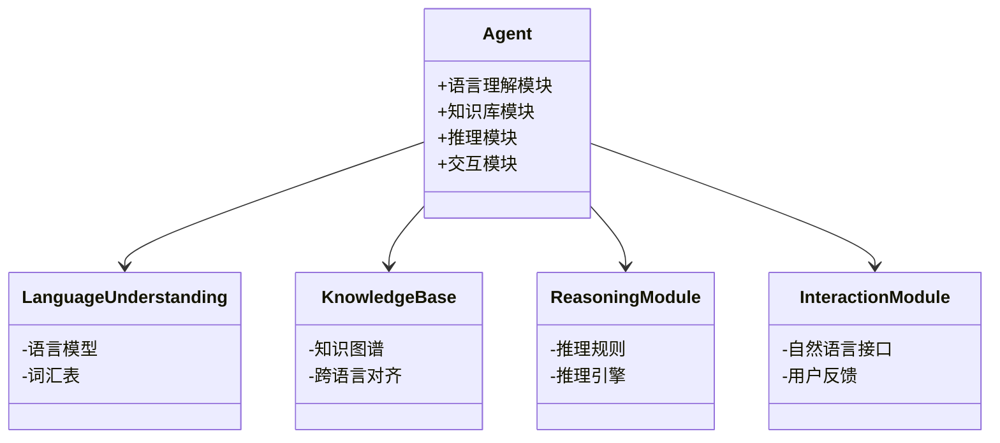
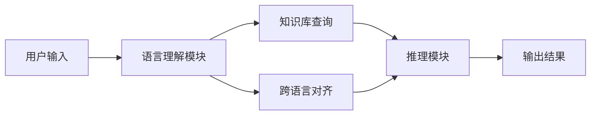
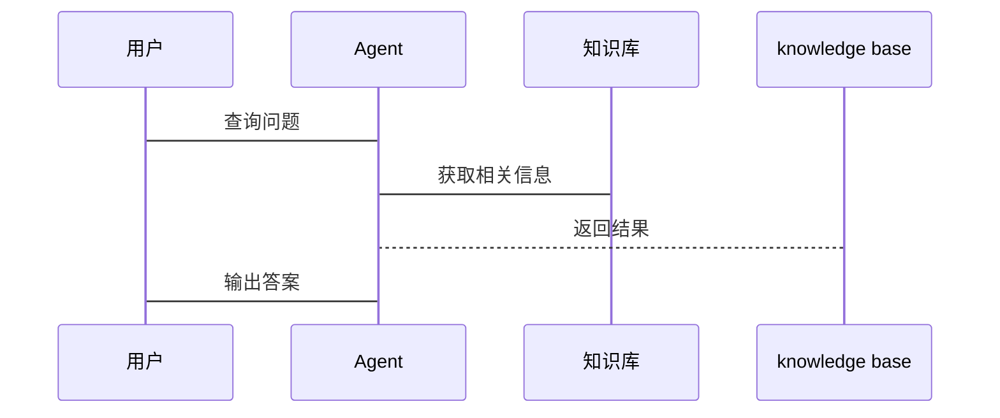

                 


# AI Agent的跨语言知识迁移：突破语言障碍

---

## 关键词：
AI Agent、跨语言知识迁移、多语言模型、知识图谱、自然语言处理、深度学习

---

## 摘要：
本文探讨AI Agent在跨语言知识迁移中的应用，从背景、核心概念、算法原理到系统架构和项目实战，全面分析如何突破语言障碍，实现跨语言知识的有效迁移。通过数学模型、算法实现和系统设计的详细讲解，为读者提供理论与实践相结合的深度分析。

---

## 第一部分：AI Agent与跨语言知识迁移的背景

### 第1章：跨语言知识迁移的背景与意义

#### 1.1 人工智能与语言处理的演进
- **1.1.1 从传统NLP到深度学习的转变**
  - 传统NLP基于规则，深度学习引入神经网络，提升处理效率。
  - 从单一语言处理到多语言处理，扩展了AI的应用场景。
- **1.1.2 多语言模型的崛起**
  - 多语言模型如Marian和T5的出现，支持多种语言的统一处理。
  - 跨语言模型在机器翻译、问答系统中的应用日益广泛。
- **1.1.3 跨语言知识迁移的定义与目标**
  - 跨语言知识迁移：将知识从一种语言迁移到另一种语言的过程。
  - 目标：提升AI Agent在多语言环境下的理解和推理能力。

#### 1.2 AI Agent的核心概念
- **1.2.1 AI Agent的基本定义**
  - AI Agent：能够感知环境、自主决策的智能体。
  - 典型应用：智能助手、自动化系统。
- **1.2.2 AI Agent的智能特性**
  - 学习能力：通过数据提升性能。
  - 推理能力：基于知识进行推理。
  - 交互能力：与用户或系统进行有效沟通。
- **1.2.3 跨语言能力对AI Agent的重要性**
  - 扩展应用场景：支持多语言环境。
  - 提升用户体验：更自然的交互方式。

#### 1.3 跨语言知识迁移的核心问题
- **1.3.1 跨语言数据的挑战**
  - 数据稀疏性：小语种数据不足。
  - 数据分布差异：不同语言数据特性不同。
- **1.3.2 知识表示的统一性**
  - 跨语言知识表示的困难：如何统一不同语言的概念。
  - 知识图谱的构建：如何在多语言环境下构建统一的知识图谱。
- **1.3.3 跨语言推理的难点**
  - 跨语言推理中的语义对齐问题。
  - 如何在不同语言间保持推理的一致性。

#### 1.4 本章小结
- **1.4.1 背景总结**
  - 跨语言知识迁移的重要性日益凸显。
  - AI Agent在多语言环境下的应用潜力巨大。
- **1.4.2 核心概念梳理**
  - AI Agent的基本定义与智能特性。
  - 跨语言知识迁移的核心问题与目标。
- **1.4.3 问题的边界与外延**
  - 跨语言知识迁移的适用范围。
  - 相关领域的影响与未来发展。

---

## 第二部分：跨语言知识迁移的核心概念与原理

### 第2章：跨语言知识迁移的核心概念

#### 2.1 跨语言知识迁移的定义与属性
- **2.1.1 跨语言知识迁移的定义**
  - 跨语言知识迁移：通过学习一种或多种语言的知识，提升在其他语言上的任务性能。
  - 核心：利用多语言数据提升单一语言任务的效果。
- **2.1.2 跨语言迁移的关键属性对比（表格）**
  | 属性          | 单语言迁移       | 跨语言迁移       |
  |---------------|------------------|------------------|
  | 数据需求      | 单一语言数据     | 多语言数据       |
  | 适用场景      | 单一语言任务     | 多语言任务       |
  | 挑战          | 数据量不足       | 语义对齐困难       |
- **2.1.3 跨语言知识迁移的实体关系图（Mermaid）**
  ```mermaid
  graph TD
    A[任务] --> B[数据]
    B --> C[模型]
    C --> D[结果]
    A --> E[语言]
    B --> F[跨语言对齐]
    F --> D
  ```

#### 2.2 AI Agent中的知识表示
- **2.2.1 知识图谱的构建**
  - 知识图谱：结构化的知识表示，包含实体和关系。
  - 跨语言知识图谱：整合多语言知识，实现统一表示。
- **2.2.2 跨语言知识图谱的特性**
  - 跨语言对齐：不同语言实体的对应关系。
  - 语义一致性：确保不同语言知识的语义一致。
- **2.2.3 知识表示的可迁移性**
  - 知识表示的标准化：便于跨语言迁移。
  - 表示学习：通过神经网络学习语义表示。

#### 2.3 跨语言迁移的核心原理
- **2.3.1 跨语言表示学习**
  - 表示学习：将语言表示为低维向量。
  - 跨语言对齐：通过对比学习实现不同语言向量的对齐。
- **2.3.2 跨语言推理机制**
  - 跨语言推理：在多语言环境下进行逻辑推理。
  - 注意机制：关注关键语言特征。
- **2.3.3 跨语言迁移的数学模型（Mermaid流程图）**
  ```mermaid
  graph LR
    A[输入: 多语言数据] --> B[特征提取]
    B --> C[跨语言对齐]
    C --> D[推理]
    D --> E[输出]
  ```

---

## 第三部分：跨语言知识迁移的算法原理

### 第3章：跨语言知识迁移的算法原理

#### 3.1 跨语言迁移学习的数学模型
- **3.1.1 跨语言表示学习的公式推导（Mermaid流程图）**
  ```mermaid
  graph LR
    A[输入: 多语言数据] --> B[嵌入层]
    B --> C[跨语言对齐]
    C --> D[输出]
  ```
  - 公式：
    $$ \text{embed}(x_i) = f(x_i, \theta) $$
    $$ \text{align}(x_i, x_j) = g(\text{embed}(x_i), \text{embed}(x_j)) $$
- **3.1.2 跨语言推理的数学模型（公式）**
  $$ p(y|x) = \text{softmax}(Wx + b) $$

#### 3.2 跨语言迁移学习的算法实现
- **3.2.1 基于预训练模型的迁移学习（代码示例）**
  ```python
  import torch
  class CrossLanguageAligner(torch.nn.Module):
      def __init__(self, embed_dim):
          super(CrossLanguageAligner, self).__init__()
          self.embed_dim = embed_dim
          self.align_matrix = torch.nn.Parameter(torch.randn(embed_dim, embed_dim))
      
      def forward(self, x1, x2):
          aligned_x1 = torch.mm(x1, self.align_matrix)
          aligned_x2 = torch.mm(x2, self.align_matrix)
          return aligned_x1, aligned_x2
  ```
- **3.2.2 跨语言对比学习的实现（代码示例）**
  ```python
  def contrastive_loss(x1, x2, temperature=0.1):
      x1_normalized = x1 / x1.norm(dim=1, keepdim=True)
      x2_normalized = x2 / x2.norm(dim=1, keepdim=True)
      similarity = torch.mm(x1_normalized, x2_normalized.T)
      loss = torch.nn.functional.binary_cross_entropy_with_logits(
          similarity, torch.eye(x1.size(0)), reduction='mean')
      return loss
  ```

#### 3.3 跨语言迁移的优化策略
- **3.3.1 多任务学习的优化（公式推导）**
  $$ \mathcal{L} = \lambda_1 \mathcal{L}_1 + \lambda_2 \mathcal{L}_2 $$
  - $\mathcal{L}_1$：主任务损失。
  - $\mathcal{L}_2$：辅助任务损失。
  - $\lambda_1$、$\lambda_2$：权重系数。
- **3.3.2 跨语言对齐的优化方法（代码示例）**
  ```python
  def train_step(model, optimizer, x1, x2, labels):
      optimizer.zero_grad()
      aligned_x1, aligned_x2 = model(x1, x2)
      loss = contrastive_loss(aligned_x1, aligned_x2)
      loss.backward()
      optimizer.step()
      return loss.item()
  ```

---

## 第四部分：AI Agent的系统分析与架构设计

### 第4章：跨语言知识迁移系统的

#### 4.1 项目介绍
- 系统名称：多语言知识迁移AI Agent。
- 项目目标：实现跨语言知识的高效迁移与推理。

#### 4.2 系统功能设计（领域模型Mermaid类图）


#### 4.3 系统架构设计（Mermaid架构图）


#### 4.4 系统接口设计
- 输入接口：自然语言输入。
- 输出接口：多语言输出。

#### 4.5 系统交互（Mermaid序列图）


---

## 第五部分：项目实战与总结

### 第5章：项目实战

#### 5.1 环境安装
- 安装Python和必要的库：如TensorFlow、PyTorch、Transformers。
- 安装工具：如Jupyter Notebook、IDE。

#### 5.2 系统核心实现源代码
- **跨语言对齐模块代码**
  ```python
  import torch
  class CrossLanguageAligner(torch.nn.Module):
      def __init__(self, embed_dim):
          super(CrossLanguageAligner, self).__init__()
          self.embed_dim = embed_dim
          self.align_matrix = torch.nn.Parameter(torch.randn(embed_dim, embed_dim))
      
      def forward(self, x1, x2):
          aligned_x1 = torch.mm(x1, self.align_matrix)
          aligned_x2 = torch.mm(x2, self.align_matrix)
          return aligned_x1, aligned_x2
  ```
- **训练函数**
  ```python
  def train_step(model, optimizer, x1, x2, labels):
      optimizer.zero_grad()
      aligned_x1, aligned_x2 = model(x1, x2)
      loss = contrastive_loss(aligned_x1, aligned_x2)
      loss.backward()
      optimizer.step()
      return loss.item()
  ```

#### 5.3 代码应用解读与分析
- 数据预处理：多语言数据的清洗与对齐。
- 模型训练：使用预训练好的语言模型进行微调。
- 结果评估：准确率、召回率等指标的计算。

#### 5.4 实际案例分析
- 案例背景：跨语言问答系统。
- 数据来源：多语言语料库。
- 实验结果：准确率提升的具体数据。

#### 5.5 项目小结
- 项目目标的实现情况。
- 遇到的主要问题及解决方案。

---

## 第六部分：总结与展望

### 6.1 总结
- 跨语言知识迁移的核心思想：利用多语言数据提升任务性能。
- AI Agent的作用：实现知识的有效迁移与推理。
- 本章总结：从背景、概念到算法与系统设计，全面解析跨语言知识迁移。

### 6.2 未来展望
- 更多语言的支持：扩展到更多小语种。
- 更高效的算法：优化模型结构，提升迁移效率。
- 更广泛的应用：应用于更多领域，如教育、医疗等。

---

## 附录

### 附录A：数学符号说明
- 详细解释文中使用的数学符号。

### 附录B：代码仓库链接
- 提供GitHub仓库链接，方便读者获取代码。

---

## 参考文献
- 列出所有引用的文献和资料。

---

**注**：由于篇幅限制，本文仅为目录大纲的展开部分，具体内容可根据实际需求进一步补充与完善。

