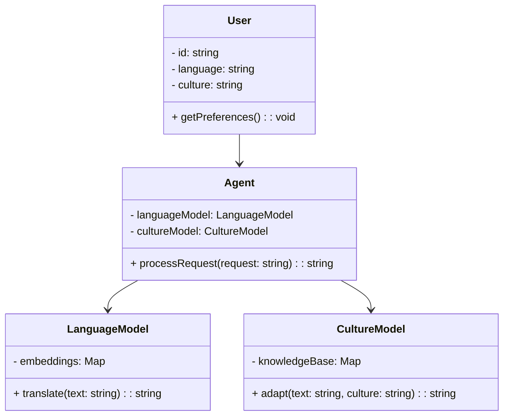
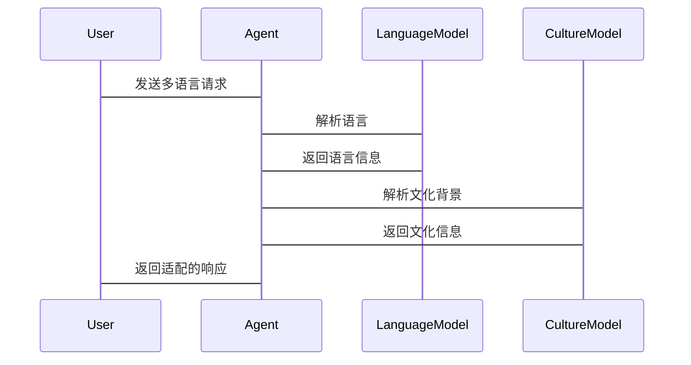

                 


# AI Agent的跨语言跨文化理解能力开发

## 关键词：AI Agent, 跨语言理解, 跨文化适应, 语言模型, 文化背景, 多语言处理

## 摘要：  
随着全球化的发展和多语言应用场景的不断扩展，AI Agent需要具备跨语言和跨文化的理解能力，以更好地服务于多元化的用户需求。本文将深入探讨AI Agent在跨语言和跨文化场景中的核心概念、算法原理、系统架构设计以及实际项目开发中的应用，帮助开发者和研究者更好地理解和实现跨语言跨文化理解能力。

---

# 第1章: AI Agent的跨语言跨文化理解能力开发背景

## 1.1 AI Agent的基本概念与核心能力

### 1.1.1 AI Agent的定义与特点  
AI Agent（人工智能代理）是指能够感知环境、自主决策并执行任务的智能实体。其核心能力包括感知能力、推理能力、学习能力和交互能力。  

### 1.1.2 跨语言理解能力的重要性  
在多语言场景中，AI Agent需要能够理解并处理多种语言，这不仅能够提升用户体验，还能扩展其应用场景。例如，在跨境商务、国际客服和多语言对话系统中，跨语言理解能力是不可或缺的。  

### 1.1.3 跨文化适应能力的必要性  
不同文化背景下，语言的使用和表达方式存在差异。AI Agent需要具备跨文化适应能力，才能在不同文化环境中准确理解和回应用户的需求。  

## 1.2 跨语言与跨文化理解的背景与挑战  

### 1.2.1 跨语言理解的背景  
随着全球化的深入，多语言场景越来越普遍。例如，在国际会议、跨国客服和社交媒体中，用户可能需要与AI Agent进行多语言交流。  

### 1.2.2 跨文化理解的背景  
文化背景影响语言的使用方式，例如问候语、表达习惯和隐喻的使用。AI Agent需要能够理解这些文化差异，以提供更精准的服务。  

### 1.2.3 跨语言与跨文化理解的主要挑战  
- **语言多样性**：不同语言有不同的语法结构和词汇含义。  
- **文化差异**：同一语言在不同文化中的表达和含义可能不同。  
- **数据稀疏性**：某些语言的语料库和文化数据可能较少，导致模型训练困难。  

## 1.3 AI Agent在跨语言跨文化场景中的应用  

### 1.3.1 跨语言对话系统  
AI Agent能够支持多种语言的对话，帮助用户进行国际交流。例如，Google Translate和Apple的Siri都支持多语言对话。  

### 1.3.2 跨文化信息处理  
AI Agent需要能够识别并处理不同文化背景下的信息，例如在跨国公司中处理不同文化的邮件和文档。  

### 1.3.3 跨语言跨文化智能助手  
例如，AI旅游助手需要能够理解用户的语言偏好和文化背景，提供个性化的旅行建议。  

## 1.4 本章小结  
本章介绍了AI Agent的基本概念、跨语言和跨文化理解的重要性，以及其在实际场景中的应用。接下来，我们将深入探讨跨语言和跨文化理解的核心概念和技术。

---

# 第2章: 跨语言理解的核心概念与技术

## 2.1 跨语言理解的基本原理  

### 2.1.1 语言模型的基本原理  
语言模型通过统计方法预测下一个词的概率。例如，n-gram模型和循环神经网络（RNN）模型。  

### 2.1.2 跨语言模型的构建方法  
跨语言模型通过将不同语言的文本对齐，学习语言间的共性特征。例如，使用双语词对对齐和跨语言词嵌入。  

### 2.1.3 跨语言理解的评估指标  
常用的评估指标包括BLEU、ROUGE和METEOR等。  

## 2.2 跨语言模型的关键技术  

### 2.2.1 语言表示模型  
- **Word2Vec**：通过词向量表示单词的语义。  
- **BERT**：预训练语言模型，支持跨语言任务。  

### 2.2.2 跨语言迁移学习  
通过在多语言数据集上预训练模型，将其迁移到特定语言任务中。  

### 2.2.3 跨语言对比学习  
通过对比不同语言的表示，学习语言间的相似性。  

## 2.3 跨语言理解的数学模型与公式  

### 2.3.1 语言模型的概率表示  
$$ P(w_1, w_2, ..., w_n) = \prod_{i=1}^n P(w_i | w_{i-1}) $$  

### 2.3.2 跨语言模型的对齐方法  
跨语言对齐模型通过最小化语言间词向量的余弦距离，学习语言间的对齐关系。  

### 2.3.3 跨语言对比学习的损失函数  
$$ L = -\log P(x_i = x_j) $$  

## 2.4 本章小结  
本章介绍了跨语言理解的核心概念和技术，包括语言模型、跨语言迁移学习和对比学习等。接下来，我们将探讨跨文化理解的核心概念和技术。

---

# 第3章: 跨文化理解的核心概念与技术

## 3.1 跨文化理解的基本原理  

### 3.1.1 文化背景对语言理解的影响  
文化背景影响语言的使用方式，例如问候语和表达习惯。  

### 3.1.2 跨文化信息处理的挑战  
不同文化背景下的语言表达和含义可能存在差异，导致理解困难。  

### 3.1.3 跨文化适应的基本方法  
通过学习文化背景知识，调整语言理解和生成策略。  

## 3.2 跨文化模型的关键技术  

### 3.2.1 文化语料库的构建  
通过收集和整理多文化语料库，建立文化知识库。  

### 3.2.2 跨文化迁移学习  
将一种文化的知识迁移到另一种文化场景中。  

### 3.2.3 跨文化对比学习  
通过对比不同文化的语言和行为模式，学习文化间的差异。  

## 3.3 跨文化理解的数学模型与公式  

### 3.3.1 跨文化对齐模型  
通过对比不同文化的语言表示，学习文化间的对齐关系。  

### 3.3.2 跨文化对比学习的损失函数  
$$ L = -\log P(c_i = c_j) $$  

## 3.4 本章小结  
本章介绍了跨文化理解的核心概念和技术，包括文化语料库、跨文化迁移学习和对比学习等。接下来，我们将探讨跨语言和跨文化理解的关联与整合。

---

# 第4章: 跨语言与跨文化理解的关联与整合

## 4.1 跨语言与跨文化理解的关联  

### 4.1.1 語言与文化的相互作用  
语言是文化的重要载体，文化影响语言的使用方式。  

### 4.1.2 跨语言理解中的文化因素  
在跨语言对话中，文化背景影响语言的理解和表达。  

### 4.1.3 跨文化理解中的语言因素  
语言是文化理解的重要工具，不同语言的文化背景可能影响语言的使用方式。  

## 4.2 跨语言与跨文化理解的整合方法  

### 4.2.1 联合对齐模型  
通过同时对齐语言和文化信息，实现跨语言和跨文化的联合理解。  

### 4.2.2 跨语言-跨文化联合学习  
在多语言和多文化数据上进行联合训练，学习语言和文化间的共性和差异。  

### 4.2.3 跨语言-跨文化联合推理  
结合语言和文化背景知识，进行联合推理，提高理解的准确性。  

## 4.3 跨语言跨文化理解的数学模型与公式  

### 4.3.1 联合对齐模型的公式  
$$ L = \lambda_1 L_{lang} + \lambda_2 L_{culture} $$  
其中，$\lambda_1$和$\lambda_2$是平衡系数。  

### 4.3.2 跨语言-跨文化联合学习的损失函数  
$$ L = L_{lang} + L_{culture} $$  

## 4.4 本章小结  
本章探讨了跨语言和跨文化理解的关联与整合方法，包括联合对齐模型和联合学习等。接下来，我们将介绍AI Agent的系统架构设计。

---

# 第5章: AI Agent的系统架构设计

## 5.1 问题场景介绍  
我们以一个AI旅游助手为例，设计一个支持多语言和多文化理解的系统。  

## 5.2 系统功能设计  

### 5.2.1 领域模型  
使用Mermaid类图表示系统的功能模块和类的关系。  



### 5.2.2 系统架构设计  
使用Mermaid架构图表示系统的整体架构。  

```mermaid
archiecture {
    title AI Agent System Architecture
    client --> API Gateway
    API Gateway --> LanguageService
    API Gateway --> CultureService
    LanguageService --> Database
    CultureService --> Database
}
```

### 5.2.3 系统接口设计  
系统提供以下接口：  
- `/api/v1/language/translate`：跨语言翻译接口  
- `/api/v1/culture/adapt`：跨文化适配接口  

### 5.2.4 系统交互设计  
使用Mermaid序列图表示用户与AI Agent的交互流程。  



## 5.3 本章小结  
本章设计了一个支持跨语言和跨文化理解的AI Agent系统架构，包括功能模块、接口设计和交互流程。

---

# 第6章: 项目实战——AI旅游助手开发

## 6.1 环境安装  

### 6.1.1 安装Python和相关库  
```bash
pip install numpy
pip install tensorflow
pip install transformers
```

### 6.1.2 安装自然语言处理库  
```bash
pip install spacy
python -m spacy download en
python -m spacy download es
```

## 6.2 系统核心实现源代码  

### 6.2.1 跨语言翻译模块  
```python
from transformers import pipeline

# 初始化翻译管道
translator = pipeline("translation", model="Helsinki-NLP/multi-lingual-ensemble")

def translate(text, target_lang):
    return translator(text, target_lang=target_lang)
```

### 6.2.2 跨文化适配模块  
```python
from spacy.lang import en, es

# 初始化文化适配器
class CultureAdapter:
    def __init__(self, language):
        self.nlp = en English if language == 'en' else es Spanish

    def adapt(self, text):
        doc = self.nlp(text)
        # 返回适配的文化表达
        return " ".join([token.text for token in doc])
```

## 6.3 代码应用解读与分析  
- **翻译模块**：使用Hugging Face的翻译管道进行多语言翻译。  
- **文化适配模块**：通过spaCy的不同语言模型，适配文本的文化表达方式。  

## 6.4 实际案例分析  
例如，用户输入“Hello, how are you?”，系统会根据目标语言和文化背景，返回相应的翻译和适配。

## 6.5 项目小结  
本章通过一个实际项目展示了AI Agent跨语言跨文化理解能力的开发过程，包括环境搭建、代码实现和案例分析。

---

# 第7章: 总结与展望

## 7.1 本章总结  
本文详细探讨了AI Agent的跨语言跨文化理解能力开发，包括核心概念、算法原理、系统架构设计和项目实战。  

## 7.2 研究的不足  
- 数据多样性不足，尤其是小语种和小文化的数据缺乏。  
- 跨语言和跨文化理解的模型性能有待进一步提升。  

## 7.3 未来的研究方向  
- 提高模型的跨语言和跨文化适应能力。  
- 探索更高效的算法和模型结构。  
- 扩展更多的应用场景，如教育、医疗和法律等领域。  

## 7.4 最佳实践 Tips  
- 在开发过程中，建议优先选择开源的自然语言处理库。  
- 注重数据的多样性和质量，尤其是在处理小语种和小文化场景时。  

## 7.5 小结  
AI Agent的跨语言跨文化理解能力开发是一个充满挑战但也极具潜力的领域。未来，随着技术的进步和应用场景的扩展，AI Agent将在更多领域发挥重要作用。

---

# 附录: 资源与工具推荐

## 附录A: 自然语言处理库  
- Hugging Face Transformers  
- spaCy  
- Gensim  

## 附录B: 跨语言与跨文化数据集  
- Multi-lingual Wikipedia  
- Cross-Cultural NLP Dataset  

## 附录C: 开发工具  
- VS Code  
- Jupyter Notebook  
- PyCharm  

## 附录D: 学术论文推荐  
- "Cross-Lingual Transfer Learning for Natural Language Processing"  
- "Cultural Adaptation in Human-Agent Interaction"  

---

以上是《AI Agent的跨语言跨文化理解能力开发》的技术博客文章的完整目录大纲和核心内容。如需进一步扩展某一章节或添加更多细节，请随时告知！

