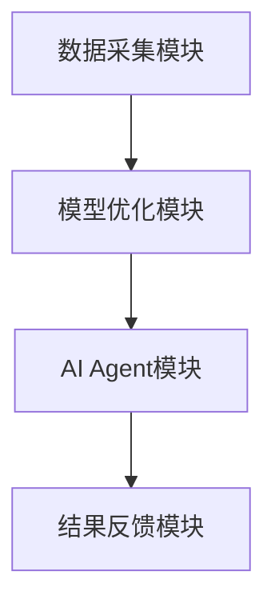
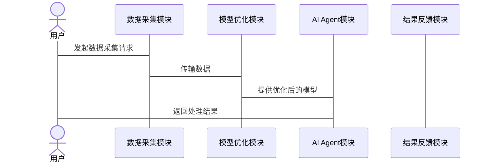

                 


# AI Agent的边缘计算优化：将LLM部署到资源受限设备

> 关键词：AI Agent，边缘计算，大语言模型，LLM，资源受限设备，模型优化

> 摘要：本文详细探讨了将大语言模型（LLM）部署到资源受限设备上的挑战与解决方案，重点介绍了AI Agent在边缘计算中的优化策略，包括模型压缩、分布式计算和隐私保护等关键技术。

---

# 第一部分: AI Agent与边缘计算的背景与核心概念

## 第1章: 引言：AI Agent与边缘计算的结合

### 1.1 问题背景与意义

#### 1.1.1 边缘计算的定义与特点
边缘计算是一种分布式计算范式，将计算能力从云端转移到靠近数据源的边缘设备。其特点包括低延迟、高实时性、高效数据处理和本地化决策。

#### 1.1.2 资源受限设备的挑战
边缘设备通常具有计算能力有限、内存不足、存储空间小等限制，这使得直接部署大型模型变得困难。

#### 1.1.3 AI Agent在边缘计算中的作用
AI Agent作为智能决策者，在边缘环境中能够实时处理数据，提供高效、个性化的服务，优化资源利用。

### 1.2 LLM部署的背景与需求

#### 1.2.1 大语言模型的定义与特点
大语言模型（LLM）是基于大量数据训练的深度学习模型，具有强大的自然语言处理能力，广泛应用于文本生成、问答系统等领域。

#### 1.2.2 边缘计算中部署LLM的意义
将LLM部署到边缘设备可以实现本地化的智能服务，减少对云端的依赖，提升响应速度和隐私安全性。

#### 1.2.3 当前LLM部署的主要挑战
计算资源不足、模型体积过大、通信延迟、能源消耗等问题限制了LLM在边缘设备上的应用。

### 1.3 本书的目标与结构

#### 1.3.1 本书的核心目标
探讨如何优化AI Agent在边缘设备上的部署，解决LLM在资源受限环境中的应用问题。

#### 1.3.2 本书的主要内容概述
涵盖边缘计算背景、AI Agent与边缘计算的核心概念、模型优化算法、系统架构设计、项目实战和最佳实践。

#### 1.3.3 本书的读者群体
适合对AI Agent和边缘计算感兴趣的开发者、研究人员和相关领域的技术爱好者。

---

## 第2章: AI Agent与边缘计算的核心概念

### 2.1 AI Agent的定义与特点

#### 2.1.1 AI Agent的基本概念
AI Agent是一个智能实体，能够感知环境、自主决策并执行任务，具有智能性、反应性和社会性。

#### 2.1.2 AI Agent的核心属性与特征
- **智能性**：通过传感器和数据进行分析和推理。
- **反应性**：能够实时响应环境变化。
- **社会性**：能够与其他系统或用户进行交互。

#### 2.1.3 AI Agent与传统代理的区别
AI Agent结合了AI技术，能够执行更复杂的任务，具有更强的自主决策能力。

### 2.2 边缘计算的定义与架构

#### 2.2.1 边缘计算的定义
边缘计算是一种分布式计算模式，将数据处理和存储功能从云端移到靠近数据源的边缘设备。

#### 2.2.2 边缘计算的架构特点
- **分布式架构**：数据在边缘端进行处理，减少云端依赖。
- **低延迟**：边缘计算能够快速响应，适用于实时性要求高的场景。
- **高效数据处理**：边缘设备能够进行数据清洗和初步分析。

#### 2.2.3 边缘计算与云计算的对比

| 特性                | 边缘计算                     | 云计算                       |
|---------------------|------------------------------|------------------------------|
| 数据处理位置        | 边缘设备                     | 云端                        |
| 延迟                | 低延迟                      | 高延迟                      |
| 网络依赖            | 较低                        | 较高                        |
| 适用场景            | 实时性高的边缘场景           | 大数据处理和存储             |

### 2.3 AI Agent与边缘计算的结合

#### 2.3.1 AI Agent在边缘计算中的应用场景
- **智能监控**：实时分析视频流，识别异常情况。
- **工业自动化**：在工厂中部署AI Agent进行设备监控和预测维护。
- **智能家居**：通过AI Agent实现家电的智能控制和交互。

#### 2.3.2 边缘计算对AI Agent性能的影响
- **计算资源限制**：边缘设备的计算能力有限，影响AI Agent的性能。
- **网络条件**：网络不稳定可能导致AI Agent无法及时与云端通信，影响决策能力。

#### 2.3.3 AI Agent与边缘计算的结合方式
通过优化算法和系统架构设计，AI Agent能够在边缘设备上高效运行，充分利用边缘计算的优势。

---

## 第3章: 边缘计算环境下的模型优化算法

### 3.1 模型剪枝算法

#### 3.1.1 模型剪枝的定义与原理
模型剪枝是一种减少模型复杂度的技术，通过删除冗余的神经元或层来降低计算量。

#### 3.1.2 模型剪枝的步骤
1. **训练模型**：先在充足的数据上训练一个大型模型。
2. **识别冗余部分**：通过评估每个神经元的重要性，识别冗余部分。
3. **剪枝操作**：删除冗余部分，重新训练模型以保持准确性。

#### 3.1.3 模型剪枝的实现
使用Python代码实现模型剪枝，通过评估损失函数的变化来确定冗余部分。

```python
def model_prune(model, prune_rate):
    # 识别冗余部分
    importance = get_importance(model)
    # 删除冗余部分
    remove_neurons(importance, prune_rate)
    # 重新训练模型
    model.train(data)
```

### 3.2 模型量化算法

#### 3.2.1 模型量化的定义与原理
模型量化是将模型中的浮点数参数转换为低精度整数，以减少存储空间和计算时间。

#### 3.2.2 模型量化的实现步骤
1. **参数分析**：分析模型参数的分布，确定量化位数。
2. **参数转换**：将浮点数参数转换为低精度整数。
3. **模型校准**：通过微调模型，确保量化后的模型准确性。

#### 3.2.3 模型量化的代码实现
```python
def model_quantization(model, bits):
    # 分析参数分布
    analyze_parameters(model)
    # 转换为低精度整数
    quantize_parameters(bits)
    # 校准模型
    model.calibrate(data)
```

### 3.3 模型蒸馏算法

#### 3.3.1 模型蒸馏的定义与原理
模型蒸馏是一种通过小模型学习大模型知识的技术，通过知识蒸馏减少模型大小。

#### 3.3.2 模型蒸馏的实现步骤
1. **教师模型训练**：训练一个大型教师模型。
2. **学生模型训练**：通过教师模型的软标签指导学生模型学习。
3. **模型优化**：调整蒸馏参数，优化学生模型性能。

#### 3.3.3 模型蒸馏的代码实现
```python
def model_distillation(teacher_model, student_model, data):
    # 教师模型生成软标签
    teacher_logits = teacher_model(data)
    # 学生模型学习软标签
    student_logits = student_model(data)
    # 计算蒸馏损失
    distillation_loss = distillation_criterion(teacher_logits, student_logits)
    # 优化模型
    optimizer.zero_grad()
    distillation_loss.backward()
    optimizer.step()
```

---

## 第4章: 系统架构设计

### 4.1 系统功能模块设计

#### 4.1.1 系统功能模块
- **数据采集模块**：负责从边缘设备采集数据。
- **模型优化模块**：对模型进行剪枝、量化等优化。
- **AI Agent模块**：处理数据并生成决策。
- **结果反馈模块**：将处理结果反馈给用户或设备。

#### 4.1.2 功能模块交互流程
1. 数据采集模块收集数据并传输给模型优化模块。
2. 模型优化模块对模型进行优化，生成轻量化模型。
3. AI Agent模块利用优化后的模型处理数据，生成决策。
4. 结果反馈模块将结果传输给用户或设备。

### 4.2 系统架构图



### 4.3 系统接口设计

#### 4.3.1 数据采集接口
```python
def collect_data():
    # 采集数据
    data = sensor.read()
    return data
```

#### 4.3.2 模型优化接口
```python
def optimize_model(model):
    # 执行模型优化
    pruned_model = prune_model(model)
    return pruned_model
```

### 4.4 系统交互流程图



---

## 第5章: 项目实战

### 5.1 环境安装与配置

#### 5.1.1 安装依赖
```bash
pip install torch numpy matplotlib
```

#### 5.1.2 环境配置
配置本地开发环境，确保硬件资源充足，网络连接稳定。

### 5.2 系统核心实现

#### 5.2.1 数据采集实现
```python
import torch
def collect_data():
    # 采集数据
    data = torch.randn(100, 10)
    return data
```

#### 5.2.2 模型优化实现
```python
def prune_model(model):
    # 模型剪枝
    import torch.nn as nn
    import torch.nn.utils.prune as prune
    # 剪枝操作
    prune.l1_unstructured(model, pattern=prune.Linear, amount=0.2)
    return model
```

#### 5.2.3 AI Agent实现
```python
class AIAgent:
    def __init__(self, model):
        self.model = model
    def process_data(self, data):
        # 处理数据
        output = self.model(data)
        return output
```

### 5.3 实际案例分析

#### 5.3.1 案例介绍
在智能家居场景中，部署一个AI Agent，用于实时处理用户的语音指令。

#### 5.3.2 案例实现
```python
# 初始化模型
model = torch.nn.Sequential(
    torch.nn.Linear(10, 5),
    torch.nn.ReLU(),
    torch.nn.Linear(5, 2)
)
# 模型优化
optimized_model = prune_model(model)
# 初始化AI Agent
agent = AIAgent(optimized_model)
# 处理数据
data = collect_data()
result = agent.process_data(data)
```

### 5.4 项目总结与优化

#### 5.4.1 项目总结
通过本项目，展示了如何在边缘设备上部署优化后的AI Agent，实现高效的数据处理和智能决策。

#### 5.4.2 进一步优化
可以尝试结合多种优化算法，进一步提升模型性能和部署效率。

---

## 第6章: 最佳实践与总结

### 6.1 最佳实践

#### 6.1.1 模型优化建议
- 选择适合的优化算法，如剪枝、量化等。
- 在实际应用中，结合模型性能和资源限制进行权衡。

#### 6.1.2 系统设计建议
- 合理设计系统架构，确保模块间的高效交互。
- 注重系统可扩展性和可维护性。

### 6.2 小结与展望

#### 6.2.1 本书的核心内容回顾
详细讲解了AI Agent在边缘计算中的优化策略，包括模型优化算法和系统架构设计。

#### 6.2.2 未来研究方向
未来可以进一步研究更高效的优化算法，探索AI Agent在更多边缘场景中的应用。

### 6.3 注意事项与拓展阅读

#### 6.3.1 注意事项
- 模型优化需要在保证性能的前提下进行。
- 边缘设备的网络条件可能影响AI Agent的性能。

#### 6.3.2 拓展阅读
推荐阅读相关领域的最新论文和技术博客，了解前沿技术和发展趋势。

---

# 结语

通过本文的详细讲解，读者可以深入了解如何将大语言模型部署到资源受限的边缘设备上，并通过优化算法和系统设计提升AI Agent的性能和效率。希望本文能为相关领域的研究和实践提供有价值的参考。

