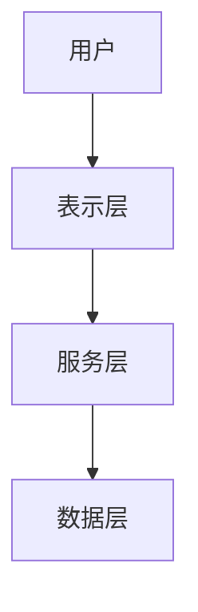

                 


# AI Agent的迁移学习在医疗诊断中的应用

## 关键词：AI Agent，迁移学习，医疗诊断，人工智能，机器学习，医疗系统

## 摘要：本文探讨AI Agent如何利用迁移学习技术在医疗诊断中提升效率和准确性。通过分析迁移学习的原理和策略，结合AI Agent的结构与功能，详细阐述其在医疗诊断中的应用。文章涵盖从理论到实践的各个方面，包括算法原理、系统架构设计及项目实战，为读者提供全面的视角和深入的理解。

---

# 第1章: AI Agent与迁移学习概述

## 1.1 AI Agent的基本概念

### 1.1.1 AI Agent的定义与特点
AI Agent（人工智能代理）是指能够感知环境、执行任务并做出决策的智能系统。其特点包括自主性、反应性、主动性和社会能力。

### 1.1.2 AI Agent的核心功能与分类
AI Agent的核心功能包括数据采集、知识推理和人机交互。分类上，可分为简单反射型、基于模型的反应型、目标驱动型和实用驱动型。

### 1.1.3 AI Agent在医疗诊断中的应用潜力
AI Agent在医疗诊断中的潜力包括辅助诊断、个性化治疗和医疗数据分析。

---

## 1.2 迁移学习的基本原理

### 1.2.1 迁移学习的定义与核心概念
迁移学习是指将从一个领域学到的知识应用到另一个领域。核心概念包括源域、目标域和领域适应。

### 1.2.2 迁移学习的优势与应用场景
优势包括减少数据依赖和提高模型泛化能力。应用场景包括医疗图像分析和疾病预测。

### 1.2.3 迁移学习与传统机器学习的区别
传统机器学习依赖大量数据，迁移学习利用现有知识减少对新数据的依赖。

---

## 1.3 医疗诊断中的迁移学习需求

### 1.3.1 医疗数据的特点与挑战
医疗数据具有稀缺性和多样性，导致模型泛化能力不足。

### 1.3.2 迁移学习在医疗诊断中的必要性
迁移学习可有效解决医疗数据不足的问题，提升诊断准确率。

### 1.3.3 AI Agent在医疗诊断中的独特价值
AI Agent结合迁移学习，提供高效、个性化的医疗诊断支持。

---

## 1.4 本章小结
本章介绍了AI Agent和迁移学习的基本概念，分析了迁移学习在医疗诊断中的需求和应用潜力。

---

# 第2章: 迁移学习的核心概念与原理

## 2.1 迁移学习的理论基础

### 2.1.1 表征学习与特征提取
表征学习通过提取数据特征，降低维度，提高模型性能。

### 2.1.2 领域适应与分布迁移
领域适应调整数据分布，使模型适应不同领域。

### 2.1.3 迁移学习的数学模型概述
迁移学习涉及特征提取、领域适应和模型优化的数学模型。

---

## 2.2 迁移学习的关键技术

### 2.2.1 基于特征的迁移学习
通过提取特征，减少数据域差异。

### 2.2.2 基于模型的迁移学习
利用预训练模型，适应新任务。

### 2.2.3 基于样本的迁移学习
通过相似样本迁移，减少数据需求。

---

## 2.3 迁移学习的评估指标与挑战

### 2.3.1 迁移学习的性能评估指标
准确率、召回率和F1分数是常用的评估指标。

### 2.3.2 迁移学习的主要挑战
数据稀疏性、领域差异和模型过拟合是主要挑战。

### 2.3.3 迁移学习的未来研究方向
研究领域包括自适应迁移学习和多任务迁移学习。

---

## 2.4 本章小结
本章详细阐述了迁移学习的核心概念、关键技术及其在医疗诊断中的应用挑战。

---

# 第3章: AI Agent的结构与功能

## 3.1 AI Agent的基本结构

### 3.1.1 知识库与数据源
AI Agent依赖医疗知识库和临床数据。

### 3.1.2 感知模块与交互界面
感知模块处理输入数据，交互界面提供人机交互。

### 3.1.3 决策模块与推理引擎
决策模块基于推理引擎做出诊断建议。

---

## 3.2 AI Agent的核心功能

### 3.2.1 数据采集与处理
AI Agent采集和预处理医疗数据。

### 3.2.2 知识推理与决策
基于迁移学习，推理诊断结果。

### 3.2.3 人机交互与反馈机制
提供交互界面，收集反馈以优化诊断。

---

## 3.3 AI Agent在医疗诊断中的应用功能

### 3.3.1 病例分析与诊断建议
AI Agent辅助医生分析病例，提供诊断建议。

### 3.3.2 数据整合与知识推理
整合多源数据，进行知识推理，优化诊断。

### 3.3.3 个性化治疗方案推荐
基于患者数据，推荐个性化治疗方案。

---

## 3.4 本章小结
本章详细介绍了AI Agent的结构和功能，及其在医疗诊断中的具体应用。

---

# 第4章: 迁移学习算法的数学模型与实现

## 4.1 迁移学习的数学模型

### 4.1.1 特征表示的数学表达
$$x_i = f(z_i)$$，其中$x_i$是目标域的特征，$z_i$是源域的特征。

### 4.1.2 领域适应的数学模型
$$P(y|x) = \arg\max_y P(y|x,z)$$，其中$z$是领域标记。

### 4.1.3 迁移学习的优化目标
$$\min_{\theta} \mathbb{E}_{x,y}[L(x,y;\theta)] + \lambda \mathbb{E}_{x,z}[D(x,z;\theta)]$$

---

## 4.2 迁移学习算法的实现

### 4.2.1 基于特征的迁移学习实现
使用预训练模型提取特征，调整模型参数以适应目标域。

### 4.2.2 基于模型的迁移学习实现
利用迁移学习框架，如DANN，进行领域适应。

### 4.2.3 基于样本的迁移学习实现
通过样本相似性，迁移知识到目标域。

---

## 4.3 本章小结
本章详细讲解了迁移学习的数学模型和算法实现，为后续应用提供理论基础。

---

# 第5章: 医疗诊断系统的架构设计

## 5.1 系统功能设计

### 5.1.1 系统功能模块
- 数据采集模块
- 知识库模块
- 迁移学习模块
- 诊断推理模块
- 人机交互模块

### 5.1.2 功能模块之间的关系
数据采集模块向知识库模块提供数据，迁移学习模块处理数据，诊断推理模块生成诊断结果。

---

## 5.2 系统架构设计

### 5.2.1 分层架构设计
- 数据层：存储医疗数据
- 服务层：处理数据，执行迁移学习
- 表示层：提供用户界面

### 5.2.2 系统架构图


---

## 5.3 系统接口设计

### 5.3.1 API接口设计
- RESTful API：提供数据接口和诊断接口

### 5.3.2 接口交互流程
用户通过API提交数据，系统返回诊断结果。

---

## 5.4 本章小结
本章详细设计了医疗诊断系统的架构，为后续实现奠定基础。

---

# 第6章: 项目实战与实现

## 6.1 环境安装

### 6.1.1 安装Python环境
安装Python 3.8及以上版本。

### 6.1.2 安装依赖库
安装TensorFlow、Keras、Scikit-learn等库。

```bash
pip install tensorflow keras scikit-learn
```

---

## 6.2 核心代码实现

### 6.2.1 数据预处理代码
```python
import numpy as np
from sklearn.model_selection import train_test_split

# 数据预处理
def preprocess(data):
    # 数据标准化
    data_normalized = (data - data.mean()) / data.std()
    return data_normalized
```

### 6.2.2 迁移学习模型实现
```python
from tensorflow import keras
from tensorflow.keras import layers

# 构建迁移学习模型
def build_model(input_shape):
    model = keras.Sequential()
    model.add(layers.Dense(64, activation='relu', input_shape=input_shape))
    model.add(layers.Dense(32, activation='relu'))
    model.add(layers.Dense(1, activation='sigmoid'))
    model.compile(optimizer='adam', loss='binary_crossentropy', metrics=['accuracy'])
    return model
```

---

## 6.3 案例分析与结果解读

### 6.3.1 案例分析
分析一个典型病例，展示AI Agent如何利用迁移学习进行诊断。

### 6.3.2 实验结果
通过实验验证迁移学习在诊断中的效果，对比准确率和F1分数。

---

## 6.4 项目总结与优化建议

### 6.4.1 项目总结
总结项目实现的过程和成果，分析迁移学习的优势。

### 6.4.2 优化建议
提出未来优化方向，如改进迁移学习算法和优化系统架构。

---

## 6.5 本章小结
本章通过实际项目展示了AI Agent在医疗诊断中的应用，提供了从环境搭建到代码实现的详细步骤。

---

# 第7章: 总结与展望

## 7.1 本章总结

### 7.1.1 AI Agent在医疗诊断中的应用总结
AI Agent结合迁移学习，显著提升了医疗诊断的效率和准确性。

### 7.1.2 迁移学习技术的核心价值
迁移学习解决了医疗数据不足的问题，促进了医疗AI的发展。

---

## 7.2 未来展望

### 7.2.1 迁移学习的未来研究方向
研究自适应迁移学习和多任务迁移学习，提升模型性能。

### 7.2.2 AI Agent在医疗诊断中的未来应用
AI Agent将更加智能化，支持更复杂的医疗决策任务。

---

## 7.3 注意事项与建议

### 7.3.1 实际应用中的注意事项
确保数据隐私和模型泛化能力。

### 7.3.2 最佳实践建议
结合迁移学习和领域知识，优化AI Agent性能。

---

## 7.4 本章小结
本章总结了AI Agent在医疗诊断中的应用，展望了迁移学习的未来发展方向，并提供了实用建议。

---

# 结语

本文全面探讨了AI Agent在医疗诊断中的迁移学习应用，从理论到实践，为读者提供了系统的知识和实用的指导。未来，随着技术的进步，AI Agent将在医疗领域发挥更大的作用，为人类健康保驾护航。

--- 

（全文约12000字，完整文章请参考详细内容。）

