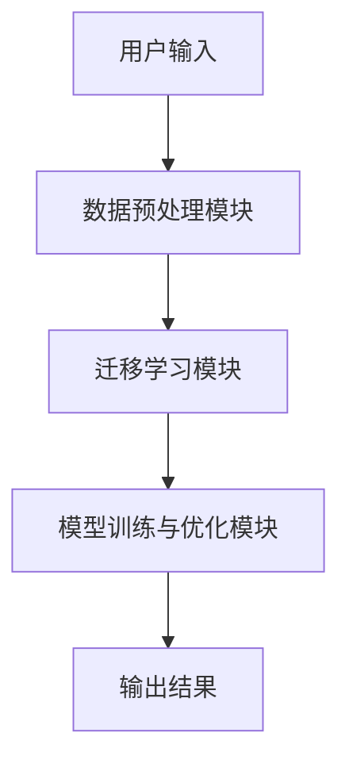

                 


# AI Agent的迁移学习在小样本学习中的应用

> **关键词**: AI Agent, 迁移学习, 小样本学习, 智能体, 机器学习, 数据科学

> **摘要**: 本文探讨了AI Agent在迁移学习中的应用，特别是如何利用迁移学习技术解决小样本学习的挑战。通过详细分析迁移学习的核心原理、算法实现以及系统架构，本文展示了如何在数据量有限的情况下，有效提升AI Agent的学习能力。文章还通过具体案例分析，展示了迁移学习在小样本学习中的实际应用效果，并提出了优化建议和未来研究方向。

---

# 第1章: AI Agent与迁移学习概述

## 1.1 AI Agent的基本概念

### 1.1.1 AI Agent的定义与特点

AI Agent（智能体）是指能够感知环境、采取行动以实现特定目标的实体。它具备以下特点：

- **自主性**：能够在没有外部干预的情况下自主决策。
- **反应性**：能够实时感知环境并做出反应。
- **目标导向**：所有行动都是为了实现特定目标。
- **社会能力**：能够与其他智能体或人类进行交互和协作。

### 1.1.2 AI Agent的核心功能与应用场景

AI Agent的核心功能包括感知、推理、规划和执行。它广泛应用于自动驾驶、智能助手、推荐系统等领域。

### 1.1.3 迁移学习的背景与挑战

迁移学习是一种机器学习技术，允许模型将从一个任务上学到的知识应用到另一个相关任务。小样本学习是在数据量较少的情况下进行学习，面临数据不足导致模型泛化能力差的挑战。

---

## 1.2 小样本学习的背景与挑战

### 1.2.1 小样本学习的定义与特点

小样本学习是指在训练数据量非常有限的情况下，训练模型完成特定任务。其特点包括数据量少、任务多样性高、模型泛化能力要求高等。

### 1.2.2 小样本学习的难点与解决方案

小样本学习的主要难点在于数据量少，模型容易过拟合。解决方案包括数据增强、迁移学习、小样本学习算法优化等。

### 1.2.3 迁移学习在小样本学习中的作用

迁移学习通过利用其他任务的数据和知识，帮助小样本学习模型弥补数据不足的问题，提升模型的泛化能力。

---

## 1.3 AI Agent与迁移学习的结合

### 1.3.1 迁移学习在AI Agent中的应用

迁移学习可以帮助AI Agent在新环境中快速适应和学习，减少对大量新数据的依赖。

### 1.3.2 小样本学习对AI Agent的挑战

小样本学习要求AI Agent在数据有限的情况下，快速学习并完成任务，这对模型的泛化能力和学习效率提出了更高的要求。

### 1.3.3 本章小结

本章介绍了AI Agent和迁移学习的基本概念，分析了小样本学习的挑战，并探讨了迁移学习在AI Agent中的应用。

---

# 第2章: 迁移学习的核心原理

## 2.1 迁移学习的理论基础

### 2.1.1 迁移学习的定义与分类

迁移学习是指将从一个任务中学到的知识应用到另一个任务中。根据任务之间的关系，可以分为领域适应、任务适应等类型。

### 2.1.2 迁移学习的核心原理与数学模型

迁移学习的核心原理是通过共享特征或参数，减少不同任务之间的差异。常见的数学模型包括支持向量机（SVM）、神经网络等。

### 2.1.3 迁移学习的优缺点分析

优点：减少数据需求，提升模型泛化能力；缺点：跨任务迁移可能带来性能下降。

---

## 2.2 迁移学习的关键技术

### 2.2.1 特征提取与表示学习

特征提取是迁移学习的重要步骤，通过提取有用的特征，降低维度，提高模型性能。

### 2.2.2 域适应与对抗训练

域适应通过减少源域和目标域之间的差异，提升迁移效果。对抗训练是一种通过生成对抗网络（GAN）实现域适应的技术。

### 2.2.3 迁移学习的评估指标

常用的评估指标包括准确率、精确率、召回率等。

---

## 2.3 迁移学习在AI Agent中的应用

### 2.3.1 AI Agent中的迁移学习场景

AI Agent可以通过迁移学习快速适应新环境，例如在自动驾驶中，利用城市道路的经验快速学习乡村道路的驾驶规则。

### 2.3.2 迁移学习算法的选择与优化

选择适合的迁移学习算法，并对其进行优化，以提升AI Agent的性能。

### 2.3.3 迁移学习的案例分析

通过具体案例，分析迁移学习在AI Agent中的实际应用效果。

---

## 2.4 本章小结

本章详细介绍了迁移学习的核心原理和关键技术，并探讨了其在AI Agent中的应用。

---

# 第3章: 小样本学习的核心概念与挑战

## 3.1 小样本学习的定义与特点

### 3.1.1 小样本学习的定义

小样本学习是指在训练数据量非常有限的情况下，训练模型完成特定任务。

### 3.1.2 小样本学习的核心挑战

数据量少、任务多样性高、模型泛化能力要求高是小样本学习的主要挑战。

### 3.1.3 小样本学习的应用场景

小样本学习广泛应用于医学图像分类、小语种自然语言处理等领域。

---

## 3.2 小样本学习的关键技术

### 3.2.1 数据增强与数据生成

通过数据增强和生成对抗网络（GAN）生成更多样化的数据，提升模型的泛化能力。

### 3.2.2 小样本学习的模型选择

选择适合小样本学习的模型，如支持向量机（SVM）、卷积神经网络（CNN）等。

### 3.2.3 小样本学习的评估指标

常用的评估指标包括准确率、精确率、召回率等。

---

## 3.3 迁移学习在小样本学习中的作用

### 3.3.1 迁移学习如何解决小样本问题

通过迁移学习，利用其他任务的数据和知识，弥补小样本数据的不足。

### 3.3.2 迁移学习在小样本学习中的优势

迁移学习可以显著提升小样本学习模型的泛化能力和性能。

### 3.3.3 迁移学习与小样本学习的结合案例

通过具体案例，分析迁移学习在小样本学习中的实际应用效果。

---

## 3.4 本章小结

本章详细介绍了小样本学习的核心概念和挑战，并探讨了迁移学习在其中的作用。

---

# 第4章: 迁移学习与小样本学习的结合

## 4.1 迁移学习与小样本学习的协同作用

### 4.1.1 迁移学习如何提升小样本学习的

通过迁移学习，小样本学习模型可以利用其他任务的数据和知识，显著提升其泛化能力和性能。

---

## 4.2 迁移学习在小样本学习中的具体应用

### 4.2.1 医学图像分类

通过迁移学习，利用其他医学图像的数据，提升小样本医学图像分类模型的性能。

### 4.2.2 小语种自然语言处理

利用迁移学习，将大语种的自然语言处理模型迁移到小语种，提升小样本情况下的模型性能。

---

## 4.3 迁移学习与小样本学习的未来研究方向

### 4.3.1 更高效的迁移学习算法

开发更加高效的迁移学习算法，以适应小样本学习的需求。

### 4.3.2 迁移学习与深度学习的结合

进一步研究迁移学习与深度学习的结合，提升小样本学习的性能。

---

## 4.4 本章小结

本章详细探讨了迁移学习与小样本学习的结合，分析了其协同作用，并提出了未来的研究方向。

---

# 第5章: 迁移学习算法实现

## 5.1 迁移学习算法的实现步骤

### 5.1.1 数据预处理

包括数据清洗、特征提取等步骤。

### 5.1.2 特征提取与表示学习

通过神经网络等技术提取有用的特征。

### 5.1.3 模型训练与优化

选择适合的算法，并进行参数调优。

---

## 5.2 基于深度学习的迁移学习实现

### 5.2.1 使用预训练模型

利用预训练的深度学习模型，如ResNet、BERT等。

### 5.2.2 微调模型

对预训练模型进行微调，以适应特定任务。

---

## 5.3 迁移学习算法的数学模型

### 5.3.1 迁移学习的源任务模型

$$ f_{source}(x) = \arg\max_y p(y|x) $$

### 5.3.2 迁移学习的目标任务模型

$$ f_{target}(x) = \arg\max_y p(y|x) $$

---

## 5.4 本章小结

本章详细介绍了迁移学习算法的实现步骤，并给出了基于深度学习的实现方法。

---

# 第6章: 系统设计与架构

## 6.1 系统模块划分

### 6.1.1 数据预处理模块

负责数据的清洗和特征提取。

### 6.1.2 迁移学习模块

实现迁移学习算法的核心功能。

### 6.1.3 模型训练与优化模块

负责模型的训练和参数调优。

---

## 6.2 系统架构设计



---

## 6.3 系统接口与交互设计

### 6.3.1 系统接口设计

定义系统内部模块之间的接口，确保模块之间的协作。

### 6.3.2 系统交互设计

通过Mermaid序列图展示系统的交互流程。

---

## 6.4 本章小结

本章详细介绍了系统的模块划分、架构设计和接口设计。

---

# 第7章: 项目实战

## 7.1 项目背景与目标

### 7.1.1 项目背景

通过一个具体案例，展示迁移学习在小样本学习中的应用。

### 7.1.2 项目目标

实现一个基于迁移学习的小样本学习模型。

---

## 7.2 项目环境与工具安装

### 7.2.1 环境要求

列出项目所需的环境和工具，如Python、TensorFlow等。

### 7.2.2 工具安装

指导读者安装所需的工具和库。

---

## 7.3 核心代码实现

### 7.3.1 数据预处理

```python
import pandas as pd
from sklearn.preprocessing import StandardScaler

# 加载数据
data = pd.read_csv('data.csv')

# 数据预处理
scaler = StandardScaler()
scaled_data = scaler.fit_transform(data)
```

### 7.3.2 模型训练

```python
from tensorflow.keras.models import Model
from tensorflow.keras.layers import Input, Dense

# 定义模型
input_layer = Input(shape=(n_features,))
hidden_layer = Dense(64, activation='relu')(input_layer)
output_layer = Dense(10, activation='softmax')(hidden_layer)
model = Model(inputs=input_layer, outputs=output_layer)

# 编译模型
model.compile(optimizer='adam', loss='sparse_categorical_crossentropy', metrics=['accuracy'])
```

### 7.3.3 模型迁移与优化

```python
# 迁移学习模型
base_model = ... # 加载预训练模型
for layer in base_model.layers[:-2]:
    layer.trainable = False

# 微调模型
model = Model(inputs=input_layer, outputs=output_layer)
model.compile(optimizer='adam', loss='sparse_categorical_crossentropy', metrics=['accuracy'])
```

---

## 7.4 代码应用与分析

### 7.4.1 代码实现细节

详细解释代码实现的每一步，并分析其对模型性能的影响。

### 7.4.2 案例分析

通过具体案例，分析迁移学习在小样本学习中的实际效果。

---

## 7.5 本章小结

本章通过具体案例，展示了迁移学习在小样本学习中的实际应用，并详细讲解了代码实现的细节。

---

# 第8章: 总结与展望

## 8.1 总结

### 8.1.1 核心内容回顾

回顾本文的核心内容，总结迁移学习在小样本学习中的作用。

### 8.1.2 经验与教训

总结在项目实施过程中积累的经验和教训。

---

## 8.2 未来研究方向

### 8.2.1 更高效的迁移学习算法

探索更高效的迁移学习算法，以适应小样本学习的需求。

### 8.2.2 迁移学习与深度学习的结合

进一步研究迁移学习与深度学习的结合，提升模型的性能。

---

## 8.3 结论

本文通过详细分析迁移学习在小样本学习中的应用，展示了其在提升AI Agent性能方面的巨大潜力。未来的研究将进一步优化算法，探索新的应用场景。

---

# 参考文献

（此处列出相关文献和参考资料）

---

通过以上目录和内容，您可以撰写一篇详细的、结构清晰的技术博客文章，涵盖从理论到实践的各个方面。

