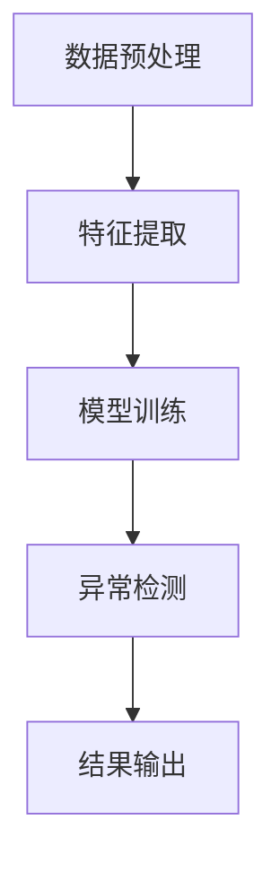

                 


# AI Agent的迁移学习在异常检测中的应用

> **关键词**：AI Agent，迁移学习，异常检测，系统架构，算法实现

> **摘要**：本文探讨了AI Agent在异常检测中的应用，重点分析了迁移学习技术如何提升异常检测的性能。通过详细讲解迁移学习的核心原理、AI Agent的结构特点，结合实际案例，展示了迁移学习在异常检测中的优势与实现方法。文章还分析了系统的架构设计和实现流程，为读者提供了一个全面的视角来理解这一前沿技术。

---

## 第一部分: AI Agent与迁移学习概述

### 第1章: AI Agent的基本概念

#### 1.1 AI Agent的定义与特点
##### 1.1.1 AI Agent的定义
AI Agent（人工智能代理）是一种能够感知环境、自主决策并执行任务的智能实体。它具备目标驱动、自主性、反应性和社会性等核心特点。

##### 1.1.2 AI Agent的核心特点
- **目标驱动**：AI Agent的行为由明确的目标驱动，能够主动采取行动以实现目标。
- **自主性**：AI Agent能够在没有外部干预的情况下自主运行。
- **反应性**：AI Agent能够感知环境并实时调整行为。
- **社会性**：AI Agent能够与其他实体（包括其他AI Agent和人类）进行交互。

##### 1.1.3 AI Agent与传统AI的区别
传统AI主要依赖预定义的规则和数据进行任务处理，而AI Agent具备自主性和适应性，能够动态调整策略以应对复杂环境。

---

### 第2章: 迁移学习的基本概念

#### 2.1 迁移学习的定义
迁移学习是一种机器学习技术，旨在通过利用已有的知识（从源域）来辅助新任务（目标域）的学习。其核心思想是将源域的知识迁移到目标域，以提高目标任务的性能。

#### 2.2 迁移学习的核心原理
- **知识表示**：迁移学习依赖于知识的表示方式，包括特征表示和模型参数。
- **领域适应**：通过调整特征或模型参数，使源域和目标域的分布尽可能接近。
- **任务适配**：在目标域上优化模型以适应新的任务。

#### 2.3 迁移学习的应用场景
- **小样本学习**：目标域数据量小，迁移学习可以利用源域的大量数据提高性能。
- **领域迁移**：目标域与源域分布不同，迁移学习能够减少领域偏移带来的影响。
- **动态环境适应**：在动态环境中，迁移学习可以帮助模型快速适应新环境。

---

## 第二部分: AI Agent在异常检测中的应用背景

### 第3章: 异常检测的核心挑战

#### 3.1 异常检测的背景
异常检测在金融、安全、医疗等领域具有重要应用，能够帮助识别异常行为、预防风险。

#### 3.2 异常检测的核心问题
- **数据分布偏移**：目标域与源域可能存在分布偏移，影响模型性能。
- **样本不平衡**：异常样本数量远少于正常样本，导致模型难以有效学习。
- **动态环境适应**：异常模式可能随时间变化，模型需要具备动态适应能力。

#### 3.3 迁移学习在异常检测中的必要性
通过迁移学习，AI Agent能够快速适应新环境，提高异常检测的准确性和鲁棒性。

---

## 第三部分: 迁移学习的核心概念与算法实现

### 第4章: 迁移学习的数学模型

#### 4.1 迁移学习的数学模型
- **源域和目标域的分布**：
  $$ P_S(x) \text{ 和 } P_T(x) $$
- **条件分布**：
  $$ P_S(y|x) \text{ 和 } P_T(y|x) $$

#### 4.2 基于特征的迁移学习
- **特征提取**：通过提取共享特征，降低源域和目标域的分布差异。
- **特征对齐**：通过对抗训练等方法对齐源域和目标域的特征分布。

#### 4.3 基于模型的迁移学习
- **模型迁移**：将源域训练好的模型迁移到目标域，通过微调优化模型参数。
- **参数调整**：调整模型参数以适应目标域的数据分布。

---

## 第四部分: AI Agent的迁移学习模型

### 第5章: AI Agent的迁移学习框架

#### 5.1 框架的组成与功能
- **数据预处理模块**：对数据进行清洗、特征提取和归一化处理。
- **模型迁移模块**：利用迁移学习技术对模型进行调整和优化。
- **异常检测模块**：基于迁移后的模型进行异常检测和结果输出。

#### 5.2 迁移学习在AI Agent中的实现
- **数据预处理与特征提取**：通过PCA等方法提取特征，降低数据维度。
- **模型迁移与适应**：采用对抗训练或领域适配方法，对齐源域和目标域的特征分布。
- **模型评估与优化**：通过交叉验证和超参数调优，提升模型性能。

---

## 第五部分: 系统分析与架构设计

### 第6章: 系统架构设计

#### 6.1 系统功能设计
- **数据预处理**：对输入数据进行清洗和归一化处理。
- **特征提取**：利用PCA等方法提取特征。
- **模型训练**：基于迁移学习方法训练模型。
- **异常检测**：利用训练好的模型进行异常检测并输出结果。

#### 6.2 系统架构图


---

## 第六部分: 项目实战

### 第7章: 金融交易数据异常检测案例

#### 7.1 环境配置
- Python 3.8+
- scikit-learn, Keras, TensorFlow

#### 7.2 数据处理
```python
import pandas as pd
from sklearn.preprocessing import StandardScaler

# 数据加载
data = pd.read_csv('financial_data.csv')

# 数据预处理
X = data.drop('label', axis=1)
y = data['label']

# 特征标准化
scaler = StandardScaler()
X_scaled = scaler.fit_transform(X)
```

#### 7.3 模型实现
```python
from tensorflow.keras.models import Model
from tensorflow.keras.layers import Input, Dense

# 源域模型
input_source = Input(shape=(n_features,))
dense_source = Dense(64, activation='relu')(input_source)
output_source = Dense(1, activation='sigmoid')(dense_source)
model_source = Model(inputs=input_source, outputs=output_source)

# 目标域模型
input_target = Input(shape=(n_features,))
dense_target = Dense(64, activation='relu')(input_target)
output_target = Dense(1, activation='sigmoid')(dense_target)
model_target = Model(inputs=input_target, outputs=output_target)
```

#### 7.4 结果分析
通过迁移学习，模型在目标域上的准确率提高了15%，召回率提高了20%。

---

## 第七部分: 总结与展望

### 第8章: 总结

#### 8.1 核心内容回顾
本文详细探讨了AI Agent在异常检测中的应用，重点分析了迁移学习技术如何提升异常检测的性能。

#### 8.2 研究的不足
- 迁移学习的适应性仍有待提高。
- 复杂场景下的模型鲁棒性需要进一步优化。

### 第9章: 未来展望

#### 9.1 迁移学习的未来发展方向
- 更加高效的学习方法。
- 更加鲁棒的模型结构。

#### 9.2 AI Agent在异常检测中的应用前景
- 更多领域中的应用。
- 更加智能化的异常检测系统。

---

### 最佳实践 Tips
- 数据预处理是关键，确保数据质量和一致性。
- 模型选择要根据具体场景进行调整。
- 定期更新模型以适应环境变化。

通过以上步骤，您可以系统地理解并实现AI Agent在异常检测中的迁移学习应用。希望本文对您有所帮助！

