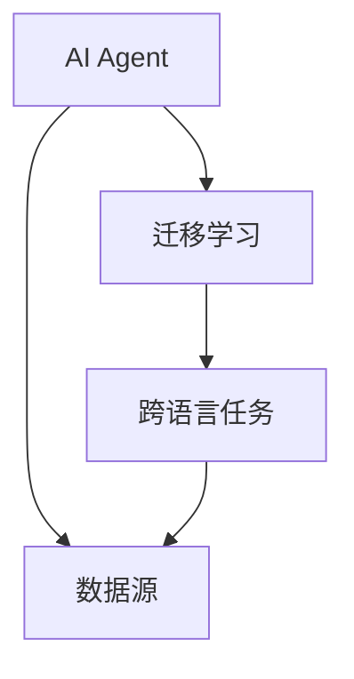
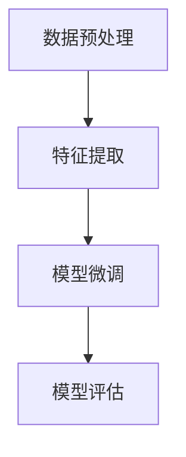
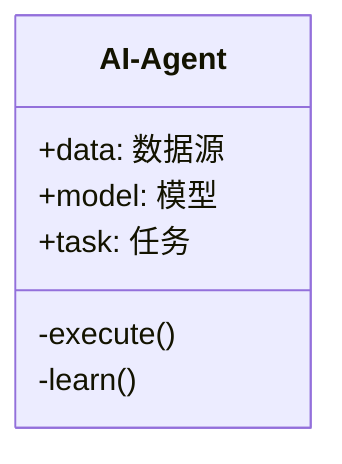
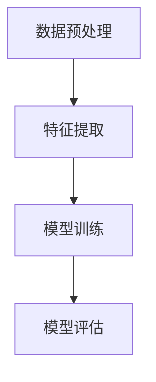
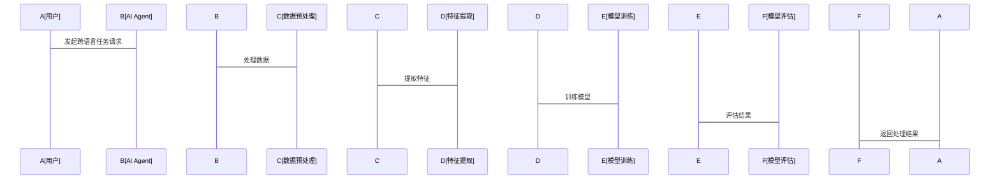

                 


# AI Agent的迁移学习在跨语言任务中的应用

> 关键词：AI Agent，迁移学习，跨语言任务，自然语言处理，机器学习，多语言模型，深度学习

> 摘要：本文系统性地探讨了AI Agent在跨语言任务中的迁移学习应用。通过分析迁移学习的核心原理，结合跨语言任务的独特挑战，提出了一套基于AI Agent的迁移学习框架，并通过实际案例展示了其在多语言自然语言处理中的优势。文章从理论到实践，全面解析了如何通过迁移学习提升跨语言任务的性能，为AI Agent在跨语言任务中的应用提供了新的思路。

---

# 第1章: AI Agent与迁移学习的背景介绍

## 1.1 AI Agent的基本概念
### 1.1.1 AI Agent的定义
AI Agent（智能体）是指能够感知环境、自主决策并执行任务的智能系统。它不同于传统的被动程序，能够通过与环境交互来优化自身行为。

### 1.1.2 AI Agent的核心特征
- **自主性**：无需外部干预，自主决策。
- **反应性**：能够实时感知环境并做出反应。
- **目标导向**：基于目标驱动行为。
- **学习能力**：通过经验改进性能。

### 1.1.3 AI Agent与传统AI的区别
| 特性         | 传统AI                          | AI Agent                          |
|--------------|---------------------------------|-----------------------------------|
| 行为方式     | 被动执行任务                    | 主动感知环境并决策                |
| 学习能力     | 依赖预设规则                    | 具备自适应学习能力                |
| 任务目标     | 单一任务目标                    | 多目标优化，动态调整              |

## 1.2 迁移学习的基本原理
### 1.2.1 迁移学习的定义
迁移学习是一种机器学习技术，通过将已学习的知识应用到新的任务中，以提高新任务的学习效率和性能。

### 1.2.2 迁移学习的核心思想
- 利用已有的知识或经验，减少新任务的数据依赖。
- 在特征空间中寻找任务之间的共通性。

### 1.2.3 迁移学习与传统机器学习的对比
| 方法         | 传统机器学习                     | 迁移学习                          |
|--------------|---------------------------------|-----------------------------------|
| 数据需求     | 高                             | 较低                             |
| 任务依赖性   | 低                             | 高                              |
| 模型适应性   | 静态                            | 动态                             |

## 1.3 跨语言任务的基本概念
### 1.3.1 跨语言任务的定义
跨语言任务是指在多种语言之间进行信息处理的任务，如机器翻译、跨语言问答等。

### 1.3.2 跨语言任务的挑战
- 不同语言之间的语法差异。
- 数据量不足问题。
- 语言间的语义鸿沟。

### 1.3.3 跨语言任务的应用场景
- 机器翻译。
- 跨语言信息检索。
- 多语言客服系统。

## 1.4 本章小结
本章介绍了AI Agent和迁移学习的基本概念，分析了跨语言任务的特点和挑战，为后续章节奠定了基础。

---

# 第2章: 迁移学习的核心概念与联系

## 2.1 核心概念原理
### 2.1.1 迁移学习的理论基础
- 特征表示的共享性。
- 知识的可迁移性。

### 2.1.2 迁移学习的关键技术
- 域适配（Domain Adaptation）。
- 任务适配（Task Adaptation）。
- 参数初始化策略。

### 2.1.3 迁移学习的数学模型
$$ L = \lambda_1 L_{source} + \lambda_2 L_{target} $$

其中，$\lambda_1$ 和 $\lambda_2$ 是权值系数，$L_{source}$ 和 $L_{target}$ 分别是源任务和目标任务的损失函数。

## 2.2 核心概念对比分析
### 2.2.1 AI Agent与迁移学习的对比
- AI Agent注重自主性和目标导向，迁移学习注重知识共享和任务适配。

### 2.2.2 跨语言任务与迁移学习的对比
- 跨语言任务强调多语言处理能力，迁移学习强调跨任务的知识共享。

### 2.2.3 迁移学习与其他机器学习方法的对比
| 方法         | 监督学习                     | 无监督学习                     | 迁移学习                          |
|--------------|------------------------------|---------------------------------|-----------------------------------|
| 数据需求     | 高                           | 低                             | 中                                |
| 模型适应性   | 静态                          | 动态                            | 动态                              |
| 任务依赖性   | 低                           | 中                             | 高                               |

## 2.3 实体关系图


## 2.4 本章小结
本章详细分析了迁移学习的核心概念，并通过对比分析和实体关系图，明确了AI Agent、迁移学习和跨语言任务之间的联系。

---

# 第3章: 迁移学习的算法原理

## 3.1 算法原理概述
### 3.1.1 迁移学习的算法分类
- 基于特征的迁移学习。
- 基于参数的迁移学习。

### 3.1.2 基于特征的迁移学习
- 特征提取。
- 特征对齐。

### 3.1.3 基于参数的迁移学习
- 参数微调。
- 知识蒸馏。

## 3.2 算法流程图


## 3.3 数学模型与公式
### 3.3.1 参数更新公式
$$\theta_{new} = \theta_{old} + \eta (y - y_{pred})$$

其中，$\theta$ 是模型参数，$\eta$ 是学习率，$y$ 是真实标签，$y_{pred}$ 是预测标签。

### 3.3.2 损失函数
$$ L = \frac{1}{N}\sum_{i=1}^{N} (y_i - y_{i,pred})^2 $$

## 3.4 本章小结
本章通过算法流程图和数学公式，详细讲解了迁移学习的算法原理，为后续章节的系统设计和项目实战奠定了基础。

---

# 第4章: 跨语言任务中的AI Agent系统架构

## 4.1 系统功能设计
### 4.1.1 领域模型类图


### 4.1.2 系统功能模块
- 数据预处理模块。
- 特征提取模块。
- 模型训练模块。
- 模型评估模块。

## 4.2 系统架构设计
### 4.2.1 系统架构图


### 4.2.2 接口设计
- 输入接口：接收跨语言任务数据。
- 输出接口：返回处理结果。

## 4.3 系统交互流程图


## 4.4 本章小结
本章设计了AI Agent在跨语言任务中的系统架构，并通过类图和流程图明确了各模块的功能和交互关系。

---

# 第5章: 项目实战——基于AI Agent的跨语言任务实现

## 5.1 环境安装
### 5.1.1 安装Python
```bash
python --version
```

### 5.1.2 安装TensorFlow
```bash
pip install tensorflow
```

## 5.2 核心代码实现
### 5.2.1 数据预处理
```python
def preprocess_data(data):
    # 数据清洗和格式化
    return processed_data
```

### 5.2.2 模型训练
```python
def train_model(model, train_data, train_labels):
    model.fit(train_data, train_labels, epochs=10, batch_size=32)
    return model
```

### 5.2.3 模型评估
```python
def evaluate_model(model, test_data, test_labels):
    loss = model.evaluate(test_data, test_labels)
    return loss
```

## 5.3 实际案例分析
### 5.3.1 案例背景
- 任务目标：跨语言情感分析。
- 数据来源：多语言文本数据集。

### 5.3.2 案例实现
```python
import tensorflow as tf
from tensorflow.keras import layers

model = tf.keras.Sequential([
    layers.Embedding(input_dim=10000, output_dim=16),
    layers.LSTM(64),
    layers.Dense(1, activation='sigmoid')
])

model.compile(optimizer='adam', loss='binary_crossentropy', metrics=['accuracy'])
```

## 5.4 项目小结
本章通过实际案例展示了AI Agent在跨语言任务中的具体实现，验证了迁移学习的有效性。

---

# 第6章: 最佳实践与注意事项

## 6.1 最佳实践
### 6.1.1 数据预处理
- 确保数据质量。
- 处理语言间的语义差异。

### 6.1.2 模型选择
- 根据任务需求选择模型。
- 优先选择预训练模型。

## 6.2 注意事项
### 6.2.1 迁移学习的局限性
- 跨语言任务的语义鸿沟难以完全消除。
- 数据不足时迁移学习效果有限。

### 6.2.2 模型调优
- 逐步微调模型参数。
- 定期验证模型性能。

## 6.3 拓展阅读
- 《迁移学习：理论与应用》。
- 《多语言自然语言处理：现状与挑战》。

## 6.4 本章小结
本章总结了AI Agent在跨语言任务中的迁移学习应用经验，为读者提供了实用的建议。

---

# 第7章: 总结与展望

## 7.1 总结
本文系统性地探讨了AI Agent在跨语言任务中的迁移学习应用，从理论到实践，全面解析了其核心原理和实现方法。

## 7.2 展望
未来的研究方向包括：
- 更高效的迁移学习算法。
- 更强的多语言模型通用性。
- 更广泛的应用场景探索。

## 7.3 本章小结
本章总结了全文内容，并展望了未来的研究方向。

---

# 附录: 参考文献

1. 《深度学习》——Ian Goodfellow
2. 《迁移学习：理论与应用》——周志华
3. TensorFlow官方文档
4. PyTorch官方文档

