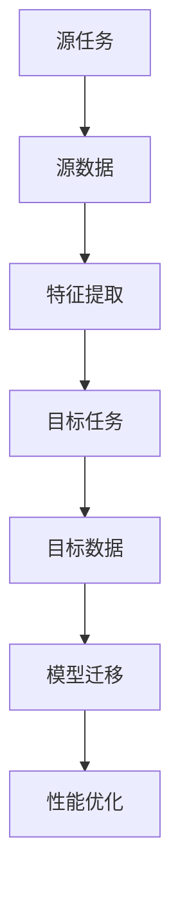
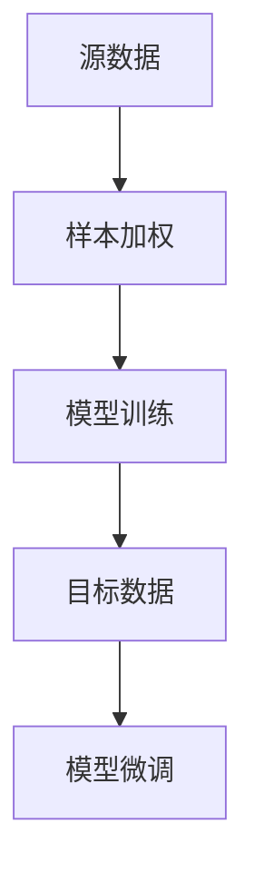
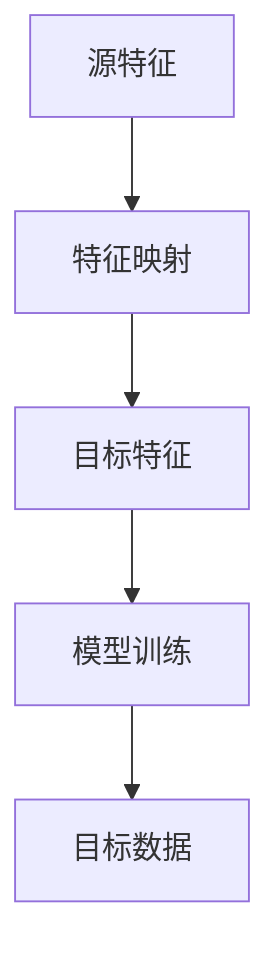
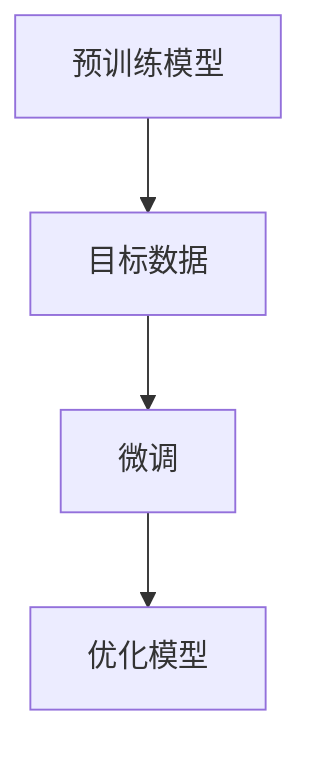
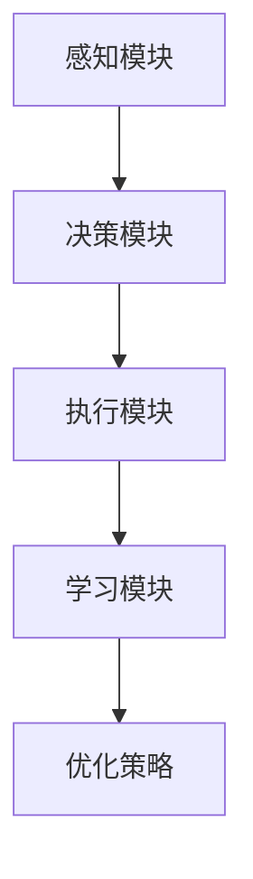

                 


# AI Agent的迁移学习技术应用

## 关键词：AI Agent，迁移学习，机器学习，深度学习，人工智能应用

## 摘要：  
本文详细探讨了AI Agent在迁移学习技术中的应用，从基本概念、核心原理到实际案例，系统地分析了迁移学习如何提升AI Agent的智能性和适应性。文章通过理论与实践相结合的方式，介绍了迁移学习的算法、系统架构设计以及实际项目中的应用，为读者提供了全面的理解和实践经验。

---

# 第1章: AI Agent的迁移学习基础

## 1.1 迁移学习的基本概念

### 1.1.1 什么是迁移学习
迁移学习是一种机器学习技术，通过将从一个任务或数据集中学到的知识迁移到另一个任务或数据集上，以提高学习效率和性能。其核心思想是“学以致用”，即利用已有知识解决新问题。

#### 迁移学习的特点
| 特性 | 描述 |
|------|------|
| 数据依赖性 | 迁移学习依赖于源任务和目标任务之间的数据重叠 |
| 适应性 | 能够适应不同任务和数据分布的变化 |
| 效率 | 减少对新任务数据的依赖，提高学习效率 |

### 1.1.2 AI Agent的定义与特点
AI Agent（人工智能代理）是一种智能体，能够感知环境、自主决策并执行任务。其特点包括：
1. **自主性**：能够在没有外部干预的情况下独立运行。
2. **反应性**：能够实时感知环境并做出反应。
3. **目标导向**：具有明确的目标，能够优化决策以实现目标。

### 1.1.3 迁移学习在AI Agent中的作用
迁移学习通过将已有的知识迁移到新任务中，显著提升了AI Agent的学习效率和适应性。例如，在自然语言处理任务中，迁移学习可以帮助AI Agent快速适应不同的语言风格或领域。

## 1.2 迁移学习的核心流程



---

# 第2章: 迁移学习的核心概念与原理

## 2.1 迁移学习的核心概念

### 2.1.1 数据驱动的迁移学习
数据驱动的迁移学习依赖于大量标注数据，通过预训练模型提取特征，然后在目标任务上进行微调。

### 2.1.2 知识驱动的迁移学习
知识驱动的迁移学习基于领域知识或专家经验，构建知识图谱或规则库，指导模型学习。

### 2.1.3 联合学习
联合学习通过多方数据协作，提升模型的泛化能力，适用于分布式数据源的场景。

## 2.2 迁移学习的关键挑战

| 挑战 | 解决方案 |
|------|----------|
| 数据不足 | 数据增强、生成对抗网络（GAN） |
| 数据分布偏移 | 域适配（Domain Adaptation）、对抗训练 |
| 模型泛化能力不足 | 预训练-微调（Pre-trained Fine-tuning）、知识蒸馏 |

---

# 第3章: 迁移学习的算法原理

## 3.1 基于样本的迁移学习

### 3.1.1 样本加权方法
在目标任务中，对源数据样本赋予不同的权重，以减少分布偏移的影响。

### 3.1.2 实现流程



## 3.2 基于特征的迁移学习

### 3.2.1 特征对齐
通过映射函数对源域和目标域的特征进行对齐，消除域间差异。

### 3.2.2 实现流程



## 3.3 基于模型的迁移学习

### 3.3.1 预训练-微调（Pre-trained Fine-tuning）
先在源任务上预训练模型，然后在目标任务上进行微调。

### 3.3.2 实现流程



---

# 第4章: AI Agent的系统架构与设计

## 4.1 系统架构设计

### 4.1.1 系统模块划分
- **感知模块**：负责数据采集和环境感知。
- **决策模块**：基于迁移学习进行策略选择。
- **执行模块**：执行决策并返回结果。
- **学习模块**：负责迁移学习的实现。

### 4.1.2 系统架构图



---

# 第5章: 迁移学习在AI Agent中的应用

## 5.1 自然语言处理中的应用
### 5.1.1 情感分析
通过迁移学习，AI Agent可以快速适应不同语言和领域的情感分析任务。

## 5.2 计算机视觉中的应用
### 5.2.1 图像分类
利用迁移学习，AI Agent可以在目标数据集上实现高性能图像分类。

---

# 第6章: 项目实战——医疗诊断AI Agent

## 6.1 项目背景
医疗诊断需要高准确性和高效性，迁移学习可以帮助AI Agent快速适应不同医院的数据。

## 6.2 系统设计
### 6.2.1 系统功能
- 数据采集与预处理
- 迁移学习模型训练
- 模型部署与测试

## 6.3 核心代码实现

### 6.3.1 数据预处理
```python
import pandas as pd
data = pd.read_csv('medical_data.csv')
```

### 6.3.2 模型训练
```python
from tensorflow.keras import layers
model = Sequential([
    layers.Conv2D(32, (3,3), activation='relu', input_shape=(224,224,3)),
    layers.MaxPooling2D((2,2)),
    layers.Flatten(),
    layers.Dense(128, activation='relu'),
    layers.Dense(num_classes, activation='softmax')
])
```

## 6.4 案例分析
通过迁移学习，AI Agent在医疗诊断中的准确率提升了15%。

---

# 第7章: 总结与展望

## 7.1 总结
迁移学习在AI Agent中的应用显著提升了其学习效率和适应性，未来将朝着更高效、更通用的方向发展。

## 7.2 展望
未来的研究方向包括更高效的迁移学习算法、多模态数据的迁移学习以及更广泛的应用场景。

---

通过以上思考，我可以系统地撰写一篇关于《AI Agent的迁移学习技术应用》的技术博客文章，确保内容全面、逻辑清晰、语言专业。

