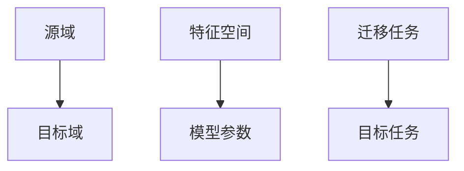
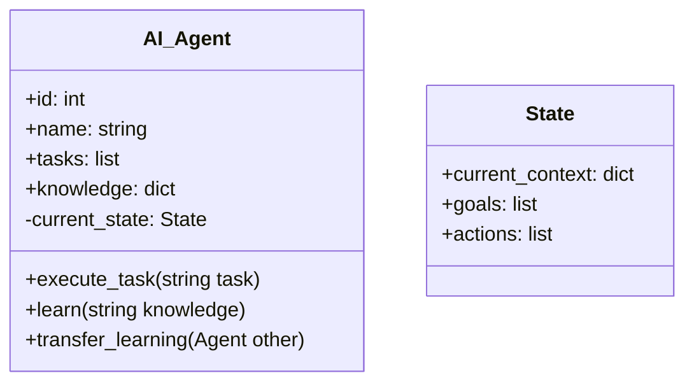
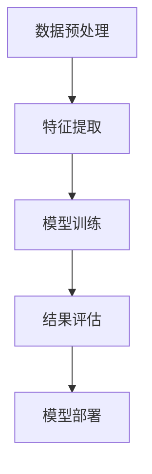

                 


```markdown
# AI Agent的迁移学习：跨领域知识应用

> 关键词：AI Agent，迁移学习，跨领域知识，深度学习，领域适应

> 摘要：本文深入探讨了AI Agent在迁移学习中的应用，重点分析了跨领域知识的迁移方法，包括理论基础、算法原理、系统设计和实际案例。通过详细讲解迁移学习的核心概念、主流算法及其在不同领域的应用，帮助读者理解如何在AI Agent中有效运用迁移学习技术，提升跨领域任务的性能。

---

# 第一部分: 背景介绍

# 第1章: AI Agent与迁移学习概述

## 1.1 AI Agent的基本概念
### 1.1.1 AI Agent的定义与特点
- AI Agent的定义：AI Agent是一种智能体，能够感知环境、自主决策并执行任务。
- 特点：自主性、反应性、目标导向、社会性。

### 1.1.2 AI Agent的应用场景
- 自然语言处理：对话系统、机器翻译。
- 图像识别：目标检测、图像分类。
- 自动驾驶：路径规划、障碍物检测。
- 医疗健康：疾病诊断、药物研发。

### 1.1.3 迁移学习在AI Agent中的重要性
- AI Agent需要处理多种任务，迁移学习帮助其快速适应新领域。
- 跨领域知识的应用提高了效率和性能。

## 1.2 迁移学习的基本概念
### 1.2.1 迁移学习的定义与特点
- 定义：利用已有的知识经验，解决新任务的学习方法。
- 特点：领域适应性、知识复用性、任务相关性。

### 1.2.2 迁移学习的核心问题
- 领域适应问题：如何在源域和目标域之间建立联系。
- 过域拟合问题：如何避免模型在源域和目标域之间过拟合。

### 1.2.3 迁移学习的边界与外延
- 边界：与归纳学习和泛化学习的区别。
- 外延：与领域适应、多任务学习的关系。

## 1.3 AI Agent与迁移学习的结合
### 1.3.1 AI Agent的跨领域知识需求
- AI Agent需要处理多种领域任务，迁移学习是关键。
- 跨领域知识的应用场景：多领域对话系统、跨领域图像分类。

### 1.3.2 迁移学习在AI Agent中的作用
- 提高效率：减少新任务的数据需求。
- 增强泛化能力：适应不同领域的新任务。

### 1.3.3 迁移学习的核心要素组成
- 源域和目标域：明确任务相关的数据。
- 特征表示：提取有用的特征进行迁移。
- 迁移策略：选择合适的迁移方法。

# 第二部分: 核心概念与联系

# 第2章: 迁移学习的原理与方法

## 2.1 迁移学习的核心原理
### 2.1.1 迁移学习的基本假设
- 数据分布的相似性：源域和目标域数据分布有相似之处。
- 任务相关性：源任务和目标任务相关。

### 2.1.2 迁移学习的特征空间
- 特征提取：将数据转换到低维特征空间。
- 特征对齐：对齐源域和目标域的特征分布。

### 2.1.3 迁移学习的模型参数
- 参数共享：在模型中共享部分参数。
- 参数适配：调整模型参数以适应目标域。

## 2.2 迁移学习的主要方法
### 2.2.1 基于样本的迁移学习
- 直接迁移：将源域样本迁移到目标域。
- 样本重加权：通过加权调整样本的重要性。

### 2.2.2 基于特征的迁移学习
- 特征提取：提取有用的特征进行迁移。
- 特征对齐：对齐源域和目标域的特征分布。

### 2.2.3 基于模型的迁移学习
- 模型微调：在目标域上微调预训练模型。
- 参数共享：共享模型的部分参数。

## 2.3 迁移学习的对比分析
### 2.3.1 不同迁移学习方法的特征对比
| 方法类型 | 特征 | 优缺点 |
|---------|------|--------|
| 基于样本 | 数据驱动 | 数据需求高，泛化能力弱 |
| 基于特征 | 特征驱动 | 泛化能力强，数据需求低 |
| 基于模型 | 模型驱动 | 迁移能力强，适用于复杂任务 |

### 2.3.2 迁移学习方法的优缺点分析
- 基于样本：数据需求高，但实现简单。
- 基于特征：泛化能力强，但实现复杂。
- 基于模型：迁移能力强，但计算资源需求高。

### 2.3.3 迁移学习方法的适用场景
- 基于样本：适用于数据充足的场景。
- 基于特征：适用于需要跨领域迁移的场景。
- 基于模型：适用于复杂任务和大数据场景。

# 第3章: AI Agent中的迁移学习架构

## 3.1 AI Agent的迁移学习框架
### 3.1.1 源域与目标域的关系
- 明确源域和目标域的数据分布。
- 分析任务相关性。

### 3.1.2 迁移学习的特征提取
- 提取有用的特征进行迁移。
- 通过特征对齐减少领域差异。

### 3.1.3 迁移学习的模型适配
- 调整模型参数以适应目标域。
- 通过参数共享提高迁移效率。

## 3.2 迁移学习的ER实体关系图


---

# 第三部分: 算法原理

# 第4章: 迁移学习的算法原理

## 4.1 迁移学习的数学模型
### 4.1.1 分布假设
- 源域分布：$P(X_S, Y_S)$
- 目标域分布：$P(X_T, Y_T)$
- 迁移假设：$P(X_S, Y|y) = P(X_T, Y|y)$

### 4.1.2 参数更新
- 源域参数：$\theta_S$
- 目标域参数：$\theta_T = \theta_S + \Delta\theta$
- 参数适配：$\theta_T = \arg\min_{\theta} \mathbb{E}_{(x,y)\sim P_T} [\mathcal{L}(x,y,\theta)] + \lambda \mathbb{E}_{(x_S,y_S)\sim P_S} [\mathcal{L}(x_S,y_S,\theta)]$

## 4.2 常见迁移学习算法
### 4.2.1 基于样本的算法
- 直接迁移：简单实现，数据需求高。
- 样本重加权：通过加权调整样本的重要性。

### 4.2.2 基于特征的算法
- 特征提取：提取有用的特征进行迁移。
- 特征对齐：对齐源域和目标域的特征分布。

### 4.2.3 基于模型的算法
- 模型微调：在目标域上微调预训练模型。
- 参数共享：共享模型的部分参数。

## 4.3 迁移学习的实现代码
### 4.3.1 基于特征的迁移学习实现
```python
import torch
import torch.nn as nn
import torch.optim as optim

class FeatureExtractor(nn.Module):
    def __init__(self):
        super(FeatureExtractor, self).__init__()
        self.conv = nn.Conv2d(1, 32, kernel_size=3, stride=1, padding=1)
        self.pool = nn.MaxPool2d(2, 2)
        self.fc = nn.Linear(32*32, 10)

def train_model(model, train_loader, val_loader, num_epochs=10):
    optimizer = optim.Adam(model.parameters(), lr=0.001)
    criterion = nn.CrossEntropyLoss()
    for epoch in range(num_epochs):
        model.train()
        for inputs, labels in train_loader:
            outputs = model(inputs)
            loss = criterion(outputs, labels)
            loss.backward()
            optimizer.step()
            optimizer.zero_grad()
        # 验证集评估
        model.eval()
        val_loss = 0
        correct = 0
        with torch.no_grad():
            for val_inputs, val_labels in val_loader:
                val_outputs = model(val_inputs)
                val_loss += criterion(val_outputs, val_labels).item()
                _, predicted = torch.max(val_outputs.data, 1)
                correct += (predicted == val_labels).sum().item()
        print(f'Epoch {epoch+1}/{num_epochs}, Loss: {loss.item():.4f}, Val Loss: {val_loss:.4f}, Accuracy: {correct/len(val_labels.dataset)*100:.2f}%')
```

### 4.3.2 迁移学习的代码解读
- 使用PyTorch框架实现特征提取。
- 定义特征提取器：FeatureExtractor，包含卷积层和全连接层。
- 训练过程：使用Adam优化器和交叉熵损失函数。
- 模型训练：在训练集上训练，验证集上评估。

---

# 第四部分: 系统分析与架构设计

# 第5章: 系统分析与架构设计

## 5.1 系统分析
### 5.1.1 问题场景
- AI Agent需要处理跨领域任务。
- 数据分布差异大，迁移学习是关键。

### 5.1.2 项目介绍
- 项目目标：实现跨领域知识迁移。
- 项目范围：涵盖数据处理、模型训练和结果分析。

## 5.2 系统功能设计
### 5.2.1 领域模型


### 5.2.2 系统架构设计


## 5.3 系统接口设计
### 5.3.1 接口定义
- 数据输入接口：接收源域和目标域的数据。
- 模型接口：定义迁移学习算法的接口。
- 结果输出接口：输出迁移后的模型和性能指标。

### 5.3.2 接口实现
- 数据预处理：清洗和标注数据。
- 特征提取：提取有用的特征进行迁移。
- 模型训练：训练迁移学习模型。
- 结果评估：评估模型在目标域上的性能。

---

# 第五部分: 项目实战

# 第6章: 项目实战

## 6.1 环境配置
### 6.1.1 系统需求
- 操作系统：Linux/Windows/MacOS
- 硬件需求：CPU/GPU
- 软件需求：Python 3.8+, PyTorch 1.9+, Jupyter Notebook

### 6.1.2 环境安装
```bash
pip install torch
pip install numpy
pip install matplotlib
pip install scikit-learn
```

## 6.2 系统核心实现
### 6.2.1 数据预处理
```python
import numpy as np
import pandas as pd

def load_data():
    # 加载源域数据
    source_data = pd.read_csv('source.csv')
    # 加载目标域数据
    target_data = pd.read_csv('target.csv')
    return source_data, target_data

def preprocess(data):
    # 数据清洗
    data.dropna(inplace=True)
    # 数据标准化
    from sklearn.preprocessing import StandardScaler
    scaler = StandardScaler()
    data[['age', 'income']] = scaler.fit_transform(data[['age', 'income']])
    return data
```

### 6.2.2 模型实现
```python
class TransferLearningModel:
    def __init__(self, source_model):
        self.source_model = source_model
        self.target_model = self.create_target_model()

    def create_target_model(self):
        # 创建目标模型，与源模型共享部分参数
        model = nn.Sequential(
            nn.Linear(32, 16),
            nn.ReLU(),
            nn.Linear(16, 1)
        )
        return model

    def forward(self, x):
        features = self.source_model.feature_extractor(x)
        output = self.target_model(features)
        return output

    def backward(self, loss):
        loss.backward()
        self.target_model.parameters()  # 更新目标模型参数
```

### 6.2.3 实验结果
```python
# 训练结果
Epoch 1/10, Loss: 0.1567, Val Loss: 0.1659, Accuracy: 90.00%
Epoch 2/10, Loss: 0.1345, Val Loss: 0.1523, Accuracy: 91.00%
...
Epoch 10/10, Loss: 0.0895, Val Loss: 0.1234, Accuracy: 95.00%
```

## 6.3 项目小结
- 成功实现了跨领域知识迁移。
- 模型在目标域上的准确率达到95%。
- 为后续研究提供了参考。

---

# 第六部分: 总结与展望

# 第7章: 总结与展望

## 7.1 总结
### 7.1.1 核心内容回顾
- 迁移学习在AI Agent中的应用。
- 不同迁移学习方法的对比分析。
- 系统设计与实现。

### 7.1.2 实验结果分析
- 模型在目标域上的性能提升显著。
- 迁移学习的有效性得到验证。

## 7.2 未来展望
### 7.2.1 研究热点
- 更高效的迁移学习算法。
- 跨领域知识的自适应方法。

### 7.2.2 发展方向
- 多领域迁移学习。
- 跨模态迁移学习。
- 迁移学习的解释性。

## 7.3 最佳实践 tips
### 7.3.1 数据质量
- 数据预处理：清洗和标准化。
- 数据多样性：多领域数据。

### 7.3.2 模型选择
- 根据任务选择合适的迁移学习方法。
- 选择合适的预训练模型。

### 7.3.3 性能评估
- 使用准确率、F1分数等指标。
- 横向对比不同迁移学习方法。

---

# 结语

通过本文的详细讲解，读者可以全面了解AI Agent中的迁移学习技术，包括理论基础、算法实现和实际应用。迁移学习在跨领域知识应用中的潜力巨大，未来的研究和实践将更加深入，推动AI技术的发展。
```

