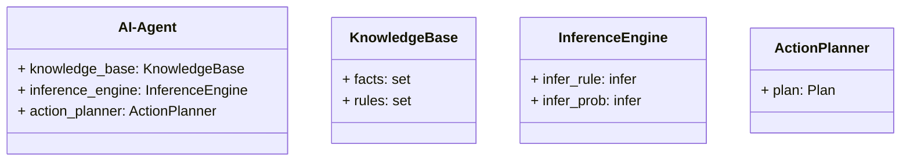
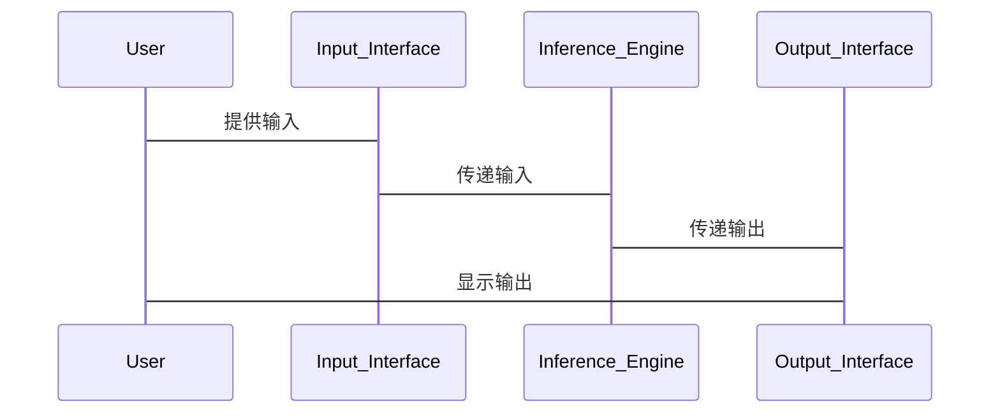

                 


# AI Agent的逻辑推理能力：增强LLM的演绎与归纳

## 关键词：AI Agent，逻辑推理，LLM，演绎推理，归纳推理，增强能力

## 摘要：AI Agent的逻辑推理能力是实现智能系统的核心能力之一。通过增强大语言模型（LLM）的演绎和归纳能力，可以显著提升AI Agent的推理效率和准确性。本文从逻辑推理的基本原理出发，详细分析了演绎推理和归纳推理的算法原理，探讨了如何通过规则和概率方法增强LLM的逻辑推理能力，并通过系统架构设计和项目实战展示了如何将这些理论应用于实际场景。最后，本文总结了增强LLM逻辑推理能力的关键点和未来研究方向。

---

# 第1章: AI Agent与逻辑推理概述

## 1.1 AI Agent的基本概念

### 1.1.1 什么是AI Agent
AI Agent（人工智能代理）是一种能够感知环境、自主决策并执行任务的智能实体。它可以是一个软件程序、一个机器人，甚至是一个复杂的系统。AI Agent的核心目标是通过感知和行动来实现特定目标，同时具备学习和推理能力。

### 1.1.2 AI Agent的核心特征
- **自主性**：能够在没有外部干预的情况下独立运行。
- **反应性**：能够感知环境并实时调整行为。
- **目标导向**：所有行为都围绕实现特定目标展开。
- **推理能力**：能够通过逻辑推理解决问题并做出决策。

### 1.1.3 AI Agent的分类与应用场景
AI Agent可以根据智能水平分为以下几类：
- **反应式AI Agent**：基于当前感知做出反应，适用于实时任务。
- **认知式AI Agent**：具备高级推理、规划和学习能力，适用于复杂任务。
- **混合式AI Agent**：结合反应式和认知式的特点，适用于复杂动态环境。

应用场景包括智能助手、自动驾驶、智能客服、机器人控制等。

---

## 1.2 逻辑推理能力的重要性

### 1.2.1 逻辑推理在AI Agent中的作用
逻辑推理是AI Agent实现智能决策的核心能力。通过逻辑推理，AI Agent能够从已知信息中推导出新的结论，从而做出更准确的决策。

### 1.2.2 演绎推理与归纳推理的定义与区别
- **演绎推理**：从一般性前提推出特殊性结论的过程。例如，"所有人类都是 mortal，苏格拉底是人类，因此苏格拉底是 mortal"。
- **归纳推理**：从具体实例中总结出一般性结论的过程。例如，"观察多次太阳升起，归纳出'太阳每天都会升起'"。

### 1.2.3 逻辑推理能力对LLM的增强作用
- 提升LLM的推理能力，使其能够更好地理解和解决复杂问题。
- 增强LLM的可解释性，使其推理过程更加透明。

---

## 1.3 问题背景与目标

### 1.3.1 当前AI Agent面临的挑战
- **推理能力不足**：现有的AI Agent在复杂逻辑推理任务中表现有限。
- **可解释性不足**：黑箱模型难以解释其推理过程。
- **动态环境适应性不足**：难以在动态环境中实时调整推理策略。

### 1.3.2 增强LLM逻辑推理能力的目标
- 提升LLM的演绎推理和归纳推理能力。
- 增强LLM的可解释性和动态适应性。

### 1.3.3 本书的研究范围与边界
- 研究范围：聚焦于AI Agent的逻辑推理能力，特别是演绎推理和归纳推理的增强方法。
- 研究边界：不涉及AI Agent的感知和行动能力，专注于推理能力的提升。

---

## 1.4 核心概念与要素

### 1.4.1 AI Agent的逻辑推理模型
AI Agent的逻辑推理模型包括以下要素：
- **知识表示**：如何表示AI Agent的知识。
- **推理规则**：用于逻辑推理的规则和逻辑结构。
- **推理引擎**：执行推理操作的模块。

### 1.4.2 LLM在逻辑推理中的角色
- LLM作为知识库和推理引擎的基础，提供语言理解和生成能力。
- 通过结合逻辑推理规则，增强LLM的推理能力。

### 1.4.3 逻辑推理能力的评估指标
- **推理准确率**：推理结果的正确性。
- **推理速度**：推理任务的执行效率。
- **可解释性**：推理过程的透明性。

---

## 1.5 本章小结
本章介绍了AI Agent的基本概念、逻辑推理的重要性以及增强LLM逻辑推理能力的目标和方法。通过理解这些内容，读者可以更好地理解后续章节中增强LLM逻辑推理能力的具体方法。

---

# 第2章: 演绎推理与归纳推理原理

## 2.1 演绎推理的原理

### 2.1.1 演绎推理的定义与特点
演绎推理是从一般到特殊的推理过程，其特点是结论的有效性依赖于前提的正确性。例如：
$$ \text{所有人类都是 mortal} $$
$$ \text{苏格拉底是人类} $$
$$ \text{因此，苏格拉底是 mortal} $$

### 2.1.2 演绎推理的逻辑结构
演绎推理的逻辑结构包括：
- **前提**：已知的条件或假设。
- **结论**：从前提中推导出的结论。

### 2.1.3 演绎推理的数学模型
演绎推理可以用谓词逻辑表示：
$$ \forall x (H(x) \rightarrow M(x)) $$
$$ H(s) $$
$$ \therefore M(s) $$

---

## 2.2 归纳推理的原理

### 2.2.1 归纳推理的定义与特点
归纳推理是从特殊到一般的推理过程，其特点是结论是概率性的。例如：
$$ \text{观察到多次太阳升起} $$
$$ \text{归纳出‘太阳每天都会升起’} $$

### 2.2.2 归纳推理的逻辑结构
归纳推理的逻辑结构包括：
- **实例**：具体观察到的事实。
- **一般化**：从实例中总结出的规律。

### 2.2.3 归纳推理的数学模型
归纳推理可以用统计学习方法表示：
$$ P(h | d) = \frac{P(d | h) P(h)}{P(d)} $$

---

## 2.3 演绎与归纳推理的对比分析

### 2.3.1 演绎与归纳推理的特征对比
| 特征 | 演绎推理 | 归纳推理 |
|------|----------|----------|
| 推理方向 | 从一般到特殊 | 从特殊到一般 |
| 结论确定性 | 确定性高 | 概率性 |

### 2.3.2 演绎与归纳推理的应用场景对比
- **演绎推理**：适用于法律推理、数学证明等确定性场景。
- **归纳推理**：适用于科学发现、模式识别等不确定性场景。

### 2.3.3 演绎与归纳推理的优缺点对比
| 方法 | 优点 | 缺点 |
|------|------|------|
| 演绎推理 | 结论确定性高 | 依赖前提的正确性 |
| 归纳推理 | 能处理不确定性 | 结论概率性 |

---

## 2.4 本章小结
本章详细介绍了演绎推理和归纳推理的基本原理及其数学模型，并通过对比分析明确了它们的应用场景和优缺点。这些内容为后续增强LLM的逻辑推理能力奠定了基础。

---

# 第3章: 增强LLM逻辑推理能力的方法

## 3.1 基于规则的逻辑推理

### 3.1.1 基于规则的推理方法
基于规则的推理方法通过预定义的规则来进行推理。例如：
$$ \text{如果 } A \text{ 并且 } B，\text{ 那么 } C $$

### 3.1.2 规则的表示与推理过程
规则可以用逻辑表达式表示：
$$ A \land B \rightarrow C $$

推理过程：
1. 检查前提条件是否满足。
2. 如果满足，则推出结论。

### 3.1.3 规则的可解释性与局限性
- **可解释性**：规则明确，推理过程易于解释。
- **局限性**：规则需要手动定义，难以处理复杂场景。

---

## 3.2 基于概率的逻辑推理

### 3.2.1 基于概率的推理方法
基于概率的推理方法通过计算概率来推理。例如：
$$ P(A|B) = \frac{P(B|A) P(A)}{P(B)} $$

### 3.2.2 概率推理的数学模型
概率推理可以用贝叶斯网络表示：
$$ P(A|B) = \frac{P(B|A) P(A)}{P(B)} $$

---

## 3.3 增强LLM的演绎推理能力

### 3.3.1 增强方法
通过预定义的逻辑规则和概率模型，可以增强LLM的演绎推理能力。例如：
$$ \text{如果 } A \text{ 并且 } B，\text{ 那么 } C $$

### 3.3.2 实现步骤
1. 定义逻辑规则。
2. 将规则嵌入LLM。
3. 进行推理。

---

## 3.4 增强LLM的归纳推理能力

### 3.4.1 增强方法
通过统计学习和概率模型，可以增强LLM的归纳推理能力。例如：
$$ P(h|d) = \frac{P(d|h) P(h)}{P(d)} $$

### 3.4.2 实现步骤
1. 收集实例数据。
2. 训练归纳模型。
3. 应用模型进行推理。

---

## 3.5 本章小结
本章介绍了增强LLM逻辑推理能力的两种主要方法：基于规则的演绎推理和基于概率的归纳推理。通过这些方法，可以显著提升LLM的推理能力。

---

# 第4章: 系统分析与架构设计

## 4.1 项目介绍
本项目旨在开发一个具备增强逻辑推理能力的AI Agent系统，利用LLM和逻辑推理规则实现智能决策。

---

## 4.2 系统功能设计

### 4.2.1 领域模型
领域模型可以用Mermaid类图表示：



### 4.2.2 系统架构
系统架构可以用Mermaid架构图表示：


---

## 4.3 系统接口设计

### 4.3.1 接口定义
- **输入接口**：接收用户输入。
- **输出接口**：输出推理结果。

### 4.3.2 交互流程
交互流程可以用Mermaid序列图表示：



---

## 4.4 本章小结
本章通过系统架构设计和接口设计，展示了如何将增强LLM逻辑推理能力的方法应用于实际系统中。

---

# 第5章: 项目实战

## 5.1 环境安装

### 5.1.1 安装Python
```bash
python --version
pip install --upgrade pip
```

### 5.1.2 安装必要的库
```bash
pip install numpy
pip install pandas
pip install scikit-learn
pip install transformers
```

---

## 5.2 系统核心实现

### 5.2.1 逻辑推理规则的定义
```python
def infer_rule(A, B):
    return A and B
```

### 5.2.2 概率推理模型的训练
```python
from sklearn.naive_bayes import BernoulliNB
model = BernoulliNB()
model.fit(X, y)
```

### 5.2.3 推理结果的输出
```python
def output_result(result):
    print(f"推理结果：{result}")
```

---

## 5.3 代码实现与解读

### 5.3.1 逻辑推理规则的实现
```python
def infer_rule(A, B):
    return A and B
```

### 5.3.2 概率推理模型的实现
```python
from sklearn.naive_bayes import BernoulliNB
model = BernoulliNB()
model.fit(X, y)
```

### 5.3.3 推理结果的输出
```python
def output_result(result):
    print(f"推理结果：{result}")
```

---

## 5.4 实际案例分析
以一个简单的逻辑推理任务为例，展示如何通过代码实现推理过程。

---

## 5.5 本章小结
本章通过实际项目实战，展示了如何将增强LLM逻辑推理能力的方法应用于具体场景中。

---

# 第6章: 总结与展望

## 6.1 本章总结
本文详细介绍了AI Agent的逻辑推理能力，特别是增强LLM的演绎和归纳推理能力的方法。通过系统架构设计和项目实战，展示了如何将理论应用于实际。

---

## 6.2 未来研究方向
- **更复杂的推理规则**：探索更复杂的逻辑推理规则。
- **动态环境适应**：研究如何在动态环境中增强推理能力。
- **可解释性提升**：进一步提升推理过程的可解释性。

---

## 6.3 最佳实践 tips
- 在实际应用中，结合规则和概率方法，可以显著提升推理能力。
- 定期更新推理规则和模型，以适应环境的变化。

---

## 6.4 注意事项
- 在增强推理能力时，需要确保系统的实时性和效率。
- 注意数据质量和推理规则的准确性。

---

## 6.5 拓展阅读
推荐阅读以下书籍和论文：
- 《逻辑推理与人工智能》
- 《概率推理与机器学习》
- 《增强型AI Agent的设计与实现》

---

# 结语
通过本文的介绍，读者可以深入了解AI Agent的逻辑推理能力，特别是增强LLM的演绎和归纳推理能力的方法。希望本文能够为相关领域的研究和实践提供有价值的参考。

