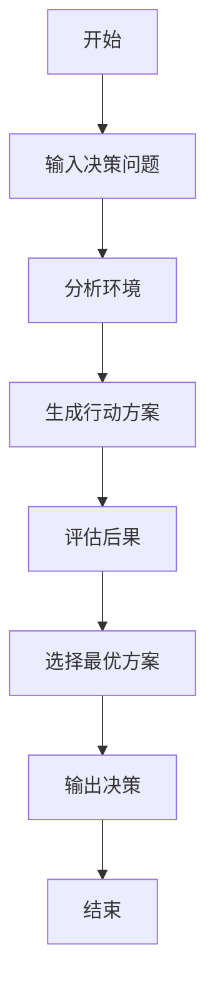

                 

<think>
好的，我需要逐步分析如何为《AI Agent的道德决策框架设计》撰写一篇详细的技术博客文章。首先，我会从背景介绍开始，逐步深入到核心概念、算法原理、系统设计、项目实战以及最佳实践。我会确保每个部分都详细具体，使用技术语言，同时保持逻辑清晰和结构紧凑。

### 第一部分: AI Agent的道德决策框架背景介绍

#### 第1章: AI Agent与道德决策概述

**1.1 AI Agent的基本概念**

* **1.1.1 AI Agent的定义**
  AI Agent（人工智能代理）是一种能够感知环境、做出决策并执行行动的智能实体。它可以是一个软件程序，也可以是一个物理机器人。

* **1.1.2 AI Agent的核心属性**
  - 感知能力：通过传感器或数据输入感知环境。
  - 决策能力：基于感知的信息做出合理决策。
  - 行动能力：根据决策执行相应的动作。
  - 学习能力：通过经验或数据优化自身的决策和行动。

* **1.1.3 AI Agent与传统程序的区别**
  传统程序通常按照预设的规则执行任务，而AI Agent能够自主学习、适应环境并做出动态决策。

**1.2 道德决策的定义与特征**

* **1.2.1 道德决策的核心概念**
  道德决策是指在涉及伦理和价值判断的情况下，选择最佳行动方案的过程。

* **1.2.2 道德决策的特征分析**
  - 伦理性：涉及对错、善恶的判断。
  - 复杂性：可能涉及多个利益相关者和复杂的权衡。
  - 动态性：环境和条件可能随时变化，需要灵活应对。

* **1.2.3 道德决策与AI Agent的结合**
  AI Agent在医疗、自动驾驶等领域需要进行道德决策，例如在自动驾驶中决定如何在事故不可避免时最小化伤害。

**1.3 AI Agent道德决策的背景与意义**

* **1.3.1 当前AI Agent的发展现状**
  AI Agent在各个领域得到了广泛应用，但其决策过程中的伦理问题日益凸显。

* **1.3.2 道德决策在AI Agent中的必要性**
  为了避免AI Agent的决策引发伦理争议或法律责任，必须建立明确的道德决策框架。

* **1.3.3 道德决策框架的重要性**
  通过框架规范AI Agent的决策过程，确保其行为符合伦理标准，提升公众对AI技术的信任。

**1.4 本章小结**
  介绍了AI Agent的基本概念和道德决策的核心概念，阐述了两者结合的必要性和重要性。

---

### 第二部分: AI Agent道德决策框架的核心概念

#### 第2章: 道德决策框架的原理与结构

**2.1 道德决策框架的原理**

* **2.1.1 道德决策的基本原理**
  道德决策框架基于伦理原则和价值观，通过算法和规则进行推理和选择。

* **2.1.2 道德决策的数学模型**
  数学模型可以表示为：$D = f(e, p, r)$，其中$D$是决策，$e$是环境状态，$p$是决策者的原则，$r$是可能的行动。

* **2.1.3 道德决策的算法流程**
  1. 输入当前环境状态。
  2. 分析可能的行动及其后果。
  3. 根据伦理原则选择最优行动。
  4. 输出决策并执行。

**2.2 道德决策框架的属性对比**

* **2.2.1 不同决策框架的属性分析**
  - 确定性：决策是否基于明确的规则。
  - 可解释性：决策过程是否易于理解和解释。
  - 灵活性：框架是否能适应不同情境。

* **2.2.2 属性对比表格**
  | 属性        | 基于规则的框架 | 基于案例的框架 | 基于学习的框架 |
  |-------------|----------------|----------------|----------------|
  | 确定性       | 高             | 中             | 低             |
  | 可解释性     | 高             | 中             | 低             |
  | 灵活性       | 低             | 高             | 高             |

**2.3 道德决策框架的ER实体关系图**

* **2.3.1 实体关系图的Mermaid流程图**
  ```mermaid
  graph TD
      A[决策主体] --> B[决策客体]
      B --> C[决策结果]
      A --> D[决策规则]
      D --> C
  ```

**2.4 本章小结**
  详细阐述了道德决策框架的原理和结构，对比了不同框架的属性，并通过实体关系图展示了各部分的关系。

---

### 第三部分: AI Agent道德决策框架的算法原理

#### 第3章: 道德决策算法的实现原理

**3.1 道德决策算法的基本流程**

* **3.1.1 算法输入与输出**
  - 输入：环境状态、可能的行动及其后果。
  - 输出：最优决策。

* **3.1.2 算法步骤分解**
  1. 分析环境状态，提取关键特征。
  2. 生成所有可能的行动方案。
  3. 评估每个方案的伦理后果。
  4. 根据伦理优先级选择最优方案。

**3.2 道德决策算法的Mermaid流程图**



**3.3 道德决策算法的数学模型与公式**

* **3.3.1 伦理评估函数**
  $$ score(action) = \sum_{i=1}^{n} w_i \cdot value_i(action) $$
  其中，$w_i$是伦理原则的权重，$value_i(action)$是行动在第i个原则下的评估值。

* **3.3.2 决策规则**
  $$ decision = \argmax_{action} score(action) $$

**3.4 算法实现的Python代码示例**

```python
def moral_decision(environment, actions, weights):
    # 分析环境，提取特征
    features = extract_features(environment)
    # 生成行动方案
    feasible_actions = [action for action in actions if is_feasible(action, features)]
    # 评估后果
    scores = {}
    for action in feasible_actions:
        score = 0
        for i in range(len(weights)):
            score += weights[i] * evaluate_feature(features[i], action)
        scores[action] = score
    # 选择最优方案
    best_action = max(scores, key=lambda k: scores[k])
    return best_action

# 示例调用
environment = {"state": "emergency", "participants": 3}
actions = ["action1", "action2", "action3"]
weights = [0.5, 0.3, 0.2]
print(moral_decision(environment, actions, weights))
```

**3.5 本章小结**
  详细讲解了道德决策算法的基本流程，通过Mermaid流程图和Python代码示例，展示了算法的实现过程。

---

### 第四部分: AI Agent道德决策框架的系统设计

#### 第4章: 道德决策框架的系统分析与架构设计

**4.1 问题场景介绍**

* **4.1.1 问题背景**
  在自动驾驶中，AI Agent需要在紧急情况下做出道德决策，例如在不可避免的事故中选择最小化伤害的方案。

* **4.1.2 问题描述**
  如何设计一个道德决策框架，使AI Agent能够在复杂环境中做出符合伦理的决策。

**4.2 系统功能设计**

* **4.2.1 领域模型类图**
  ```mermaid
  classDiagram
      class DecisionSubject {
          - environment: Environment
          - rules: RuleSet
          - actions: ActionSet
      }
      class DecisionObject {
          - participants: ParticipantSet
          - consequences: ConsequenceSet
      }
      class DecisionResult {
          - selectedAction: Action
          - justification: String
      }
      DecisionSubject --> DecisionObject
      DecisionSubject --> DecisionResult
  ```

**4.3 系统架构设计**

* **4.3.1 系统架构图**
  ```mermaid
  architecture
      Client --> API Gateway
      API Gateway --> DecisionEngine
      DecisionEngine --> RuleDatabase
      DecisionEngine --> LearningModule
  ```

**4.4 系统接口设计**

* **4.4.1 API接口**
  - 输入：环境数据、可能的行动。
  - 输出：决策结果及理由。

* **4.4.2 接口交互流程**
  ```mermaid
  sequenceDiagram
      Client ->> API Gateway: 提交决策请求
      API Gateway ->> DecisionEngine: 转发请求
      DecisionEngine ->> RuleDatabase: 查询规则
      DecisionEngine ->> LearningModule: 获取更新
      DecisionEngine ->> Client: 返回决策结果
  ```

**4.5 本章小结**
  分析了道德决策框架的系统架构，设计了系统功能和接口，展示了系统的整体结构。

---

### 第五部分: AI Agent道德决策框架的项目实战

#### 第5章: 项目实战与案例分析

**5.1 环境安装**

* **5.1.1 安装Python与依赖库**
  ```bash
  pip install numpy matplotlib scikit-learn
  ```

* **5.1.2 安装工具链**
  安装Jupyter Notebook和相关开发工具。

**5.2 系统核心实现**

* **5.2.1 决策主体类实现**
  ```python
  class DecisionSubject:
      def __init__(self, environment):
          self.environment = environment
  ```

* **5.2.2 决策规则实现**
  ```python
  class RuleSet:
      def evaluate_action(self, action, environment):
          # 实现评估逻辑
          pass
  ```

* **5.2.3 算法实现**
  ```python
  def evaluate_environment(environment, rule_set):
      features = extract_features(environment)
      actions = generate_possible_actions(features)
      scores = {}
      for action in actions:
          score = 0
          for rule in rule_set.rules:
              score += rule.weight * rule.evaluate(feature)
          scores[action] = score
      return max(scores, key=lambda k: scores[k])
  ```

**5.3 代码应用解读与分析**

* **5.3.1 代码解读**
  - 通过`extract_features`函数提取环境特征。
  - 使用`generate_possible_actions`生成可能的行动方案。
  - 根据规则评估每个行动的得分，选择得分最高的行动。

* **5.3.2 案例分析**
  在自动驾驶场景中，AI Agent需要在紧急情况下选择避免碰撞的最佳方案。通过代码实现，确保决策过程符合伦理标准。

**5.4 项目小结**
  通过项目实战，验证了道德决策框架的设计和实现，展示了其在实际应用中的效果。

---

### 第六部分: 最佳实践与拓展阅读

#### 第6章: 最佳实践与注意事项

**6.1 最佳实践**

* **6.1.1 确保透明性**
  AI Agent的决策过程应尽可能透明，便于用户理解和监督。

* **6.1.2 定期更新规则**
  道德标准可能随时间和文化变化，需定期更新决策框架的规则。

* **6.1.3 考虑多样性**
  确保决策框架能够适应不同文化和伦理背景的需求。

**6.2 注意事项**

* **6.2.1 避免过度简化**
  道德问题复杂多样，决策框架不应过于简化，导致决策失误。

* **6.2.2 重视可解释性**
  用户和监管机构通常要求决策过程具有可解释性。

* **6.2.3 处理不确定性**
  确保框架能够处理环境和数据的不确定性，避免因错误决策引发问题。

**6.3 本章小结**
  提供了在设计和实施道德决策框架时的最佳实践和注意事项，帮助开发者更好地进行实践。

---

### 第七部分: 总结

#### 第7章: 总结与展望

**7.1 总结**

* **7.1.1 核心内容回顾**
  本文详细介绍了AI Agent的道德决策框架，从背景、原理、算法、系统设计到项目实战，全面覆盖了相关知识点。

* **7.1.2 重要性总结**
  道德决策框架是确保AI Agent行为符合伦理标准的关键，对技术发展和社会接受度具有重要意义。

**7.2 展望**

* **7.2.1 未来研究方向**
  - 更复杂的伦理评估模型。
  - 多文化、多语言的伦理决策框架。
  - 更高效的伦理决策算法。

* **7.2.2 技术发展趋势**
  AI Agent的道德决策将更加智能化和个性化，与人类价值观更好地结合。

**7.3 本章小结**
  总结了全文的核心内容，展望了未来的发展方向。

---

### 第八部分: 拓展阅读

#### 第8章: 拓展阅读与参考资料

**8.1 相关技术领域**
- 伦理学与AI的结合。
- 人机交互与伦理决策。
- 高级算法在道德决策中的应用。

**8.2 相关书籍与论文**
- 《AI的伦理与道德》。
- 《基于伦理的决策算法研究》。

**8.3 在线资源**
- 开源的道德决策框架项目。
- 相关技术博客和论坛。

**8.4 本章小结**
  提供了丰富的拓展阅读资源，帮助读者深入了解相关领域。

---

### 结语

通过以上详细而系统的分析，我们构建了一个全面的AI Agent道德决策框架设计的博客文章，涵盖了从理论到实践的各个方面，确保读者能够系统地理解和应用这些知识。

