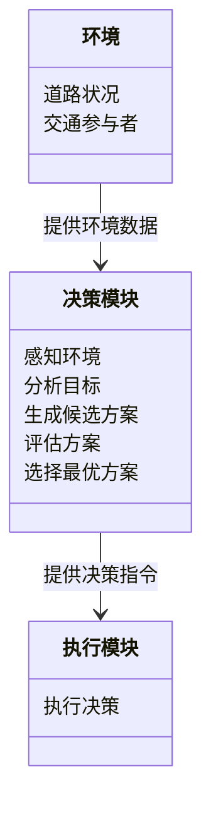
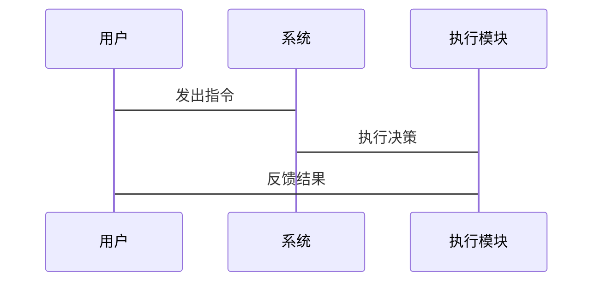

                 


# AI Agent的道德决策框架：在人工智能中植入伦理考量

> 关键词：AI Agent，道德决策框架，人工智能，伦理考量，决策系统，伦理算法，系统架构

> 摘要：随着人工智能技术的飞速发展，AI Agent在各个领域的应用越来越广泛，如何在AI系统中植入伦理考量，使其在决策过程中遵循道德规范，成为当前技术界和学术界的重要课题。本文将从AI Agent的基本概念出发，系统地分析道德决策框架的核心原理，探讨如何将伦理考量融入AI算法和系统架构中，并通过实际案例展示AI Agent道德决策框架的设计与实现。通过本文的探讨，读者将能够全面理解AI Agent的道德决策框架，并掌握其在实际应用中的设计方法。

---

# 第一部分: AI Agent的道德决策框架概述

## 第1章: AI Agent与道德决策的基本概念

### 1.1 AI Agent的基本概念

#### 1.1.1 AI Agent的定义与分类

AI Agent（人工智能代理）是指能够感知环境、自主决策并执行任务的智能系统。根据功能和复杂度的不同，AI Agent可以分为以下几类：

- **简单反射型代理**：基于当前输入直接执行预定义的规则。
- **基于模型的反射型代理**：通过内部模型分析环境并做出决策。
- **目标驱动型代理**：根据预设目标优化决策。
- **效用驱动型代理**：通过最大化效用函数实现目标。

#### 1.1.2 AI Agent的核心特征

AI Agent的核心特征包括以下几点：

- **自主性**：能够在没有外部干预的情况下自主决策。
- **反应性**：能够实时感知环境并做出响应。
- **目标导向性**：基于目标优化决策。
- **学习能力**：能够通过数据和经验不断优化自身。

#### 1.1.3 代理与决策的关系

AI Agent的决策过程是其核心功能之一，决策的正确性直接影响系统的性能。决策过程通常包括以下步骤：

1. **感知环境**：通过传感器或数据输入感知当前环境状态。
2. **分析目标**：明确决策的目标和约束条件。
3. **生成候选方案**：基于当前状态和目标生成多个候选方案。
4. **评估方案**：通过算法评估每个候选方案的优劣。
5. **选择最优方案**：基于评估结果选择最优方案并执行。

---

### 1.2 道德决策的基本概念

#### 1.2.1 道德与伦理的定义

道德（Ethics）是关于行为是否正确或正当的规范，通常涉及善恶、对错的判断。伦理（Ethics）是道德的具体体现，通常用于描述特定领域或文化中的行为规范。

#### 1.2.2 道德决策的特征

道德决策具有以下特征：

- **情境性**：决策的正确性取决于具体的情境。
- **模糊性**：道德决策往往没有唯一正确的答案。
- **权衡性**：在复杂的情境中，需要在不同的利益之间进行权衡。

#### 1.2.3 道德决策与AI代理的结合

将道德决策与AI代理结合，意味着AI系统需要在决策过程中考虑伦理规范，并在可能的情况下做出符合道德的判断。这种结合不仅能够提升系统的社会接受度，还能减少潜在的伦理风险。

---

### 1.3 AI Agent道德决策的重要性

#### 1.3.1 人工智能的广泛应用

AI技术正在渗透到医疗、金融、交通、教育等多个领域。例如，在医疗领域，AI Agent可以帮助医生制定治疗方案；在交通领域，AI Agent可以用于自动驾驶。

#### 1.3.2 道德决策在AI中的必要性

AI Agent的决策可能对人类生命、财产和社会秩序产生重大影响。例如，在自动驾驶中，AI Agent需要在紧急情况下做出决策，这涉及到生命安全的问题。

#### 1.3.3 当前AI道德决策的挑战

当前，AI Agent的道德决策面临以下挑战：

- **技术层面**：如何将复杂的道德规范转化为可执行的算法。
- **社会层面**：不同文化和价值观下的道德标准存在差异。
- **法律层面**：如何在法律框架内规范AI Agent的决策行为。

---

## 第2章: AI Agent道德决策的背景与问题

### 2.1 AI技术的快速发展

#### 2.1.1 AI技术的现状

AI技术的发展速度惊人，从深度学习到生成式AI，技术不断进步。例如，GPT-4的推出标志着AI技术的又一里程碑。

#### 2.1.2 AI代理的应用场景

AI代理已经在多个领域得到广泛应用，例如：

- **智能助手**：如Siri、Alexa等。
- **自动驾驶**：如特斯拉的Autopilot系统。
- **智能客服**：用于处理客户咨询和问题。

#### 2.1.3 AI代理决策的复杂性

随着应用场景的扩展，AI代理的决策问题变得越来越复杂。例如，在自动驾驶中，AI Agent需要在复杂的交通环境中做出实时决策。

---

### 2.2 道德决策在AI中的问题

#### 2.2.1 道德决策的模糊性

道德决策的模糊性使得将其嵌入AI系统变得具有挑战性。例如，在自动驾驶中，AI Agent可能需要在两种不同的危险情况下做出选择。

#### 2.2.2 不同利益相关者的冲突

AI Agent的决策可能涉及到不同利益相关者的利益冲突。例如，在医疗领域，医生、患者和保险公司之间的利益可能相互冲突。

#### 2.2.3 道德决策的可解释性

AI系统的决策需要具有可解释性，尤其是在涉及道德判断的情况下。然而，当前许多AI系统（如深度学习模型）的决策过程往往难以解释。

---

### 2.3 当前AI代理道德决策的挑战

#### 2.3.1 技术层面的挑战

- **算法的复杂性**：如何设计能够处理复杂道德问题的算法。
- **数据的稀缺性**：道德数据的收集和标注具有挑战性。

#### 2.3.2 社会层面的挑战

- **文化差异**：不同文化背景下的道德标准不同。
- **公众接受度**：公众对AI代理的道德决策可能持怀疑态度。

#### 2.3.3 法律层面的挑战

- **法律的滞后性**：现有法律体系难以适应快速发展的AI技术。
- **责任归属**：在AI代理决策导致负面结果时，责任归属问题复杂。

---

## 第3章: AI Agent道德决策框架的核心概念

### 3.1 道德决策框架的定义

#### 3.1.1 道德决策框架的构成

道德决策框架通常包括以下组成部分：

- **伦理原则**：如尊重、不伤害、公正等。
- **决策规则**：用于指导AI代理在特定情境下的决策。
- **情境分析**：对具体情境进行分析，以确定适用的伦理原则。

#### 3.1.2 道德决策框架的分类

道德决策框架可以根据不同的标准进行分类，例如：

- **基于规则的框架**：基于预定义的伦理规则进行决策。
- **基于效用的框架**：基于效用函数进行优化决策。
- **混合型框架**：结合规则和效用的混合型框架。

---

### 3.2 道德决策框架的关键要素

#### 3.2.1 伦理原则

伦理原则是道德决策框架的核心要素。常见的伦理原则包括：

- **尊重**：尊重个体的自主权和隐私。
- **不伤害**：避免对他人造成伤害。
- **公正**：公平对待所有相关方。

#### 3.2.2 决策规则

决策规则是将伦理原则转化为具体决策的规则。例如：

- **优先规则**：在多个伦理原则发生冲突时，优先考虑某一个原则。
- **权衡规则**：在不同原则之间进行权衡，以找到最优解。

#### 3.2.3 情境分析

情境分析是道德决策框架的重要组成部分。AI Agent需要根据具体的情境选择适用的伦理原则和决策规则。例如，在自动驾驶中，AI Agent需要根据交通状况、环境条件等因素选择合适的决策策略。

---

### 3.3 道德决策框架的属性特征对比

#### 3.3.1 基于规则的框架

基于规则的道德决策框架通过预定义的伦理规则进行决策。优点是规则明确，易于实现；缺点是灵活性较差，难以应对复杂的情境。

#### 3.3.2 基于效用的框架

基于效用的道德决策框架通过最大化效用函数进行决策。优点是灵活性高，能够应对复杂的情境；缺点是实现复杂，需要对效用函数进行精确设计。

#### 3.3.3 混合型框架

混合型框架结合了基于规则和基于效用的优点，具有较高的灵活性和可解释性。然而，实现复杂性较高。

---

## 第4章: AI Agent道德决策框架的系统分析

### 4.1 系统功能设计

#### 4.1.1 道德决策模块

道德决策模块是AI Agent的核心模块，负责根据伦理原则和决策规则生成决策。

#### 4.1.2 情境感知模块

情境感知模块负责感知环境并提供决策所需的情境信息。

#### 4.1.3 决策优化模块

决策优化模块负责对生成的决策进行优化，以确保决策的最优性。

---

### 4.2 系统架构设计

#### 4.2.1 分层架构

分层架构将系统分为感知层、决策层和执行层。感知层负责环境感知，决策层负责道德决策，执行层负责决策执行。

#### 4.2.2 模块化设计

模块化设计将系统划分为多个功能模块，每个模块负责特定的功能。例如，伦理规则模块、情境分析模块等。

#### 4.2.3 交互式架构

交互式架构允许AI Agent与人类用户进行交互，根据用户的反馈调整决策策略。

---

### 4.3 系统接口设计

#### 4.3.1 输入接口

输入接口负责接收环境感知数据和用户输入。例如，自动驾驶系统的摄像头、雷达等传感器数据。

#### 4.3.2 输出接口

输出接口负责将决策结果传递给执行模块。例如，自动驾驶系统的转向和刹车指令。

#### 4.3.3 交互接口

交互接口负责与人类用户进行交互。例如，智能客服系统的对话界面。

---

## 第5章: AI Agent道德决策框架的算法原理

### 5.1 基于规则的伦理框架

#### 5.1.1 基于规则的伦理框架原理

基于规则的伦理框架通过预定义的伦理规则进行决策。例如，自动驾驶系统在紧急情况下优先保护车内人员的生命安全。

#### 5.1.2 算法实现

基于规则的伦理框架可以通过简单的条件语句实现。例如：

```python
if 紧急情况:
    优先保护车内人员
else:
    按照正常规则行驶
```

#### 5.1.3 优缺点分析

基于规则的伦理框架的优点是简单易实现，缺点是灵活性较差，难以应对复杂的情境。

---

### 5.2 基于效用的伦理框架

#### 5.2.1 基于效用的伦理框架原理

基于效用的伦理框架通过最大化效用函数进行决策。效用函数通常表示为：

$$
\text{效用} = \sum_{i=1}^{n} w_i x_i
$$

其中，\( w_i \) 是权重，\( x_i \) 是决策变量。

#### 5.2.2 算法实现

基于效用的伦理框架可以通过优化算法实现，例如遗传算法或模拟退火算法。

#### 5.2.3 优缺点分析

基于效用的伦理框架的优点是灵活性高，缺点是实现复杂性较高。

---

### 5.3 混合型伦理框架

#### 5.3.1 混合型伦理框架原理

混合型伦理框架结合了基于规则和基于效用的优点，首先通过规则进行初步筛选，然后通过效用函数进行优化。

#### 5.3.2 算法实现

混合型伦理框架的算法实现可以分为以下步骤：

1. **规则筛选**：根据预定义的伦理规则筛选出符合条件的候选方案。
2. **效用优化**：对候选方案进行效用评估，选择最优方案。

#### 5.3.3 优缺点分析

混合型伦理框架的优点是灵活性高且可解释性较好，缺点是实现复杂性较高。

---

## 第6章: AI Agent道德决策框架的系统架构设计

### 6.1 问题场景介绍

以自动驾驶为例，设计一个AI Agent的道德决策框架，用于在紧急情况下做出符合伦理的决策。

---

### 6.2 项目介绍

本项目旨在设计一个基于伦理考量的自动驾驶决策系统，能够在紧急情况下做出符合伦理的决策。

---

### 6.3 系统功能设计

#### 6.3.1 领域模型设计

领域模型设计包括以下实体和关系：

- **环境**：包括道路、交通参与者等。
- **决策模块**：负责道德决策。
- **执行模块**：负责执行决策。

#### 6.3.2 领域模型Mermaid类图



---

### 6.4 系统架构设计

#### 6.4.1 系统架构Mermaid架构图


---

### 6.5 系统接口设计

#### 6.5.1 输入接口

输入接口包括以下内容：

- **环境感知数据**：如摄像头、雷达数据。
- **用户输入**：如驾驶员的指令。

#### 6.5.2 输出接口

输出接口包括以下内容：

- **决策指令**：如转向和刹车指令。
- **反馈信息**：如决策结果的反馈。

#### 6.5.3 交互接口

交互接口包括以下内容：

- **用户界面**：如驾驶员的仪表盘。
- **语音交互**：如智能助手的对话。

---

### 6.6 系统交互设计

#### 6.6.1 系统交互Mermaid序列图



---

## 第7章: AI Agent道德决策框架的项目实战

### 7.1 环境安装

#### 7.1.1 系统要求

- 操作系统：Windows、Linux或macOS。
- Python版本：Python 3.8或更高版本。
- 开发工具：建议使用PyCharm或VS Code。

#### 7.1.2 安装依赖

```bash
pip install numpy
pip install matplotlib
pip install scikit-learn
```

---

### 7.2 系统核心实现源代码

#### 7.2.1 伦理决策模块

```python
import numpy as np

class EthicalDecisionModule:
    def __init__(self, weights):
        self.weights = weights

    def evaluate_utility(self, decision_vars):
        return np.dot(self.weights, decision_vars)

    def make_decision(self, decision_vars):
        utility = self.evaluate_utility(decision_vars)
        # 根据效用值选择最优决策
        # 这里简化为选择效用值最大的决策
        return utility.argmax()
```

---

#### 7.2.2 系统交互模块

```python
class SystemInterface:
    def __init__(self):
        self.sensors = []
        self.executors = []

    def add_sensor(self, sensor):
        self.sensors.append(sensor)

    def add_executor(self, executor):
        self.executors.append(executor)

    def感知环境(self):
        # 获取传感器数据
        sensor_data = [s感知() for s in self.sensors]
        return sensor_data

    def 执行决策(self, decision):
        # 执行决策
        for e in self.executors:
            e.execute(decision)
```

---

### 7.3 代码应用解读与分析

#### 7.3.1 伦理决策模块的实现

伦理决策模块通过权重向量和决策变量计算效用值，并选择效用值最大的决策。这体现了基于效用的伦理决策框架的核心思想。

#### 7.3.2 系统交互模块的实现

系统交互模块负责感知环境和执行决策，体现了AI Agent与外部环境的交互过程。

---

### 7.4 实际案例分析

#### 7.4.1 案例背景

以自动驾驶为例，假设车辆在行驶过程中遇到紧急情况，需要在两种危险程度不同的情况下做出决策。

#### 7.4.2 决策过程

1. **感知环境**：车辆检测到前方出现障碍物。
2. **生成候选方案**：自动驾驶系统生成两个候选方案：
   - 方案A：紧急刹车，可能导致后车追尾。
   - 方案B：转向避让，可能导致侧面碰撞。
3. **评估方案**：基于伦理框架评估两个方案的效用。
4. **选择最优方案**：选择效用较高的方案。

---

### 7.5 项目小结

通过本项目，我们实现了基于伦理考量的AI Agent决策系统，并通过实际案例展示了系统的实现过程。这为我们进一步研究AI Agent的道德决策框架提供了参考。

---

## 第8章: AI Agent道德决策框架的最佳实践

### 8.1 实施伦理框架的注意事项

- **明确伦理原则**：确保伦理原则与实际应用场景相符。
- **可解释性**：确保决策过程具有可解释性。
- **灵活性**：框架应具有灵活性，能够应对不同的情境。

---

### 8.2 小结

本文系统地探讨了AI Agent道德决策框架的核心概念、算法原理和系统架构设计，并通过实际案例展示了框架的实现过程。通过本文的探讨，读者能够全面理解AI Agent的道德决策框架，并掌握其在实际应用中的设计方法。

---

### 8.3 注意事项

- **数据隐私**：在设计AI Agent时，需注意数据的隐私保护。
- **算法透明性**：确保算法的透明性和可解释性。
- **持续优化**：根据实际应用反馈不断优化伦理决策框架。

---

### 8.4 拓展阅读

- **推荐书籍**：《机器学习实战》、《人工智能：一种现代方法》。
- **推荐论文**：探讨AI Agent道德决策的最新研究成果。

---

通过本文的系统探讨，我们希望能够为AI Agent的道德决策框架的研究和实践提供有价值的参考，为人工智能技术的健康发展贡献一份力量。

