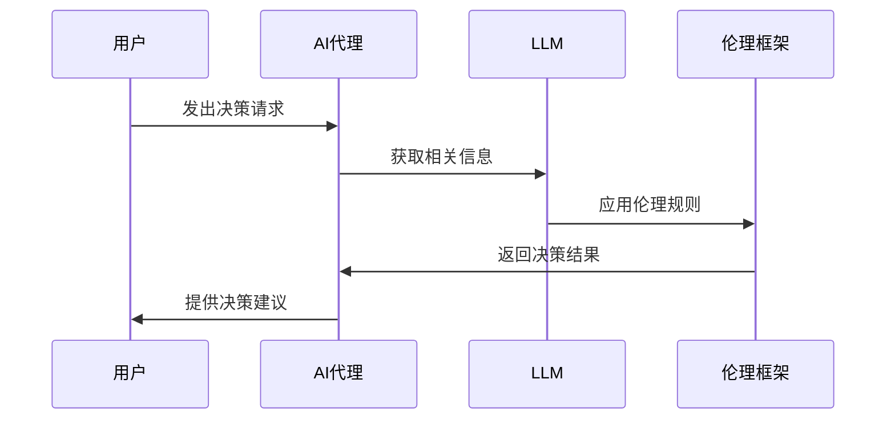

                 


# AI Agent的道德决策：在LLM中植入伦理框架

## 关键词
AI Agent, LLM, 伦理框架, 道德决策, 系统架构, 代码实现, 实体关系图

## 摘要
本文探讨如何在AI Agent中植入伦理框架，特别是在大语言模型（LLM）中的应用。通过分析伦理框架的原理、系统架构设计和项目实战，本文详细介绍了如何实现道德决策，确保AI行为符合伦理规范。

---

## 第一部分: AI Agent的道德决策概述

### 第1章: AI Agent与道德决策的基本概念

#### 1.1 AI Agent的定义与特点
- **AI Agent**：智能主体，具备感知环境、自主决策和执行任务的能力。
- **特点**：
  - 自主性：独立决策。
  - 反应性：实时响应环境变化。
  - 持续性：长时间运行，持续优化。

#### 1.2 道德决策的定义与重要性
- **道德决策**：基于伦理准则的决策过程。
- **重要性**：确保AI行为符合人类价值观，提升信任度。

#### 1.3 LLM与AI Agent的结合
- **LLM**：大语言模型，处理复杂语言任务。
- **结合方式**：LLM作为AI Agent的核心，提供决策支持。

### 第2章: AI Agent道德决策的背景与问题

#### 2.1 当前AI Agent的发展现状
- **现状**：广泛应用在自动驾驶、医疗等领域。
- **问题**：决策缺乏伦理考量，可能引发道德争议。

#### 2.2 道德决策在AI Agent中的挑战
- **复杂性**：多因素影响决策。
- **文化差异**：不同背景下的道德标准不同。
- **信任问题**：用户对AI决策的信任不足。

---

## 第二部分: 伦理框架的核心原理

### 第3章: 伦理框架的基本原理

#### 3.1 基于规则的伦理框架
- **规则**：明确的伦理准则，如“不伤害他人”。
- **特点**：简单明确，但缺乏灵活性。

#### 3.2 基于效用的伦理框架
- **效用**：最大化整体利益。
- **计算**：使用效用函数评估不同选择的影响。

#### 3.3 混合型伦理框架
- **特点**：结合规则和效用的优点，适应性更强。

### 第4章: 伦理框架的属性特征对比

#### 4.1 伦理框架的属性分析
- 可解释性：规则框架高，效用框架低。
- 可调整性：混合型框架更具灵活性。
- 适应性：混合型框架更强。

#### 4.2 对比分析
- 规则框架适用于简单场景，效用框架适用于复杂场景，混合型框架综合两者优点。

### 第5章: 伦理框架的ER实体关系图

```mermaid
erDiagram
    actor 用户 {
        <外键, 唯一> 用户ID
        <字符串> 用户名
        <日期> 注册时间
    }
    agent AI代理 {
        <外键, 唯一> 代理ID
        <字符串> 代理名称
        <日期> 创建时间
    }
    决策规则 {
        <外键, 唯一> 规则ID
        <字符串> 规则名称
        <文本> 规则内容
    }
    用户与AI代理之间存在决策请求关系
    决策规则与AI代理之间存在应用关系
```

---

## 第三部分: 伦理框架在LLM中的实现

### 第6章: 伦理框架的算法原理

```mermaid
flowchart TD
    A[开始] -> B[选择伦理框架]
    B -> C[定义决策规则或效用函数]
    C -> D[输入决策问题]
    D -> E[计算结果]
    E -> F[选择最优方案]
    F -> G[结束]
```

### 第7章: 伦理框架的系统架构设计

#### 7.1 系统功能设计
- **输入处理**：接收决策请求。
- **决策计算**：应用伦理框架计算结果。
- **输出生成**：返回决策结果。

#### 7.2 系统架构图


#### 7.3 系统接口设计
- **输入接口**：接收决策请求。
- **输出接口**：返回决策结果。

#### 7.4 系统交互流程图



### 第8章: 伦理框架的项目实战

#### 8.1 环境安装与配置
- **工具**：Python 3.8+, PyTorch, Hugging Face库。

#### 8.2 核心代码实现
```python
def apply_ethics_framework():
    # 加载LLM模型
    model = load_model()
    # 定义伦理规则
    rules = ["不伤害他人", "帮助他人"]
    # 输入决策问题
    input_question = "是否应该帮助这个人？"
    # 应用规则
    decision = model.generate_response(input_question, rules)
    return decision
```

#### 8.3 代码解读与分析
- **加载模型**：初始化LLM模型。
- **定义规则**：设定伦理决策的准则。
- **生成决策**：模型基于规则生成响应。

#### 8.4 实际案例分析
- **案例**：自动驾驶遇到紧急情况，模型应用伦理框架选择最小伤害的决策路径。

---

## 第四部分: 最佳实践与总结

### 第9章: 最佳实践与注意事项

#### 9.1 实践中的注意事项
- **规则设计**：确保规则全面且适用。
- **模型选择**：选择适合伦理框架的LLM模型。

#### 9.2 常见问题与解决方案
- **规则冲突**：优先考虑权重高的规则。

### 第10章: 项目总结与展望

#### 10.1 项目成果总结
- 成功将伦理框架植入LLM，提升AI Agent的道德决策能力。

#### 10.2 项目经验与教训
- 经验：明确规则设计，灵活应用框架。
- 教训：需考虑更多复杂场景。

---

## 总结
本文详细探讨了在AI Agent中植入伦理框架的方法，从理论到实践，确保AI决策符合伦理规范。通过系统的架构设计和代码实现，展示了如何在实际项目中应用这些框架，为未来的AI发展提供了重要参考。

