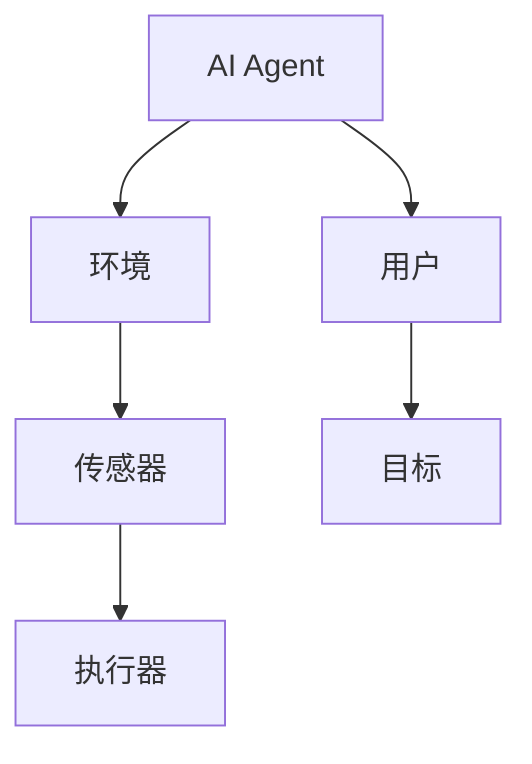
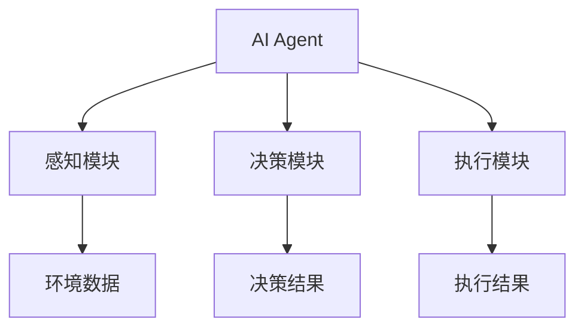
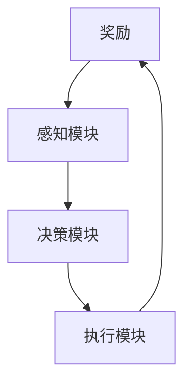
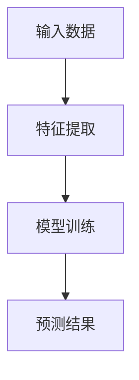
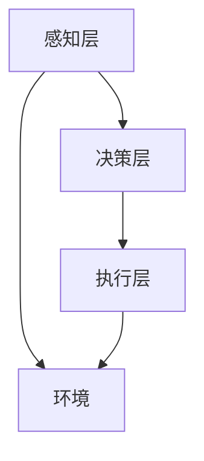
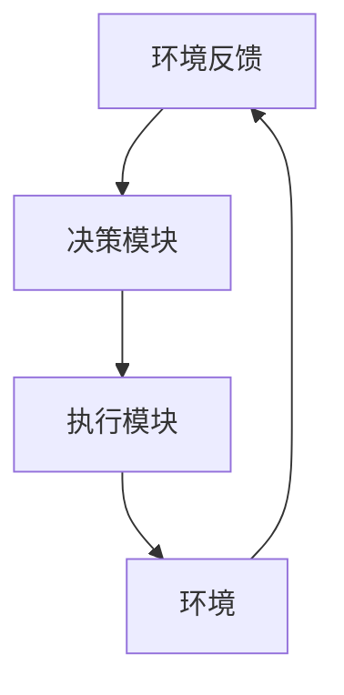
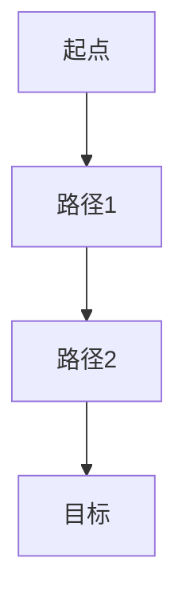

                 


# AI Agent的部署与扩展性考虑

**关键词：** AI Agent, 部署, 扩展性, 系统架构, 算法原理, 应用场景

**摘要：**  
本文深入探讨了AI Agent的部署与扩展性问题，从核心概念、算法原理、系统架构设计到实际应用场景，全面分析了AI Agent在不同环境中的部署策略和扩展性设计的关键点。文章通过具体案例分析，结合实际的代码实现和系统架构图，详细阐述了如何在实际项目中实现AI Agent的高效部署与扩展。通过本文，读者可以全面理解AI Agent的核心原理，并掌握其在实际应用中的部署与扩展技巧。

---

# 第1章 AI Agent的背景与概念

## 1.1 AI Agent的基本概念

AI Agent（智能代理）是一种能够感知环境、自主决策并执行任务的智能系统。它可以分为两类：**反应式AI Agent** 和 **基于模型的AI Agent**。反应式AI Agent主要关注当前环境状态并实时做出反应，而基于模型的AI Agent则依赖于对环境的建模和预测来进行决策。

**表1-1: 不同AI Agent的特征对比**

| 特征         | 反应式AI Agent       | 基于模型的AI Agent     |
|--------------|----------------------|------------------------|
| 环境感知      | 高度依赖实时反馈    | 基于环境模型进行预测    |
| 决策机制      | 基于当前状态         | 基于模型和历史数据      |
| 适用场景      | 简单动态环境         | 复杂或静态环境          |

---

## 1.2 AI Agent的部署背景

随着AI技术的快速发展，AI Agent在企业中的应用需求日益增长。AI Agent能够帮助企业实现自动化决策、优化资源配置和提升用户体验。然而，AI Agent的部署也面临诸多挑战，例如环境复杂性、资源限制和实时性要求等。

**图1-1: AI Agent的实体关系图**



---

## 1.3 AI Agent的扩展性问题

AI Agent的扩展性设计是确保其在复杂环境中的稳定性和性能的关键。扩展性设计需要考虑多方面的因素，包括任务分配、资源分配、容错机制和负载均衡等。以下是扩展性设计的几个关键点：

1. **任务分配**：根据环境状态和系统资源动态分配任务。
2. **资源分配**：优化计算资源的使用，避免资源瓶颈。
3. **容错机制**：设计容错机制以应对节点故障。
4. **负载均衡**：确保系统在高负载下仍能高效运行。

---

# 第2章 AI Agent的核心概念与联系

## 2.1 AI Agent的核心原理

AI Agent的核心原理可以分为感知、决策和执行三个阶段。感知阶段通过传感器获取环境信息，决策阶段基于感知信息做出最优决策，执行阶段通过执行器将决策结果转化为具体动作。

**表2-1: AI Agent核心模块的功能对比**

| 模块       | 输入          | 输出          | 功能描述                     |
|------------|---------------|---------------|------------------------------|
| 感知模块   | 环境信息       | 当前状态       | 解析环境信息，生成状态描述     |
| 决策模块   | 当前状态       | 决策结果       | 基于状态信息做出最优决策     |
| 执行模块   | 决策结果       | 执行结果       | 执行决策并返回执行状态信息    |

---

## 2.2 AI Agent的核心概念对比

AI Agent与其他智能系统（如专家系统、知识图谱）有显著区别。专家系统依赖于规则和知识库，而AI Agent则强调自主性和实时性。以下是三者的对比：

**表2-2: AI Agent与其他智能系统的对比**

| 特性         | AI Agent           | 专家系统         | 知识图谱         |
|--------------|--------------------|------------------|------------------|
| 自主性       | 高                 | 中               | 低               |
| 实时性       | 高                 | 中               | 低               |
| 决策能力     | 强                 | 强               | 弱               |

---

## 2.3 AI Agent的实体关系图

**图2-1: AI Agent的实体关系图**



---

## 2.4 本章小结

本章详细介绍了AI Agent的核心概念和其与其他智能系统的区别，通过对比分析和实体关系图帮助读者理解AI Agent的结构和功能。

---

# 第3章 AI Agent的算法原理

## 3.1 AI Agent的核心算法

AI Agent的算法主要分为强化学习算法和监督学习算法。强化学习通过与环境的交互不断优化策略，而监督学习则基于标注数据进行模型训练。

**图3-1: 强化学习算法的流程图**



---

## 3.2 AI Agent算法的数学模型

强化学习算法的核心是价值函数，用于评估状态-动作对的价值：

$$ V(s) = \max_{a} [ r(s,a) + \gamma V(s') ] $$

其中，$r(s,a)$ 是状态-动作对的奖励，$\gamma$ 是折扣因子，$s'$ 是下一个状态。

---

## 3.3 AI Agent算法的流程图

**图3-2: 监督学习算法的流程图**



---

## 3.4 本章小结

本章通过数学模型和流程图详细讲解了AI Agent的核心算法，帮助读者理解其算法原理和实现方法。

---

# 第4章 AI Agent的系统架构设计

## 4.1 AI Agent的系统架构

AI Agent的系统架构通常包括感知层、决策层和执行层。感知层负责环境数据的采集，决策层基于感知数据做出决策，执行层将决策转化为具体动作。

**图4-1: AI Agent的系统架构图**



---

## 4.2 AI Agent的系统接口设计

AI Agent的系统接口设计需要考虑模块之间的通信和数据交互。以下是一个典型的接口设计示例：

1. 感知模块接口：
   - 输入：环境数据
   - 输出：当前状态

2. 决策模块接口：
   - 输入：当前状态
   - 输出：决策结果

3. 执行模块接口：
   - 输入：决策结果
   - 输出：执行结果

---

## 4.3 AI Agent的系统交互图

**图4-2: 系统交互图**



---

## 4.4 本章小结

本章通过系统架构图和交互图详细分析了AI Agent的系统架构设计，帮助读者理解其内部结构和模块之间的关系。

---

# 第5章 AI Agent的项目实战

## 5.1 环境安装

为了实现AI Agent，首先需要安装以下环境和工具：

1. Python 3.8+
2. TensorFlow或PyTorch
3. OpenAI API
4. 系统运行环境（如Linux或Docker）

---

## 5.2 系统核心实现源代码

以下是一个简单的AI Agent实现代码示例：

```python
import random

class AI_Agent:
    def __init__(self, actions):
        self.actions = actions
        self.q_table = {}  # Q-learning 表

    def感知(self, 状态):
        # 返回当前状态的感知结果
        pass

    def 决策(self, 状态):
        # 基于状态选择动作
        if 状态 not in self.q_table:
            self.q_table[状态] = {action: 0 for action in self.actions}
        max_action = max(self.q_table[状态], key=lambda k: self.q_table[状态][k])
        return max_action

    def 执行(self, 动作):
        # 执行动作并返回结果
        pass
```

---

## 5.3 代码应用解读与分析

上述代码实现了一个简单的Q-learning算法，通过感知、决策和执行三个步骤实现AI Agent的功能。Q-learning是一种经典的强化学习算法，适用于离散动作空间和状态空间的环境。

---

## 5.4 实际案例分析

以一个简单的导航任务为例，AI Agent需要在网格环境中找到目标位置。通过Q-learning算法，AI Agent能够逐步学习并找到最优路径。

**图5-1: 导航任务的网格环境**



---

## 5.5 本章小结

本章通过具体的代码实现和案例分析，详细讲解了AI Agent的实际应用和实现方法。

---

# 第6章 最佳实践与注意事项

## 6.1 最佳实践

1. **模块化设计**：将AI Agent的感知、决策和执行模块独立设计，便于维护和扩展。
2. **容错机制**：设计容错机制以应对节点故障和网络中断。
3. **资源优化**：优化计算资源的使用，避免资源瓶颈。

## 6.2 小结

AI Agent的部署与扩展性设计需要综合考虑算法、系统架构和实际应用场景。通过合理的架构设计和算法优化，可以实现高效、稳定的AI Agent系统。

---

# 第7章 未来展望与拓展阅读

## 7.1 未来展望

随着AI技术的不断进步，AI Agent的应用场景将更加广泛。未来的研究方向包括多智能体协作、自适应学习和边缘计算等。

## 7.2 拓展阅读

1. 《强化学习入门》
2. 《分布式系统设计》
3. 《人工智能系统架构》

---

# 附录

## 附录A: AI Agent相关术语表

| 术语         | 定义                                     |
|--------------|----------------------------------------|
| 状态空间     | 系统可能处的所有可能状态的集合           |
| 动作空间     | 系统可能执行的所有可能动作的集合         |
| 奖励函数     | 衡量动作好坏的函数                       |
| 策略         | 决策过程中的规则或模型                   |

---

## 附录B: AI Agent相关工具

1. TensorFlow
2. PyTorch
3. OpenAI API
4. ROS（Robot Operating System）

---

# 结语

通过本文的详细讲解，读者可以全面理解AI Agent的部署与扩展性设计的关键点，并掌握其在实际应用中的实现方法。希望本文能为AI Agent的研究和应用提供有价值的参考。

--- 

**全文完**

