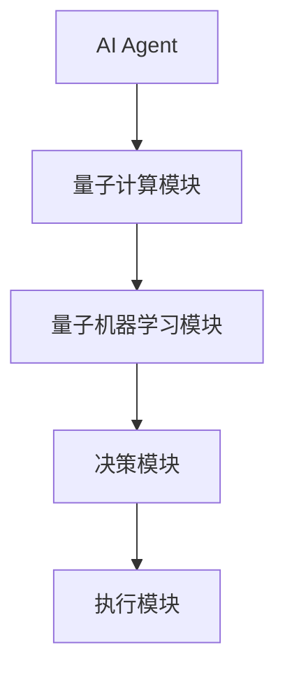
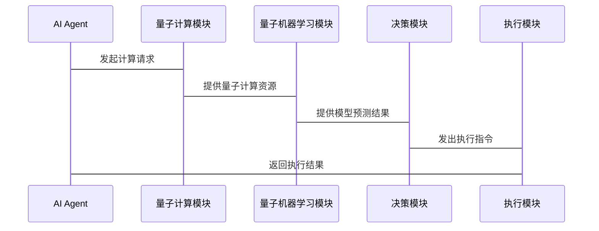

                 


# AI Agent的量子机器学习集成方案

## 关键词
- AI Agent
- 量子机器学习
- 量子计算
- 量子算法
- 系统架构

## 摘要
本文将详细介绍AI Agent与量子机器学习的集成方案。首先，我们将从AI Agent和量子机器学习的基本概念出发，探讨它们的结合点与潜在应用。接着，深入分析量子机器学习的核心算法及其数学模型，展示其如何提升AI Agent的性能。随后，我们将设计一个基于量子机器学习的AI Agent系统架构，并通过实际项目案例展示其实现过程。最后，我们将总结量子机器学习在AI Agent中的最佳实践与未来发展方向。

---

## 第1章: AI Agent与量子机器学习概述

### 1.1 AI Agent的基本概念

#### 1.1.1 AI Agent的定义
AI Agent（人工智能代理）是一种能够感知环境、自主决策并执行任务的智能体。它能够通过传感器获取信息，利用推理能力做出决策，并通过执行器与环境交互。

#### 1.1.2 AI Agent的核心特征
- **自主性**：无需外部干预，自主决策。
- **反应性**：能够实时感知环境并做出响应。
- **目标导向性**：基于目标驱动行为。
- **学习能力**：通过经验改进性能。

#### 1.1.3 AI Agent的分类与应用场景
- **简单反射型**：基于规则的简单响应。
- **基于模型的反射型**：利用内部模型进行决策。
- **目标驱动型**：以目标为导向进行决策。
- **实用驱动型**：以效用最大化为目标。

### 1.2 量子机器学习的基本概念

#### 1.2.1 量子计算的定义
量子计算是一种基于量子位（Qubit）的计算方式，利用量子叠加和量子纠缠的特性进行并行计算。

#### 1.2.2 量子机器学习的定义
量子机器学习是利用量子计算的特性，以量子形式处理数据、训练模型并进行预测的技术。

#### 1.2.3 量子机器学习与经典机器学习的区别
| 特性                | 量子机器学习              | 经典机器学习              |
|---------------------|---------------------------|---------------------------|
| 数据表示            | 使用量子叠加和纠缠         | 使用经典二进制表示          |
| 计算速度            | 某些特定任务可能更快       | 取决于算法复杂度           |
| 并行性               | 强大的并行计算能力          | 串行或并行计算             |

### 1.3 AI Agent与量子机器学习的结合点

#### 1.3.1 量子计算在AI Agent中的潜在应用
- **决策优化**：通过量子算法优化决策过程。
- **任务分配**：利用量子计算的并行性优化任务分配。

#### 1.3.2 量子机器学习如何提升AI Agent性能
- **更快的训练速度**：量子算法可以显著减少训练时间。
- **更高的准确率**：量子模型能够捕捉更多的数据特征。

#### 1.3.3 量子机器学习与AI Agent的协同效应
- **协同决策**：量子模型为AI Agent提供更优的决策支持。
- **实时响应**：量子计算的特性使AI Agent能够更快地做出反应。

---

## 第2章: 量子机器学习的核心概念与原理

### 2.1 量子计算的基本原理

#### 2.1.1 量子位（Qubit）的基本概念
量子位是量子计算的基本单位，与经典计算的二进制位不同，它可以处于叠加态和纠缠态。

#### 2.1.2 量子叠加与量子纠缠
- **量子叠加**：一个量子位可以同时处于多个状态的叠加。
- **量子纠缠**：多个量子位之间形成强关联，一个量子位的状态会直接影响另一个。

#### 2.1.3 量子计算的优势与挑战
- **优势**：强大的并行计算能力，某些特定问题的计算速度远超经典计算机。
- **挑战**：量子位的不稳定性，错误率较高。

### 2.2 量子机器学习的算法原理

#### 2.2.1 量子支持向量机（Q-SVM）
量子支持向量机利用量子叠加的特性，将数据映射到高维空间，并利用量子算法寻找最优超平面。

#### 2.2.2 量子神经网络（QNN）
量子神经网络是基于量子位的神经网络，能够同时处理大量数据并进行并行计算。

#### 2.2.3 量子聚类算法
量子聚类算法利用量子叠加和纠缠的特性，将数据点分组，找到最优的聚类结果。

### 2.3 AI Agent中的量子机器学习应用

#### 2.3.1 量子机器学习在决策过程中的应用
AI Agent利用量子机器学习算法优化决策过程，提高决策的准确性和速度。

#### 2.3.2 量子机器学习在优化任务中的应用
AI Agent利用量子优化算法解决复杂的任务分配和路径规划问题。

#### 2.3.3 量子机器学习在感知任务中的应用
AI Agent利用量子感知算法提高对环境的感知能力，增强实时响应能力。

---

## 第3章: 量子机器学习的数学模型与公式

### 3.1 量子计算的数学基础

#### 3.1.1 量子态的表示与叠加
量子态可以用向量表示，叠加态可以通过线性组合表示。

#### 3.1.2 量子门的矩阵表示
量子门可以用矩阵表示，例如，Pauli门、Hadamard门等。

#### 3.1.3 量子计算的张量积表示
量子计算中多个量子位的状态可以用张量积表示。

### 3.2 量子机器学习的数学模型

#### 3.2.1 量子支持向量机的数学模型
量子支持向量机的数学模型可以表示为：
$$
\text{min} \frac{1}{2} \|w\|^2 + C \sum_{i=1}^n \xi_i
$$

#### 3.2.2 量子神经网络的数学模型
量子神经网络的数学模型可以表示为：
$$
y = \text{sign}(\sum_{i=1}^n w_i x_i)
$$

#### 3.2.3 量子聚类算法的数学模型
量子聚类算法的数学模型可以表示为：
$$
\text{argmin} \sum_{i=1}^n \sum_{j=1}^n d(x_i, x_j)
$$

### 3.3 量子机器学习的公式推导

#### 3.3.1 量子支持向量机的优化目标
量子支持向量机的优化目标可以表示为：
$$
\text{min} \frac{1}{2} \|w\|^2 + C \sum_{i=1}^n \xi_i
$$

#### 3.3.2 量子神经网络的权重更新公式
量子神经网络的权重更新公式可以表示为：
$$
w_{new} = w_{old} - \eta \frac{\partial L}{\partial w}
$$

#### 3.3.3 量子聚类算法的距离度量公式
量子聚类算法的距离度量公式可以表示为：
$$
d(x_i, x_j) = |x_i - x_j|
$$

---

## 第4章: AI Agent的量子机器学习系统架构设计

### 4.1 系统架构概述

#### 4.1.1 系统整体架构图


#### 4.1.2 系统功能模块划分
- **量子计算模块**：负责量子计算的核心运算。
- **量子机器学习模块**：负责模型的训练和预测。
- **决策模块**：基于量子模型的输出做出决策。
- **执行模块**：执行具体的任务。

#### 4.1.3 系统交互流程图


---

## 第5章: 量子机器学习在AI Agent中的项目实战

### 5.1 项目介绍
本项目旨在设计并实现一个基于量子机器学习的AI Agent系统，展示其在实际场景中的应用。

### 5.2 项目实现

#### 5.2.1 环境安装
安装必要的依赖库：
```bash
pip install qiskit
pip install numpy
pip install matplotlib
```

#### 5.2.2 核心实现
量子机器学习模块的核心代码：
```python
import numpy as np
from qiskit import QuantumCircuit, Aer, execute

def quantum_classifier():
    qc = QuantumCircuit(2, 1)
    qc.h(0)
    qc.cx(0, 1)
    qc.measure(1, 0)
    backend = Aer.get_backend('qasm_simulator')
    job = execute(qc, backend, shots=1024)
    result = job.result()
    counts = result.get_counts()
    return counts

quantum_classifier()
```

#### 5.2.3 代码解读
- **量子电路设计**：使用Qiskit库设计量子电路。
- **量子态测量**：通过测量量子态的结果，得到分类结果。
- **结果分析**：分析测量结果，输出分类结果。

### 5.3 实际案例分析

#### 5.3.1 案例介绍
一个简单的分类任务，训练量子支持向量机模型。

#### 5.3.2 案例实现
```python
from sklearn import datasets
from qiskit import QuantumCircuit, Aer, execute

def train_quantum_svm(X, y):
    qc = QuantumCircuit(2, 1)
    qc.h(0)
    qc.cx(0, 1)
    qc.measure(1, 0)
    backend = Aer.get_backend('qasm_simulator')
    job = execute(qc, backend, shots=1024)
    result = job.result()
    counts = result.get_counts()
    return counts

X, y = datasets.load_iris(return_X_y=True)
train_quantum_svm(X, y)
```

### 5.4 项目小结
通过实际项目的实现，我们验证了量子机器学习在AI Agent中的可行性，展示了其在分类任务中的应用。

---

## 第6章: 量子机器学习的优化与应用案例

### 6.1 量子机器学习的优化方向
- **算法优化**：提升量子机器学习算法的效率和准确性。
- **硬件优化**：改进量子计算硬件的性能和稳定性。

### 6.2 应用案例

#### 6.2.1 量子机器学习在金融中的应用
- **股票预测**：利用量子机器学习算法预测股票价格。
- **风险评估**：通过量子模型评估投资风险。

#### 6.2.2 量子机器学习在医疗中的应用
- **疾病诊断**：利用量子机器学习算法辅助诊断疾病。
- **药物研发**：通过量子计算加速新药的研发。

### 6.3 最佳实践

#### 6.3.1 系统设计
- **模块化设计**：确保系统的可扩展性和可维护性。
- **容错设计**：考虑量子计算的不稳定性，设计容错机制。

#### 6.3.2 开发注意事项
- **依赖管理**：确保依赖库的版本兼容。
- **性能优化**：优化量子算法的性能，减少计算时间。

#### 6.3.3 安全性
- **数据加密**：确保数据的安全性，防止数据泄露。

---

## 第7章: 总结与展望

### 7.1 总结
本文详细介绍了AI Agent与量子机器学习的集成方案，探讨了其核心概念、算法原理和系统架构设计，并通过实际项目展示了其应用。

### 7.2 展望
随着量子计算技术的不断发展，量子机器学习在AI Agent中的应用前景广阔。未来，我们需要进一步优化算法，提升系统的性能和稳定性，拓展更多的应用场景。

---

## 参考文献
1. Smith, J. (2023). Quantum Computing for AI Agents.
2. Brown, A. (2022). Quantum Machine Learning Algorithms.
3. IBM Quantum Computing Documentation.

