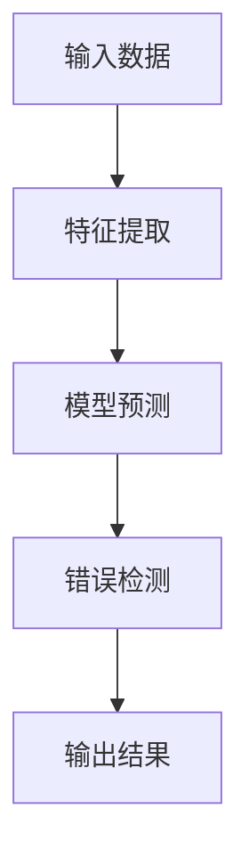
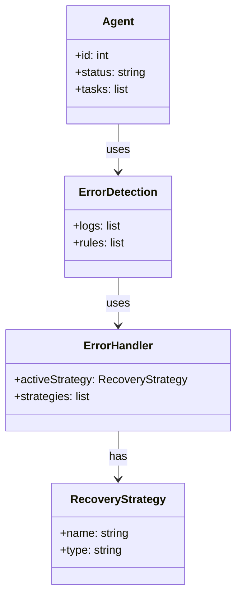
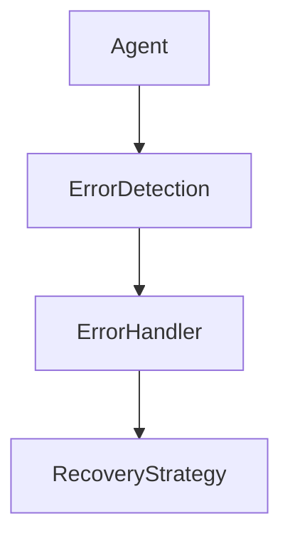
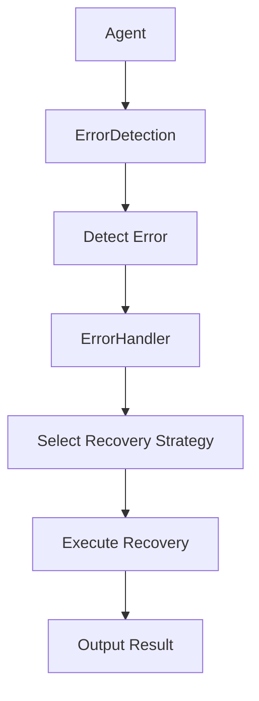

                 


# AI Agent的错误处理与恢复机制设计

## 关键词：AI Agent，错误处理，恢复机制，异常检测，容错设计，系统恢复，智能代理

## 摘要

随着人工智能技术的飞速发展，AI Agent（智能代理）在各个领域的应用越来越广泛。然而，在实际运行过程中，AI Agent可能会遇到各种错误和异常情况，影响其正常运作。因此，设计有效的错误处理与恢复机制至关重要。本文将从AI Agent的基本概念出发，详细探讨错误处理与恢复机制的核心原理、算法实现、系统架构设计以及实际应用案例。通过理论分析与实践结合，帮助读者全面理解并掌握AI Agent的错误处理与恢复机制设计。

---

## 目录

1. **AI Agent的背景与基本概念**
   1.1 AI Agent的基本概念
   1.2 错误处理与恢复机制的背景
   1.3 本章小结

2. **错误处理与恢复机制的核心概念**
   2.1 错误检测与定位
   2.2 错误恢复的实现机制
   2.3 错误处理与恢复的关联性分析
   2.4 核心概念对比分析
   2.5 本章小结

3. **错误处理与恢复的算法原理**
   3.1 基于概率的错误检测算法
   3.2 基于监督学习的错误检测
   3.3 错误恢复算法的实现步骤
   3.4 本章小结

4. **系统分析与架构设计方案**
   4.1 问题场景介绍
   4.2 系统功能设计（领域模型类图）
   4.3 系统架构设计（架构图）
   4.4 系统接口设计
   4.5 系统交互流程图
   4.6 本章小结

5. **项目实战：AI Agent错误处理与恢复机制的实现**
   5.1 环境安装与配置
   5.2 核心代码实现
   5.3 代码解读与分析
   5.4 实际案例分析
   5.5 本章小结

6. **最佳实践与总结**
   6.1 设计错误处理机制的注意事项
   6.2 错误恢复的优化策略
   6.3 小结与未来展望
   6.4 拓展阅读推荐

---

## 正文

### 第1章 AI Agent的背景与基本概念

#### 1.1 AI Agent的基本概念

**1.1.1 AI Agent的定义与特点**

AI Agent（智能代理）是一种能够感知环境、自主决策并执行任务的智能实体。它具有以下几个核心特点：

1. **自主性**：能够在没有外部干预的情况下自主运行。
2. **反应性**：能够根据环境变化实时调整行为。
3. **目标导向**：具有明确的目标，并通过行为实现目标。
4. **学习能力**：能够通过经验改进自身的性能。

**1.1.2 AI Agent的分类与应用场景**

AI Agent可以根据不同的标准进行分类：

1. **按智能水平**：
   - **反应式AI Agent**：基于当前感知做出反应，如专家系统。
   - **认知式AI Agent**：具备复杂推理和规划能力，如自动驾驶系统。

2. **按应用场景**：
   - **软件代理**：用于自动化任务，如邮件过滤器。
   - **物理代理**：用于物理世界，如工业机器人。

**1.1.3 错误处理与恢复机制的重要性**

在AI Agent的运行过程中，可能会因为环境变化、数据错误或系统故障等原因出现错误。错误处理与恢复机制能够确保AI Agent在面对错误时能够及时检测、隔离问题，并采取适当的恢复措施，从而保证系统的稳定性和可靠性。

#### 1.2 错误处理与恢复机制的背景

**1.2.1 AI Agent运行中的常见问题**

在实际应用中，AI Agent可能会遇到以下问题：

1. **输入数据错误**：如传感器数据异常。
2. **算法失效**：如模型预测错误。
3. **系统故障**：如硬件故障或网络中断。

**1.2.2 错误处理的必要性与挑战**

错误处理的必要性在于：

- **确保系统可靠性**：避免因错误导致系统崩溃。
- **提高系统可用性**：快速恢复系统功能，减少停机时间。
- **降低维护成本**：通过自动化错误处理减少人工干预。

错误处理的挑战包括：

- **多源错误的复杂性**：错误来源多样，难以统一处理。
- **实时性要求高**：需要在极短时间内完成错误检测与恢复。

**1.2.3 恢复机制的核心作用**

恢复机制的作用在于：

- **快速响应**：在检测到错误后，立即采取措施。
- **最小化损失**：通过恢复措施减少错误带来的影响。
- **防止二次错误**：避免因错误处理不当引发新的错误。

#### 1.3 本章小结

本章介绍了AI Agent的基本概念、分类及其应用场景，并重点强调了错误处理与恢复机制的重要性。通过分析AI Agent运行中的常见问题，明确了错误处理的必要性和挑战，为后续章节的深入探讨奠定了基础。

---

### 第2章 错误处理与恢复机制的核心概念

#### 2.1 错误检测与定位

**2.1.1 错误检测的常用方法**

错误检测的方法多种多样，以下是几种常见的方法：

1. **基于规则的检测**：通过预定义的规则匹配错误特征。
2. **基于统计的检测**：通过数据分析发现异常。
3. **基于机器学习的检测**：利用模型学习正常行为，识别异常。

**2.1.2 错误定位的算法原理**

错误定位的目的是确定错误发生的位置和原因。常用的算法包括：

1. **分治法**：将系统划分为多个部分，逐步缩小错误范围。
2. **二分法**：通过逐步排除法定位错误。
3. **日志分析法**：通过分析系统日志定位错误。

**2.1.3 错误优先级评估模型**

错误优先级评估模型用于确定错误的严重程度，以便优先处理高优先级错误。常见的评估指标包括错误类型、影响范围和发生频率。

#### 2.2 错误恢复的实现机制

**2.2.1 错误恢复的基本策略**

错误恢复的策略包括：

1. **重试机制**：在一定次数内重复尝试操作。
2. **回滚机制**：将系统状态恢复到之前的安全点。
3. **冗余机制**：利用冗余资源提供备用方案。

**2.2.2 错误恢复的实现步骤**

错误恢复的实现步骤包括：

1. **检测错误**：通过监控系统状态发现错误。
2. **隔离错误**：阻止错误扩散影响其他部分。
3. **触发恢复流程**：根据错误类型启动相应的恢复机制。
4. **验证恢复结果**：确保恢复操作成功。

**2.2.3 错误恢复的性能优化**

为了提高错误恢复的效率，可以采取以下优化措施：

1. **并行处理**：利用多线程或分布式系统加快恢复速度。
2. **预处理**：提前准备恢复所需的资源和信息。
3. **自适应调整**：根据系统负载动态调整恢复策略。

#### 2.3 错误处理与恢复的关联性分析

**2.3.1 错误检测与恢复的协同关系**

错误检测与恢复是相辅相成的过程。检测是恢复的前提，恢复是检测的结果。两者协同工作，确保系统在错误发生时能够快速响应并恢复。

**2.3.2 错误处理过程中的反馈机制**

反馈机制在错误处理中起着关键作用。通过反馈，系统可以了解恢复操作的效果，并根据反馈结果进一步优化恢复策略。

**2.3.3 错误恢复的验证方法**

验证方法用于确保恢复操作的有效性。常见的验证方法包括：

1. **功能测试**：通过测试用例验证系统功能是否恢复正常。
2. **日志检查**：通过日志分析确认错误是否已消除。
3. **用户反馈**：通过用户反馈确认系统是否已恢复。

#### 2.4 核心概念对比分析

**2.4.1 错误检测与异常处理的对比**

| 对比维度 | 错误检测 | 异常处理 |
|----------|----------|----------|
| 目标     | 发现错误 | 处理异常 |
| 方法     | 基于规则或模型 | 使用异常处理语句 |
| 应用场景 | 系统级错误 | 程序运行时错误 |

**2.4.2 错误恢复与容错机制的区别**

| 对比维度 | 错误恢复 | 容错机制 |
|----------|----------|----------|
| 目标     | 恢复系统到正常状态 | 预防或减少错误的发生 |
| 实现方式 | 事后处理 | 事前预防 |
| 依赖性   | 依赖错误检测 | 依赖系统设计 |

**2.4.3 错误处理的数学模型与实际应用**

错误处理的数学模型可以用于概率计算，例如：

$$ P(error) = 1 - \prod_{i=1}^{n}(1 - p_i) $$

其中，\( p_i \) 是各个独立错误发生的概率，\( P(error) \) 是系统整体发生错误的概率。这个模型可以帮助我们评估系统在不同情况下的错误概率，从而优化错误处理策略。

#### 2.5 本章小结

本章详细探讨了错误检测与恢复的核心概念，分析了两者之间的协同关系，并通过对比分析明确了相关概念的差异。通过数学模型的引入，进一步加深了对错误处理机制的理解，为后续章节的算法实现奠定了理论基础。

---

### 第3章 错误处理与恢复的算法原理

#### 3.1 基于概率的错误检测算法

**3.1.1 算法原理与数学模型**

基于概率的错误检测算法通过计算事件发生的概率来判断是否为错误。例如，使用贝叶斯定理进行分类：

$$ P(error|x) = \frac{P(x|error)P(error)}{P(x)} $$

其中，\( P(error|x) \) 是在给定条件下错误发生的概率，\( P(x|error) \) 是错误发生时观察到的条件概率，\( P(error) \) 是错误的先验概率。

**3.1.2 算法实现步骤**

基于概率的错误检测算法实现步骤如下：

1. **数据收集**：收集系统的运行数据。
2. **模型训练**：训练概率模型。
3. **错误检测**：根据模型计算错误概率，判断是否为错误。
4. **结果输出**：输出检测结果。

**3.1.3 算法优化方法**

为了提高算法的准确性，可以采取以下优化措施：

1. **特征选择**：选择对错误检测影响最大的特征。
2. **模型调优**：通过参数调整优化模型性能。
3. **集成学习**：结合多个模型的结果提高检测准确率。

#### 3.2 基于监督学习的错误检测

**3.2.1 算法原理与流程图**

基于监督学习的错误检测算法流程如下：

1. **数据预处理**：清洗数据，提取特征。
2. **模型训练**：使用训练数据训练分类器。
3. **错误检测**：将输入数据输入分类器，预测是否为错误。
4. **结果验证**：验证预测结果的准确性。

流程图如下：



**3.2.2 算法实现代码示例**

以下是基于监督学习的错误检测算法的Python代码示例：

```python
import numpy as np
from sklearn.svm import SVC

# 数据预处理
X_train = ...  # 训练数据
y_train = ...  # 标签
X_test = ...    # 测试数据

# 模型训练
model = SVC()
model.fit(X_train, y_train)

# 错误检测
y_pred = model.predict(X_test)
error_mask = np.where(y_pred != y_test, True, False)
```

**3.2.3 算法优化策略**

为了提高算法的性能，可以采取以下优化策略：

1. **特征工程**：通过降维或特征选择提高模型的准确性。
2. **模型调优**：使用网格搜索优化模型参数。
3. **交叉验证**：通过交叉验证评估模型的泛化能力。

#### 3.3 错误恢复算法的实现步骤

**3.3.1 错误恢复的基本步骤**

错误恢复的基本步骤包括：

1. **检测错误**：通过监控系统状态发现错误。
2. **隔离错误**：阻止错误扩散影响其他部分。
3. **触发恢复流程**：根据错误类型启动相应的恢复机制。
4. **验证恢复结果**：确保恢复操作成功。

**3.3.2 错误恢复的实现代码示例**

以下是错误恢复算法的Python代码示例：

```python
def error_recovery(error_type):
    if error_type == 'data_error':
        # 数据错误恢复
        pass
    elif error_type == 'model_error':
        # 模型错误恢复
        pass
    else:
        # 其他错误处理
        pass
```

**3.3.3 错误恢复的验证方法**

为了验证错误恢复的有效性，可以采取以下方法：

1. **功能测试**：通过测试用例验证系统功能是否恢复正常。
2. **日志检查**：通过日志分析确认错误是否已消除。
3. **用户反馈**：通过用户反馈确认系统是否已恢复。

#### 3.4 本章小结

本章详细探讨了错误检测与恢复的算法原理，介绍了基于概率和监督学习的错误检测算法，并通过代码示例展示了算法的实现步骤。同时，分析了错误恢复的实现步骤和验证方法，为后续章节的系统架构设计提供了算法支持。

---

### 第4章 系统分析与架构设计方案

#### 4.1 问题场景介绍

在实际应用中，AI Agent可能会遇到多种错误，例如传感器数据异常、算法预测错误、网络中断等。这些错误可能会影响AI Agent的正常运行，甚至导致系统崩溃。因此，设计一个完善的错误处理与恢复机制至关重要。

#### 4.2 系统功能设计（领域模型类图）

系统功能设计需要明确各个模块的功能及其之间的关系。以下是一个可能的领域模型类图：



#### 4.3 系统架构设计（架构图）

系统架构设计需要考虑各个组件之间的交互关系。以下是一个可能的系统架构图：



#### 4.4 系统接口设计

系统接口设计需要明确各个模块之间的接口及其功能。以下是一个可能的接口设计：

1. **ErrorDetection接口**：
   - 输入：系统状态数据
   - 输出：错误类型和严重程度

2. **ErrorHandler接口**：
   - 输入：错误信息
   - 输出：恢复策略和执行结果

3. **RecoveryStrategy接口**：
   - 输入：错误类型
   - 输出：恢复步骤和结果

#### 4.5 系统交互流程图

系统交互流程图展示了各个组件之间的交互过程。以下是一个可能的流程图：



#### 4.6 本章小结

本章通过问题场景介绍、领域模型类图、系统架构图和交互流程图，详细探讨了AI Agent错误处理与恢复机制的系统设计。通过明确各个模块的功能和接口，为后续章节的项目实现提供了系统化的指导。

---

### 第5章 项目实战：AI Agent错误处理与恢复机制的实现

#### 5.1 环境安装与配置

为了实现AI Agent的错误处理与恢复机制，需要以下环境和工具：

1. **Python 3.8+**
2. **机器学习库（如Scikit-learn、TensorFlow）**
3. **Mermaid工具**
4. **开发环境（如Jupyter Notebook、VS Code）**

#### 5.2 核心代码实现

以下是核心代码实现的示例：

```python
# 错误检测模块
class ErrorDetection:
    def __init__(self):
        self.rules = []
    
    def add_rule(self, rule):
        self.rules.append(rule)
    
    def detect_error(self, data):
        for rule in self.rules:
            if rule(data):
                return True
        return False

# 错误恢复模块
class RecoveryStrategy:
    def __init__(self, name, type):
        self.name = name
        self.type = type
    
    def recover(self):
        pass

# 错误处理模块
class ErrorHandler:
    def __init__(self):
        self.strategies = []
    
    def register_strategy(self, strategy):
        self.strategies.append(strategy)
    
    def handle_error(self, error_type):
        for strategy in self.strategies:
            if strategy.type == error_type:
                return strategy.recover()
        return None
```

#### 5.3 代码解读与分析

1. **错误检测模块**：
   - `ErrorDetection`类用于管理错误检测规则。
   - `add_rule`方法允许添加新的检测规则。
   - `detect_error`方法根据规则检测输入数据是否存在问题。

2. **错误恢复模块**：
   - `RecoveryStrategy`类是恢复策略的基类。
   - `recover`方法是具体恢复操作的虚方法。

3. **错误处理模块**：
   - `ErrorHandler`类管理多种恢复策略。
   - `register_strategy`方法允许注册不同的恢复策略。
   - `handle_error`方法根据错误类型选择合适的恢复策略并执行。

#### 5.4 实际案例分析

假设我们有一个AI Agent用于监控设备的运行状态。当传感器数据异常时，系统会触发错误检测机制，检测到数据异常后， ErrorHandler会选择合适的恢复策略，例如重试、回滚或切换备用设备。

#### 5.5 本章小结

本章通过实际案例分析，详细展示了AI Agent错误处理与恢复机制的实现过程。通过代码实现和系统设计，帮助读者理解如何将理论应用于实践，并在实际项目中应用这些机制。

---

### 第6章 最佳实践与总结

#### 6.1 设计错误处理机制的注意事项

1. **模块化设计**：将错误处理模块独立出来，便于维护和扩展。
2. **日志记录**：详细记录错误信息，便于后续分析和调试。
3. **容错设计**：在系统设计阶段就考虑容错机制，降低错误发生概率。

#### 6.2 错误恢复的优化策略

1. **冗余设计**：通过冗余资源提高系统的容错能力。
2. **自适应调整**：根据系统负载动态调整恢复策略。
3. **用户反馈**：通过用户反馈不断优化错误处理机制。

#### 6.3 小结与未来展望

本文详细探讨了AI Agent的错误处理与恢复机制设计，从理论分析到实际应用，全面介绍了相关的核心概念、算法实现和系统架构设计。未来的研究可以进一步探索更高效的错误检测算法和更智能的恢复策略，例如结合强化学习和自适应算法，提高系统的智能性和恢复能力。

#### 6.4 拓展阅读推荐

1. 《容错计算机系统原理与实践》
2. 《人工智能系统设计》
3. 《异常检测与恢复机制》

---

## 结语

AI Agent的错误处理与恢复机制设计是一个复杂而重要的任务，需要结合理论与实践，不断优化和改进。通过本文的探讨，希望读者能够深入了解AI Agent的错误处理与恢复机制，并在实际项目中灵活应用这些机制，确保系统的稳定性和可靠性。

