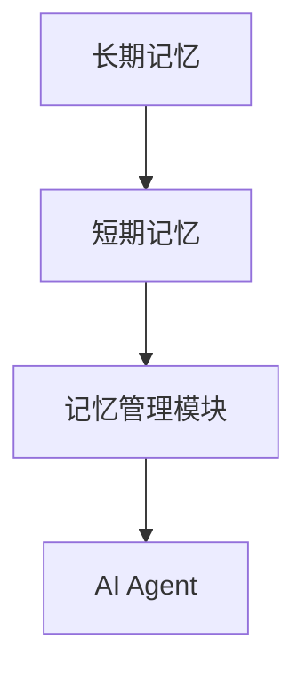
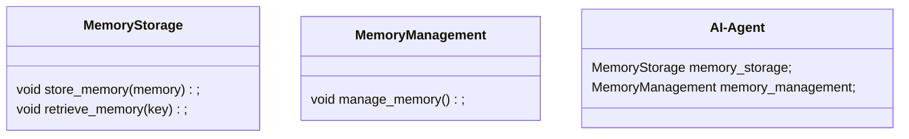
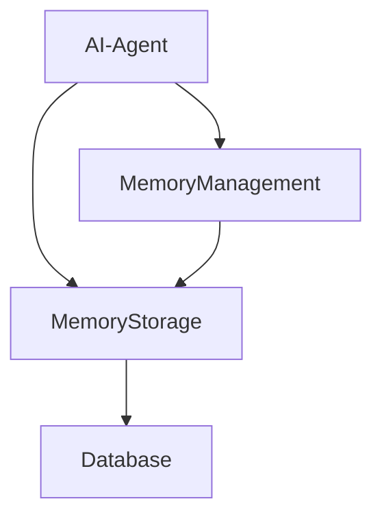
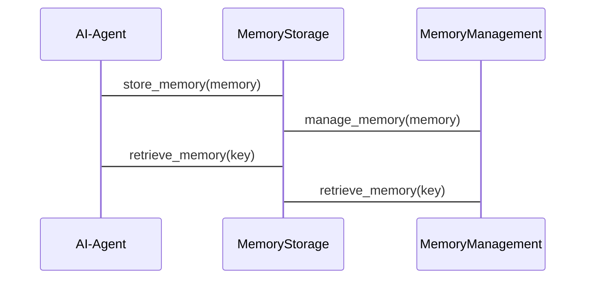

                 


# AI Agent的长短期记忆管理

> 关键词：AI Agent, 长期记忆, 短期记忆, 记忆管理, 算法实现, 系统架构, 项目实战

> 摘要：本文深入探讨了AI Agent的长短期记忆管理的关键概念、算法实现和系统架构。从背景介绍到核心概念，从算法原理到系统设计，再到项目实战，系统地剖析了长短期记忆管理的实现细节和应用实践。通过详细的代码实现和案例分析，帮助读者全面掌握AI Agent的记忆管理技术。

---

# 第一部分: AI Agent的长短期记忆管理基础

# 第1章: AI Agent与记忆管理概述

## 1.1 问题背景与问题描述
### 1.1.1 AI Agent的基本概念
AI Agent（智能体）是指能够感知环境并采取行动以实现目标的智能系统。AI Agent需要具备记忆能力，以便在复杂环境中高效地完成任务。

### 1.1.2 长短期记忆管理的必要性
在动态和复杂环境中，AI Agent需要记住之前的状态、交互和经验，以便在后续任务中利用这些信息做出更明智的决策。长短期记忆管理是实现这一目标的核心技术。

### 1.1.3 问题解决的思路与方法
通过结合神经网络和符号逻辑的方法，设计一种能够动态调整长短期记忆的机制，以实现高效的信息存储和检索。

### 1.1.4 边界与外延
长短期记忆管理的边界包括记忆的存储、检索和遗忘机制。其外延涉及认知科学、计算机科学和人工智能等多个领域。

### 1.1.5 概念结构与核心要素
长短期记忆管理的核心要素包括记忆存储、记忆检索和记忆管理模块。

## 1.2 本章小结
本章通过介绍AI Agent的基本概念、长短期记忆管理的必要性以及其边界和外延，为后续章节奠定了基础。

---

# 第二部分: 长短期记忆管理的核心概念与联系

# 第2章: 长短期记忆模型的原理与特点

## 2.1 长期记忆模型的原理
### 2.1.1 基于神经网络的长期记忆模型
使用深度学习模型（如LSTM和Transformer）来实现长期记忆的存储和检索。

### 2.1.2 基于符号逻辑的长期记忆模型
通过符号逻辑和知识图谱来表示和存储长期记忆。

### 2.1.3 长期记忆模型的优缺点对比
长期记忆模型的优点包括高容量和持久性，缺点包括检索速度慢和难以动态调整。

## 2.2 短期记忆模型的原理
### 2.2.1 基于滑动窗口的短期记忆模型
通过滑动窗口技术来实现短期记忆的存储和检索。

### 2.2.2 基于注意力机制的短期记忆模型
使用注意力机制来动态调整短期记忆的关注点。

### 2.2.3 短期记忆模型的优缺点对比
短期记忆模型的优点包括快速检索和灵活性，缺点包括容量有限和易遗忘。

## 2.3 长短期记忆的关联与协调
### 2.3.1 长短期记忆的协同机制
通过记忆管理模块实现长短期记忆的协同工作。

### 2.3.2 长短期记忆的动态平衡
通过动态调整长短期记忆的权重来实现记忆的动态平衡。

### 2.3.3 长短期记忆的相互影响
长短期记忆相互影响，共同优化AI Agent的记忆管理能力。

## 2.4 核心概念对比表格
### 表2-1: 长期记忆与短期记忆的对比

| 属性         | 长期记忆            | 短期记忆            |
|--------------|--------------------|--------------------|
| 存储时间      | 长期               | 短期               |
| 存储容量      | 大                 | 小                 |
| 检索速度      | 较慢               | 较快               |
| 适用场景      | 知识库、历史记录    | 当前任务、上下文    |

## 2.5 ER实体关系图


## 2.6 本章小结
本章通过详细阐述长短期记忆模型的原理、特点及其协同机制，帮助读者理解长短期记忆管理的核心概念。

---

# 第三部分: 长短期记忆管理的算法原理

# 第3章: 长短期记忆管理的算法实现

## 3.1 基于时间的衰减模型
### 3.1.1 算法原理
基于时间的衰减模型通过为记忆设置一个衰减系数，随着时间的推移，记忆的重要性逐渐降低。

### 3.1.2 算法流程
1. 初始化记忆存储模块。
2. 记录每个记忆的时间戳。
3. 根据时间戳计算记忆的衰减系数。
4. 动态调整记忆的权重。
5. 实现记忆的存储和检索。

### 3.1.3 算法实现
```python
def time_based_decay(memory, timestamp):
    decay_rate = 0.9  # 衰减率
    current_time = timestamp()
    memory_age = current_time - memory['timestamp']
    memory['weight'] = decay_rate ** memory_age
    return memory
```

### 3.1.4 数学模型与公式
长短期记忆的权重计算公式：
$$ weight = decay\_rate^{(current\_time - memory\_timestamp)} $$

### 3.1.5 举例说明
假设当前时间是100，记忆的时间戳是50，衰减率是0.9：
$$ weight = 0.9^{(100 - 50)} = 0.9^{50} \approx 0.0045 $$

## 3.2 基于注意力机制的短期记忆模型
### 3.2.1 算法原理
通过注意力机制动态调整短期记忆的关注点，提高记忆检索的效率。

### 3.2.2 算法流程
1. 初始化短期记忆模块。
2. 计算每个记忆的注意力权重。
3. 根据注意力权重进行记忆的加权求和。
4. 实现记忆的存储和检索。

### 3.2.3 算法实现
```python
def attention_based_short_term(memory_list, query):
    # 计算注意力权重
    attention_weights = [calculate_attention(memory, query) for memory in memory_list]
    # 加权求和
    weighted_memory = sum(memory * weight for memory, weight in zip(memory_list, attention_weights))
    return weighted_memory
```

### 3.2.4 数学模型与公式
注意力权重计算公式：
$$ attention\_weight = \frac{e^{query \cdot memory}}{\sum_{i=1}^{n} e^{query \cdot memory_i}} $$

## 3.3 长期记忆的存储与检索
### 3.3.1 长期记忆的存储
使用神经网络模型（如Transformer）对长期记忆进行编码和存储。

### 3.3.2 长期记忆的检索
通过查询匹配或相似度计算实现长期记忆的检索。

## 3.4 本章小结
本章通过详细讲解基于时间的衰减模型和基于注意力机制的短期记忆模型，展示了长短期记忆管理的算法实现。

---

# 第四部分: 长短期记忆管理的系统架构

# 第4章: 长短期记忆管理的系统分析与设计

## 4.1 问题场景介绍
### 4.1.1 智能客服中的记忆管理
在智能客服场景中，AI Agent需要记住与用户的对话历史，以便提供更个性化的服务。

## 4.2 系统功能设计
### 4.2.1 领域模型设计


### 4.2.2 系统架构设计


### 4.2.3 接口设计
定义接口`MemoryStorage`和`MemoryManagement`，实现记忆的存储、检索和管理功能。

### 4.2.4 系统交互设计


## 4.3 本章小结
本章通过分析智能客服场景，设计了长短期记忆管理的系统架构，并展示了系统各部分的交互关系。

---

# 第五部分: 长短期记忆管理的项目实战

# 第5章: 项目实战：智能客服中的长短期记忆管理

## 5.1 环境安装
安装必要的开发环境，包括Python、深度学习框架（如TensorFlow或PyTorch）和相关库。

## 5.2 系统核心实现
### 5.2.1 长期记忆的存储与检索
实现基于神经网络的长期记忆存储模块。

### 5.2.2 短期记忆的管理
实现基于注意力机制的短期记忆管理模块。

## 5.3 代码实现
### 5.3.1 长期记忆存储模块
```python
class LongTermMemoryStorage:
    def store_memory(self, memory):
        # 存储长期记忆
        pass

    def retrieve_memory(self, key):
        # 检索长期记忆
        pass
```

### 5.3.2 短期记忆管理模块
```python
class ShortTermMemoryManagement:
    def manage_memory(self, memories):
        # 管理短期记忆
        pass
```

### 5.3.3 记忆管理模块
```python
class MemoryManager:
    def __init__(self):
        self.long_term_storage = LongTermMemoryStorage()
        self.short_term_management = ShortTermMemoryManagement()

    def process_memory(self, memories):
        # 处理记忆
        pass
```

## 5.4 代码应用解读与分析
通过实际案例分析，解读代码实现，并分析其在智能客服中的应用效果。

## 5.5 项目小结
总结项目实现的关键点，分析项目的优缺点，并提出改进建议。

---

# 第六部分: 最佳实践与总结

# 第6章: 长短期记忆管理的最佳实践

## 6.1 小结
总结全文，回顾长短期记忆管理的核心概念、算法实现和系统架构设计。

## 6.2 注意事项
在实际应用中，需要注意记忆管理的动态调整和系统的可扩展性。

## 6.3 拓展阅读
推荐相关的技术书籍和论文，供读者进一步学习和研究。

## 6.4 思考与实践
鼓励读者结合实际场景，设计和实现自己的长短期记忆管理方案。

---

# 附录

## 附录A: 术语表
列出本文中涉及的专业术语及其定义。

## 附录B: 参考文献
列出本文参考的文献和资料。

---

# 结束语

通过本文的系统介绍和详细讲解，读者可以全面掌握AI Agent的长短期记忆管理技术，并能够将其应用于实际项目中。希望本文能够为相关领域的研究和实践提供有价值的参考。

