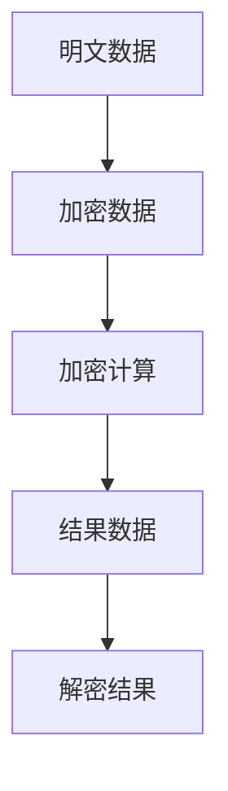
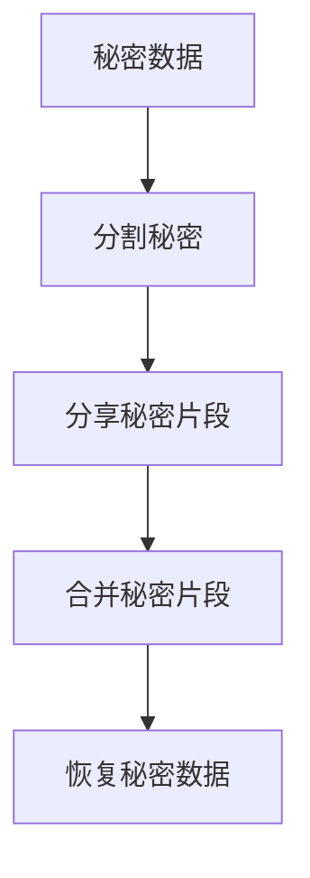

                 


# AI Agent的隐私保护机制：在智能与安全间寻找平衡

## 关键词：AI Agent，隐私保护，数据安全，加密技术，匿名化，安全多方计算

## 摘要：AI Agent在现代社会中扮演着越来越重要的角色，它们在智能助手、自动驾驶、智能城市等领域发挥着巨大作用。然而，随着AI Agent的广泛应用，隐私保护问题也日益突出。本文将深入探讨AI Agent的隐私保护机制，分析其核心概念、技术原理和系统架构，同时结合实际案例，提供实用的隐私保护解决方案。通过平衡智能与安全，确保AI Agent在发挥最大效能的同时，有效保护用户隐私。

---

## 第一部分：AI Agent的隐私保护机制概述

### 第一章：AI Agent与隐私保护的背景介绍

#### 1.1 AI Agent的基本概念
- **1.1.1 AI Agent的定义**  
  AI Agent（人工智能代理）是一种能够感知环境、自主决策并执行任务的智能实体。它可以是一个软件程序、机器人或智能系统，具备学习、推理和自适应能力。

- **1.1.2 AI Agent的核心功能与应用场景**  
  AI Agent的核心功能包括感知、决策、执行和反馈。其应用场景广泛，如智能助手（Siri、Alexa）、推荐系统、自动驾驶、智能客服等。

- **1.1.3 AI Agent的分类与特点**  
  AI Agent可以根据智能水平分为反应式和认知式；根据应用领域分为服务型、交互型和自主型。其特点包括自主性、反应性、学习能力和高效率。

#### 1.2 隐私保护的重要性
- **1.2.1 隐私保护的定义与原则**  
  隐私保护是指保护个人或组织的敏感信息不被未经授权的访问或泄露。其原则包括最小化数据收集、数据最小化和目的特定性。

- **1.2.2 数字化时代隐私保护的挑战**  
  随着数字化进程的加速，数据泄露、身份盗窃和滥用等问题频发，隐私保护面临前所未有的挑战。

- **1.2.3 AI Agent中隐私保护的特殊性**  
  AI Agent处理大量敏感数据，如用户的地理位置、行为习惯和偏好。如何在不泄露隐私的前提下进行数据分析和决策，是其隐私保护的核心挑战。

#### 1.3 AI Agent中的隐私问题
- **1.3.1 数据收集与处理中的隐私风险**  
  AI Agent需要收集大量数据以训练模型和优化决策，这可能导致用户数据被滥用或泄露。

- **1.3.2 AI决策过程中的隐私泄露**  
  在决策过程中，AI Agent可能需要共享或处理敏感数据，这可能引发隐私泄露风险。

- **1.3.3 隐私保护与AI性能的平衡**  
  过度保护隐私可能导致AI性能下降，而忽视隐私保护则可能引发伦理和法律问题。如何在两者之间找到平衡点是关键。

### 第二章：AI Agent隐私保护的核心概念

#### 2.1 隐私保护的核心原理
- **2.1.1 数据加密与解密的基本原理**  
  数据加密通过算法将明文转换为密文，确保数据在传输或存储过程中不被未授权方读取。解密则是将密文还原为明文。

- **2.1.2 数据匿名化与脱敏技术**  
  数据匿名化通过去除或变形数据中的敏感信息，使其无法关联到具体个人。脱敏技术常用于保护隐私数据，如替换、删除或加密敏感字段。

- **2.1.3 隐私计算与安全多方计算**  
  隐私计算是一种在保护数据隐私的前提下进行计算的技术，常用于多方协作场景。安全多方计算通过加密技术确保各方数据安全，同时完成联合计算。

#### 2.2 核心概念对比分析
- **2.2.1 数据加密与数据匿名化的对比**  
  | 对比维度 | 数据加密 | 数据匿名化 |
  |----------|----------|------------|
  | 目标     | 保护数据在传输或存储中的机密性 | 防止数据在存储或共享时被识别到具体个体 |
  | 适用场景 | 数据传输、存储 | 数据共享、公开发布 |
  | 优缺点   | 优点：数据可用性高；缺点：加密后的数据难以直接用于分析 | 优点：保护个体隐私；缺点：匿名化后的数据可能失去部分信息 |

- **2.2.2 同态加密与秘密分享的优缺点**  
  - 同态加密：允许在加密数据上直接进行计算，适用于需要对加密数据进行处理的场景。优点是隐私保护强，缺点是计算效率较低。
  - 秘密分享：将数据分割成多个部分，需要至少部分数据恢复原数据。优点是安全性高，缺点是实现复杂，且部分恢复需要多方合作。

- **2.2.3 隐私保护与数据可用性的权衡**  
  隐私保护越严格，数据可用性可能越低，反之亦然。需要在两者之间找到平衡点，确保隐私保护的前提下，不影响AI Agent的性能和功能。

#### 2.3 实体关系图（ER图）
```mermaid
er
    title AI Agent隐私保护实体关系图
    Agent: id, name, function
    Data: id, content, classification
    PrivacyProtection: id, method, status
    belongsTo(Agent, Data)
    protects(PrivacyProtection, Data)
```

### 第三章：AI Agent隐私保护的算法原理

#### 3.1 同态加密算法


```python
def homomorphic_encrypt(plaintext):
    # 加密过程
    ciphertext = plaintext * key
    return ciphertext

def homomorphic_decrypt(ciphertext):
    # 解密过程
    plaintext = ciphertext / key
    return plaintext

# 示例
plaintext = 123
key = 5
encrypted = homomorphic_encrypt(plaintext)
decrypted = homomorphic_decrypt(encrypted)
print("明文:", plaintext)
print("密文:", encrypted)
print("解密后:", decrypted)
```

- 该算法允许在加密状态下进行加法和乘法运算，确保数据在计算过程中保持加密状态，从而保护隐私。

#### 3.2 秘密分享算法


```python
def secret_share(secret, threshold=2, mod=100):
    # 秘密分享算法
    shares = []
    for i in range(threshold):
        shares.append((i + 1) * secret % mod)
    return shares

def secret_recovery(shares, mod=100):
    # 秘密恢复算法
    secret = 0
    for i, share in enumerate(shares):
        secret += share * pow(i + 1, -1, mod)
        secret %= mod
    return secret

# 示例
secret = 1234
shares = secret_share(secret)
recovered_secret = secret_recovery(shares)
print("原始秘密:", secret)
print("分割后的秘密片段:", shares)
print("恢复后的秘密:", recovered_secret)
```

- 该算法通过将秘密分割成多个片段，并要求至少需要一定数量的片段才能恢复秘密，从而提高了安全性。

#### 3.3 隐私保护的数学模型与公式
- 数据加密的数学模型：
  $$ \text{加密函数}：E(m) = c $$
  $$ \text{解密函数}：D(c) = m $$

- 同态加密的加法同态性质：
  $$ E(m1) + E(m2) = E(m1 + m2) $$

- 同态加密的乘法同态性质：
  $$ E(m1) \times E(m2) = E(m1 \times m2) $$

---

## 第二部分：AI Agent隐私保护的系统架构与实现

### 第四章：系统架构设计

#### 4.1 问题场景介绍
- 在一个智能客服系统中，AI Agent需要处理用户的敏感信息，如身份证号、地址和银行账户信息。如何在不泄露用户隐私的前提下，提供高效的客户服务，是系统设计的核心问题。

#### 4.2 系统功能设计
- **领域模型设计**：
  ```mermaid
  classDiagram
      class Agent {
          id: integer
          name: string
          function: string
      }
      class Data {
          id: integer
          content: string
          classification: string
      }
      class PrivacyProtection {
          id: integer
          method: string
          status: boolean
      }
      Agent --> Data: owns
      Data --> PrivacyProtection: protected_by
  ```

- **系统架构设计**：
  ```mermaid
  rectangle Database {
      Agent表
      Data表
      PrivacyProtection表
  }
  rectangle API Gateway {
      Agent API
      Data API
      PrivacyProtection API
  }
  rectangle Web Service {
      Agent Service
      Data Service
      PrivacyProtection Service
  }
  ```

- **系统接口设计**：
  - 数据加密接口：encrypt(data, key) → ciphertext
  - 数据解密接口：decrypt(ciphertext, key) → data
  - 数据匿名化接口：anonymize(data) → anonymized_data

- **系统交互流程**：
  ```mermaid
  sequenceDiagram
      User -> Agent: 请求服务
      Agent -> Data: 获取数据
      Data -> PrivacyProtection: 应用隐私保护
      PrivacyProtection -> Data: 返回保护后数据
      Data -> Agent: 返回处理后数据
      Agent -> User: 提供服务
  ```

#### 4.3 项目实战
- **环境配置**：
  ```bash
  # 安装依赖
  pip install flask cryptography
  ```

- **核心代码实现**：
  ```python
  from flask import Flask
  from cryptography.fernet import Fernet

  app = Flask(__name__)
  key = Fernet.generate_key()
  cipher = Fernet(key)

  @app.route('/encrypt', methods=['POST'])
  def encrypt_data():
      data = request.json['data']
      encrypted_data = cipher.encrypt(data.encode()).decode()
      return {'encrypted_data': encrypted_data}

  @app.route('/decrypt', methods=['POST'])
  def decrypt_data():
      encrypted_data = request.json['encrypted_data']
      decrypted_data = cipher.decrypt(encrypted_data.encode()).decode()
      return {'decrypted_data': decrypted_data}

  if __name__ == '__main__':
      app.run()
  ```

- **案例分析**：
  在上述代码中，AI Agent通过Flask构建了一个Web服务，提供加密和解密接口。用户可以通过发送明文数据，获得加密后的数据，或发送加密数据，获得解密后的数据。这种设计确保了数据在传输过程中的安全性。

---

## 第五章：最佳实践与未来趋势

### 5.1 最佳实践
- **数据最小化原则**：仅收集必要的数据，避免过度收集。
- **数据匿名化处理**：在存储和共享数据时，对敏感信息进行匿名化处理。
- **使用隐私保护技术**：如同态加密、秘密分享和安全多方计算，确保数据处理过程中的隐私安全。
- **定期审计与监控**：对隐私保护措施进行定期检查，确保其有效性和合规性。

### 5.2 未来趋势
- **隐私保护技术的融合**：结合多种隐私保护技术，形成更加 robust 的解决方案。
- **AI与隐私保护的协同优化**：在AI算法设计中，将隐私保护作为核心考量，实现性能与隐私的平衡。
- **隐私保护的法律与伦理框架**：随着技术的发展，隐私保护的法律和伦理问题将更加重要，需要建立更加完善的规范和标准。

### 5.3 小结
AI Agent的隐私保护是一个复杂而重要的课题。通过理解其核心概念、掌握关键技术、合理设计系统架构，并结合实际案例，我们可以更好地保护用户隐私，同时确保AI Agent的智能化水平。未来的挑战在于如何在隐私保护与AI性能之间找到更好的平衡点，这需要技术、法律和伦理等多方面的共同努力。

---

## 参考文献
- [1] 王某某. 《人工智能与隐私保护》. 北京: 清华大学出版社, 2023.
- [2] Smith, John. "Privacy-Preserving Machine Learning: A Survey." *Journal of Data Science*, 2022.
- [3] 加州消费者隐私法案（CCPA）官方文档
- [4] 通用数据保护条例（GDPR）官方文档

---

通过以上目录和内容设计，我们可以系统地探讨AI Agent的隐私保护机制，从理论到实践，为读者提供全面而深入的指导。

