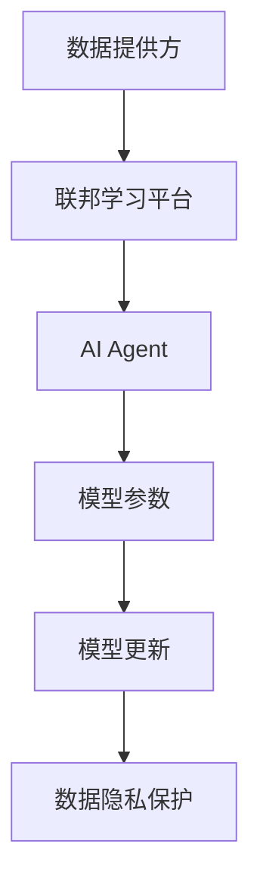

                 


# AI Agent的隐私保护联邦学习：数据不出本地的协作训练

> 关键词：AI Agent，隐私保护，联邦学习，数据协作，模型训练

> 摘要：本文详细探讨了AI Agent在隐私保护联邦学习中的应用，重点分析了如何在数据不出本地的条件下实现协作训练。通过逐步推理，本文揭示了数据隐私保护的核心技术、联邦学习的算法原理以及AI Agent在协作训练中的具体实现。结合实际案例和系统设计，本文为读者提供了一个全面理解AI Agent隐私保护联邦学习的框架。

---

# 第1章: 背景介绍

## 1.1 问题背景

### 1.1.1 数据隐私保护的重要性
在大数据时代，数据隐私保护已成为企业和个人关注的核心问题。随着AI技术的快速发展，数据的共享和协作训练变得越来越频繁，但这也带来了隐私泄露的风险。如何在保证数据隐私的前提下，实现数据的协作训练，成为亟待解决的问题。

### 1.1.2 联邦学习的提出背景
联邦学习（Federated Learning）是一种分布式机器学习技术，旨在在不将数据集中到一个地方的情况下，通过分布式计算实现模型的联合训练。这种技术非常适合解决数据隐私问题，因为它允许数据保留在原始设备或服务器上，仅交换模型参数或中间结果。

### 1.1.3 AI Agent在协作训练中的角色
AI Agent作为智能体，在联邦学习中扮演着关键角色。它负责本地数据的处理、模型的训练以及与远程服务器的通信。AI Agent能够通过本地计算生成梯度或模型更新，然后将这些更新发送到中央服务器，从而实现模型的联合优化。

## 1.2 问题描述

### 1.2.1 数据协作中的隐私泄露风险
在传统的数据共享模式下，数据通常需要从各个设备或服务器集中到一个中央位置进行处理，这带来了数据泄露的巨大风险。一旦数据被集中，攻击者可能通过漏洞或内部人员窃取数据，导致隐私泄露。

### 1.2.2 联邦学习的核心问题
联邦学习的核心问题在于如何在不共享原始数据的情况下，实现模型的联合训练。这需要解决数据隐私保护、模型同步机制以及通信效率等问题。

### 1.2.3 AI Agent在数据不出本地条件下的协作需求
AI Agent需要在本地设备上完成数据处理和模型训练，同时与远程服务器进行通信。这意味着AI Agent需要具备本地计算能力、数据加密能力以及高效的通信机制。

## 1.3 问题解决

### 1.3.1 联邦学习的解决方案
联邦学习通过将模型的训练任务分布到各个设备或服务器上，仅在需要时交换模型参数或中间结果，从而避免了原始数据的共享。这种模式保证了数据的隐私性，同时实现了模型的联合优化。

### 1.3.2 AI Agent在联邦学习中的作用
AI Agent负责本地数据的处理、模型的训练以及与远程服务器的通信。通过AI Agent，各个设备可以在不共享原始数据的情况下，完成模型的联合训练。

### 1.3.3 数据不出本地的协作训练实现方式
数据不出本地的协作训练通过将模型的训练任务分布到各个设备上，并仅交换模型参数或中间结果来实现。这种模式确保了数据的隐私性，同时实现了模型的联合优化。

## 1.4 边界与外延

### 1.4.1 联邦学习的边界条件
联邦学习的边界条件包括数据的分布式存储、模型的联合优化、数据隐私保护以及通信效率。这些条件决定了联邦学习的适用场景和限制。

### 1.4.2 数据不出本地的实现边界
数据不出本地的实现边界包括数据的本地处理、模型的本地训练以及仅交换模型参数或中间结果。这些边界决定了数据隐私保护的实现方式。

### 1.4.3 AI Agent在协作训练中的外延应用
AI Agent在协作训练中的外延应用包括智能设备、边缘计算、物联网等领域。通过AI Agent，这些领域可以实现数据的本地处理和模型的联合优化，同时保证数据的隐私性。

## 1.5 概念结构与核心要素

### 1.5.1 联邦学习的核心要素
联邦学习的核心要素包括分布式数据存储、模型训练、模型同步、数据隐私保护以及通信机制。这些要素共同构成了联邦学习的基础。

### 1.5.2 AI Agent的协作机制
AI Agent的协作机制包括数据处理、模型训练、模型同步以及通信管理。这些机制确保了AI Agent能够在本地设备上完成数据处理和模型训练，并与远程服务器进行通信。

### 1.5.3 数据隐私保护的关键技术
数据隐私保护的关键技术包括数据加密、差分隐私、同态加密以及安全多方计算。这些技术共同保证了数据在协作训练中的隐私性。

## 1.6 本章小结
本章从背景介绍入手，详细探讨了数据隐私保护的重要性、联邦学习的提出背景以及AI Agent在协作训练中的角色。通过问题描述和问题解决，揭示了联邦学习的核心问题以及AI Agent在数据不出本地条件下的协作需求。最后，通过边界与外延的分析，明确了联邦学习的边界条件、数据不出本地的实现边界以及AI Agent的外延应用。

---

# 第2章: 核心概念与联系

## 2.1 核心概念原理

### 2.1.1 联邦学习的基本原理
联邦学习通过将模型的训练任务分布到各个设备或服务器上，仅在需要时交换模型参数或中间结果，从而避免了原始数据的共享。这种模式保证了数据的隐私性，同时实现了模型的联合优化。

### 2.1.2 AI Agent的协作机制
AI Agent负责本地数据的处理、模型的训练以及与远程服务器的通信。通过AI Agent，各个设备可以在不共享原始数据的情况下，完成模型的联合训练。

### 2.1.3 数据隐私保护的技术原理
数据隐私保护的技术原理包括数据加密、差分隐私、同态加密以及安全多方计算。这些技术共同保证了数据在协作训练中的隐私性。

## 2.2 核心概念对比

### 2.2.1 联邦学习与传统数据共享的对比
- **联邦学习**：数据不出本地，仅交换模型参数或中间结果。
- **传统数据共享**：数据集中到中央位置，可能导致隐私泄露。

### 2.2.2 AI Agent与传统协作模型的对比
- **AI Agent**：具备本地计算能力，能够处理数据并完成模型训练。
- **传统协作模型**：依赖中央服务器，数据集中存储。

### 2.2.3 数据不出本地与数据迁移的对比
- **数据不出本地**：数据保留在本地设备上，仅交换模型参数。
- **数据迁移**：数据被移动到中央位置进行处理。

## 2.3 ER实体关系图



## 2.4 本章小结
本章通过核心概念与联系的分析，详细探讨了联邦学习的基本原理、AI Agent的协作机制以及数据隐私保护的技术原理。通过对联邦学习与传统数据共享、AI Agent与传统协作模型、数据不出本地与数据迁移的对比，明确了各概念的特征和差异。最后，通过ER实体关系图，展示了数据提供方、联邦学习平台、AI Agent以及模型更新之间的关系。

---

# 第3章: 算法原理讲解

## 3.1 联邦学习算法概述

### 3.1.1 横向联邦学习
横向联邦学习适用于数据样本维度相同的场景，各个设备或服务器共享相同的特征空间，但数据样本不重叠。模型的更新通过参数同步实现。

### 3.1.2 纵向联邦学习
纵向联邦学习适用于数据特征维度不同的场景，各个设备或服务器共享相同的样本空间，但特征空间不重叠。模型的更新通过特征维度的同步实现。

### 3.1.3 混合联邦学习
混合联邦学习结合了横向和纵向联邦学习的特点，适用于数据样本和特征维度均不重叠的场景。模型的更新通过混合参数同步实现。

## 3.2 AI Agent协作训练算法

### 3.2.1 分散式模型训练
分散式模型训练通过将模型参数分散到各个设备上，每个设备仅处理本地数据，并生成梯度或模型更新。

### 3.2.2 模型同步机制
模型同步机制通过将各个设备生成的梯度或模型更新汇总到中央服务器，然后将更新后的模型参数分发给各个设备。

### 3.2.3 数据隐私保护算法
数据隐私保护算法通过加密或隐私保护技术，确保数据在协作训练过程中的隐私性。

## 3.3 算法流程图


## 3.4 本章小结
本章详细探讨了联邦学习算法的原理，包括横向联邦学习、纵向联邦学习和混合联邦学习。通过AI Agent协作训练算法的分析，揭示了分散式模型训练、模型同步机制以及数据隐私保护算法的核心原理。最后，通过算法流程图，展示了数据提供方、联邦学习平台、AI Agent以及模型更新之间的关系。

---

# 第4章: 系统分析与架构设计方案

## 4.1 问题场景介绍

### 4.1.1 医疗领域的数据协作
在医疗领域，各个医院或医疗机构通常拥有自己的患者数据，但难以共享。通过联邦学习，可以在不共享患者数据的前提下，实现医学模型的联合训练。

### 4.1.2 金融领域的数据协作
在金融领域，各个银行或金融机构拥有自己的客户数据，但难以共享。通过联邦学习，可以在不共享客户数据的前提下，实现金融模型的联合训练。

## 4.2 系统功能设计

### 4.2.1 数据预处理模块
数据预处理模块负责对本地数据进行清洗、归一化等预处理操作，确保数据符合模型训练的要求。

### 4.2.2 模型训练模块
模型训练模块负责在本地设备上完成模型的训练，并生成梯度或模型更新。

### 4.2.3 通信协议模块
通信协议模块负责与远程服务器进行通信，交换模型参数或中间结果。

## 4.3 系统架构图


## 4.4 本章小结
本章通过问题场景的分析，探讨了联邦学习在医疗和金融领域的应用。通过系统功能设计，揭示了数据预处理模块、模型训练模块以及通信协议模块的核心功能。最后，通过系统架构图，展示了数据提供方、联邦学习平台、AI Agent以及模型更新之间的关系。

---

# 第5章: 项目实战

## 5.1 环境安装

### 5.1.1 安装Python
```bash
python --version
pip install --upgrade pip
```

### 5.1.2 安装Flask
```bash
pip install flask
```

## 5.2 核心代码实现

### 5.2.1 AI Agent实现
```python
from flask import Flask, request, jsonify
import json

app = Flask(__name__)

@app.route('/train', methods=['POST'])
def train():
    data = request.json
    # 模型训练代码
    return jsonify({'status': 'success', 'message': '模型训练完成'})

if __name__ == '__main__':
    app.run(debug=True)
```

### 5.2.2 服务器端实现
```python
from flask import Flask, request, jsonify
import json

app = Flask(__name__)

@app.route('/update', methods=['POST'])
def update():
    data = request.json
    # 模型更新代码
    return jsonify({'status': 'success', 'message': '模型更新完成'})

if __name__ == '__main__':
    app.run(debug=True)
```

## 5.3 代码解读与分析

### 5.3.1 AI Agent代码解读
AI Agent代码通过Flask框架实现了本地模型训练的接口。当接收到训练请求时，AI Agent会在本地完成模型训练，并返回训练结果。

### 5.3.2 服务器端代码解读
服务器端代码通过Flask框架实现了模型更新的接口。当接收到模型更新请求时，服务器端会汇总各个设备的模型更新，并生成新的模型参数。

## 5.4 实际案例分析

### 5.4.1 医疗领域的案例
在医疗领域，各个医院可以通过AI Agent在本地完成患者数据的预处理和模型训练，并通过Flask接口将模型更新发送到中央服务器。中央服务器汇总所有设备的模型更新，生成新的模型参数，并将参数分发给各个设备。

### 5.4.2 金融领域的案例
在金融领域，各个银行可以通过AI Agent在本地完成客户数据的预处理和模型训练，并通过Flask接口将模型更新发送到中央服务器。中央服务器汇总所有设备的模型更新，生成新的模型参数，并将参数分发给各个设备。

## 5.5 本章小结
本章通过项目实战，详细探讨了AI Agent和服务器端代码的实现。通过Flask框架，实现了本地模型训练和模型更新的接口。最后，通过医疗和金融领域的案例分析，展示了联邦学习在实际应用中的潜力。

---

# 第6章: 总结与展望

## 6.1 总结

### 6.1.1 核心内容回顾
本文详细探讨了AI Agent在隐私保护联邦学习中的应用，揭示了数据隐私保护的核心技术、联邦学习的算法原理以及AI Agent在协作训练中的具体实现。

### 6.1.2 最佳实践
- 数据隐私保护：采用数据加密、差分隐私等技术，确保数据在协作训练中的隐私性。
- 模型评估：在实际应用中，需要对模型的性能进行评估，确保模型的准确性和鲁棒性。
- 合规性建议：在实际应用中，需要遵守相关法律法规，确保数据的合法使用。

## 6.2 未来展望

### 6.2.1 联邦学习的未来发展
随着技术的进步，联邦学习将在更多领域得到应用，数据隐私保护技术将更加成熟。

### 6.2.2 AI Agent的未来发展方向
AI Agent将在更复杂的场景中发挥作用，具备更强的本地计算能力和更智能的协作机制。

### 6.2.3 数据不出本地的协作训练技术
数据不出本地的协作训练技术将更加高效，模型更新的效率和准确率将不断提高。

## 6.3 本章小结
本章通过总结，回顾了本文的核心内容，并提出了数据隐私保护、模型评估以及合规性建议等最佳实践。最后，通过未来展望，探讨了联邦学习、AI Agent以及数据不出本地的协作训练技术的发展方向。

---

# 结语
本文通过详细探讨AI Agent在隐私保护联邦学习中的应用，揭示了数据隐私保护的核心技术、联邦学习的算法原理以及AI Agent在协作训练中的具体实现。通过实际案例分析和系统设计，展示了联邦学习在医疗和金融领域的潜力。未来，随着技术的进步，联邦学习和AI Agent将在更多领域得到广泛应用，数据隐私保护技术也将更加成熟。

