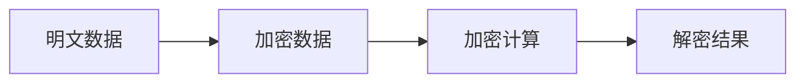
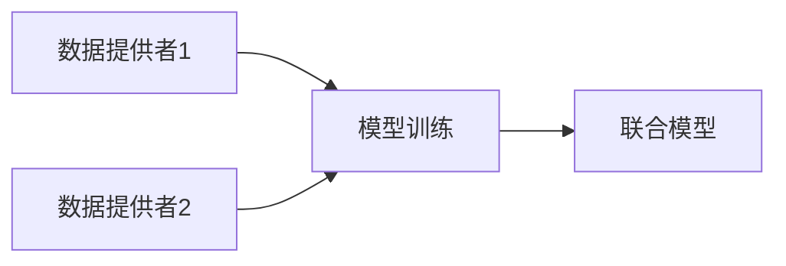
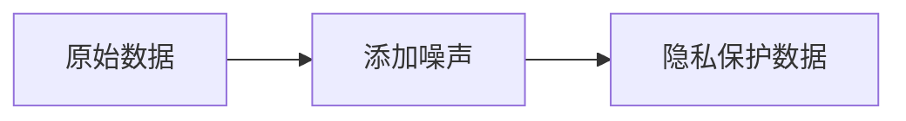
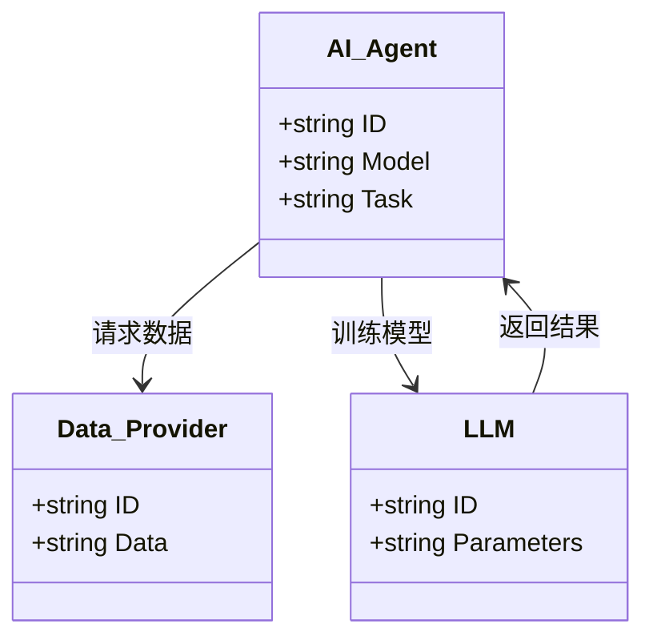
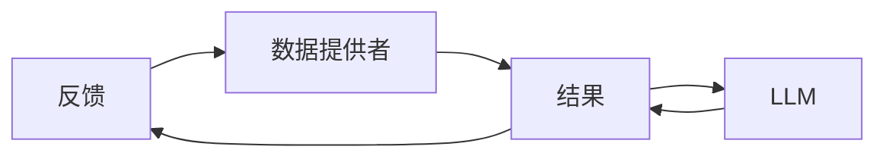
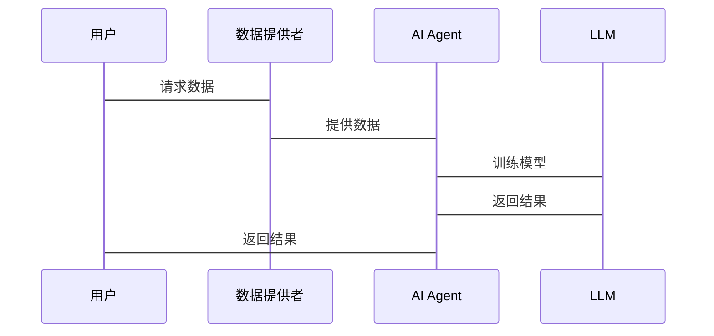

                 


# AI Agent的隐私计算：在保护数据隐私的同时应用LLM

> 关键词：AI Agent, 隐私计算, 大型语言模型, 同态加密, 联邦学习, 差分隐私

> 摘要：  
在当前数字化时代，数据隐私保护的重要性日益凸显。AI Agent作为人工智能领域的重要技术，如何在保护数据隐私的前提下应用大型语言模型（LLM）成为一个关键问题。本文将从AI Agent的基本概念出发，结合隐私计算的核心原理，深入分析如何在保护数据隐私的同时，有效应用LLM技术。文章将详细探讨隐私计算的算法原理、系统架构设计、项目实战以及实际案例分析，为读者提供全面的技术指导。

---

## # 第1章: AI Agent与隐私计算概述

### ## 1.1 AI Agent的基本概念

#### ### 1.1.1 AI Agent的定义与分类
AI Agent（人工智能代理）是指能够感知环境、自主决策并执行任务的智能实体。根据功能和应用场景的不同，AI Agent可以分为多种类型，例如基于规则的代理、基于模型的代理、基于学习的代理等。

#### ### 1.1.2 隐私计算的核心概念
隐私计算是一种在保护数据隐私的前提下，对数据进行处理和分析的技术。其核心在于确保数据在计算过程中不被泄露或滥用。

#### ### 1.1.3 AI Agent与隐私计算的结合
AI Agent可以通过隐私计算技术，在不暴露原始数据的情况下，利用大型语言模型进行分析和决策。这种结合能够有效解决数据隐私保护与AI技术应用之间的矛盾。

### ## 1.2 隐私计算的背景与挑战

#### ### 1.2.1 数据隐私的重要性
随着数据量的激增，数据隐私保护成为企业和个人关注的焦点。隐私计算技术能够帮助我们在不暴露数据的前提下，完成数据分析和模型训练。

#### ### 1.2.2 当前隐私计算的主要技术
当前，隐私计算的主要技术包括同态加密、联邦学习、差分隐私等。这些技术各有优缺点，适用于不同的应用场景。

#### ### 1.2.3 AI Agent在隐私计算中的应用前景
AI Agent结合隐私计算技术，可以在医疗、金融、教育等领域实现数据隐私保护下的智能应用，具有广阔的发展前景。

### ## 1.3 本章小结

---

## # 第2章: 隐私计算的核心概念与联系

### ## 2.1 隐私计算的原理与方法

#### ### 2.1.1 数据加密与隐私保护
通过数据加密技术，可以在不暴露原始数据的前提下，完成数据的处理和分析。

#### ### 2.1.2 数据匿名化技术
数据匿名化技术通过去除或脱敏敏感信息，确保数据在共享和分析过程中的隐私安全。

#### ### 2.1.3 数据共享与计算分离
隐私计算的核心思想是将数据与计算分离，确保数据的所有者无需共享原始数据，即可完成计算任务。

### ## 2.2 AI Agent的隐私计算模型

#### ### 2.2.1 隐私计算的数学模型
隐私计算的数学模型通常涉及加密算法和概率统计方法，确保在不泄露数据的前提下，完成数据分析和建模。

#### ### 2.2.2 AI Agent的隐私计算架构
AI Agent的隐私计算架构包括数据预处理、模型训练、结果解密等模块，确保数据的隐私性和计算的高效性。

#### ### 2.2.3 隐私计算与AI Agent的交互流程
隐私计算与AI Agent的交互流程包括数据加密、模型训练、结果解密等步骤，确保数据的安全性和计算的高效性。

### ## 2.3 核心概念对比与ER图分析

#### ### 2.3.1 隐私计算与传统数据处理的对比
隐私计算与传统数据处理的主要区别在于数据的安全性和隐私性保护。

#### ### 2.3.2 AI Agent与传统AI的区别
AI Agent具有自主决策和动态适应能力，而传统AI通常需要人工干预和调整。

#### ### 2.3.3 ER实体关系图的构建

```mermaid
erDiagram
    actor User {
        +string ID
        +string Name
    }
    actor DataProvider {
        +string ID
        +string Data
    }
    actor Model {
        +string ID
        +string Parameters
    }
    User --> DataProvider: 提供数据
    DataProvider --> Model: 训练模型
    Model --> User: 返回结果
```

---

## # 第3章: 隐私计算的算法原理

### ## 3.1 隐私计算的核心算法

#### ### 3.1.1 同态加密算法

##### 同态加密的流程



##### 同态加密的数学模型

加密函数：$Enc(m) = c$

解密函数：$Dec(c) = m$

加密密钥：$pk$

解密密钥：$sk$

加密计算：$E(f(x)) = f(E(x))$

##### 同态加密的Python代码示例

```python
import numpy as np
from cryptography.fernet import Fernet

# 生成加密密钥
key = Fernet.generate_key()
cipher = Fernet(key)

# 加密数据
plaintext = "Sensitive data"
encrypted = cipher.encrypt(plaintext.encode())

# 解密数据
decrypted = cipher.decrypt(encrypted).decode()
```

#### ### 3.1.2 联邦学习算法

##### 联邦学习的流程



##### 联邦学习的数学模型

模型参数：$\theta$

数据提供者1的梯度：$g_1$

数据提供者2的梯度：$g_2$

联合梯度：$g = g_1 + g_2$

更新参数：$\theta = \theta - \eta g$

##### 联邦学习的Python代码示例

```python
import tensorflow as tf

# 数据提供者1的模型
model1 = tf.keras.Sequential([
    tf.keras.layers.Dense(64, activation='relu'),
    tf.keras.layers.Dense(1)
])

# 数据提供者2的模型
model2 = tf.keras.Sequential([
    tf.keras.layers.Dense(64, activation='relu'),
    tf.keras.layers.Dense(1)
])

# 联合训练
model1.compile(optimizer='adam', loss='mse')
model2.compile(optimizer='adam', loss='mse')

# 模型训练
model1.fit(x1, y1, epochs=10)
model2.fit(x2, y2, epochs=10)

# 合并模型参数
theta1 = model1.get_weights()
theta2 = model2.get_weights()
combined_theta = [theta1[i] + theta2[i] for i in range(len(theta1))]
```

#### ### 3.1.3 差分隐私技术

##### 差分隐私的流程



##### 差分隐私的数学模型

隐私预算：$\epsilon$

概率函数：$P(y|x) \geq \frac{1}{\epsilon} \ln \left( \frac{\epsilon}{\delta} \right)$

##### 差分隐私的Python代码示例

```python
import numpy as np

# 添加噪声
def add_noise(x, epsilon=1.0):
    noise = np.random.laplace(0, 1.0/epsilon)
    return x + noise

# 应用差分隐私
data = np.array([1, 2, 3, 4])
noised_data = add_noise(data)
```

---

## # 第4章: AI Agent的系统分析与架构设计

### ## 4.1 系统分析

#### ### 4.1.1 问题场景介绍
在医疗数据共享场景中，多个数据提供者需要在不共享原始数据的前提下，共同训练一个大型语言模型。

#### ### 4.1.2 项目介绍
本项目旨在设计一个基于隐私计算的AI Agent系统，能够在保护数据隐私的前提下，实现大型语言模型的训练和推理。

### ## 4.2 系统功能设计

#### ### 4.2.1 领域模型设计



#### ### 4.2.2 系统架构设计



#### ### 4.2.3 系统接口设计
系统接口包括数据接口、模型接口和结果接口，分别用于数据的获取、模型的训练和结果的返回。

#### ### 4.2.4 系统交互流程



---

## # 第5章: 项目实战

### ## 5.1 环境安装

#### ### 5.1.1 安装Python
```bash
python --version
```

#### ### 5.1.2 安装依赖库
```bash
pip install cryptography tensorflow keras
```

### ## 5.2 系统核心实现

#### ### 5.2.1 数据预处理
```python
import numpy as np
from cryptography.fernet import Fernet

# 生成加密密钥
key = Fernet.generate_key()
cipher = Fernet(key)

# 加密数据
plaintext = "Sensitive data"
encrypted = cipher.encrypt(plaintext.encode())
```

#### ### 5.2.2 模型训练
```python
import tensorflow as tf
from tensorflow.keras import layers

# 定义模型
model = tf.keras.Sequential([
    layers.Dense(64, activation='relu'),
    layers.Dense(1)
])

# 编译模型
model.compile(optimizer='adam', loss='mse')

# 训练模型
model.fit(x_train, y_train, epochs=10)
```

#### ### 5.2.3 结果解密
```python
# 解密数据
decrypted = cipher.decrypt(encrypted).decode()
```

### ## 5.3 案例分析

#### ### 5.3.1 案例场景
在医疗数据共享场景中，多个医院需要在不共享患者数据的前提下，共同训练一个预测模型。

#### ### 5.3.2 实施步骤
1. 数据提供者生成加密数据
2. AI Agent请求数据
3. LLM进行模型训练
4. 返回解密结果

#### ### 5.3.3 结果解读
通过隐私计算技术，可以在不泄露患者数据的前提下，完成医疗模型的训练和推理。

### ## 5.4 本章小结

---

## # 第6章: 案例分析与详细解读

### ## 6.1 案例场景

#### ### 6.1.1 案例介绍
在金融 fraud detection 场景中，多个银行需要在不共享客户数据的前提下，共同训练一个 fraud detection 模型。

#### ### 6.1.2 实施过程
1. 数据提供者生成加密数据
2. AI Agent请求数据
3. LLM进行模型训练
4. 返回解密结果

### ## 6.2 详细分析

#### ### 6.2.1 数据处理流程
加密数据 -> 数据预处理 -> 模型训练 -> 结果解密

#### ### 6.2.2 模型优化策略
通过联邦学习技术，可以在不共享数据的前提下，优化模型性能。

#### ### 6.2.3 结果评估
评估模型的准确率、召回率和F1分数，确保模型性能达到预期。

### ## 6.3 本章小结

---

## # 第7章: 总结与最佳实践

### ## 7.1 本章总结

#### ### 7.1.1 核心内容回顾
本文详细探讨了AI Agent的隐私计算技术，包括同态加密、联邦学习、差分隐私等算法原理和系统架构设计。

#### ### 7.1.2 实际应用中的注意事项
在实际应用中，需要根据具体场景选择合适的隐私计算技术，并确保系统的安全性和效率。

### ## 7.2 最佳实践 tips

#### ### 7.2.1 选择合适的隐私计算技术
根据具体需求选择同态加密、联邦学习或差分隐私等技术。

#### ### 7.2.2 确保系统的安全性
在实际应用中，需要确保系统的安全性，防止数据泄露和滥用。

#### ### 7.2.3 优化系统的效率
通过算法优化和系统设计，确保隐私计算系统的高效性和可扩展性。

### ## 7.3 未来的研究方向

#### ### 7.3.1 新型隐私计算技术
研究新型隐私计算技术，例如基于区块链的隐私保护技术。

#### ### 7.3.2 AI Agent的智能化发展
推动AI Agent的智能化发展，使其能够自主决策和优化隐私计算过程。

#### ### 7.3.3 行业标准与规范
制定隐私计算行业的标准和规范，促进技术的广泛应用和健康发展。

### ## 7.4 本章小结

---

# 附录: 代码与资源

### ## 附录A: 完整代码示例

```python
import numpy as np
import tensorflow as tf
from cryptography.fernet import Fernet

# 生成加密密钥
key = Fernet.generate_key()
cipher = Fernet(key)

# 加密数据
plaintext = "Sensitive data"
encrypted = cipher.encrypt(plaintext.encode())

# 定义模型
model = tf.keras.Sequential([
    tf.keras.layers.Dense(64, activation='relu'),
    tf.keras.layers.Dense(1)
])

# 编译模型
model.compile(optimizer='adam', loss='mse')

# 训练模型
model.fit(x_train, y_train, epochs=10)

# 解密数据
decrypted = cipher.decrypt(encrypted).decode()
```

### ## 附录B: 进一步学习与资源

- 建议阅读《隐私计算入门与实践》
- 参考TensorFlow Federated官方文档
- 关注隐私计算领域的最新研究论文

---

# 结语

通过本文的详细讲解，读者可以全面了解AI Agent的隐私计算技术，并掌握其在实际应用中的实施方法。希望本文能够为相关领域的研究和实践提供有价值的参考。

