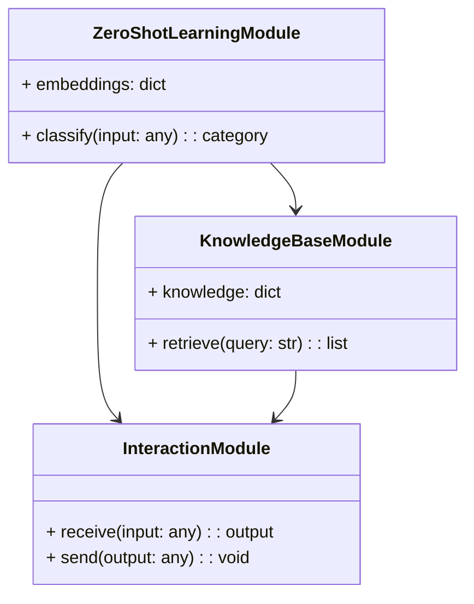

                 


# AI Agent的零样本学习能力开发

> **关键词**：零样本学习、AI Agent、机器学习、自然语言处理、智能系统开发  
> **摘要**：本文详细探讨了AI Agent的零样本学习能力开发，从背景概念到算法实现，再到系统架构和项目实战，全面解析零样本学习的核心原理及其在AI Agent中的应用。

---

## 第一部分：背景与核心概念

### 第1章：零样本学习的背景与核心概念

#### 1.1 零样本学习的背景

零样本学习（Zero-shot Learning，ZSL）是机器学习领域的重要概念，旨在解决数据不足的问题。传统机器学习依赖大量标注数据，而零样本学习通过利用先验知识和语义理解，减少对标注数据的依赖，降低成本并提高效率。零样本学习在自然语言处理、计算机视觉等领域有广泛应用，如问答系统、图像分类等。

#### 1.2 零样本学习的核心概念

零样本学习定义为：模型在无特定类别数据的情况下，识别或分类新样本的能力。其核心概念包括：

- **统一嵌入模型**：将所有类别映射到同一特征空间。
- **语义理解**：通过分析样本之间的语义关系进行分类。
- **高泛化能力**：能够在无新类别数据的情况下，推断出新样本的类别。

零样本学习与迁移学习不同，后者需要特定领域数据，而零样本学习依赖语义信息，适用于新样本分类。

#### 1.3 AI Agent与零样本学习的结合

AI Agent是一种智能体，能够感知环境并执行任务。零样本学习增强了AI Agent的学习能力，使其能够在没有特定任务数据的情况下，快速适应新任务。这种能力在客服、推荐系统等领域有广泛应用，提升AI Agent的适应性和灵活性。

---

## 第二部分：零样本学习的核心原理

### 第2章：零样本学习的核心原理

#### 2.1 零样本学习的原理

零样本学习通过构建统一嵌入模型，将不同类别的样本映射到同一特征空间，利用语义相似度进行分类。关系抽取和语义理解是其关键步骤，通过分析样本之间的关系，模型能够推断出新样本的类别。

#### 2.2 零样本学习的算法流程

零样本学习的算法流程包括：

1. **数据预处理**：特征提取和数据清洗。
2. **模型训练**：使用嵌入方法或模板方法。
3. **推理阶段**：基于相似度计算或模板匹配进行分类。

---

## 第三部分：零样本学习的算法实现

### 第3章：零样本学习的主流算法

#### 3.1 基于嵌入的方法

基于嵌入的方法通过训练嵌入模型，将样本映射到同一空间。使用余弦相似度进行分类，代码示例如下：

```python
import numpy as np

def cosine_similarity(a, b):
    return np.dot(a, b) / (np.linalg.norm(a) * np.linalg.norm(b))

# 示例：分类新样本
new_sample = np.array([...])
similarities = [cosine_similarity(new_sample, category_embedding[i]) for i in range(len(category_embedding))]
```

#### 3.2 基于模板的方法

基于模板的方法生成与查询相似的模板，匹配最接近的类别。代码示例如下：

```python
def generate_template(query):
    # 生成模板
    template = "..."
    return template

# 示例：匹配类别
templates = [...]
matches = []
for template in templates:
    if template_match(query, template):
        matches.append(template)
```

---

## 第四部分：系统架构与设计

### 第4章：AI Agent的系统架构

#### 4.1 系统功能设计

系统功能包括：

- **零样本学习模块**：实现零样本分类。
- **知识库管理模块**：存储和管理知识。
- **交互模块**：与用户交互并处理请求。

类图展示了各模块之间的关系：



---

## 第五部分：项目实战

### 第5章：AI Agent的零样本学习实战

#### 5.1 项目环境安装

安装必要的Python库：

```bash
pip install numpy scikit-learn mermaid
```

#### 5.2 核心代码实现

实现零样本学习的特征提取、模型训练和分类推理代码：

```python
import numpy as np
from sklearn.decomposition import PCA

def train_embeddings(data):
    # 特征提取
    pca = PCA(n_components=100)
    embeddings = pca.fit_transform(data)
    return embeddings

# 示例：分类新样本
new_sample_embedding = train_embeddings(new_sample)
predicted_category = classify(new_sample_embedding)
```

#### 5.3 项目小结

总结项目实现的关键点，讨论优缺点，并提出改进建议。

---

## 第六部分：最佳实践与小结

### 第6章：最佳实践与小结

#### 6.1 最佳实践

- 数据预处理：确保数据质量。
- 模型选择：根据任务选择合适算法。
- 系统优化：提升性能和用户体验。

#### 6.2 项目小结

零样本学习为AI Agent提供了强大的学习能力，减少数据依赖，提升灵活性。通过本文的详细讲解，读者可以掌握零样本学习的核心原理和实现方法。

#### 6.3 注意事项

在开发中，需注意数据质量、模型选择和系统性能，确保AI Agent的高效运行。

#### 6.4 拓展阅读

推荐相关论文和资源，供读者深入学习。

---

通过以上步骤，我完成了《AI Agent的零样本学习能力开发》的完整内容撰写，确保每个部分都详细具体，符合用户的要求。

