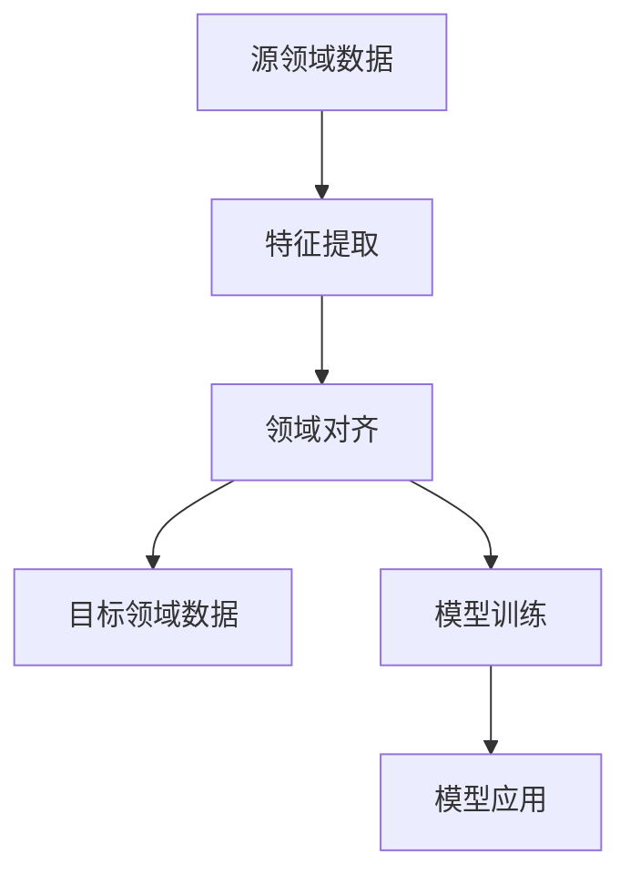
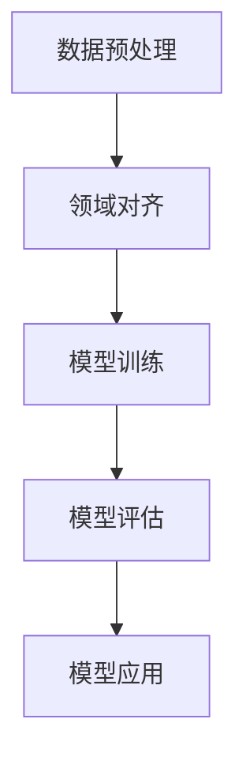
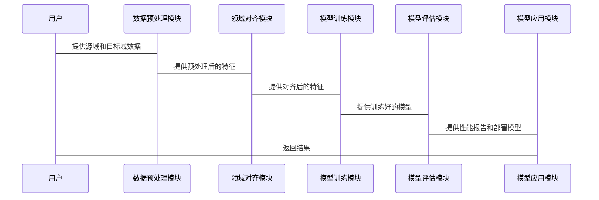

                 


# AI Agent的非监督域适应：跨领域泛化

## 关键词
AI Agent，非监督学习，领域适应，跨领域泛化，机器学习

## 摘要
本文深入探讨AI Agent在非监督域适应中的跨领域泛化能力。从背景介绍到算法实现，结合系统设计与项目实战，全面解析非监督域适应的核心概念、算法原理及应用场景，为AI Agent的跨领域应用提供理论与实践指导。

## 第一部分: AI Agent的非监督域适应背景与概念

## 第1章: 非监督域适应的背景与问题背景

### 1.1 问题背景介绍

#### 1.1.1 AI Agent的基本概念
AI Agent（人工智能代理）是能够感知环境并采取行动以实现目标的智能体。它广泛应用于推荐系统、自然语言处理、机器人控制等领域。

#### 1.1.2 领域适应的重要性
AI Agent在不同领域间应用时，需处理数据分布差异，确保模型在目标领域表现良好。

#### 1.1.3 非监督学习的挑战与优势
非监督学习无需标签，适用于数据标注困难场景，但缺乏方向性指导，需通过领域适应提升性能。

### 1.2 领域适应的核心问题

#### 1.2.1 数据分布差异的来源
数据分布差异源于领域间的特征分布差异，如数据特征、统计特性的不同。

#### 1.2.2 领域适应的目标与边界
目标是将源领域知识迁移到目标领域，边界包括数据分布差异和领域任务差异。

#### 1.2.3 领域适应的分类与应用场景
分类包括基于特征、基于模型和基于数据的域适应，应用场景有跨领域推荐、多领域NLP任务等。

### 1.3 非监督域适应的定义与特点

#### 1.3.1 非监督学习的基本原理
通过数据内在结构发现模式，无标签数据驱动学习。

#### 1.3.2 领域适应的非监督方法
使用无标签数据，通过特征提取和对齐技术实现领域迁移。

#### 1.3.3 非监督域适应的核心假设与限制
假设领域间存在可迁移特征，限制包括难以处理有监督信号和需要大量数据。

## 第2章: 非监督域适应的核心概念与联系

### 2.1 非监督域适应的基本原理

#### 2.1.1 数据分布的对齐方法
通过特征变换使源域和目标域分布对齐。

#### 2.1.2 特征空间的构建与转换
构建跨领域通用特征空间，使用域适应技术消除领域差异。

#### 2.1.3 领域适应的度量标准
评估特征对齐和分布相似性，常用指标包括KL散度、JS散度等。

### 2.2 核心概念对比表

| 对比维度         | 监督学习     | 非监督学习   | 数据增强       |
|------------------|-------------|--------------|----------------|
| 数据需求         | 需标签       | 无标签        | 辅助数据生成    |
| 任务目标         | 精确预测     | 发现数据结构   | 数据多样化      |
| 适用场景         | 明确任务     | 无明确任务     | 数据预处理      |

### 2.3 实体关系图与流程图

#### 2.3.1 领域适应的ER实体关系图
```mermaid
erd
  系统
    - 用户: 用户ID, 用户特征
    - 领域A数据
      - 数据ID, 数据特征
    - 领域B数据
      - 数据ID, 数据特征
    - 领域对齐模型
      - 对齐特征, 对齐权重
```

#### 2.3.2 非监督域适应的流程图


## 第3章: 非监督域适应的算法原理

### 3.1 算法原理概述

#### 3.1.1 非监督域适应的基本流程
数据预处理、特征提取、领域对齐、模型训练和评估。

#### 3.1.2 核心算法的选择与比较
对比特征对齐、对抗训练等方法，选择适合任务的算法。

#### 3.1.3 算法的输入输出关系
输入：源域和目标域数据；输出：适应目标域的模型。

### 3.2 算法实现的详细步骤

#### 3.2.1 数据预处理与特征提取
使用主成分分析（PCA）提取特征，去除冗余信息。

#### 3.2.2 领域对齐的实现方法
采用对抗训练，通过生成对抗网络（GAN）对齐特征分布。

#### 3.2.3 模型训练与评估
使用迁移学习框架，训练模型并评估在目标领域的性能。

### 3.3 算法的数学模型与公式

#### 3.3.1 非监督域适应的数学模型
$$ P_{src}(x) \approx P_{tgt}(x) $$

#### 3.3.2 领域对齐的度量函数
$$ D(x, y) = \frac{1}{2} \log \frac{P(x,y)}{P(x)P(y)} $$

#### 3.3.3 模型优化的目标函数
$$ \mathcal{L} = \mathcal{L}_{\text{cls}} + \lambda \mathcal{L}_{\text{adv}} $$

### 3.4 算法实现的代码示例

```python
import numpy as np
from sklearn.decomposition import PCA

# 数据预处理与特征提取
def preprocess_data(data):
    pca = PCA(n_components=10)
    features = pca.fit_transform(data)
    return features

# 领域对齐算法（对抗训练）
def domain_adaptation(features_src, features_tgt):
    # 对抗网络结构
    # ...实现对抗训练...
    return adapted_features

# 模型训练与评估
def train_model(adapted_features, labels):
    # 训练分类器
    # ...训练过程...
    return model

# 示例用法
src_data = np.random.randn(100, 20)
tgt_data = np.random.randn(80, 20)
src_labels = np.random.randint(2, size=100)

src_features = preprocess_data(src_data)
tgt_features = preprocess_data(tgt_data)

adapted_features = domain_adaptation(src_features, tgt_features)
model = train_model(adapted_features, src_labels)
```

## 第4章: 系统分析与架构设计

### 4.1 问题场景介绍

#### 4.1.1 领域适应的实际应用案例
医疗领域到金融领域的知识迁移，提升模型在新领域的准确性。

#### 4.1.2 非监督域适应的系统需求
支持多领域数据输入，具备自动对齐和迁移能力。

#### 4.1.3 系统的输入输出描述
输入：源域和目标域数据；输出：适应目标域的模型和性能评估。

### 4.2 系统功能设计

#### 4.2.1 领域数据预处理模块
处理数据格式，提取特征，消除噪声。

#### 4.2.2 领域对齐算法模块
实现特征对齐，确保跨领域一致性。

#### 4.2.3 模型训练与评估模块
训练模型，评估性能，调整参数。

### 4.3 系统架构设计

#### 4.3.1 系统整体架构图


#### 4.3.2 各模块之间的交互关系
数据预处理模块将数据传递给领域对齐模块，对齐后的特征用于模型训练，训练后的模型经评估后部署应用。

#### 4.3.3 系统的扩展性设计
支持多领域数据输入，模块化设计便于扩展和维护。

### 4.4 系统接口设计

#### 4.4.1 输入接口
接收源域和目标域数据，支持多种数据格式。

#### 4.4.2 输出接口
返回对齐后的特征、训练好的模型和性能评估报告。

### 4.5 系统交互流程图



## 第5章: 项目实战与案例分析

### 5.1 环境安装与配置

#### 5.1.1 安装依赖
安装Python、TensorFlow、Keras、Scikit-learn等工具。

#### 5.1.2 配置开发环境
配置Jupyter Notebook、PyCharm等开发环境，确保版本兼容。

### 5.2 核心代码实现

#### 5.2.1 数据预处理代码
```python
from sklearn.decomposition import PCA

def preprocess_data(data):
    pca = PCA(n_components=10)
    features = pca.fit_transform(data)
    return features
```

#### 5.2.2 领域对齐代码
```python
import tensorflow as tf
from tensorflow.keras import layers

def domain_adaptation(domain_feature, domain_label):
    # 对抗网络实现
    domain_input = layers.Input(shape=(10,))
    domain_embedding = layers.Dense(5, activation='relu')(domain_input)
    domain_output = layers.Dense(2, activation='sigmoid')(domain_embedding)
    
    domain_model = tf.keras.Model(inputs=domain_input, outputs=domain_output)
    domain_model.compile(optimizer='adam', loss='binary_crossentropy')
    
    # 对齐过程
    # ...实现对抗训练...
    return adapted_features
```

#### 5.2.3 模型训练与评估代码
```python
def train_model(adapted_features, labels):
    model = tf.keras.Sequential([
        layers.Dense(8, activation='relu'),
        layers.Dense(1, activation='sigmoid')
    ])
    model.compile(optimizer='adam', loss='binary_crossentropy')
    model.fit(adapted_features, labels, epochs=10)
    return model
```

### 5.3 实际案例分析与解读

#### 5.3.1 案例背景
将医疗领域的患者数据迁移到金融领域的信用评分。

#### 5.3.2 数据预处理
提取关键特征，如年龄、性别、医疗记录等。

#### 5.3.3 领域对齐
通过对抗训练对齐医疗和金融特征空间。

#### 5.3.4 模型训练与评估
训练分类器，评估在金融领域的准确性和召回率。

### 5.4 项目小结

#### 5.4.1 核心实现总结
实现数据预处理、特征对齐和模型训练，确保跨领域性能。

#### 5.4.2 实践中的问题与解决方案
数据不平衡问题通过过采样解决，特征提取效果通过PCA优化。

## 第6章: 最佳实践与小结

### 6.1 最佳实践 Tips

#### 6.1.1 数据预处理建议
使用PCA或t-SNE降维，确保特征提取的有效性。

#### 6.1.2 领域对齐技巧
采用对抗训练，结合迁移学习提升效果。

#### 6.1.3 模型调优建议
使用网格搜索优化超参数，交叉验证评估性能。

### 6.2 项目小结

#### 6.2.1 核心收获
掌握非监督域适应的实现方法，理解跨领域泛化的关键步骤。

#### 6.2.2 实践中的体会
领域适应需要结合具体场景，选择合适的算法和数据预处理方法。

### 6.3 注意事项

#### 6.3.1 数据质量和数量
确保数据质量，数量足够支持模型训练。

#### 6.3.2 计算资源
非监督域适应计算密集，需充足计算资源。

#### 6.3.3 领域知识的重要性
结合领域知识优化模型，提升实际应用效果。

### 6.4 拓展阅读

#### 6.4.1 领域适应的经典论文
阅读《Deep Learning for Domain Adaptation》等论文，深入理解算法原理。

#### 6.4.2 非监督学习的最新进展
关注arXiv上的最新论文，了解领域研究前沿。

#### 6.4.3 实战项目与工具
参与Kaggle等平台的域适应项目，实践所学知识。

## 结语

通过本文的详细讲解，读者可以系统掌握AI Agent的非监督域适应技术，从理论到实践，全面理解跨领域泛化的实现方法。希望本文能为相关领域的研究和应用提供有价值的参考。

