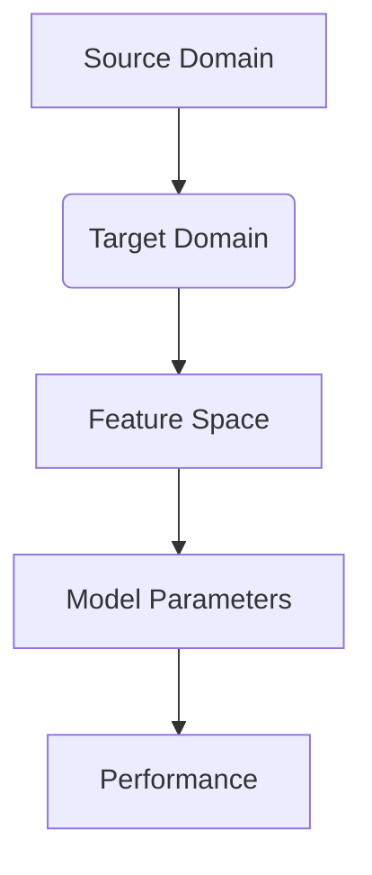

                 

# AI Agent的领域迁移学习：从通用LLM到专业模型

## 关键词：AI Agent，领域迁移学习，LLM，专业模型，迁移学习，大语言模型

## 摘要：本文深入探讨了AI Agent在领域迁移学习中的应用，从通用大语言模型（LLM）到专业领域的迁移，分析了领域迁移学习的核心概念、算法原理、系统架构和实际应用案例。通过逐步分析和推理，本文为读者提供了从理论到实践的全面指导，帮助理解如何利用AI Agent实现跨领域的知识迁移，提升模型在特定领域的性能和应用价值。

---

# 第一部分: AI Agent与领域迁移学习基础

## 第1章: AI Agent的基本概念与技术背景

### 1.1 AI Agent的基本概念
AI Agent（人工智能代理）是指能够感知环境、自主决策并采取行动的智能实体。它不同于传统的基于规则的系统，AI Agent具备学习能力、推理能力和自适应能力，能够根据环境反馈优化自身的行为策略。

#### 1.1.1 AI Agent的定义与特点
- **定义**：AI Agent是一个智能实体，能够通过感知环境、处理信息、做出决策并执行动作来实现特定目标。
- **特点**：
  - **自主性**：无需外部干预，自主完成任务。
  - **反应性**：能够实时感知环境变化并做出反应。
  - **学习性**：通过经验或数据不断优化自身能力。
  - **社交能力**：能够与其他AI Agent或人类进行交互协作。

#### 1.1.2 AI Agent的分类与应用场景
- **分类**：
  - **简单反射型AI Agent**：基于固定的规则进行简单决策。
  - **基于模型的AI Agent**：利用内部状态模型进行复杂决策。
  - **学习型AI Agent**：通过机器学习算法不断优化行为策略。
  - **人机协作型AI Agent**：与人类协同完成复杂任务。
- **应用场景**：
  - 智能助手（如Siri、Alexa）。
  - 自动驾驶系统。
  - 机器人控制。
  - 智慧城市中的自动化决策系统。

#### 1.1.3 AI Agent与传统AI的区别
- **传统AI**：基于规则的专家系统，不具备自主性和学习能力。
- **AI Agent**：具备自主性、学习能力和动态适应能力，能够根据环境反馈优化行为。

---

### 1.2 领域迁移学习的背景与意义
领域迁移学习是一种机器学习技术，旨在将已有的知识或模型从一个领域迁移到另一个领域，以提高模型在目标领域的性能。

#### 1.2.1 领域迁移学习的定义
领域迁移学习（Domain Adaptation）是指在数据分布不同的源领域和目标领域之间，通过学习共享特征或调整模型参数，使模型能够适应目标领域的数据分布。

#### 1.2.2 领域迁移学习的核心问题
- **数据分布差异**：源领域和目标领域的数据分布不同，直接使用源领域模型在目标领域表现不佳。
- **样本数量差异**：目标领域可能缺乏足够的标注数据，需要从源领域迁移知识。

#### 1.2.3 领域迁移学习的应用价值
- **减少数据标注成本**：通过迁移学习，可以在目标领域数据有限的情况下，利用源领域的大量数据提高模型性能。
- **提升模型泛化能力**：通过跨领域的知识迁移，模型能够更好地适应不同场景的需求。
- **加速AI Agent的落地应用**：通过迁移学习，AI Agent可以在不同领域快速部署和应用。

---

## 第2章: 领域迁移学习的核心概念与联系

### 2.1 领域迁移学习的基本原理
领域迁移学习的核心思想是通过学习共享特征或调整模型参数，使模型能够适应目标领域的数据分布。

#### 2.1.1 领域迁移学习的基本框架
- **源领域**：数据分布为$P_{source}(x,y)$，用于训练模型。
- **目标领域**：数据分布为$P_{target}(x,y)$，目标是使模型在目标领域表现良好。

#### 2.1.2 领域适应的核心思想
领域适应（Domain Adaptation）通过学习源领域和目标领域的共同特征，减少两者之间的分布差异，从而提高模型在目标领域的性能。

#### 2.1.3 领域迁移学习的关键技术
- **特征提取**：通过提取领域无关的特征，降低领域分布差异。
- **对抗训练**：通过对抗网络调整模型参数，使模型适应目标领域分布。
- **自适应距离度量**：通过自适应距离度量方法，优化特征空间中的分布差异。

---

### 2.2 领域迁移学习的核心要素对比
领域迁移学习的核心要素包括特征提取、迁移策略和性能评估。

#### 2.2.1 领域特征的提取方法
- **基于源领域特征提取**：直接使用源领域特征进行迁移。
- **基于目标领域特征提取**：通过目标领域特征进行迁移。
- **基于共同特征提取**：提取源领域和目标领域的共同特征。

#### 2.2.2 迁移策略的选择与优化
- **完全迁移**：直接使用源领域模型到目标领域。
- **领域适配**：通过调整模型参数或特征，使模型适应目标领域。
- **领域对齐**：通过对抗训练或特征对齐方法，使源领域和目标领域的特征分布一致。

#### 2.2.3 性能评估指标对比
- **准确率**：模型在目标领域的分类准确率。
- **F1分数**：综合考虑精确率和召回率的指标。
- **AUC曲线**：评估模型在目标领域的整体性能。

---

### 2.3 领域迁移学习的ER实体关系图
以下是领域迁移学习的ER实体关系图，展示了领域迁移学习的核心要素及其关系：

---

## 第3章: 领域迁移学习的主流算法

### 3.1 迁移学习框架
迁移学习框架包括基于特征的迁移学习、基于模型的迁移学习和基于概率分布的迁移学习。

#### 3.1.1 基于特征的迁移学习
- **特征提取**：通过提取领域无关的特征，降低源领域和目标领域的分布差异。
- **特征对齐**：通过对抗训练或特征对齐方法，使源领域和目标领域的特征分布一致。

#### 3.1.2 基于模型的迁移学习
- **模型调整**：通过调整模型参数，使模型适应目标领域。
- **参数迁移**：将源领域模型的参数迁移到目标领域模型中。

#### 3.1.3 基于概率分布的迁移学习
- **概率建模**：通过建模源领域和目标领域的概率分布，进行知识迁移。
- **分布对齐**：通过调整模型参数，使源领域和目标领域的概率分布一致。

---

### 3.2 领域适应算法
领域适应算法包括基于最大均值差异的领域适应、基于对抗训练的领域适应和基于自适应距离度量的领域适应。

#### 3.2.1 基于最大均值差异的领域适应
- **目标**：通过最小化源领域和目标领域的均值差异，使两者分布一致。
- **实现**：通过优化目标函数，使源领域和目标领域的均值差异最小化。

#### 3.2.2 基于对抗训练的领域适应
- **目标**：通过对抗网络调整模型参数，使模型适应目标领域分布。
- **实现**：使用对抗网络，通过对抗训练优化模型参数。

#### 3.2.3 基于自适应距离度量的领域适应
- **目标**：通过自适应距离度量方法，优化特征空间中的分布差异。
- **实现**：通过学习自适应距离度量，使源领域和目标领域的特征分布更接近。

---

### 3.3 基于预训练大模型的迁移方法
基于预训练大模型的迁移方法包括基于BERT、GPT和T5的迁移学习。

#### 3.3.1 基于BERT的迁移学习
- **特点**：BERT是一种基于Transformer的预训练语言模型，通过微调可以迁移到特定领域任务。
- **实现**：在目标领域上进行微调，使模型适应目标领域的语言风格和任务需求。

#### 3.3.2 基于GPT的迁移学习
- **特点**：GPT是一种生成式语言模型，通过微调可以迁移到特定领域任务。
- **实现**：在目标领域上进行微调，使模型能够生成符合目标领域需求的文本。

#### 3.3.3 基于T5的迁移学习
- **特点**：T5是一种基于Transformer的预训练模型，通过微调可以迁移到特定领域任务。
- **实现**：在目标领域上进行微调，使模型能够生成符合目标领域需求的文本。

---

## 第4章: 领域迁移学习的数学模型与公式

### 4.1 领域适应的数学模型
领域适应的数学模型包括基于源领域和目标领域的概率分布建模，以及通过优化目标函数使两者分布一致。

#### 4.1.1 基于源域和目标域的概率分布建模
- **源领域**：$P_{source}(x,y)$
- **目标领域**：$P_{target}(x,y)$

#### 4.1.2 领域适应的目标函数
$$ \min_{\theta} \mathbb{E}_{(x,y) \sim P_{target}(x,y)} \left[ \mathcal{L}(f_\theta(x), y) \right] $$

---

## 总结
通过以上章节的内容，我们可以看到，领域迁移学习是一种非常重要的技术，能够帮助AI Agent在不同领域之间实现知识的迁移和应用。从通用大语言模型（LLM）到专业领域的迁移，不仅能够减少数据标注成本，还能提升模型的泛化能力和应用价值。未来，随着技术的不断发展，领域迁移学习将在更多领域中得到广泛应用，为AI Agent的发展注入新的活力。

