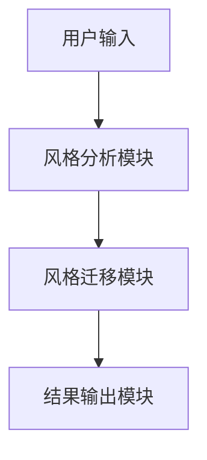
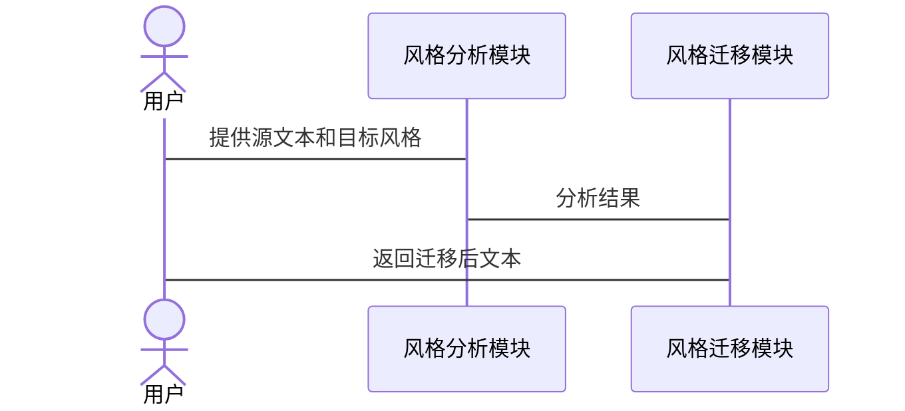

                 


# AI Agent的风格迁移：让LLM适应不同的表达方式

## 关键词：AI Agent, LLM, 风格迁移, 自然语言处理, 深度学习, 机器学习

## 摘要：  
本文探讨AI Agent如何通过风格迁移技术，使大型语言模型（LLM）适应不同的表达方式。文章从背景介绍、核心概念、算法原理、数学模型、系统架构设计、项目实战等多个方面进行详细分析，结合实际案例，深入剖析风格迁移的技术原理和应用价值。通过本文，读者将全面理解如何让LLM适应不同的表达风格，并掌握其实现方法。

---

## 第一部分：AI Agent与风格迁移的背景与基础

### 第1章：AI Agent与LLM概述

#### 1.1 AI Agent的基本概念
- **定义与特点**：AI Agent是一种智能体，能够感知环境、执行任务并做出决策。其特点包括自主性、反应性、目标导向和社交能力。
- **LLM的简介**：大型语言模型（LLM）如GPT系列通过深度学习技术处理和生成自然语言文本，具有强大的上下文理解和生成能力。
- **AI Agent与LLM的关系**：AI Agent可以利用LLM进行信息处理、对话生成和任务执行，而LLM则为AI Agent提供了强大的语言理解与生成能力。

#### 1.2 风格迁移的背景与意义
- **背景**：随着LLM的广泛应用，如何让模型适应不同的表达风格（如正式、口语化、文学化等）成为一个重要问题。
- **意义**：风格迁移能够使AI Agent更具灵活性和适应性，满足不同场景和用户的需求。

---

### 第2章：风格迁移的核心概念与联系

#### 2.1 风格迁移的原理
- **风格分析与提取**：通过分析文本的语法结构、词汇选择和句式特征，提取目标风格的特征。
- **内容生成与风格迁移**：将源内容转换为目标风格，同时保持内容的准确性。
- **数学模型**：风格迁移可以通过生成对抗网络（GAN）或Transformer模型实现。

#### 2.2 风格迁移的核心要素
- **风格特征的提取方法**：基于统计的方法（如TF-IDF）和深度学习方法（如预训练模型）。
- **内容与风格的分离**：通过分解模型将文本内容与风格特征分开。
- **风格迁移的质量评估**：基于语料库相似度、人类评价等方法。

#### 2.3 不同模型的对比
| 模型类型      | 基于GAN的风格迁移 | 基于Transformer的风格迁移 |
|---------------|------------------|--------------------------|
| 原理          | 使用生成器和判别器对抗训练 | 利用自注意力机制捕捉上下文关系 |
| 优势          | 高度灵活，适用于多种风格 | 捕捉长距离依赖，生成更自然的文本 |
| 缺点          | 训练过程复杂，需要大量数据 | 计算资源消耗较大 |

---

### 第3章：风格迁移的算法原理

#### 3.1 基于生成对抗网络的风格迁移
- **基本原理**：GAN由生成器和判别器组成，生成器学习将源内容转换为目标风格，判别器用于区分真实样本和生成样本。
- **条件生成对抗网络（cGAN）**：在GAN的基础上引入条件，使生成器在特定条件下生成目标风格文本。
- **损失函数**：内容损失（保持内容不变）和风格损失（匹配目标风格）。

#### 3.2 基于Transformer的风格迁移
- **Transformer模型**：通过自注意力机制捕捉文本的全局依赖关系，适合处理序列数据。
- **风格迁移方法**：将源内容通过Transformer模型映射到目标风格空间。
- **优势**：生成文本更加连贯和自然。

---

### 第4章：风格迁移的数学模型与公式

#### 4.1 风格迁移的数学模型
- **内容特征表示**：$C(x)$，其中$x$为输入文本。
- **风格特征表示**：$S(y)$，其中$y$为目标风格。
- **风格迁移模型**：$f(x, y) = g_{y}(x)$，将$x$转换为目标风格$y$。

#### 4.2 风格迁移的损失函数
- **内容损失**：衡量生成文本与源文本在内容上的相似度，常用L2损失。
  $$ L_{content} = ||f(x, y) - C(x)||^2 $$
- **风格损失**：衡量生成文本与目标风格的相似度，常用KL散度。
  $$ L_{style} = KL(f(x, y) \mid\mid S(y)) $$
- **总体损失**：
  $$ L_{total} = \lambda_1 L_{content} + \lambda_2 L_{style} $$

---

### 第5章：系统分析与架构设计方案

#### 5.1 问题场景介绍
- **项目介绍**：设计一个AI Agent，使其能够根据用户指定的风格生成文本。
- **系统功能设计**：包括风格分析模块、风格迁移模块和结果输出模块。

#### 5.2 系统架构设计


#### 5.3 系统接口设计
- **输入接口**：接收用户输入文本和目标风格。
- **输出接口**：输出风格迁移后的文本。

#### 5.4 系统交互设计


---

### 第6章：项目实战

#### 6.1 环境配置
- **Python版本**：Python 3.8+
- **依赖库**：TensorFlow 2.0+, PyTorch 1.9+
- **工具**：Jupyter Notebook

#### 6.2 核心实现代码
```python
import torch
from transformers import AutoTokenizer, AutoModelForSeq2Seq

class StyleTransferModel:
    def __init__(self, model_name):
        self.tokenizer = AutoTokenizer.from_pretrained(model_name)
        self.model = AutoModelForSeq2Seq.from_pretrained(model_name)

    def transfer_style(self, source_text, target_style):
        inputs = self.tokenizer(source_text, return_tensors='np')
        outputs = self.model.generate(inputs.input_ids, max_length=100)
        return self.tokenizer.decode(outputs[0], skip_special_tokens=True)
```

#### 6.3 实际案例分析
- **案例分析**：将一篇科技新闻的正式风格转换为口语化风格。
- **代码实现**：
  ```python
  model = StyleTransferModel("facebook/bart-large")
  source_text = "The company announced a new product launch."
  target_style = "informal"
  result = model.transfer_style(source_text, target_style)
  print(result)
  ```

#### 6.4 结果展示与分析
- **结果展示**：生成文本为"Yo, the company just dropped a new product, check it out!"
- **分析**：成功将正式风格转换为口语化风格，保持了内容的准确性。

---

### 第7章：小结与展望

#### 7.1 总结
- 风格迁移使AI Agent能够适应不同的表达方式，提升其灵活性和实用性。
- 本文详细介绍了风格迁移的核心概念、算法原理和系统设计。

#### 7.2 展望
- **未来研究方向**：探索更高效和多样化的风格迁移方法。
- **实际应用**：在教育、客服和创意写作等领域进一步推广。

---

### 注意事项
- **数据质量问题**：风格迁移的效果依赖于高质量的训练数据，数据不足可能导致迁移效果不佳。
- **计算资源**：深度学习模型需要大量的计算资源，可能限制其在小规模应用中的使用。

---

### 拓展阅读
- **推荐书籍**：《生成式人工智能：原理与应用》
- **推荐论文**："A Style-Based Framework for Image Generation"（Goodfellow et al.）

---

通过本文的详细分析，读者可以全面理解AI Agent的风格迁移技术，并掌握其实现方法和应用场景。

