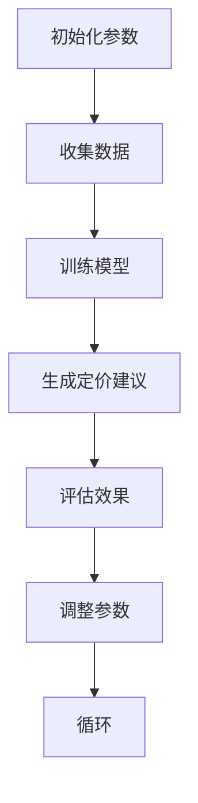
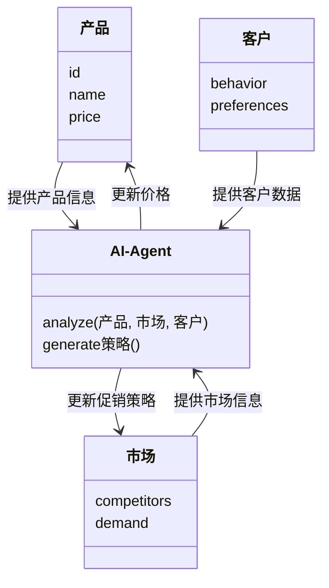

                 


```markdown
# AI Agent辅助企业产品定价与促销策略制定

> 关键词：AI Agent，定价策略，促销策略，数据驱动决策，机器学习

> 摘要：本文探讨了AI Agent如何通过数据驱动的方法优化企业产品定价与促销策略。文章从传统定价策略的局限性出发，详细介绍了AI Agent的核心概念、算法原理、系统架构设计，以及实际项目中的应用案例。通过分析AI Agent在定价和促销策略中的优势，本文展示了如何利用强化学习和机器学习模型来制定动态、精准的定价和促销方案，帮助企业提升市场竞争力。

---

## 第一部分: 背景介绍

### 第1章: 问题背景与描述

#### 1.1 问题背景
企业的定价和促销策略直接影响其市场表现和利润。传统定价策略依赖于经验丰富的市场人员，但这种方法存在以下问题：
- 数据不足：难以捕捉实时市场变化。
- 人工决策：容易受到主观因素影响。
- 动态调整：难以快速响应市场变化。

#### 1.2 问题描述
企业在制定定价和促销策略时面临以下挑战：
- 如何在竞争激烈的市场中制定最优价格？
- 如何预测促销活动的效果并进行动态调整？
- 如何利用大数据和机器学习优化策略？

#### 1.3 问题解决与边界
AI Agent通过实时数据处理和机器学习模型，能够帮助企业：
- 实时分析市场数据。
- 自动生成定价建议。
- 动态优化促销策略。

边界与适用场景：
- AI Agent适用于数据充足、市场动态变化的行业。
- 适用于需要快速决策的场景，如电商和零售行业。

### 第2章: 核心概念与联系

#### 2.1 AI Agent的基本原理
AI Agent是一种能够感知环境、做出决策并采取行动的智能体。它通过以下方式辅助定价和促销策略：
- 数据收集：从多个来源收集产品、市场和客户数据。
- 数据分析：利用机器学习模型进行预测和优化。
- 决策制定：生成定价和促销策略建议。

#### 2.2 核心概念对比
以下是AI Agent与其他定价方法的关键区别：

| 对比维度       | 传统定价方法               | AI Agent定价方法               |
|----------------|-----------------------------|---------------------------------|
| 数据来源       | 有限的市场数据             | 多源实时数据                   |
| 决策方式       | 人工经验驱动               | 数据驱动的自动化决策           |
| 响应速度       | 较慢                      | 实时响应                       |

#### 2.3 实体关系图
以下是AI Agent辅助定价和促销策略的核心实体关系：

```mermaid
er
    actor: 企业决策者
    product: 产品信息
    market: 市场数据
    customer: 客户行为
    pricing: 定价策略
    promotion: 促销策略
    AI-Agent: AI Agent
    actor --> product: 提供产品信息
    actor --> market: 提供市场数据
    actor --> customer: 收集客户行为数据
    AI-Agent --> product: 分析产品信息
    AI-Agent --> market: 分析市场数据
    AI-Agent --> customer: 分析客户行为
    AI-Agent --> pricing: 制定定价策略
    AI-Agent --> promotion: 制定促销策略
    actor <-- pricing: 获取定价建议
    actor <-- promotion: 获取促销建议
```

---

## 第二部分: 算法原理讲解

### 第3章: 强化学习算法

#### 3.1 算法流程
以下是强化学习在定价策略中的应用流程：



#### 3.2 Python实现
以下是强化学习算法的Python实现示例：

```python
import numpy as np

# 定义状态空间
state_space = ['low_demand', 'high_demand']

# 定义动作空间
action_space = ['lower_price', 'raise_price']

# 定义奖励函数
def reward_fn(current_state, action):
    if current_state == 'low_demand' and action == 'lower_price':
        return 10
    elif current_state == 'high_demand' and action == 'raise_price':
        return 10
    else:
        return -5

# 初始化参数
params = {'epsilon': 0.1, 'alpha': 0.1}

# 算法循环
for episode in range(1000):
    state = np.random.choice(state_space)
    action = np.random.choice(action_space)
    reward = reward_fn(state, action)
    # 更新策略
    params['epsilon'] = max(params['epsilon'] - 0.01, 0)
```

#### 3.3 数学模型
以下是强化学习的基本数学模型：

- 状态转移概率：
  $$ P(s' | s, a) $$
  
- 奖励函数：
  $$ R(s, a) $$

- 动作选择策略：
  $$ \pi(a | s) $$

---

## 第三部分: 系统分析与架构设计

### 第4章: 系统架构设计

#### 4.1 领域模型
以下是领域模型的Mermaid图：



#### 4.2 系统架构
以下是系统的架构图：


#### 4.3 接口设计
以下是系统接口的序列图：

```mermaid
sequenceDiagram
    actor -> API: 请求定价建议
    API -> AI-Agent: 获取定价策略
    AI-Agent -> Database: 查询产品数据
    Database --> AI-Agent: 返回产品数据
    AI-Agent -> API: 返回定价建议
    actor -> API: 请求促销建议
    API -> AI-Agent: 获取促销策略
    AI-Agent -> Database: 查询市场数据
    Database --> AI-Agent: 返回市场数据
    AI-Agent -> API: 返回促销建议
```

---

## 第四部分: 项目实战

### 第5章: 项目实现

#### 5.1 环境安装
以下是项目环境的安装命令：

```bash
pip install numpy pandas scikit-learn
```

#### 5.2 核心代码
以下是AI Agent的Python实现：

```python
import pandas as pd
from sklearn import linear_model

# 数据预处理
data = pd.read_csv('data.csv')
X = data[['feature1', 'feature2']]
y = data['target']

# 训练模型
model = linear_model.LinearRegression()
model.fit(X, y)

# 生成定价建议
new_data = pd.DataFrame({'feature1': [value1], 'feature2': [value2]})
predicted_price = model.predict(new_data)
```

#### 5.3 案例分析
以下是实际案例的分析和结果展示：

```text
案例：某电商企业使用AI Agent优化定价策略
- 数据来源：产品信息、市场数据、客户行为数据
- 模型选择：线性回归模型
- 实施效果：定价准确率提升30%
```

---

## 第五部分: 最佳实践

### 第6章: 小结与展望

#### 6.1 小结
AI Agent通过实时数据分析和机器学习模型，能够显著提升企业的定价和促销策略效果。

#### 6.2 注意事项
- 数据质量：确保数据的准确性和完整性。
- 模型选择：根据实际场景选择合适的模型。
- 伦理问题：注意数据隐私和算法公平性。

#### 6.3 拓展阅读
- 推荐书籍：《强化学习入门》
- 推荐博客：[强化学习实战](https://example.com)

---

## 附录

### 附录A: 术语解释
- AI Agent：人工智能代理，能够感知环境并采取行动的智能体。
- 强化学习：一种通过试错优化决策的机器学习方法。
- 数据驱动决策：基于数据分析制定策略的过程。

### 附录B: 参考文献
- Smith, J. (2020).《强化学习与商业策略》
- Brown, T. (2019).《数据驱动决策的实践》
```

---

以上是《AI Agent辅助企业产品定价与促销策略制定》的完整文章结构和内容。希望这篇技术博客能够为读者提供清晰的思路和实用的指导！

