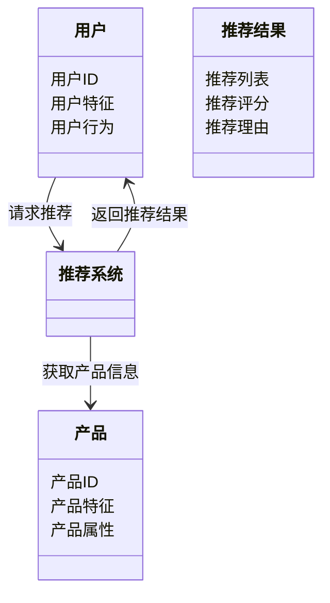
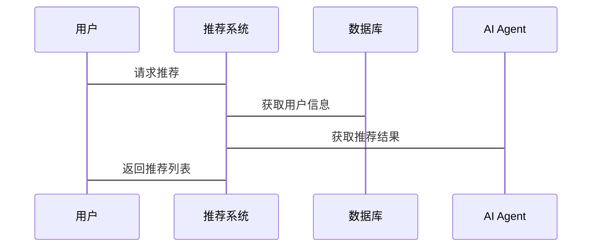

                 


# AI Agent辅助企业产品推荐与个性化服务

> 关键词：AI Agent, 企业推荐系统, 个性化服务, 机器学习, 深度学习, 推荐算法, 知识图谱

> 摘要：本文详细探讨了AI Agent在企业产品推荐与个性化服务中的应用。通过分析AI Agent的核心原理、推荐系统的算法实现、系统架构设计以及实际项目案例，揭示了AI Agent如何通过智能化手段提升企业的推荐效率和用户体验。文章结合理论与实践，为读者提供了一套完整的解决方案，涵盖了从基础概念到实际应用的全过程。

---

## 第一部分: AI Agent与企业推荐系统概述

### 第1章: AI Agent的基本概念

#### 1.1 AI Agent的定义与特点
AI Agent（人工智能代理）是一种能够感知环境、自主决策并执行任务的智能实体。它具备以下特点：
- **自主性**：能够在没有人工干预的情况下独立运行。
- **反应性**：能够实时感知环境变化并做出相应反应。
- **目标导向**：通过设定目标来驱动行为。
- **学习能力**：能够通过数据和经验不断优化自身行为。

#### 1.2 AI Agent在企业中的应用场景
AI Agent在企业中的应用十分广泛，主要包括：
- **产品推荐**：通过分析用户行为和偏好，为用户提供个性化的产品推荐。
- **客户服务**：通过自然语言处理技术，为用户提供智能化的客服支持。
- **决策支持**：通过分析大量数据，为企业提供决策支持。

#### 1.3 AI Agent与传统推荐系统的区别
传统推荐系统通常基于协同过滤或基于内容的推荐方法，而AI Agent推荐系统则更加智能化和个性化。以下是两者的区别：
- **数据处理能力**：AI Agent能够处理更复杂的数据，并结合上下文信息进行推荐。
- **实时性**：AI Agent能够实时感知用户行为和环境变化，提供实时推荐。
- **智能化**：AI Agent具备学习和推理能力，能够不断优化推荐效果。

### 第2章: 企业推荐系统的背景与挑战

#### 2.1 传统推荐系统的局限性
传统推荐系统在实际应用中存在以下问题：
- **数据稀疏性**：当用户数量较少或用户行为较少时，推荐效果不佳。
- **计算复杂度**：传统推荐算法在处理大规模数据时计算复杂度较高。
- **个性化不足**：传统推荐系统难以满足用户的个性化需求。

#### 2.2 数据量与用户行为分析的挑战
随着企业规模的扩大，用户数据量和行为数据量也在不断增加。如何高效地处理和分析这些数据，成为了企业推荐系统面临的一个重要挑战。

#### 2.3 个性化服务的需求与实现难点
用户对个性化服务的需求日益增长，但如何在保证推荐准确性的前提下，实现个性化的推荐，仍然是一个难题。

---

## 第二部分: AI Agent的核心原理与技术

### 第3章: AI Agent的核心原理

#### 3.1 AI Agent的感知与行动机制
AI Agent的感知和行动机制是其核心组成部分。感知机制通过传感器或数据输入接口获取环境信息，行动机制则根据感知结果做出相应的决策和行动。

#### 3.2 AI Agent的决策过程
AI Agent的决策过程通常包括以下几个步骤：
1. **感知环境**：通过传感器或其他数据源获取环境信息。
2. **信息处理**：对获取的信息进行分析和处理。
3. **决策制定**：基于处理后的信息，制定相应的决策。
4. **行动执行**：根据决策结果执行相应的行动。

#### 3.3 AI Agent与机器学习的关系
AI Agent的核心技术之一是机器学习。通过机器学习算法，AI Agent能够从数据中学习模式和规律，并据此做出决策和推荐。

### 第4章: AI Agent的关键技术

#### 4.1 机器学习在AI Agent中的应用
机器学习在AI Agent中的应用主要体现在以下几个方面：
- **监督学习**：通过标记数据进行训练，提高推荐系统的准确性。
- **无监督学习**：通过聚类分析等方法，发现数据中的潜在模式。
- **强化学习**：通过奖励机制，优化AI Agent的决策过程。

#### 4.2 自然语言处理在AI Agent中的作用
自然语言处理技术在AI Agent中的作用主要体现在以下几个方面：
- **用户意图识别**：通过自然语言处理技术，识别用户的意图和需求。
- **对话生成**：通过自然语言生成技术，实现与用户的自然对话。

#### 4.3 知识图谱与推理技术
知识图谱与推理技术在AI Agent中的作用主要体现在以下几个方面：
- **知识表示**：通过知识图谱，将企业的知识和信息进行结构化表示。
- **推理与决策**：通过推理技术，基于知识图谱进行推理和决策。

---

## 第三部分: AI Agent与推荐系统的结合

### 第5章: AI Agent在推荐系统中的角色

#### 5.1 AI Agent作为推荐引擎的核心
AI Agent可以作为推荐引擎的核心，通过分析用户行为和偏好，生成个性化推荐。

#### 5.2 AI Agent作为用户交互的中介
AI Agent可以作为用户与推荐系统之间的中介，通过自然语言处理技术，实现与用户的交互。

#### 5.3 AI Agent作为数据处理与分析的工具
AI Agent可以作为数据处理与分析的工具，通过机器学习算法，分析和处理大量数据，生成推荐结果。

### 第6章: 推荐系统的分类与实现方式

#### 6.1 协同过滤推荐
协同过滤推荐是一种基于用户行为的推荐方法。它通过分析用户之间的相似性，推荐用户可能感兴趣的产品。

#### 6.2 基于内容的推荐
基于内容的推荐是一种基于产品特征的推荐方法。它通过分析产品的特征，推荐与当前产品相似的产品。

#### 6.3 混合推荐模型
混合推荐模型是一种结合协同过滤和基于内容的推荐方法的推荐模型。它通过结合两种方法的优点，提高推荐的准确性和多样性。

---

## 第四部分: AI Agent辅助推荐系统的算法原理

### 第7章: 推荐系统的算法原理

#### 7.1 协同过滤算法
协同过滤算法是一种基于用户行为的推荐算法。它通过分析用户之间的相似性，推荐用户可能感兴趣的产品。

#### 7.2 基于内容的推荐算法
基于内容的推荐算法是一种基于产品特征的推荐算法。它通过分析产品的特征，推荐与当前产品相似的产品。

#### 7.3 基于深度学习的推荐算法
基于深度学习的推荐算法是一种基于神经网络的推荐算法。它通过分析用户行为和产品特征，生成推荐结果。

### 第8章: AI Agent辅助推荐系统的算法实现

#### 8.1 基于矩阵分解的推荐算法
基于矩阵分解的推荐算法是一种通过矩阵分解技术，分析用户和产品的交互关系，生成推荐结果的算法。

#### 8.2 基于神经网络的推荐算法
基于神经网络的推荐算法是一种通过神经网络模型，分析用户行为和产品特征，生成推荐结果的算法。

#### 8.3 基于强化学习的推荐算法
基于强化学习的推荐算法是一种通过强化学习技术，优化推荐系统的推荐效果的算法。

---

## 第五部分: 推荐系统的数学模型与公式

### 第9章: 协同过滤的数学模型

#### 9.1 基于用户的协同过滤公式
$$ sim(i,j) = \frac{\sum_{k=1}^n (r_{ik} - \bar{r_i})(r_{jk} - \bar{r_j})}{\sqrt{\sum_{k=1}^n (r_{ik} - \bar{r_i})^2} \cdot \sqrt{\sum_{k=1}^n (r_{jk} - \bar{r_j})^2}}} $$

#### 9.2 基于物品的协同过滤公式
$$ sim(i,j) = \frac{\sum_{k=1}^n (r_{ki} - \bar{r_i})(r_{kj} - \bar{r_j})}{\sqrt{\sum_{k=1}^n (r_{ki} - \bar{r_i})^2} \cdot \sqrt{\sum_{k=1}^n (r_{kj} - \bar{r_j})^2}}} $$

### 第10章: 基于深度学习的推荐模型

#### 10.1 神经网络协同过滤模型
$$ y = \sigma(W_u u_i^T W_v v_j) $$

#### 10.2 交替最小二乘法模型
$$ (W_u, W_v) = \arg \min_{W_u, W_v} \sum_{i,j} (r_{ij} - W_u u_i^T W_v v_j)^2 $$

---

## 第六部分: 系统分析与架构设计方案

### 第11章: 问题场景介绍

#### 11.1 电商推荐系统场景
我们以一个典型的电商推荐系统为例，设计一个基于AI Agent的推荐系统。

### 第12章: 系统功能设计

#### 12.1 领域模型设计


#### 12.2 系统架构设计
```mermaid
graph TD
    前端 --> 后端
    后端 --> 数据库
    后端 --> 推荐算法
    推荐算法 --> AI Agent
    AI Agent --> 数据源
```

#### 12.3 系统接口设计


---

## 第七部分: 项目实战

### 第13章: 环境安装与核心代码实现

#### 13.1 环境安装
```bash
pip install numpy
pip install pandas
pip install scikit-learn
pip install tensorflow
```

#### 13.2 核心代码实现
```python
import numpy as np
from sklearn.metrics.pairwise import cosine_similarity

# 用户-产品矩阵
users_products = np.array([[4, 3, 0], [2, 0, 3], [5, 1, 2]])

# 计算相似度
similarity = cosine_similarity(users_products)

# 获取推荐结果
def get_recommendations(user_id, product_id, similarity):
    return similarity[user_id, product_id]

print(get_recommendations(0, 1, similarity))
```

### 第14章: 项目小结与经验总结

#### 14.1 项目小结
通过本项目的实践，我们了解了AI Agent在推荐系统中的应用，掌握了基于协同过滤和深度学习的推荐算法的实现方法。

#### 14.2 经验总结
- **数据预处理**：在实际应用中，数据预处理是非常重要的一环，需要仔细处理缺失值和异常值。
- **模型调优**：推荐系统的性能依赖于模型的调优，需要尝试不同的算法和参数组合，找到最优解。
- **用户体验**：推荐系统的最终目标是提升用户体验，需要结合用户反馈不断优化推荐效果。

---

## 第八部分: 最佳实践与未来发展

### 第15章: 小结与注意事项

#### 15.1 小结
通过本文的探讨，我们了解了AI Agent在企业产品推荐与个性化服务中的应用，掌握了推荐系统的算法实现和系统架构设计方法。

#### 15.2 注意事项
- **数据隐私**：在实际应用中，需要特别注意数据隐私问题，确保用户数据的安全。
- **模型可解释性**：推荐系统的可解释性对于用户体验和企业信任非常重要，需要在模型设计中考虑可解释性。
- **多模态推荐**：未来的发展方向之一是多模态推荐，即结合文本、图像等多种数据源进行推荐。

### 第16章: 未来展望与拓展阅读

#### 16.1 未来展望
随着人工智能技术的不断发展，AI Agent在推荐系统中的应用将会更加广泛和深入。未来的研究方向包括：
- **强化学习推荐**：通过强化学习技术，优化推荐系统的推荐效果。
- **多模态推荐**：结合文本、图像等多种数据源，实现更加个性化的推荐。
- **实时推荐**：通过实时数据分析，实现动态推荐。

#### 16.2 拓展阅读
- **《推荐系统实践》**：这本书详细介绍了推荐系统的实现方法和应用场景。
- **《深度学习推荐系统》**：这本书深入探讨了深度学习在推荐系统中的应用。
- **《AI Agent与智能系统》**：这本书介绍了AI Agent的核心原理和技术。

---

通过本文的探讨，我们深入理解了AI Agent在企业产品推荐与个性化服务中的应用，掌握了推荐系统的算法实现和系统架构设计方法。未来，随着人工智能技术的不断发展，AI Agent在推荐系统中的应用将会更加广泛和深入。

