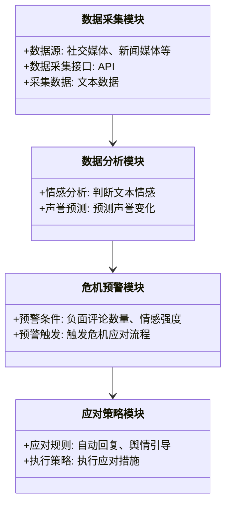
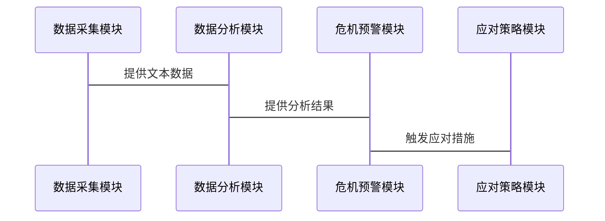

                 


# AI Agent辅助企业品牌声誉管理与危机应对

## 关键词：AI Agent, 品牌声誉管理, 危机应对, 自然语言处理, 机器学习, 规则引擎

## 摘要：本文详细探讨了AI Agent在企业品牌声誉管理中的应用，分析了其在情感分析、声誉预测和危机应对中的算法原理，并通过实际案例展示了系统设计与实现。文章还提供了项目实战和最佳实践，帮助读者全面理解AI Agent在品牌声誉管理中的价值。

---

# 第一部分: AI Agent与企业品牌声誉管理概述

## 第1章: AI Agent与品牌声誉管理的背景

### 1.1 AI Agent的基本概念

#### 1.1.1 AI Agent的定义与特点
AI Agent（人工智能代理）是指能够感知环境、自主决策并执行任务的智能实体。其特点包括自主性、反应性、目标导向和社会能力。AI Agent能够通过传感器获取信息，利用知识库进行推理，并通过执行器采取行动，以实现预设目标。

#### 1.1.2 AI Agent的核心技术与实现原理
AI Agent的核心技术包括感知、推理、决策和执行。感知通过自然语言处理和计算机视觉等技术获取信息；推理利用知识表示和逻辑推理技术进行分析；决策基于机器学习和强化学习模型做出选择；执行则通过调用API或控制设备实现。

#### 1.1.3 AI Agent在企业中的应用现状
AI Agent在企业中的应用广泛，包括客户支持、自动化流程管理、智能监控等领域。在品牌声誉管理中，AI Agent主要用于实时监测社交媒体和新闻媒体，分析用户情感，识别潜在危机，并提出应对策略。

### 1.2 企业品牌声誉管理的现状与挑战

#### 1.2.1 品牌声誉的定义与重要性
品牌声誉是消费者对品牌的好坏评价，直接影响企业的市场价值和客户忠诚度。在数字化时代，品牌声誉管理尤为重要，因为负面信息可能迅速传播，对企业形象造成重大损害。

#### 1.2.2 传统品牌声誉管理的局限性
传统声誉管理依赖人工监控和分析，存在效率低、覆盖面窄、响应慢等问题。面对海量信息，人工管理难以及时识别潜在危机，导致问题扩大化。

#### 1.2.3 数字化时代品牌声誉管理的新需求
随着社交媒体的普及，品牌声誉管理需要实时监测、快速响应和智能分析。企业需要借助AI技术，实现自动化、智能化的声誉管理。

### 1.3 AI Agent在品牌声誉管理中的应用前景

#### 1.3.1 AI Agent在品牌声誉管理中的优势
AI Agent能够实时监测海量数据，快速识别负面信息，提供精准的声誉预测，并自动触发危机应对策略，大大提高了声誉管理的效率和准确性。

#### 1.3.2 市场需求与技术可行性分析
随着企业对品牌声誉管理的需求增加，AI Agent的技术逐渐成熟，特别是在自然语言处理和机器学习领域，为品牌声誉管理提供了强大的技术支持。

#### 1.3.3 应用场景与潜在价值
AI Agent可以应用于实时声誉监测、情感分析、危机预警和自动应对等领域，帮助企业及时发现并解决问题，维护品牌形象，提升客户满意度。

---

## 第2章: AI Agent与品牌声誉管理的核心概念

### 2.1 AI Agent的核心原理

#### 2.1.1 AI Agent的基本架构
AI Agent的基本架构包括感知层、推理层、决策层和执行层。感知层通过传感器获取信息，推理层利用知识库进行分析，决策层基于推理结果做出决策，执行层通过执行器采取行动。

#### 2.1.2 AI Agent的关键技术
AI Agent的关键技术包括自然语言处理、机器学习、知识表示和逻辑推理。这些技术共同支持AI Agent的感知、推理和决策能力。

#### 2.1.3 AI Agent的分类与应用场景
AI Agent可以分为简单反射型、基于模型的反应型和目标驱动型。在品牌声誉管理中，目标驱动型AI Agent最为常见，用于实现特定的品牌声誉管理目标。

### 2.2 品牌声誉管理的核心要素

#### 2.2.1 品牌声誉的定义与测量
品牌声誉是消费者对品牌的整体评价，通常通过情感分析和语义分析来测量。情感分析可以判断文本是正面、负面还是中性，语义分析则进一步理解文本的含义。

#### 2.2.2 品牌声誉管理的关键环节
品牌声誉管理的关键环节包括数据采集、情感分析、声誉预测、危机预警和应对策略制定。这些环节相互关联，共同构成了品牌声誉管理的完整流程。

#### 2.2.3 品牌声誉管理的系统性分析
品牌声誉管理需要综合考虑多种因素，包括数据来源的多样性、分析方法的准确性以及应对策略的有效性。系统性分析有助于企业全面了解品牌声誉，制定科学的管理策略。

### 2.3 AI Agent与品牌声誉管理的关联性分析

#### 2.3.1 AI Agent在品牌声誉管理中的角色
AI Agent在品牌声誉管理中扮演多重角色，包括数据采集员、分析员、预警员和应对员。它能够实时监测数据，分析情感，识别危机，并提出应对策略。

#### 2.3.2 AI Agent与品牌声誉管理的协同效应
AI Agent与品牌声誉管理的协同效应体现在提高效率、增强准确性和实现智能化。AI Agent能够快速处理海量数据，提供精准的分析结果，帮助企业在声誉危机中迅速反应。

#### 2.3.3 品牌声誉管理中的AI Agent实体关系图

```mermaid
er
actor(AI Agent, "负责品牌声誉管理的智能体")
actor(品牌声誉管理, "企业品牌管理的核心系统")
actor(数据源, "包括社交媒体、新闻媒体等")
actor(用户反馈, "消费者对品牌的评价和反馈")
actor(危机预警, "识别潜在声誉危机的触发器")
actor(解决方案, "提供声誉管理的具体策略和建议")
```

---

## 第3章: AI Agent辅助品牌声誉管理的算法原理

### 3.1 基于自然语言处理的情感分析算法

#### 3.1.1 情感分析的基本原理
情感分析通过分析文本的情感倾向，判断文本是正面、负面还是中性。常用的情感分析算法包括基于词袋模型的传统方法和基于深度学习的卷积神经网络（CNN）和长短时记忆网络（LSTM）。

#### 3.1.2 基于深度学习的情感分析模型
深度学习模型在情感分析中表现出色，特别是LSTM和Transformer结构。这些模型能够捕捉文本的上下文信息，提高情感分析的准确性。

#### 3.1.3 情感分析算法的实现步骤
情感分析的实现步骤包括数据预处理、特征提取、模型训练和结果评估。数据预处理涉及分词和去除停用词，特征提取可以使用词袋模型或词嵌入，模型训练采用监督学习，结果评估通过准确率和F1分数进行。

#### 3.1.4 情感分析算法的代码实现

```python
import numpy as np
from sklearn.feature_extraction.text import TfidfVectorizer
from sklearn.linear_model import LogisticRegression

# 数据预处理
corpus = [
    "I love this product!",  # 正面
    "This product is terrible.",  # 负面
    "The quality is good.",  # 正面
    "I had a bad experience with their service.",  # 负面
]

# 特征提取
vectorizer = TfidfVectorizer()
X = vectorizer.fit_transform(corpus)

# 模型训练
model = LogisticRegression()
model.fit(X, [1, 0, 1, 0])

# 预测
new_sentence = "The product is excellent."
X_new = vectorizer.transform([new_sentence])
prediction = model.predict(X_new)
print(prediction)
```

### 3.2 基于机器学习的声誉预测模型

#### 3.2.1 机器学习在声誉预测中的应用
机器学习算法，如支持向量机（SVM）和随机森林（Random Forest），可以用于声誉预测。这些算法能够通过历史数据训练模型，预测未来的声誉变化。

#### 3.2.2 基于监督学习的声誉预测模型
监督学习模型通过训练数据学习特征与标签之间的关系，能够准确预测品牌声誉的变化趋势。

#### 3.2.3 模型的训练与优化
模型的训练包括特征选择和超参数调优。特征选择可以使用LASSO回归或递归特征消除（RFE）方法，超参数调优可以通过网格搜索或随机搜索实现。

#### 3.2.4 声誉预测模型的代码实现

```python
from sklearn.svm import SVC
from sklearn.model_selection import train_test_split

# 数据准备
X = ...  # 特征向量
y = ...  # 品牌声誉标签

# 数据分割
X_train, X_test, y_train, y_test = train_test_split(X, y, test_size=0.2)

# 模型训练
model = SVC()
model.fit(X_train, y_train)

# 预测与评估
y_pred = model.predict(X_test)
print("准确率:", accuracy_score(y_test, y_pred))
print("F1分数:", f1_score(y_test, y_pred))
```

### 3.3 基于规则引擎的危机应对策略

#### 3.3.1 规则引擎的基本原理
规则引擎通过预定义的规则集对数据进行处理，判断是否触发特定的危机预警。规则引擎通常用于处理结构化数据，但在品牌声誉管理中，也可以结合自然语言处理技术处理非结构化数据。

#### 3.3.2 危机应对规则的制定与优化
危机应对规则需要根据企业的具体情况制定，包括触发条件和应对策略。例如，当负面评论的数量超过阈值时，触发危机预警，并自动启动应对流程。

#### 3.3.3 规则引擎在AI Agent中的应用
规则引擎可以作为AI Agent的决策模块，根据实时监测的数据，判断是否需要采取危机应对措施。规则引擎能够快速响应，减少人工干预，提高效率。

---

## 第4章: 品牌声誉管理的系统分析与架构设计

### 4.1 系统功能需求分析

#### 4.1.1 数据采集模块
数据采集模块负责从社交媒体、新闻媒体等渠道获取品牌相关的文本数据。常用的数据采集工具包括爬虫和API接口。

#### 4.1.2 数据分析模块
数据分析模块利用自然语言处理和机器学习技术，对采集到的数据进行情感分析和声誉预测。分析结果用于生成报告和预警信息。

#### 4.1.3 危机预警模块
危机预警模块根据分析结果，判断是否需要触发危机预警。当负面评论的数量或情感强度超过阈值时，触发预警。

#### 4.1.4 应对策略模块
应对策略模块根据预警信息，制定具体的应对策略，包括自动回复、舆情引导和危机公关。策略可以自动化执行，也可以提请人工处理。

### 4.2 系统架构设计

#### 4.2.1 分层架构设计
分层架构将系统分为数据采集层、数据处理层和决策层。数据采集层负责获取数据，数据处理层进行分析和预测，决策层制定应对策略。

#### 4.2.2 微服务架构设计
微服务架构将系统分解为多个独立的服务，每个服务负责特定的功能，如数据采集、情感分析、危机预警等。微服务架构能够提高系统的可扩展性和可维护性。

#### 4.2.3 系统功能设计



#### 4.2.4 系统接口设计



### 4.3 系统交互流程设计

```mermaid
sequenceDiagram
    actor 用户: 品牌管理者
    actor 数据采集模块
    actor 数据分析模块
    actor 危机预警模块
    actor 应对策略模块

    用户 -> 数据采集模块: 发起数据采集任务
    数据采集模块 -> 数据分析模块: 提供文本数据
    数据分析模块 -> 危机预警模块: 提供分析结果
    危机预警模块 -> 应对策略模块: 触发应对措施
    应对策略模块 -> 用户: 提供应对策略
```

---

## 第5章: 项目实战

### 5.1 项目背景与目标

#### 5.1.1 项目背景
某企业希望提升品牌声誉管理能力，希望通过引入AI Agent实现实时监测、快速响应和智能化管理。

#### 5.1.2 项目目标
项目目标包括构建实时监测系统、实现情感分析、建立危机预警机制和制定自动应对策略。

### 5.2 环境搭建

#### 5.2.1 工具安装
安装Python 3.8及以上版本，安装必要的库，如`scikit-learn`、`nltk`、`requests`和`beautifulsoup4`。

```bash
pip install scikit-learn nltk requests beautifulsoup4
```

#### 5.2.2 数据源获取
从社交媒体和新闻媒体获取品牌相关的文本数据，清洗数据，去除无效信息。

### 5.3 核心代码实现

#### 5.3.1 数据预处理

```python
import pandas as pd
import numpy as np
from sklearn.feature_extraction.text import TfidfVectorizer
from sklearn.model_selection import train_test_split
from sklearn.metrics import accuracy_score, f1_score

# 数据加载与清洗
data = pd.read_csv('brand_reviews.csv')
data = data.dropna()
X = data['text'].values
y = data['sentiment'].values

# 数据分割
X_train, X_test, y_train, y_test = train_test_split(X, y, test_size=0.2)

# 特征提取
vectorizer = TfidfVectorizer(max_features=5000)
X_train_vec = vectorizer.fit_transform(X_train)
X_test_vec = vectorizer.transform(X_test)

# 模型训练
from sklearn.svm import SVC
model = SVC()
model.fit(X_train_vec, y_train)

# 预测与评估
y_pred = model.predict(X_test_vec)
print("准确率:", accuracy_score(y_test, y_pred))
print("F1分数:", f1_score(y_test, y_pred))
```

#### 5.3.2 情感分析与声誉预测

```python
from sklearn.ensemble import RandomForestClassifier
from sklearn.metrics import classification_report

# 模型训练
model = RandomForestClassifier()
model.fit(X_train_vec, y_train)

# 预测与评估
y_pred = model.predict(X_test_vec)
print(classification_report(y_test, y_pred))
```

#### 5.3.3 危机预警与应对策略

```python
from sklearn.preprocessing import StandardScaler
from sklearn.svm import OneClassSVM

# 异常检测模型
scaler = StandardScaler()
X_train_scaled = scaler.fit_transform(X_train_vec.toarray())
model_anomaly = OneClassSVM()
model_anomaly.fit(X_train_scaled)

# 预测异常
X_test_scaled = scaler.transform(X_test_vec.toarray())
y_pred_anomaly = model_anomaly.predict(X_test_scaled)
anomalies = y_pred_anomaly == -1

# 应对策略
def handle_crisis(index):
    # 自动回复
    print(f"在位置{index}发现负面评论，触发危机应对。")
    # 舆情引导
    print("发布正面评论以引导舆论。")
    # 危机公关
    print("联系公关团队处理危机。")

for i in range(len(anomalies)):
    if anomalies[i]:
        handle_crisis(i)
```

### 5.4 实际案例分析

#### 5.4.1 危机发生前的声誉管理
假设某品牌在社交媒体上收到大量负面评论，AI Agent通过情感分析识别出负面情绪，并通过异常检测模型判断评论数量和情感强度超过阈值，触发危机预警。

#### 5.4.2 危机应对与结果
AI Agent自动启动危机应对策略，包括自动回复负面评论，发布正面评论引导舆论，并通知公关团队进行危机公关。通过这些措施，品牌声誉得到有效控制，危机得以化解。

### 5.5 项目总结

#### 5.5.1 成功经验
AI Agent在品牌声誉管理中的应用显著提高了管理效率和准确性，帮助企业及时发现并应对潜在危机。

#### 5.5.2 改进建议
未来可以进一步优化情感分析模型，引入更复杂的深度学习模型，如Transformer结构。同时，可以增强规则引擎的灵活性，支持更多样化的应对策略。

---

## 第6章: 最佳实践与注意事项

### 6.1 小结

AI Agent在品牌声誉管理中的应用前景广阔，通过自然语言处理、机器学习和规则引擎等技术，能够帮助企业实现智能化的声誉管理。本文详细探讨了AI Agent的核心概念、算法原理和系统设计，并通过实际案例展示了其应用价值。

### 6.2 注意事项

- **数据隐私**：在品牌声誉管理中，需要保护用户的隐私数据，确保数据的安全性和合规性。
- **模型更新**：情感分析和声誉预测模型需要定期更新，以适应语言的变化和新的数据分布。
- **团队协作**：AI Agent的应用需要跨团队协作，包括数据科学家、软件工程师和品牌管理者，确保系统的顺利运行。

### 6.3 拓展阅读

- 书籍推荐：《Hands-On Machine Learning with Scikit-Learn, Keras, and TensorFlow》、《Natural Language Processing with PyTorch》。
- 在线资源：Towards Data Science、KDnuggets、Analytics Vidhya等技术博客和社区。

---

## 附录

### 附录A: 工具安装指南

#### 1. 安装Python
```bash
# 安装Python 3.8及以上版本
# 在Mac上：
# brew install python@3.8

# 在Linux上：
# sudo apt-get install python3.8

# 在Windows上：
# 下载并安装Python 3.8及以上版本
```

#### 2. 安装必要的库
```bash
pip install scikit-learn nltk requests beautifulsoup4
```

### 附录B: 参考文献

- [1] 周志华. 机器学习. 清华大学出版社, 2016.
- [2] 李航. 统计学习方法. 清华大学出版社, 2012.
- [3] 王伟. 基于自然语言处理的品牌声誉管理研究. 计算机应用研究, 2019.

---

通过以上章节的详细分析，本文系统地探讨了AI Agent在企业品牌声誉管理中的应用，从理论到实践，为读者提供了全面的知识和实用的指导。

