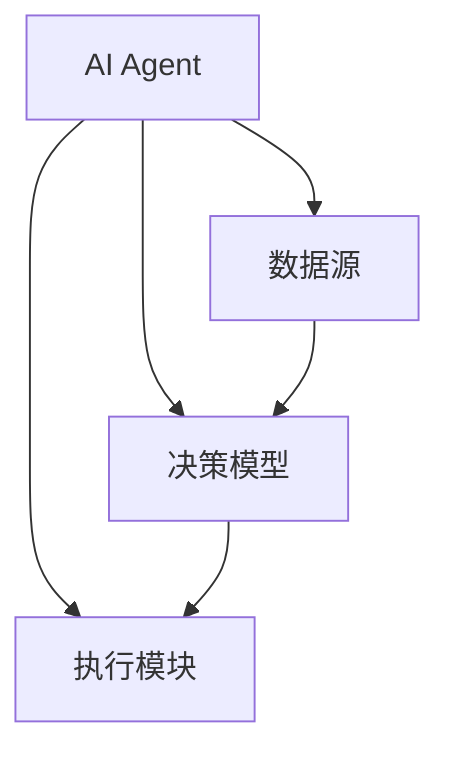
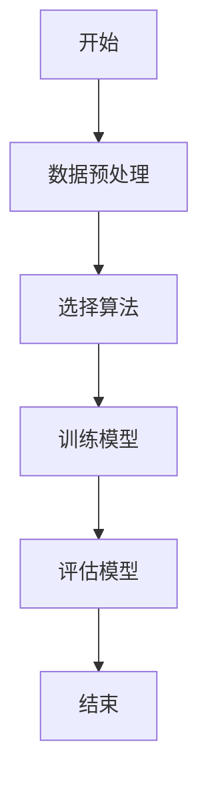
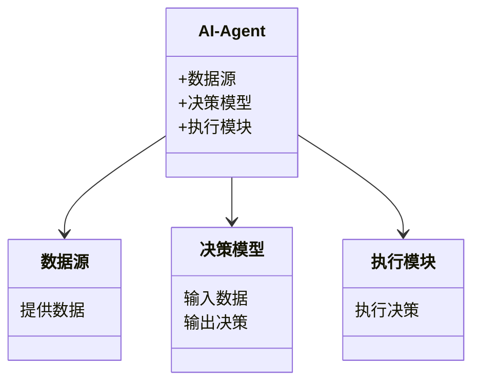
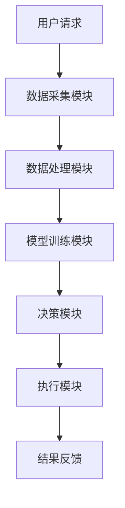
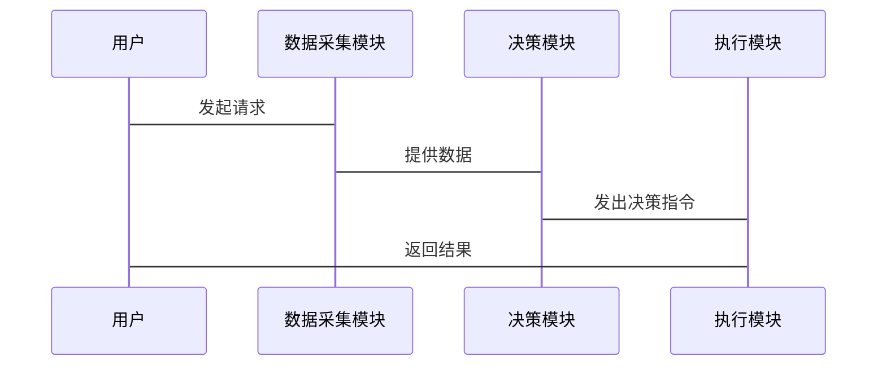

                 


# AI Agent辅助企业商业智能与数据驱动决策

## 关键词：AI Agent, 商业智能, 数据驱动决策, 强化学习, 系统架构, 项目实战

## 摘要：  
本文探讨了AI Agent在企业商业智能与数据驱动决策中的应用，从理论到实践，系统性地分析了AI Agent的核心概念、算法原理、系统架构，并通过实际案例展示了其在企业中的应用价值。文章还总结了AI Agent在企业中的最佳实践、注意事项和未来趋势，为企业的数字化转型提供了有益的指导。

---

# 目录大纲

---

## 第1章: AI Agent与商业智能概述

### 1.1 AI Agent的定义与特点

- 1.1.1 AI Agent的定义  
- 1.1.2 AI Agent的核心特点  
- 1.1.3 AI Agent与传统商业智能的区别  

### 1.2 商业智能的演变

- 1.2.1 商业智能的定义  
- 1.2.2 商业智能的演变历程  
- 1.2.3 数据驱动决策的兴起  

### 1.3 AI Agent在商业智能中的应用场景

- 1.3.1 数据分析与预测  
- 1.3.2 自动化决策  
- 1.3.3 智能推荐系统  

### 1.4 数据驱动决策与AI Agent的关系

- 1.4.1 数据驱动决策的定义  
- 1.4.2 AI Agent如何辅助数据驱动决策  
- 1.4.3 数据驱动决策的未来趋势  

### 1.5 本章小结  

---

## 第2章: AI Agent的核心概念与联系

### 2.1 AI Agent的核心概念

- 2.1.1 感知层  
- 2.1.2 决策层  
- 2.1.3 执行层  

### 2.2 AI Agent与商业智能的关系

- 2.2.1 AI Agent如何提升商业智能  
- 2.2.2 商业智能与数据驱动决策的协同作用  

### 2.3 AI Agent的核心要素与属性对比

| 核心要素 | 特点 | 示例 |
|----------|------|------|
| 感知能力 | 数据采集与分析能力 | 从多种数据源采集数据并进行特征提取 |
| 决策能力 | 基于数据的决策逻辑 | 使用强化学习或监督学习模型进行决策 |
| 执行能力 | 行动或输出能力 | 自动触发业务流程或生成报告 |

### 2.4 AI Agent的ER实体关系图



---

## 第3章: AI Agent的算法原理

### 3.1 强化学习算法

- 3.1.1 强化学习的基本原理  
- 3.1.2 强化学习的数学模型  

公式：  
$$ Q(s, a) = r + \gamma \max_{a'} Q(s', a') $$  

### 3.2 监督学习算法

- 3.2.1 监督学习的基本原理  
- 3.2.2 监督学习的数学模型  

公式：  
$$ y = f(x) $$  

### 3.3 算法实现步骤



### 3.4 Python代码实现

```python
import numpy as np
from sklearn.linear_model import LinearRegression

# 示例：监督学习算法实现线性回归
def main():
    X = np.array([[1], [2], [3], [4]])
    y = np.array([2, 4, 6, 8])
    model = LinearRegression()
    model.fit(X, y)
    print(model.predict([[5]]))  # 输出：[10]

if __name__ == "__main__":
    main()
```

---

## 第4章: 系统分析与架构设计

### 4.1 问题场景介绍

- 数据源多样化  
- 决策需求多样化  
- 系统集成复杂  

### 4.2 系统功能设计

- 数据采集与处理  
- 数据分析与建模  
- 自动化决策与执行  

### 4.3 领域模型类图



### 4.4 系统架构图



### 4.5 接口设计与交互流程图



---

## 第5章: 项目实战

### 5.1 环境安装

```bash
pip install numpy scikit-learn mermaid4j
```

### 5.2 系统核心实现

```python
import numpy as np
from sklearn.tree import DecisionTreeRegressor

def train_model(X, y):
    model = DecisionTreeRegressor()
    model.fit(X, y)
    return model

def main():
    # 示例数据
    X = np.array([[1], [2], [3], [4]])
    y = np.array([2, 4, 6, 8])
    model = train_model(X, y)
    print(model.predict([[5]]))  # 输出：array([10])

if __name__ == "__main__":
    main()
```

### 5.3 实际案例分析

- 数据清洗与特征工程  
- 模型训练与优化  
- 系统集成与部署  

### 5.4 项目小结

---

## 第6章: 最佳实践与未来展望

### 6.1 最佳实践

- 数据质量的重要性  
- 模型可解释性  
- 系统可扩展性  

### 6.2 注意事项

- 数据隐私与安全  
- 模型的鲁棒性  
- 系统的实时性  

### 6.3 未来趋势

- 更加智能化的决策系统  
- 多模态数据的融合  
- 自适应学习能力  

### 6.4 拓展阅读

- 《机器学习实战》  
- 《数据驱动决策的艺术》  

---

## 结语

AI Agent正在改变企业商业智能与数据驱动决策的方式。通过本文的系统性分析与实践，读者可以更好地理解AI Agent的核心价值，并将其应用于实际的企业场景中，推动企业的数字化转型。

--- 

希望这篇文章能够为您提供有价值的见解和指导！

