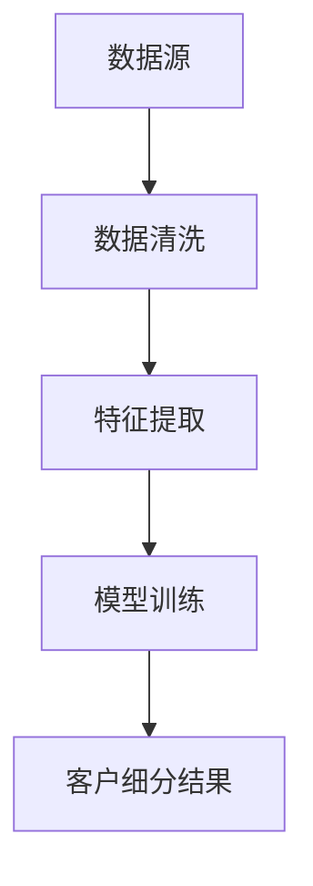

                 


# 第2章: AI Agent辅助客户细分的核心概念

## 2.1 客户细分的基本原理

### 2.1.1 客户细分的定义与重要性

客户细分是指将客户按照某些特征分成不同的群体，以便企业能够针对不同群体制定不同的市场策略。这种做法有助于提高营销效率和客户满意度。

### 2.1.2 数据采集与处理

数据是客户细分的基础。企业需要收集客户的数据，包括人口统计数据、购买行为数据、反馈数据等。数据清洗是处理数据的第一步，去除无效或错误的数据。数据预处理包括数据归一化、标准化和特征提取，确保数据适合建模。

**示例代码：数据清洗**

```python
import pandas as pd

# 假设df是原始数据
# 删除包含缺失值的行
df.dropna(inplace=True)
```

### 2.1.3 数据分析与特征提取

特征提取是关键步骤，包括文本数据的处理和数值数据的归一化。文本数据可以通过分词和向量化（如TF-IDF）处理，而数值数据可能需要归一化或标准化。

**示例代码：文本数据处理**

```python
from sklearn.feature_extraction.text import TfidfVectorizer

vectorizer = TfidfVectorizer()
tfidf_matrix = vectorizer.fit_transform(text_data)
```

### 2.1.4 数据建模与分类

数据建模是通过算法将客户分成不同的群体。聚类分析是一种常用的技术，如K-means算法，用于发现数据中的自然分组。

**数学模型：K-means算法**

K-means算法的目标是最小化所有点到其聚类中心的平方距离之和。公式如下：

$$
\text{目标函数} = \sum_{i=1}^{k} \sum_{j=1}^{n_i} \|x_j - c_i\|^2
$$

其中，$k$是聚类数，$n_i$是第$i$个聚类的样本数，$x_j$是样本，$c_i$是第$i$个聚类的中心。

**算法步骤：**

1. 初始化聚类中心。
2. 计算每个样本到聚类中心的距离，分配最近的聚类中心。
3. 重新计算聚类中心。
4. 重复步骤2和3，直到聚类中心不再变化或达到最大迭代次数。

### 2.2 AI Agent在客户细分中的应用

### 2.2.1 基于机器学习的客户细分

机器学习算法，如聚类和分类，被广泛用于客户细分。聚类用于发现未知的客户群体，而分类用于根据已知标签预测客户类别。

**示例代码：使用K-means进行聚类**

```python
from sklearn.cluster import KMeans

# 假设X是特征矩阵
kmeans = KMeans(n_clusters=3, random_state=42)
kmeans.fit(X)
clusters = kmeans.labels_
```

### 2.2.2 基于自然语言处理的客户细分

自然语言处理技术用于分析客户的文本反馈，提取情感倾向或其他语义信息。例如，使用词袋模型或词嵌入技术（如Word2Vec）来处理文本数据。

**示例代码：使用词袋模型**

```python
from sklearn.feature_extraction.text import CountVectorizer

vectorizer = CountVectorizer()
X = vectorizer.fit_transform(text_data)
```

### 2.2.3 基于图论的客户细分

图论用于分析客户之间的关系网络，发现关键客户或社区。例如，使用社区检测算法（如Louvain算法）来识别客户群体。

**示例代码：使用NetworkX进行社区检测**

```python
import networkx as nx
from community import community_louvain

# 假设G是图结构
partition = community_louvain(G)
```

### 2.3 算法实现的数学模型

#### 2.3.1 聚类分析

K-means算法的数学模型如前所述，通过迭代优化聚类中心，使簇内平方和最小。

#### 2.3.2 决策树分类

决策树通过信息增益或基尼指数选择特征，构建树状结构进行分类。例如，ID3算法使用信息增益，C4.5算法使用信息增益率。

**数学模型：ID3算法**

信息增益的计算公式为：

$$
\text{信息增益}(A) = H(T) - H(T|A)
$$

其中，$H(T)$是原始数据的熵，$H(T|A)$是在给定特征$A$情况下的熵。

### 2.4 系统架构设计

#### 2.4.1 数据流设计

客户数据从数据库中提取，经过清洗和预处理后，输入到特征提取模块，生成特征向量。这些向量被送入建模模块，使用聚类或分类算法进行客户细分，结果用于后续分析。

**系统架构图**



#### 2.4.2 系统接口设计

系统需要与数据库接口连接，获取客户数据。API接口用于接收请求，返回细分结果。用户界面展示分析结果，供企业决策者参考。

### 2.5 项目实战

#### 2.5.1 安装环境

需要安装Python、机器学习库（如scikit-learn）、自然语言处理库（如NLTK或spaCy）、数据处理库（如Pandas）和可视化库（如Matplotlib或Seaborn）。

**示例代码：安装必要的库**

```bash
pip install scikit-learn pandas numpy matplotlib
```

#### 2.5.2 核心实现

使用K-means算法对客户进行聚类。

**示例代码：客户细分实现**

```python
import pandas as pd
from sklearn.cluster import KMeans
from sklearn.preprocessing import StandardScaler

# 加载数据
df = pd.read_csv('customers.csv')

# 数据清洗：删除缺失值
df.dropna(inplace=True)

# 特征选择
features = df[['age', 'income', 'purchase_frequency']]

# 标准化数据
scaler = StandardScaler()
features_scaled = scaler.fit_transform(features)

# 初始化并训练K-means模型
kmeans = KMeans(n_clusters=3, random_state=42)
kmeans.fit(features_scaled)

# 获取聚类结果
clusters = kmeans.labels_
```

#### 2.5.3 实际案例分析

以零售行业为例，分析客户数据，将客户分为高价值、中价值和低价值三个群体，制定针对性的营销策略。

### 2.6 总结与注意事项

- 客户细分是企业精准营销的关键步骤。
- AI Agent通过机器学习和自然语言处理等技术，提高了客户细分的效率和准确性。
- 在实施过程中，需注意数据质量、算法选择和模型解释性。

---

通过以上思考和分析，第二章详细探讨了客户细分的基本原理、AI Agent的应用以及具体的算法实现，为读者提供了理论和实践相结合的指导。

