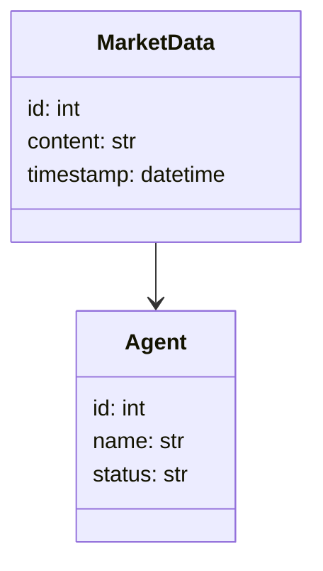

                 


# AI Agent辅助企业市场分析与战略规划

## 关键词：AI Agent, 市场分析, 战略规划, 机器学习, 自然语言处理, 企业决策

## 摘要

本文深入探讨了AI Agent在企业市场分析与战略规划中的应用，从核心概念、算法原理到系统架构、项目实战，系统地分析了AI Agent如何辅助企业进行市场分析与战略规划。通过丰富的理论分析和实际案例，本文展示了AI Agent在企业中的巨大潜力和实际价值。

---

## 第一部分：AI Agent基础与背景

### 第1章：AI Agent概述

#### 1.1 AI Agent的基本概念

AI Agent（人工智能代理）是一种能够感知环境、自主决策并执行任务的智能实体。它结合了机器学习、自然语言处理和自动化技术，能够帮助企业高效地进行市场分析和战略规划。

**核心特征：**
- **自主性**：无需人工干预，自动执行任务。
- **反应性**：能够实时感知环境变化并调整策略。
- **学习能力**：通过数据学习和优化决策模型。
- **交互能力**：能够与人类或其他系统进行交互。

**与传统软件的区别：**
- 传统软件依赖于固定的规则和流程，而AI Agent能够根据数据动态调整行为。
- AI Agent具备学习和适应能力，能够应对复杂多变的市场环境。

**应用场景：**
- 数据采集与处理：AI Agent可以自动从互联网、社交媒体等渠道收集市场数据。
- 市场趋势分析：通过机器学习模型预测市场趋势。
- 竞争对手分析：识别竞争对手的策略变化。
- 战略规划：基于数据生成市场进入、产品推广等策略。

---

#### 1.2 企业市场分析与战略规划的背景

**问题背景：**
- 企业市场分析需要处理海量数据，传统方法效率低、成本高。
- 市场环境复杂多变，人工分析难以及时捕捉变化。
- 战略规划需要多部门协作，缺乏高效工具支持。

**问题描述：**
- 数据来源多样，难以统一处理。
- 分析结果依赖人工经验，主观性强。
- 竞争对手动态难以实时跟踪。
- 战略调整滞后，无法快速响应市场变化。

**边界与外延：**
- 边界：AI Agent仅辅助市场分析与战略规划，不直接参与执行。
- 外延：AI Agent可以与其他企业系统（如CRM、ERP）集成，形成完整的智能决策体系。

---

## 第二部分：AI Agent的核心概念与原理

### 第2章：AI Agent的核心原理

#### 2.1 AI Agent的感知与决策机制

**感知层：**
- 数据采集：从多种来源（如社交媒体、新闻网站、竞争对手网站）获取数据。
- 特征提取：通过NLP技术提取关键词、情感分析等特征。

**决策层：**
- 数据分析：利用机器学习模型（如随机森林、神经网络）对数据进行分析。
- 战略生成：基于分析结果生成市场进入、产品推广等策略。

**执行层：**
- 策略执行：将生成的策略转化为具体行动，如自动发布营销内容、调整产品定价。
- 反馈优化：根据执行结果优化AI Agent的决策模型。

---

#### 2.2 AI Agent的算法基础

**机器学习算法：**
- **监督学习**：用于分类和回归任务，如预测市场趋势。
- **无监督学习**：用于聚类分析，如识别市场细分。

**自然语言处理：**
- **文本挖掘**：从新闻、评论中提取情感倾向。
- **文本生成**：自动生成市场分析报告。

**强化学习：**
- 用于动态环境中的决策优化，如实时调整营销策略。

---

## 第三部分：AI Agent的算法原理与数学模型

### 第3章：AI Agent的感知算法

#### 3.1 数据采集与特征提取

**数据采集流程：**
1. 确定数据来源（如社交媒体、竞争对手网站）。
2. 使用爬虫技术获取数据。
3. 数据清洗：去除噪声数据。

**特征提取：**
- **文本特征**：TF-IDF、词袋模型。
- **情感特征**：情感分析结果。

**示例代码：**

```python
import requests
from bs4 import BeautifulSoup

def extract_data(url):
    response = requests.get(url)
    soup = BeautifulSoup(response.text, 'html.parser')
    # 提取文本内容
    text = soup.find('div', {'class': 'content'}).get_text()
    return text
```

---

## 第四部分：系统分析与架构设计方案

### 第4章：系统分析与架构设计

#### 4.1 系统功能设计

**领域模型：**



---

#### 4.2 系统架构设计

**分层架构：**


---

## 第五部分：项目实战

### 第5章：项目实战

#### 5.1 环境安装

**工具安装：**
- Python 3.8+
- TensorFlow 2.5+
- Pandas 1.3+
- Scikit-learn 0.24+

---

#### 5.2 核心代码实现

**数据处理代码：**

```python
import pandas as pd

def process_data(data):
    # 数据清洗
    data = data.dropna()
    # 数据转换
    data['date'] = pd.to_datetime(data['date'])
    return data
```

---

## 结语

通过本文的详细分析，我们可以看到AI Agent在企业市场分析与战略规划中的巨大潜力。从感知数据到生成策略，AI Agent为企业提供了一种高效、智能的解决方案。未来，随着技术的不断进步，AI Agent将在企业决策中发挥更大的作用。

